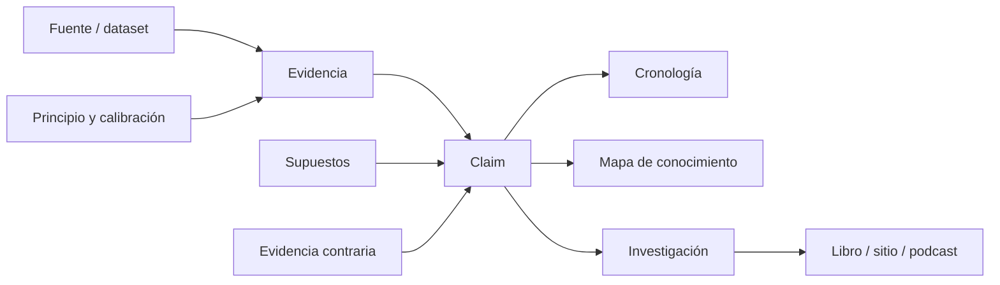

# Arquitectura del repositorio

## Principios de diseño

- **Trazabilidad:** ningún dato importante vive solo en prosa narrativa.
- **Separación:** registros canónicos, análisis y productos editoriales son capas distintas.
- **Historial:** las afirmaciones retiradas no se borran; se marcan y enlazan a su reemplazo.
- **Escalabilidad:** los IDs no codifican una posición de tabla que pueda cambiar.
- **Auditoría humana:** Markdown legible y enlaces relativos antes que una base opaca.
- **Datos grandes fuera de Git:** datasets pesados se describen mediante URL, checksum, licencia y script de adquisición cuando exista.

## Árbol

```text
vida-tierra/
├── README.md
├── CONTRIBUTING.md
├── METHODOLOGY.md
├── ROADMAP.md
├── CLAIMS.md
├── EVIDENCE_LEDGER.md
├── SOURCES.md
├── CONTROVERSIES.md
├── SCIENTIFIC_ERRORS.md
├── TIMELINE.md
├── KNOWLEDGE_MAP.md
├── 00_metodologia/
│   ├── ARCHITECTURE.md
│   ├── CONFIDENCE_SYSTEM.md
│   ├── UNCERTAINTY_TAGS.md
│   ├── ID_CONVENTIONS.md
│   ├── WORKFLOW.md
│   └── plantillas/
├── 01_cosmos/
├── 02_formacion_tierra/
├── 03_hadeano/
├── 04_arcaico/
├── 05_proterozoico/
├── 06_paleozoico/
├── 07_mesozoico/
├── 08_cenozoico/
├── 09_origen_vida/
├── 10_evolucion_vida/
├── 11_evolucion_humana/
├── 12_homo_sapiens/
├── 13_migraciones/
├── 14_civilizaciones/
├── 15_genetica_humana/
├── 16_controversias/
├── 17_preguntas_abiertas/
├── 18_historia_ciencia/
├── 19_fuentes/
├── 20_evidencia/
├── 21_cronologias/
├── 22_mapas_epistemologicos/
├── 23_informes/
└── 24_libro/
```

## Responsabilidad de cada capa

| Capa | Contenido | Es canónica para |
|---|---|---|
| Raíz | índices maestros | estado de claims, evidencias, fuentes y fechas maestras |
| `00_metodologia` | reglas y plantillas | cómo se investiga y evalúa |
| `01`–`18` | investigaciones temáticas | razonamiento extenso y contexto histórico |
| `19_fuentes` | notas bibliográficas largas | auditorías de papers y datasets |
| `20_evidencia` | fichas de objetos/datos | procedencia, medición y cadena de custodia |
| `21_cronologias` | cronologías especializadas | escalas regionales o temáticas |
| `22_mapas_epistemologicos` | grafos y dependencias | relaciones entre claims y supuestos |
| `23_informes` | cortes de estado | síntesis fechadas |
| `24_libro` | manuscrito | narrativa derivada, nunca registro primario |

## Granularidad

- Un archivo de investigación responde una pregunta principal.
- Un claim contiene una sola proposición.
- Una evidencia identifica un objeto, dataset o patrón acotado.
- Una fuente identifica una publicación o dataset versionado.
- Una controversia compara explicaciones rivales sobre el mismo conjunto de datos.

Cuando un archivo supere una lectura manejable, se divide por pregunta, no por longitud arbitraria.

## Flujo de dependencias



## Versionado

Los IDs son permanentes; la formulación y confianza pueden cambiar. Toda revisión sustantiva anota fecha, razón, fuente nueva y responsable en el archivo temático. Si cambia el significado central, se crea un claim nuevo y el anterior se marca `RETIRADO`.
