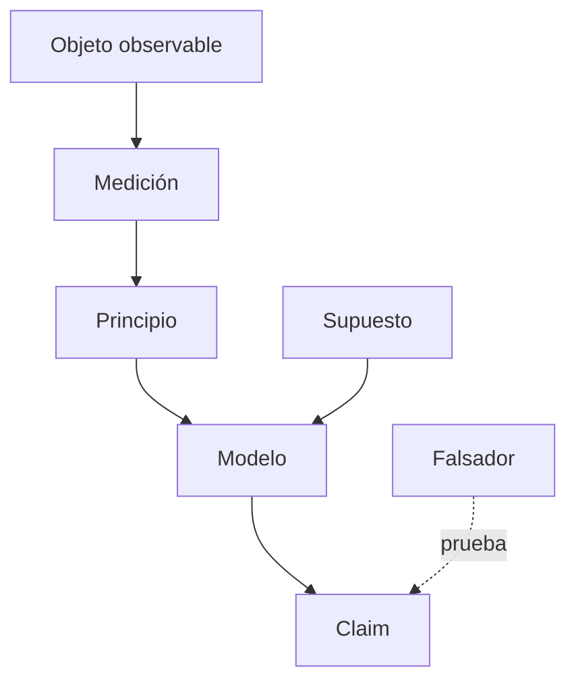

# Mapa epistemológico: <tema>

## Pregunta central

< >

## Nodos

| ID | Tipo | Descripción | Fuente | Dependencias |
|---|---|---|---|---|

## Cuellos de botella

<Supuestos o mediciones de los que dependen muchas conclusiones.>
