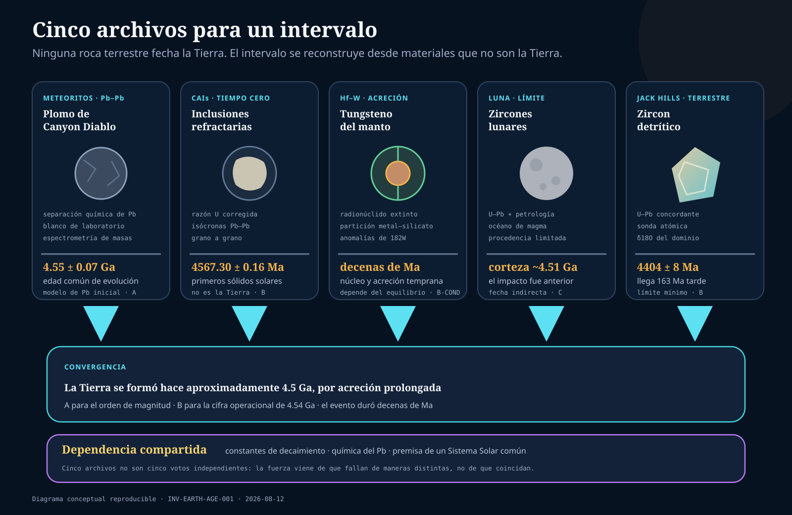
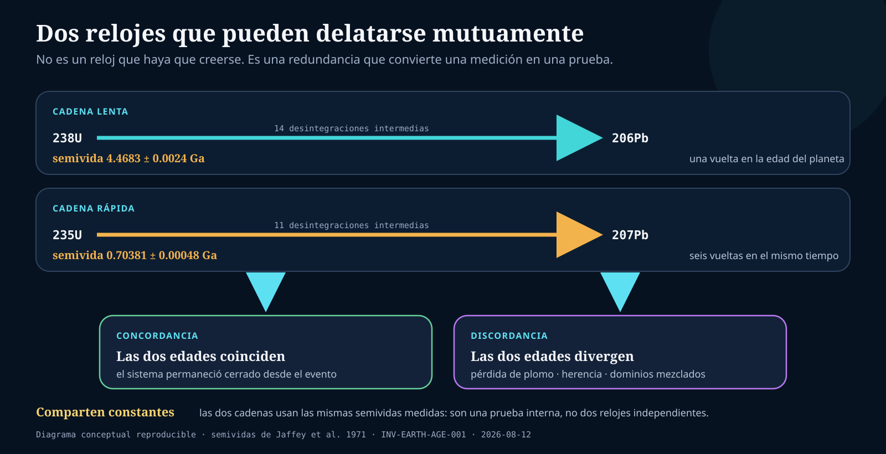

# Investigación 001 — ¿Cómo sabemos la edad de la Tierra?


La portada es una **composición editorial no probatoria**. Meteorito, zircon, roca estratificada e instrumental son genéricos y no proceden de una misma muestra o medición. Su convergencia visual no sustituye calibración, procedencia, sistemas isotópicos ni modelos de formación.





## Respuesta breve

No existe un cronómetro que muestre “4.54 mil millones de años” al introducir una roca terrestre. Tampoco existe una roca intacta de la primera Tierra. El valor se reconstruye mediante una red de inferencias:

1. medimos en laboratorio relaciones isotópicas en meteoritos y en los sólidos más antiguos conocidos del Sistema Solar;
2. medimos experimentalmente las tasas de decaimiento de los isótopos padre;
3. comprobamos con dos cadenas de uranio si una muestra se comportó como sistema cerrado o si perdió/ganó plomo;
4. usamos meteoritos de composiciones distintas para estimar una edad común de separación y evolución del plomo;
5. comparamos ese reloj con CAIs, cronómetros extintos de diferenciación, muestras lunares y los minerales terrestres más antiguos;
6. interpretamos la convergencia como el intervalo de formación del Sistema Solar y de la Tierra.

La conclusión fuerte es que la Tierra se formó **hace alrededor de 4.5 Ga**. El número convencional **~4.54 Ga** es muy bien sustentado si “edad” significa el comienzo/intervalo temprano de acreción planetaria. No es un instante directamente observado ni la edad de una roca terrestre. Diferentes hitos —primeros sólidos, mayor parte de la acreción, núcleo, Luna, corteza— tienen fechas distintas.

## 0. Antes de medir: ¿qué significa “edad de la Tierra”?

Una pregunta aparentemente simple contiene varias preguntas físicas.

| Posible “nacimiento” | Qué evento sería | Qué reloj podría restringirlo | Problema |
|---|---|---|---|
| primeros sólidos solares | condensación/cristalización de CAIs | Pb–Pb corregido por U | precede al planeta Tierra |
| inicio de acreción terrestre | primeras colisiones del reservorio que formará la Tierra | cronómetros meteoríticos + modelos dinámicos | no deja una muestra terrestre identificable |
| mayor parte de la masa acumulada | crecimiento del protoplaneta | Hf–W y simulaciones | edad modelo dependiente de historia de equilibrio |
| segregación del núcleo | separación metal–silicato | Hf–W y elementos siderófilos | proceso por etapas, quizá reiniciado por impactos |
| impacto formador de la Luna | gran colisión Tierra–protoplaneta | muestras lunares, Hf–W, dinámica | el reloj suele fechar cristalización posterior, no el impacto |
| primera corteza preservada | cristalización de minerales/rocas | U–Pb en zircon, Sm–Nd | es un límite mínimo: la Tierra ya existía |

Por eso “la Tierra tiene 4.54 Ga” debe leerse como una **convención operacional robusta** para un proceso temprano. Pedir una precisión de pocos Ma sin especificar el evento es semánticamente más impreciso, aunque la medición isotópica sea excelente.

Etiquetas críticas: `[SEM:3] [DATE:3] [MODEL:2]`.

## 1. Si desaparecieran los libros, ¿qué tendríamos que hacer?

Un programa de reconstrucción desde cero tendría que demostrar cinco cosas, en este orden:

### 1.1 Que ciertos núcleos cambian espontáneamente a tasas medibles

Preparar cantidades conocidas de uranio isotópicamente caracterizado, contar desintegraciones durante intervalos controlados y relacionar actividad con número de átomos. Repetir con geometrías, detectores y laboratorios distintos. Esto no requiere conocer la edad de la Tierra.

### 1.2 Que los productos hijos se acumulan de forma cuantificable

Crear o usar materiales de edad experimental conocida; medir antes/después o comparar sistemas naturales recientes con su contexto. Demostrar conservación de masa isotópica, fraccionamiento químico y condiciones de cierre.

### 1.3 Que podemos medir relaciones isotópicas sin que el laboratorio domine la señal

Separar químicamente U y Pb, medir blancos, usar trazadores de composición conocida, comparar estándares, variar el tamaño de muestra y reproducir en otro equipo. Una razón precisa no es necesariamente exacta si el blanco, la deriva o el fraccionamiento están mal corregidos.

### 1.4 Que la muestra conserva un evento interpretable

Examinar textura y contexto. Buscar herencia, fracturas, metamictización, alteración, inclusiones y pérdida de Pb. Medir varios dominios y usar dos cadenas U–Pb. Si las edades no concuerdan, modelar la apertura o rechazar la muestra para esa pregunta.

### 1.5 Que el evento fechado responde a “formación terrestre”

Comparar materiales de meteoritos primitivos, cuerpos diferenciados, la Luna y la Tierra. El último paso ya no es metrología pura: requiere un modelo de origen común del Sistema Solar, acreción y evolución de reservorios.

## 2. Lo que existe físicamente hoy

### 2.1 Meteoritos

Podemos sostener fragmentos de cuerpos extraterrestres que llegaron a la superficie, catalogar su caída o hallazgo, describir minerales y texturas y medir sus elementos. Algunos meteoritos condríticos preservan inclusiones ricas en Ca y Al (CAIs); otros proceden de cuerpos diferenciados.

**Observación:** una CAI es una inclusión mineral dentro de un meteorito.

**Inferencia:** se formó entre los primeros sólidos de alta temperatura del disco protoplanetario.

La inferencia se apoya en mineralogía refractaria, edades, abundancias isotópicas y comparación con modelos de condensación; no viene escrita en la muestra.

### 2.2 Plomo y uranio terrestres

Existen minerales y depósitos terrestres con diferentes razones U/Pb y composiciones isotópicas de Pb. Ninguno tiene por qué conservar todo el planeta como sistema cerrado. El Pb terrestre usado en modelos representa reservorios muestreados, no una botella de “plomo de la Tierra completa”.

### 2.3 Zircones

El zircon (`ZrSiO4`) suele incorporar U en su red y excluir mucho Pb al cristalizar. Puede conservar dominios antiguos pese a erosión, transporte, sedimentación y metamorfismo. En Jack Hills, los granos son detríticos: el cristal es más antiguo que la roca sedimentaria que hoy lo contiene.

### 2.4 Rocas antiguas

- Los ortogneises de Acasta conservan zircones cuyos dominios ígneos se interpretan como protolitos de hasta 4031 ± 3 Ma.
- Intrusiones metagabroicas de Nuvvuagittuq fueron fechadas cerca de 4.16 Ga en 2025 mediante dos sistemas Sm–Nd; las rocas que cortan deben ser anteriores si la relación de campo es correcta.

Una roca metamórfica no es una fotografía intacta de su superficie original. Su textura actual integra cristalización, deformación, calentamiento, fluidos y exhumación.

### 2.5 Muestras lunares

Rocas y zircones devueltos por misiones o presentes en meteoritos lunares aportan otro archivo. La Luna preserva corteza y cráteres que la tectónica y erosión terrestres borraron. Pero las colecciones cubren lugares limitados y su procedencia puede mezclar eyecta de impactos lejanos.

## 3. Qué miden los instrumentos

### 3.1 Espectrometría de masas

Un espectrómetro no mide años. Convierte átomos o moléculas en iones, los separa según su respuesta a campos electromagnéticos —relacionada con masa/carga— y registra corrientes o conteos. De esas señales se estiman razones isotópicas tras correcciones.

| Técnica | Qué ocurre | Fortaleza | Riesgos/límites |
|---|---|---|---|
| TIMS / ID-TIMS | muestra purificada se ioniza térmicamente; haces llegan a copas Faraday o contadores; un trazador permite dilución isotópica | alta precisión y control químico | análisis destructivo; blanco; fraccionamiento; mezcla de dominios si no se separan |
| CA-ID-TIMS | recocido + disolución parcial elimina zonas dañadas antes de TIMS | reduce pérdida de Pb asociada a daño radiogénico | selección de dominios; herencia y calibración no desaparecen |
| SIMS / SHRIMP | haz primario expulsa iones secundarios de un punto del mineral | análisis espacial de zonas pequeñas | efectos de matriz, calibración con estándar, menor precisión típica que ID-TIMS |
| LA-ICP-MS | láser genera aerosol; plasma ioniza; analizador separa masas | rápido, espacial y multielemental | fraccionamiento durante ablación, efectos de matriz, estándares y deriva |
| atom-probe tomography | evapora iones de una punta y reconstruye posición/composición nanométrica | prueba distribución de Pb y daño en dominios | volumen diminuto; apoya integridad, no sustituye por sí sola toda la edad |

Mattinson (`SRC-MATTINSON-2005`) mostró que CA-TIMS puede producir precisiones mejores que 0.1% en casos adecuados, condicionadas a constantes y trazadores. Horstwood et al. (`SRC-HORSTWOOD-2016`) insiste en no mezclar el error aleatorio —que puede reducirse al promediar— con sistemáticos que deben propagarse después.

### 3.2 Conteo de actividad

Jaffey et al. (`SRC-JAFFEY-1971`) prepararon muestras de U por deposición molecular y midieron actividad alfa con contadores y control espectral. Reportaron semividas de aproximadamente:

- `238U`: `(4.4683 ± 0.0024) × 10^9` años;
- `235U`: `(7.0381 ± 0.0048) × 10^8` años.

El dato primario es actividad por masa/isótopo. La semivida se calcula con número de átomos y tasa. La incertidumbre de estas constantes es compartida por todas las edades que las usan; mil análisis no la reducen como si fuera ruido independiente.

### 3.3 Preparación y blanco

Antes del espectrómetro ocurren decisiones críticas:

1. selección de muestra y dominio;
2. trituración o montaje;
3. limpieza y disolución;
4. adición de trazador;
5. separación cromatográfica;
6. carga o ablación;
7. corrección del blanco.

Si una muestra contiene picogramos de Pb y reactivos/superficies aportan cantidades comparables, el resultado puede ser preciso pero falso. El laboratorio limpio de Patterson no fue un detalle biográfico: fue parte causal del conocimiento obtenido.

### 3.4 Calibración

Una auditoría debe pedir:

- composición y certificado del trazador;
- masa pesada y balanza;
- materiales de referencia medidos junto a la muestra;
- blancos de procedimiento completos, no solo del instrumento;
- corrección de fraccionamiento;
- estabilidad/deriva de detectores;
- ganancia entre copas o contadores;
- datos rechazados y criterio previo;
- propagación de covarianzas y nivel de sigma.

La exactitud es concordancia con el valor verdadero; la precisión es dispersión pequeña. Se puede tener una sin la otra.

## 4. El principio físico

### 4.1 Decaimiento exponencial

Si `P` es el número de átomos padre y la probabilidad de decaimiento por unidad de tiempo es `λ`:

```text
P(t) = P0 · e^(-λt)
```

La semivida es:

```text
t1/2 = ln(2) / λ
```

Si el producto hijo radiogénico `D*` se retiene y no había hijo radiogénico inicial confundido con él:

```text
D* = P · (e^(λt) - 1)
t  = (1/λ) · ln(1 + D*/P)
```

La ecuación no fecha automáticamente cualquier objeto. Deben conocerse o eliminarse `D` inicial, ganancias/pérdidas y el evento que cerró el sistema.

### 4.2 Dos relojes de uranio

```text
238U → ... → 206Pb
235U → ... → 207Pb
```

Tienen tasas diferentes. Una muestra cerrada desde un evento debe satisfacer ambas cadenas para el mismo `t`. En un diagrama concordia, las composiciones cerradas caen en una curva calculada. Pérdida de Pb o mezcla suele producir discordancia.

Wetherill (`SRC-WETHERILL-1956`) formalizó cómo varias fracciones afectadas por un episodio de pérdida pueden alinearse en una discordia. El intercepto superior puede recuperar la cristalización y el inferior un evento posterior bajo un modelo.

**Advertencia:** que los puntos formen una línea no demuestra de modo único ese modelo; herencia, pérdidas continuas o múltiples episodios pueden generar historias más complejas.

### 4.3 Pb–Pb

Cuando se usa solo Pb radiogénico, la razón acumulada depende de ambas cadenas:

```text
207Pb* / 206Pb* = (235U / 238U) ·
                  (e^(λ235·t) - 1) / (e^(λ238·t) - 1)
```

El `*` significa componente radiogénico. En muestras reales hay Pb común (`204Pb`, `206Pb`, `207Pb`, `208Pb`) y se necesita separar composiciones iniciales y radiogénicas mediante isócronas/modelos y fracciones con distinto U/Pb.

Pb–Pb reduce algunas dependencias de la concentración absoluta de U, pero no elimina la razón `238U/235U`. La demostración de variaciones naturales en esa razón obligó a medirla/corregirla en trabajo de alta precisión.

### 4.4 Cierre no significa aislamiento perfecto para siempre

Un mineral “cierra” para un sistema cuando la difusión o intercambio relevante se vuelve suficientemente lento respecto de la escala de tiempo y precisión. Temperatura, daño, fluidos y tamaño importan. Una edad puede registrar:

- cristalización;
- enfriamiento por debajo de cierre;
- metamorfismo;
- alteración;
- impacto;
- mezcla aparente.

El paso de edad isotópica a fecha histórica necesita petrología y contexto.

## 5. Cadena A — Patterson y la edad común de meteoritos/Tierra

### 5.1 Observación

Meteoritos de clases/minerales distintos contienen Pb con composiciones isotópicas y relaciones U/Pb diferentes. El troilito del meteorito de hierro Canyon Diablo tiene muy poco U y conserva Pb poco radiogénico comparado con fases ricas en U.

### 5.2 Medición

Patterson separó Pb, controló contaminación y midió razones isotópicas por espectrometría de masas. El blanco de Pb ambiental era una amenaza de primer orden.

### 5.3 Principio

`235U` y `238U` producen `207Pb` y `206Pb` a tasas diferentes. Reservorios que comenzaron con Pb común y luego evolucionaron con distintos U/Pb pueden definir una relación temporal común.

### 5.4 Modelo

- Los meteoritos muestreados proceden de materiales del mismo Sistema Solar temprano.
- Sus fracciones comenzaron con una composición inicial de Pb relacionada.
- Desde la separación relevante, sus evoluciones isotópicas son interpretables.
- Canyon Diablo aproxima un extremo pobre en U útil para el Pb inicial.
- El Pb terrestre puede compararse con la evolución meteórica.

### 5.5 Inferencia

Las composiciones eran compatibles, dentro de la precisión de 1956, con una edad común de `4.55 ± 0.07 Ga`; el Pb terrestre cumplía el modelo de evolución (`SRC-PATTERSON-1956`).

### 5.6 Conclusión delimitada

El trabajo no observó la formación terrestre. Mostró que meteoritos y Pb terrestre son compatibles con separación/evolución en un sistema de ~4.55 Ga, y razonó que la Tierra alcanzó su masa durante ese marco.

```text
meteoritos + Pb terrestre actuales
  → razones 204Pb/206Pb/207Pb
  → dos cadenas de U
  → modelo de Pb inicial y reservorios con distinto U/Pb
  → edad común de evolución
  → marco temporal de formación terrestre
```

## 6. Cadena B — CAIs y tiempo cero meteórico

Connelly et al. (`SRC-CONNELLY-2012`) midieron U y Pb en CAIs y cóndrulos individuales, corrigiendo la razón de U. Las CAIs analizadas definieron `4567.30 ± 0.16 Ma`; los cóndrulos abarcaron desde `4567.32 ± 0.42` hasta `4564.71 ± 0.30 Ma`.

### Qué añade

- Una referencia de tiempo cero con incertidumbre mucho menor que la estimación histórica de Patterson.
- Evidencia de que distintos sólidos se procesaron durante varios Ma.
- Un ancla para cronómetros extintos que expresan tiempo “después de CAIs”.

### Qué no añade

- No fecha cuándo la Tierra acumuló 50%, 90% o 100% de su masa.
- No prueba que cada CAI existente sea exactamente coetánea.
- No convierte `4567.30 Ma` en “edad de la Tierra”.

```text
CAIs actuales
  → U/Pb y Pb isotópico corregidos
  → isócronas Pb–Pb
  → edad de cristalización de sólidos refractarios
  → tiempo cero meteórico
  ≠ fecha directa del planeta completo
```

## 7. Cadena C — Acreción y formación del núcleo con Hf–W

### 7.1 Principio

`182Hf` decayó a `182W` con semivida corta (~9 Ma) y ya no existe en cantidades primordiales medibles. Hf es litófilo: prefiere silicatos. W es más siderófilo: puede pasar al metal durante formación del núcleo.

Si metal y silicato se separan mientras aún existe `182Hf`, el manto conserva Hf y produce `182W` radiogénico; el núcleo recibe W. La composición posterior registra cuándo y cómo se separaron reservorios.

### 7.2 Observación y medición

Se miden diferencias minúsculas de W isotópico en meteoritos, manto terrestre y materiales diferenciados mediante química de alta pureza y espectrometría de masas.

### 7.3 Modelo

La fecha depende de:

- composición inicial del reservorio;
- partición W metal–silicato;
- equilibrio en cada impacto;
- crecimiento continuo o por etapas;
- mezcla tardía y “late veneer”;
- anomalías nucleosintéticas heredadas.

### 7.4 Inferencia

El Hf–W muestra que cuerpos pequeños se diferenciaron casi inmediatamente y que la acreción/formación del núcleo terrestre ocurrieron temprano, durante decenas de Ma. Las fechas exactas cambian con el modelo (`SRC-KLEINE-2002`, `SRC-KLEINE-2009`).

**Confianza:** B para diferenciación/acreción temprana; C para un único número de finalización.

## 8. Cadena D — La Luna

Zircones lunares con edades antiguas y química de cristalización indican que ya existía corteza diferenciada hacia ~4.51 Ga en el análisis de Barboni et al. (`SRC-BARBONI-2017`). Si la corteza se formó después del impacto y de un océano de magma, el impacto debió ser anterior.

La lógica es un límite:

```text
zircon lunar cristaliza a t
  → corteza/magma lunar diferenciados ya existen a t
  → la formación de la Luna ocurrió antes de t
```

La segunda flecha es fuerte bajo la identificación lunar y edad primaria. Convertirla en una fecha exacta del impacto requiere duración del océano de magma, enfriamiento, posible herencia y modelos Hf–W.

## 9. Cadena E — El archivo terrestre sobreviviente

### 9.1 Zircon de 4404 ± 8 Ma

Wilde et al. (`SRC-WILDE-2001`) reportaron un zircon detrítico de ~200 μm con edad `4404 ± 8 Ma`, >99% concordante. Valley et al. (`SRC-VALLEY-2014`) usaron tomografía atómica para comprobar que agrupamientos nanométricos de Pb no destruían la interpretación hadeana del dominio.

**Lo demostrado con fuerza:** un mineral terrestre cristalizó aproximadamente 163 Ma después del tiempo cero de CAIs y sobrevivió una historia compleja.

**Lo que requiere más inferencia:** el tipo de corteza, régimen tectónico y ambiente global del planeta.

### 9.2 Oxígeno y agua

Algunos zircones tienen `δ18O` mayor que el esperado para zircon en equilibrio con un manto homogéneo. Bajo modelos de fraccionamiento, su magma incorporó material cortical que había interactuado a baja temperatura con agua y luego se fundió (`SRC-PECK-2001`).

Cadena:

```text
microdominio de zircon
  → razón 18O/16O calibrada
  → δ18O respecto de estándar
  → modelo de fraccionamiento mineral–magma
  → fuente cortical alterada a baja temperatura
  → agua cerca de la superficie antes de cristalización
```

Cada flecha amplía el alcance. “Había interacción con agua” es más fuerte que “existía un océano global parecido al moderno”.

### 9.3 Acasta, 4031 ± 3 Ma

En ortogneises deformados, mapeo y U–Pb de zircon separan dominios de protolito ígneo de eventos posteriores. Bowring y Williams (`SRC-BOWRING-1999`) reportaron edades hasta `4031 ± 3 Ma`. La tabla ICS 2026 usa esa cifra como base numérica del Arcaico mientras avanza la formalización del límite.

### 9.4 Nuvvuagittuq, ~4.16 Ga

El terreno de Nuvvuagittuq carece en partes clave de zircon fechable y ha producido edades discordantes. Sole et al. (`SRC-SOLE-2025`) enfocaron intrusiones metagabroicas que cortan rocas encajantes y obtuvieron isócronas concordantes de los sistemas corto y largo Sm–Nd cerca de 4.16 Ga.

La cadena correcta es:

```text
intrusión corta encajante
  + isócronas Sm–Nd de la intrusión ≈ 4.16 Ga
  → cristalización interpretada de la intrusión ≈ 4.16 Ga
  → encajante es anterior a la intrusión
```

No es correcto escribir “toda Nuvvuagittuq tiene exactamente 4.16 Ga”. Por ser un resultado de 2025, se mantiene `B-PROV` hasta replicación independiente y auditoría completa del suplemento.

## 10. Reconstrucción temporal de los primeros ~536 Ma

Tomando `4567.30 Ma` como tiempo cero meteórico —no como nacimiento instantáneo de la Tierra—:

| Tiempo desde CAIs | Edad antes del presente | Restricción | Tipo de conocimiento | Confianza |
|---:|---:|---|---|---|
| 0 Ma | 4567.30 ± 0.16 Ma | CAIs analizadas cristalizan | edad isotópica de objetos | B |
| primeras decenas de Ma | ~4.56–4.50 Ga | acreción y segregación metal–silicato avanzan | cronómetros extintos + modelos | B-C |
| ~57 Ma | ~4.51 Ga | corteza lunar temprana según zircones estudiados | edad de mineral + inferencia de límite | C |
| ~163 Ma | 4404 ± 8 Ma | cristaliza zircon terrestre sobreviviente | U–Pb + microestructura | B |
| ≤~163 Ma | ≥4.4 Ga | material fuente de algunos zircones interactuó con agua | isótopos estables + modelo petrológico | C |
| ~407 Ma | ~4.16 Ga | intrusiones Nuvvuagittuq, si interpretación 2025 se replica | isócronas Sm–Nd + campo | B-PROV |
| ~536 Ma | 4031 ± 3 Ma | protolitos ígneos Acasta; base numérica actual del Arcaico | U–Pb + tabla ICS | B |

### Lo que cabe entre los puntos

No tenemos una película continua. Entre ellos se modelan:

- crecimiento por impactos;
- océanos de magma y enfriamiento;
- separación del núcleo;
- formación y reciclaje de corteza;
- pérdida y adquisición de volátiles;
- flujo de impactos.

Las simulaciones se aceptan por reproducir restricciones y hacer predicciones, no porque el pasado haya sido observado. Múltiples historias pueden pasar por los mismos puntos.

## 11. Corroboración: ¿realmente independiente?

| Línea | Objeto | Principio | Dependencias compartidas | Independencia útil |
|---|---|---|---|---|
| Pb–Pb de meteoritos | meteoritos/fases de distinto U/Pb | dos decaimientos de U | constantes, química Pb, modelo inicial | alta entre muestras; media teóricamente |
| CAI Pb–Pb corregido | inclusiones y cóndrulos | mismas cadenas U–Pb | constantes y calibraciones | nueva muestra/precisión, no principio independiente |
| Hf–W | meteoritos y reservorios planetarios | radionúclido extinto + partición | tiempo cero CAI y modelo solar | alta en física/química; baja-media en modelo de evento |
| U–Pb de zircon terrestre | granos de Jack Hills/Acasta | mismas cadenas U–Pb | constantes y estándares | independiente en archivo material, no en constantes |
| Sm–Nd Nuvvuagittuq | roca total/minerales | dos decaimientos Sm–Nd | interpretación geológica y mezcla | alta respecto de U–Pb si sistemas preservados |
| zircon lunar | muestras lunares | U–Pb + petrología | mismas constantes U; modelo de corteza | archivo planetario distinto |
| estratigrafía/relaciones de corte | afloramientos | superposición/corte | contexto y mapeo | principio no radiométrico; da orden, no años por sí solo |

La fortaleza no viene de “seis métodos votan por 4.5”. Viene de que objetos y principios con fallos diferentes restringen una secuencia compatible. Sin embargo, varias líneas comparten tiempo cero, constantes o la premisa de un Sistema Solar común; esa dependencia debe conservarse.

## 12. Presupuesto de incertidumbre

### 12.1 Estadística `[STAT]`

Conteos iónicos, dispersión entre análisis, ajuste de isócrona y MSWD. Puede reducirse con más señal o réplicas si son independientes.

### 12.2 Calibración `[CAL] [CONST]`

Trazadores, materiales de referencia, ganancia y semividas. Es sistemática: no desaparece al promediar muestras que comparten calibración.

### 12.3 Blanco y fraccionamiento `[BLANK] [FRAC]`

Pb de reactivos/superficies y discriminación de masas. Pueden desplazar todas las razones en la misma dirección.

### 12.4 Muestra `[ALTER] [MIX] [INHER] [SAMP]`

Pérdida de Pb, herencia de núcleos, metamictización, dominios mezclados y selección de supervivientes. La escasez de Hadeano hace enorme el sesgo de preservación.

### 12.5 Modelo `[CERR] [INIT] [MODEL] [DATE]`

Sistema cerrado, Pb inicial, historia de acreción, partición metal–silicato y significado del reloj. Estas incertidumbres pueden ser mucho mayores que el error analítico impreso.

### 12.6 Semántica `[SEM]`

La mayor fuente de falsa precisión pública: llamar “edad de la Tierra” a eventos que duran decenas de Ma o usar indistintamente formación, cristalización y cierre.

## 13. Regla del adversario

### 13.1 “No hay una roca terrestre de 4.54 Ga”

**Crítica fuerte:** entonces no se ha fechado directamente la Tierra.

**Respuesta:** correcto en sentido estricto. Se fecha el sistema de materiales del que se formó, se modela su evolución y se comprueba con cronómetros de etapas posteriores. La ausencia de roca primordial se registra como límite, no se oculta. La conclusión es abductiva y cuantitativa, no una observación directa.

### 13.2 “Se desconoce la cantidad inicial de producto hijo”

**Crítica fuerte:** si ya había Pb, una razón padre–hija simple puede aparentar una edad arbitraria.

**Respuesta:** por eso se usan isócronas, `204Pb` no radiogénico, minerales con distintos U/Pb y dos cadenas. La intersección estima composición inicial bajo el modelo. Si las fracciones no definen la relación esperada, no hay edad fiable.

### 13.3 “El sistema pudo abrirse”

**Crítica fuerte:** calor, fluidos e impactos mueven U/Pb.

**Respuesta:** es una objeción real. Concordia/discordia, imágenes de dominios, abrasión química, minerales múltiples y contexto buscan detectarlo. No todo sistema abierto puede corregirse; algunos resultados deben rechazarse o reinterpretarse como edad de alteración.

### 13.4 “Las tasas de decaimiento pudieron cambiar”

**Crítica fuerte:** extrapolamos una tasa actual durante miles de millones de años.

**Respuesta:** la constancia temporal es una hipótesis física. Se somete a límites mediante física nuclear, espectros astronómicos, reactores naturales y concordancia de isótopos con sensibilidades distintas. Para invalidar edades de 4.5 Ga se necesitaría una variación grande, coordinada y compatible con todas esas observaciones, no la mera posibilidad lógica.

**Pendiente de este bloque:** una auditoría separada cuantificará límites experimentales a variación de constantes; no se afirma aquí haberla completado.

### 13.5 “Los meteoritos podrían no representar la Tierra”

**Crítica fuerte:** son fragmentos de asteroides, no del planeta.

**Respuesta:** no se supone identidad química total. Se prueba relación mediante abundancias isotópicas, dinámica orbital, mineralogía y coherencia temporal entre muchas clases y muestras. Los meteoritos primitivos se usan como archivo del reservorio solar; modelos de composición terrestre corrigen fraccionamiento y diferenciación.

**Falla posible:** si se demostrara que la Tierra se incorporó tarde desde un reservorio isotópico no relacionado, el paso meteorito→Tierra tendría que reconstruirse.

### 13.6 “Todos los métodos comparten los mismos supuestos”

**Crítica fuerte:** U–Pb, Pb–Pb y zircon no son tres relojes completamente independientes.

**Respuesta:** correcto. Comparten constantes y cadenas. Hf–W, Sm–Nd, orden estratigráfico y muestras lunares agregan independencia parcial. El proyecto no contará publicaciones como votos; mantendrá una matriz de dependencia.

### 13.7 “4.54 no es igual a 4.567”

No es una contradicción. `4567.30 Ma` fecha CAIs usadas como tiempo cero. `~4.54 Ga` resume formación/acreción terrestre, posterior y extendida. Presentar ambas como mediciones del mismo evento sería un error semántico.

## 14. Historia de cómo cambió el conocimiento

### Antes de la radioactividad

Se intentó inferir la edad con genealogías, espesor de sedimentos, salinidad oceánica y enfriamiento. Estos métodos transformaban observaciones actuales en tiempo usando tasas. El problema no era “inferir”: era asumir tasas, sistemas completos y condiciones iniciales incorrectas.

### Kelvin: cálculo físico, modelo incompleto

Los cálculos térmicos del siglo XIX trataban la Tierra como cuerpo que se enfría principalmente por conducción desde un estado caliente. Eran cuantitativos y falsables, pero omitían calentamiento radiogénico y convección. El error ilustra que una ley correcta aplicada a un modelo incompleto puede producir una edad precisa y falsa.

### Radioactividad y primeras edades

El descubrimiento de radioactividad reveló una fuente de calor y un reloj nuclear. Rutherford planteó el principio; Boltwood aplicó U–Pb a minerales; Holmes desarrolló una escala geológica. Las primeras edades padecían constantes, Pb inicial, química y geología insuficientes.

### Isótopos y espectrometría

La separación isotópica de Pb permitió distinguir componente común y radiogénico. El avance instrumental no bastaba: necesitaba mejores blancos, muestras y modelos.

### Patterson, 1956

El control de contaminación y la comparación meteorítica produjeron `4.55 ± 0.07 Ga`. El valor no ganó fuerza solo por prestigio: sobrevivió porque nuevas muestras, mediciones y cronómetros redujeron incertidumbre sin desplazar el orden de magnitud.

### Wetherill y concordia

La discordancia dejó de ser solo “dato malo” y se convirtió, bajo modelos, en información sobre pérdida de Pb y eventos posteriores.

### De precisión a trazabilidad

CA-TIMS, microsondas, tomografía, trazadores y estándares comunitarios permiten aislar dominios y separar errores. A la vez, la mayor precisión hace más visibles problemas antes despreciables: variación `238U/235U`, covarianza de constantes y significado del evento.

### Lección histórica

La edad terrestre no es resultado de una revelación única. Es una red que se fortaleció al detectar contaminación, abandonar física incompleta, medir constantes y desarrollar pruebas internas de sistema abierto.

## 15. Predicciones y pruebas discriminatorias

Una reconstrucción útil arriesga expectativas:

1. **Meteoritos primitivos:** más CAIs bien preservadas deberían seguir agrupándose cerca del tiempo cero, salvo procesamiento identificable.
2. **Dos cadenas U:** dominios cerrados deben ser concordantes; apertura debe dejar patrones mineralógicos/isotópicos coherentes.
3. **Cronómetros extintos:** reservorios diferenciados muy temprano deben mostrar anomalías correlacionadas con su fraccionamiento químico.
4. **Relaciones de corte:** una intrusión no puede ser más antigua que la roca que corta si la geometría fue interpretada correctamente.
5. **Luna:** materiales de corteza primaria con procedencia diversa deberían preservar formación/diferenciación tempranas, aunque no idéntica edad.
6. **Zircones hadeanos:** si la señal de agua es primaria, varios proxies del mismo dominio deberían ser compatibles con fuente alterada, no con alteración tardía.

## 16. Qué podría cambiar el modelo de forma importante

- CAIs reproducidas con edades sistemáticamente mucho más jóvenes/antiguas después de corregir calibraciones conocidas.
- un sesgo grande confirmado en semividas o trazadores que afecte coherentemente U–Pb/Pb–Pb.
- demostrar que las isócronas clásicas mezclan componentes sin significado temporal común.
- muestras terrestres inequívocas anteriores al tiempo cero meteórico actual.
- evidencia de que los meteoritos usados proceden de un reservorio sin vínculo con la Tierra y que otro archivo ofrece una cronología incompatible.
- replicación que sitúe Nuvvuagittuq en el Arcaico y explique la concordancia Sm–Nd de 2025 como reinicio/mezcla.
- muestras lunares globalmente representativas que obliguen a una formación mucho más tardía y a reinterpretar zircones antiguos como heredados.

Ninguno de estos hallazgos convertiría automáticamente la Tierra en joven; podrían modificar el valor, el evento al que se refiere o una rama de la reconstrucción.

## 17. Matriz de claims

| Claim | Observación principal | Salto inferencial crítico | Confianza | Razón de no elevar más |
|---|---|---|---|---|
| `CLAIM-EARTH-AGE-001` | Pb isotópico, CAIs, cronómetros extintos | meteoritos/Sistema Solar → formación terrestre | A para ~4.5; B para 4.54 operacional | evento prolongado y modelo de formación |
| `CLAIM-GEO-UPB-001` | actividad y razones isotópicas | cierre + condición inicial → edad | A-COND | falla si sistema/contexto no se controlan |
| `CLAIM-EARTH-ACCRETION-001` | W isotópico | reservorio/partición → curva de crecimiento | B-COND | sensibilidad a equilibrio y modelo |
| `CLAIM-MOON-AGE-001` | zircones lunares/Hf–W | corteza → impacto anterior | C | fecha indirecta del impacto |
| `CLAIM-HADEAN-ZIRCON-001` | dominio U–Pb concordante | edad del dominio → material terrestre | B | grano excepcional/retrabajado |
| `CLAIM-HADEAN-WATER-001` | `δ18O` alto | fuente alterada → agua superficial | C | escala/localidad y alternativas petrológicas |
| `CLAIM-HADEAN-ACASTA-001` | zircon en gneis | dominio ígneo → edad de protolito | B | metamorfismo complejo |
| `CLAIM-HADEAN-NGB-001` | dos isócronas Sm–Nd | isócrona → cristalización | B-PROV | resultado reciente/replicación |
| `CLAIM-HADEAN-NGB-002` | relación intrusión–encajante | corte → límite mínimo | C-LOCAL | geometría e historia tectónica |
| `CLAIM-HADEAN-LHB-001` | edades/cráteres sesgados | agrupación → pico global único | D | modelos alternativos y muestreo |

## 18. Protocolo reproducible ideal

Para volver a llegar a la conclusión sin autoridad textual:

1. adquirir muestras con procedencia documentada de varias clases meteóricas, zircones terrestres y materiales de edad/contexto independiente;
2. fotografiar, mapear y analizar mineralogía antes de destruir;
3. dividir alícuotas ciegas entre laboratorios;
4. medir blancos completos y trazadores contra estándares compartidos;
5. medir `238U/235U` de cada material cuando la precisión lo requiera;
6. ejecutar U–Pb/Pb–Pb y publicar señales, correcciones, covarianzas y descartes;
7. comprobar concordia, texturas y dominios;
8. medir un sistema distinto (Hf–W o Sm–Nd) en muestras pertinentes;
9. mantener separados resultados instrumentales, edades isotópicas y eventos interpretados;
10. comparar modelos de acreción con los mismos datos y reportar sensibilidad;
11. preregistrar falsadores y criterios de confianza;
12. conservar alícuotas y metadatos para replicación futura.

Una persona sin laboratorio no puede reproducir todo el proceso por lectura. Puede auditar procedimientos, datos publicados, estándares, cálculos y consistencia entre laboratorios. El conocimiento distribuido incluye confianza calibrada en cadenas de custodia e instituciones, pero esa confianza puede apoyarse en trazabilidad en vez de autoridad desnuda.

## 19. Fuentes de este bloque

### Primarias centrales

- `SRC-PATTERSON-1956`: edad Pb–Pb meteoritos/Tierra.
- `SRC-CONNELLY-2012`: CAIs y cóndrulos U-corregidos.
- `SRC-JAFFEY-1971`: semividas/actividad de U.
- `SRC-WETHERILL-1956`: discordia U–Pb.
- `SRC-KLEINE-2002`: Hf–W y diferenciación.
- `SRC-BARBONI-2017`: zircon lunar.
- `SRC-WILDE-2001`: zircon Jack Hills.
- `SRC-PECK-2001`: oxígeno en zircones.
- `SRC-VALLEY-2014`: integridad nanométrica del zircon antiguo.
- `SRC-BOWRING-1999`: Acasta.
- `SRC-SOLE-2025`: Nuvvuagittuq.

### Métodos y síntesis

- `SRC-MATTINSON-2005`: CA-TIMS.
- `SRC-HORSTWOOD-2016`: incertidumbre/estándares LA-ICP-MS.
- `SRC-SCHOENE-2014`: síntesis U–Th–Pb.
- `SRC-KLEINE-2009`: síntesis Hf–W.
- `SRC-BOTTKE-2017`, `SRC-CHAPMAN-2007`: bombardeo.
- `SRC-ICS-2026`: escala estratigráfica vigente.

Los metadatos, métodos, acceso y límites se registran en [`../SOURCES.md`](../SOURCES.md). Donde solo se consultó resumen/metadatos, el registro lo indica; no se presenta como auditoría de datos suplementarios.

---

## LO OBSERVADO

- Meteoritos, CAIs, cóndrulos, minerales de U/Pb y composiciones isotópicas medibles.
- Zircones terrestres detríticos y en gneises; texturas, zonación, fracturas y dominios.
- Rocas metamórficas de Acasta y Nuvvuagittuq con relaciones de campo.
- Muestras lunares y cráteres.
- Actividad radiactiva y señales iónicas actuales.

No observamos la Tierra acrecentarse, el núcleo separarse, el impacto lunar ni un océano hadeano.

## LO MEDIDO

- Tasas de actividad y semividas de `235U`/`238U`.
- Razones `204Pb`, `206Pb`, `207Pb`, `208Pb`, U/Pb y `238U/235U`.
- Razones Hf–W, Sm–Nd y `18O/16O`.
- Edad U–Pb/Pb–Pb de CAIs, meteoritos, zircones y rocas interpretadas.
- Microestructura y distribución de Pb.
- Orden relativo por intrusión/corte y contexto estratigráfico.

Los instrumentos miden señales y razones; “edad” es un resultado calculado bajo condiciones.

## LO INFERIDO

- Un tiempo cero meteórico de ~4567.3 Ma.
- Formación terrestre alrededor de 4.54 Ga mediante acreción prolongada.
- Diferenciación metal–silicato temprana.
- Formación/diferenciación lunar dentro de las primeras decenas de Ma, con fecha exacta abierta.
- Corteza mineralizada por 4.404 Ga.
- Interacción local agua–roca muy temprana compatible con agua superficial.
- Supervivencia posible de rocas/intrusiones hadeanas en Nuvvuagittuq.

## LOS SUPUESTOS

- Constantes de decaimiento aplicables durante el intervalo.
- Trazadores, blancos y fraccionamiento correctamente calibrados.
- Condición inicial estimable y sistema cerrado o apertura diagnosticable.
- Dominios analizados corresponden al evento interpretado.
- Meteoritos y Tierra derivan del mismo sistema protoplanetario relevante.
- Modelos de partición y acreción capturan la física dominante.
- Relaciones de campo no fueron invertidas o mal interpretadas.

## LAS INCERTIDUMBRES

- El `±` analítico no incluye siempre modelo/evento.
- La formación no fue instantánea.
- Hf–W depende de equilibrio y crecimiento.
- Los materiales hadeanos son supervivientes raros y locales.
- `δ18O` restringe fuente/agua, no volumen oceánico global.
- Nuvvuagittuq 2025 requiere replicación.
- La historia del bombardeo está sesgada por muestras lunares.

## LAS ALTERNATIVAS

- Definir edad mediante CAIs, masa acumulada, núcleo, Luna o corteza.
- Historias de acreción rápidas, escalonadas o prolongadas compatibles con parte de los mismos datos.
- Señal de zircon por fuente cortical/alteración local sin océano global.
- Nuvvuagittuq arqueana con edades modelo/reinicio, frente a intrusiones hadeanas.
- Pico de bombardeo a ~3.9 Ga, cola decreciente o modelo híbrido.

## LAS CONTROVERSIAS

- significado exacto de “edad de la Tierra”;
- independencia real de métodos isotópicos;
- fecha del impacto lunar;
- escala y persistencia del agua a 4.4 Ga;
- edad/interpretación de Nuvvuagittuq;
- existencia de un cataclismo único tardío.

Véase [`../CONTROVERSIES.md`](../CONTROVERSIES.md).

## QUÉ PODRÍA FALSARLO

- Cronómetros bien controlados e independientes convergiendo en un marco incompatible.
- Variación de constantes suficiente y coherente con todas las observaciones nucleares/geológicas.
- Demostración de mezcla/contaminación que explique las isócronas sin edad común.
- Material terrestre inequívoco más antiguo que el tiempo cero meteórico vigente.
- Evidencia de que los meteoritos usados no guardan relación cronológica con la formación terrestre.
- Replicaciones que invaliden las interpretaciones de zircon, Luna o Nuvvuagittuq.

## NIVEL DE CONFIANZA

- **A:** la Tierra tiene aproximadamente 4.5 Ga; el decaimiento U–Pb funciona bajo condiciones controladas.
- **B:** `~4.54 Ga` como edad operacional; acreción/diferenciación tempranas; zircon de 4.404 Ga; Acasta de 4031 Ma.
- **C:** fecha exacta de la Luna; agua superficial interpretada a 4.4 Ga; alcance de Nuvvuagittuq.
- **D:** un pico único y breve de bombardeo global a ~3.9 Ga.

## QUÉ SABEMOS REALMENTE

Objetos formados en el Sistema Solar temprano contienen dos relojes de uranio y otros cronómetros que, después de correcciones explícitas, convergen en una historia de aproximadamente 4.5 Ga. La Tierra no apareció completa en un instante: se acrecentó y diferenció temprano. En menos de ~163 Ma desde las CAIs ya existían condiciones para cristalizar zircon terrestre; algunos granos registran una fuente que había interactuado con agua. Para ~536 Ma después de CAIs hay protolitos de roca preservados con alta confianza, y posiblemente antes si Nuvvuagittuq se confirma.

## QUÉ TODAVÍA NO SABEMOS

- el instante único de “nacimiento”, porque probablemente no existe como evento físico nítido;
- la curva exacta de masa acumulada y equilibrio del núcleo;
- la fecha exacta y secuencia del impacto lunar;
- aspecto, extensión y continuidad de corteza, océanos y atmósfera hadeanos;
- si Nuvvuagittuq preserva las rocas encajantes más antiguas y su edad exacta;
- la intensidad temporal precisa del bombardeo;
- cuántos escenarios de Tierra temprana satisfacen todavía todas las restricciones.

La ausencia de testigos humanos no impide conocimiento confiable; obliga a que cada paso entre objeto actual y pasado inferido quede visible.
