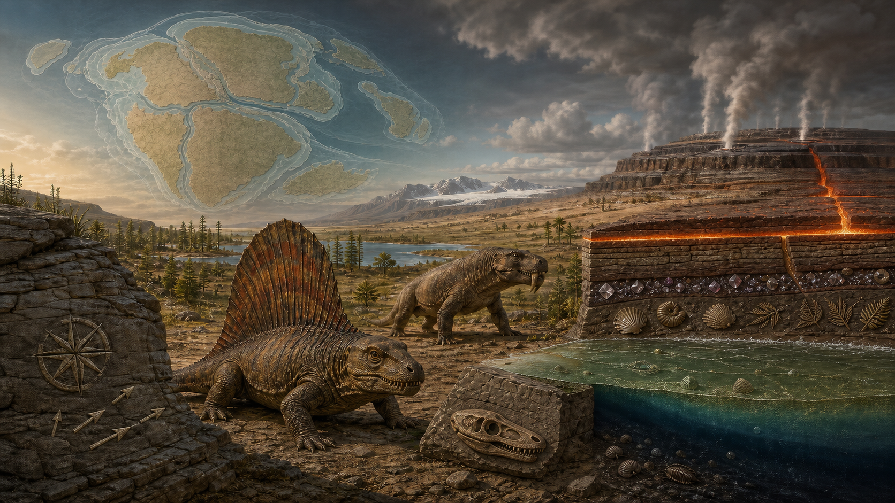
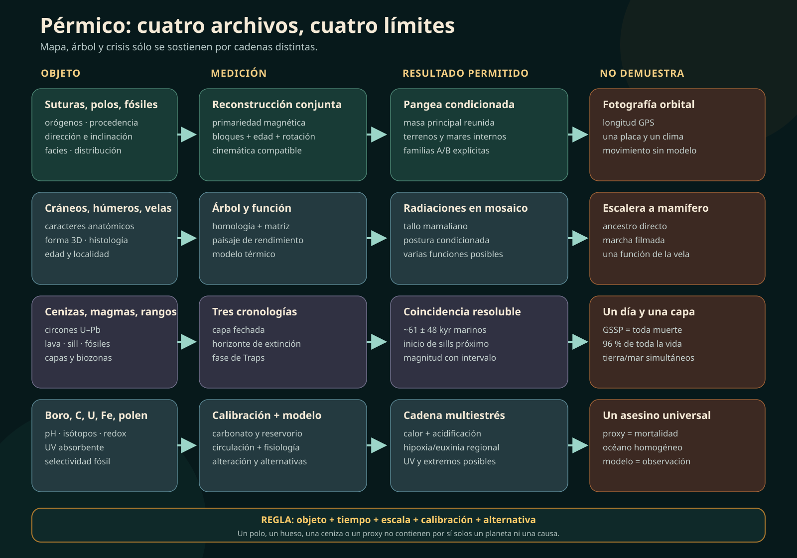
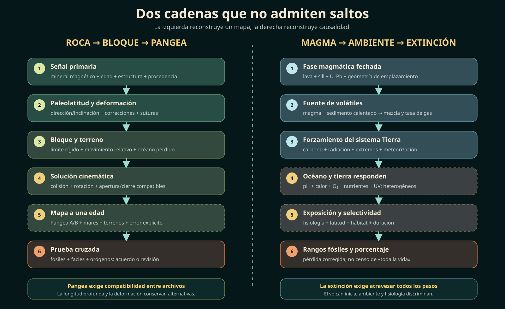

# Investigación 027 — ¿Cómo se ensambló Pangea, qué eran los sinápsidos y por qué la mayor extinción no tuvo una sola causa?



> **Portada conceptual:** yuxtapone reconstrucción continental, archivos fósiles y una cadena volcán–atmósfera–océano. No es un mapa paleogeográfico exacto, no coloca todos los taxones en un mismo lugar y no representa una erupción instantánea que mate por una sola vía.





## Respuesta breve, con sus condiciones

El Pérmico se extiende de `298.9 ± 0.15` a `251.902 ± 0.024 Ma` en la tabla ICS 2026. Comenzó en el horizonte de Aidaralash Creek definido por un conodonto y terminó en el GSSP de Meishan definido por otro; ninguno de los dos puntos coincide por definición con «la formación de Pangea» o con toda la mortandad. El periodo contiene tres series —Cisuraliense, Guadalupiense y Lopingiense—, climas que pasaron de una casa de hielo menguante a un invernadero terminal y más de una crisis biótica (`CLAIM-PERMIAN-SCOPE-001`, `CLAIM-PERMIAN-BOUNDARY-001`, `CLAIM-PERMIAN-SUBDIVISIONS-001`).

Pangea tampoco apareció en un instante. Gondwana, Laurussia y otros bloques se reunieron mediante colisiones y suturas prolongadas; varios terrenos asiáticos siguieron separados por Paleotetis y Neotetis. Orogenias, paleomagnetismo, continuidad de unidades, faunas y reconstrucciones cinemáticas sostienen el ensamblaje, pero no fijan de manera única todas las longitudes. Las configuraciones llamadas Pangea A y B muestran una incertidumbre real, no dos supercontinentes observados (`CLAIM-PERMIAN-PANGEA-ASSEMBLY-001`, `CLAIM-PERMIAN-PANGEA-EVIDENCE-001`, `CLAIM-PERMIAN-PANGEA-CONFIGURATION-001`).

Los sinápsidos son la rama de amniotas que incluye a los mamíferos. `Dimetrodon` fue un sinápsido no mamífero y no un dinosaurio; estaba más próximo genealógicamente a nosotros que a un dinosaurio, pero no está demostrado como nuestro ancestro directo. «Pelicosaurio» reúne un grado parafilético. Los terápsidos y, dentro de ellos, los cinodontos forman ramas anidadas; dientes, cráneos y miembros cambiaron en mosaico. Un análisis de 2025 de más de 200 taxones rechazó una marcha simple de postura extendida a erguida y situó la postura parasagital habitual mucho más tarde, en el tallo de los terios (`CLAIM-PERMIAN-SYNAPSID-DEFINITION-001`, `CLAIM-PERMIAN-DIMETRODON-001`, `CLAIM-PERMIAN-LOCOMOTION-001`).

La extinción terminal fue la mayor crisis marina conocida bajo varias métricas, pero «murió el 96 % de toda la vida» no es una observación. Un reanálisis estimó cerca de `81 %` de especies marinas para el pulso terminal al separar extinción de fondo y la crisis capitaniense. El registro terrestre no ofrece un porcentaje planetario equivalente ni sincronía perfecta: algunas secuencias del Karoo apoyan proximidad temporal con la crisis marina, mientras una cronología de Cathaysia sitúa el colapso forestal después del comienzo marino (`CLAIM-PERMIAN-EPME-MAGNITUDE-001`, `CLAIM-PERMIAN-TERRESTRIAL-TIMING-001`).

La coincidencia de alta precisión con los Traps Siberianos, sobre todo el inicio de intrusiones de sills en sedimentos ricos en volátiles, sostiene al magmatismo como desencadenante principal. La mortalidad, sin embargo, requiere una cadena: gases de efecto invernadero y otros volátiles → perturbación del carbono → calentamiento y extremos climáticos → acidificación, pérdida de oxígeno, reciclaje de nutrientes y euxinia, más estrés terrestre. UV-B y «mega-El Niño» son mecanismos/amplificadores comprobables, no causas independientes ya demostradas en todo el planeta (`CLAIM-PERMIAN-TRAPS-001`, `CLAIM-PERMIAN-CARBON-001`, `CLAIM-PERMIAN-KILLCHAIN-001`).

## 1. Siete relojes que la palabra «Pérmico» no sincroniza

La narrativa popular comprime al menos siete problemas:

1. ¿dónde comienza y termina formalmente el sistema?;
2. ¿cuándo y cómo se ensamblaron los bloques de Pangea?;
3. ¿qué clima tuvo cada región y fase?;
4. ¿qué parentesco y función tenían los sinápsidos?;
5. ¿cuándo ocurrieron las crisis capitaniense y terminal?;
6. ¿qué hizo el magmatismo siberiano y en qué orden?;
7. ¿cómo se convierten cambios ambientales en pérdidas biológicas?

```text
GSSP ≠ colisión continental
mapa reconstruido ≠ fotografía orbital
ventana temporal ≠ ancestro directo
volcanismo ≠ mecanismo de muerte completo
porcentaje estimado ≠ fracción de «toda la vida»
```

Los relojes se conectan mediante correlaciones y modelos, pero no se sustituyen (`CLAIM-PERMIAN-SCOPE-001`).

## 2. La base del Pérmico está en un arroyo de Kazajistán

La base del Pérmico, Cisuraliense y Asseliense se fija en Aidaralash Creek, Kazajistán, `27 m` sobre la base del lecho 19. El marcador es la primera aparición de `Streptognathodus isolatus`, dentro de una sucesión de conodontos (`SRC-DAVYDOV-ASSELIAN-1998`, `SRC-PERMIAN-SUBCOMMISSION-2026`). La tabla vigente asigna `298.9 ± 0.15 Ma` (`SRC-ICS-2026`).

El final formal del Pérmico y la base del Triásico/Induense están en Meishan D, China, en la base del lecho `27c`, por la primera aparición de `Hindeodus parvus`. El valor tabulado es `251.902 ± 0.024 Ma` (`SRC-YIN-PTB-2001`, `SRC-ICS-2026`).

El horizonte de extinción principal y el GSSP están estrechamente próximos, pero responden a criterios diferentes. La mortalidad no «define» automáticamente el límite (`CLAIM-PERMIAN-BOUNDARY-001`).

## 3. Tres series y nueve pisos evitan un Pérmico uniforme

La escala internacional divide el sistema en:

- **Cisuraliense:** Asseliense, Sakmariense, Artinskiense y Kunguriense;
- **Guadalupiense:** Roadiense, Wordiense y Capitaniense;
- **Lopingiense:** Wuchiapingiense y Changhsingiense.

No todas las bases tuvieron siempre GSSP ratificado. Artinskiense fue ratificado en 2022 y la página de la subcomisión aún muestra al Kunguriense como candidato; Wuchiapingiense fue redefinido en 2023. Una tabla es infraestructura científica en revisión, no una lista atemporal (`SRC-PERMIAN-SUBCOMMISSION-2026`; `CLAIM-PERMIAN-SUBDIVISIONS-001`).

## 4. Pangea fue una secuencia de colisiones, no un clic continental

La masa principal surgió al reunir Gondwana con Laurussia mediante los cinturones varisco–alleganiano y al cerrar océanos entre otros bloques. La sutura urálica y la incorporación de terrenos asiáticos continuaron durante el Pérmico; Cimmeria se separaba de Gondwana mientras Neotetis se abría. «Toda la Tierra» nunca fue literalmente una sola placa ni una sola costa (`SRC-DOMEIER-PANGEA-2014`).

La evidencia combina:

- continuidad de cinturones orogénicos hoy separados;
- edades y procedencias de rocas a ambos lados de suturas;
- fósiles y provincias biogeográficas;
- paleomagnetismo que restringe latitud y orientación;
- cinemática de placas compatible con creación y consumo de litosfera.

Ninguna ruta por sí sola entrega un globo completo. Las reconstrucciones son soluciones conjuntas condicionadas (`CLAIM-PERMIAN-PANGEA-ASSEMBLY-001`, `CLAIM-PERMIAN-PANGEA-EVIDENCE-001`).

## 5. Pangea A y B hacen visible la incertidumbre longitudinal

El paleomagnetismo recupera con mayor fuerza paleolatitud y rotación; la longitud absoluta profunda es mucho más difícil. Datos del Pérmico temprano se han usado para defender una configuración **Pangea B**, con Gondwana desplazada hacia el este respecto de Laurussia, y datos tardíos admiten **Pangea A**, semejante al ajuste clásico. Pasar de B a A exigiría gran cizalla intracontinental (`SRC-MUTTONI-PANGEA-2003`).

Otros modelos consideran que errores de inclinación, selección de polos o deformación regional reducen la necesidad de ese desplazamiento. El debate no niega Pangea; cambia geometría, tiempo y movimiento interno (`CLAIM-PERMIAN-PANGEA-CONFIGURATION-001`).

## 6. Un supercontinente todavía contiene hielo, monzones y costas húmedas

La gran continentalidad favorecía fuerte estacionalidad e interiores áridos, mientras relieve, latitud y mares marginales producían mosaicos. Modelos y sedimentos de Pangea occidental muestran que el levantamiento/colapso de montañas, `CO₂`, hielo y geometría oceánica alteraban circulación y precipitación (`SRC-TABOR-PANGEA-2008`).

La Edad de Hielo del Paleozoico tardío no terminó en la frontera Carbonífero–Pérmico. Mantos de Gondwana crecieron y retrocedieron en pulsos; la deglaciación fue escalonada y persistieron archivos fríos hasta fases tardías según región y definición (`SRC-MONTANEZ-LPIA-2013`, `SRC-MUTTONI-LPIA-2020`).

```text
interior árido ≠ continente entero desértico
monzón ≠ lluvia constante
Pérmico temprano ≠ invernadero terminal
glaciar local ≠ temperatura planetaria única
```

(`CLAIM-PERMIAN-CLIMATE-MOSAIC-001`, `CLAIM-PERMIAN-DEGLACIATION-001`).

## 7. Sinápsido no significa «reptil parecido a mamífero»

En filogenia moderna, Synapsida contiene al ancestro común de los sinápsidos y todos sus descendientes, incluidos mamíferos vivos. La fenestra temporal única ayudó históricamente a reconocer el grupo, pero una diagnosis moderna usa conjuntos de caracteres y árbol, no un agujero aislado.

«Reptil mamiferoide» mezcla semejanza y una clasificación donde Reptilia excluía a Mammalia. «Mamífero del tallo» o «sinápsido no mamífero» expresa mejor la genealogía, siempre declarando el nodo (`SRC-BENSON-SYNAPSIDS-2012`; `CLAIM-PERMIAN-SYNAPSID-DEFINITION-001`).

## 8. «Pelicosaurio» es un grado que deja fuera a sus descendientes

Los sinápsidos tempranos tradicionalmente reunidos como Pelycosauria incluyen caseidos, edafosáuridos, ofiacodóntidos y esfenacodóntidos, pero excluyen Therapsida pese a que ésta emerge dentro de ese conjunto. Por eso el término es parafilético y resulta útil sólo como grado descriptivo entre comillas (`SRC-BENSON-SYNAPSIDS-2012`).

Una caja parafilética puede describir anatomías; no debe dibujarse como peldaño homogéneo (`CLAIM-PERMIAN-PELYCOSAUR-001`).

## 9. `Dimetrodon` no fue dinosaurio, mamífero ni ancestro demostrado

`Dimetrodon` es un esfenacodóntido del Cisuraliense y parte inicial del Guadalupiense en algunas calibraciones regionales. Cráneo, dentición y postcráneo lo sitúan en el tallo mamaliano, cerca de la rama que contiene Therapsida, no dentro de Dinosauria. Un hallazgo en Richards Spur amplió su distribución ecológica y mostró que ni siquiera las faunas sinápsidas tempranas eran uniformes (`SRC-BRINK-DIMETRODON-2019`).

«Más cercano a mamíferos que a dinosaurios» es una relación de nodos. No significa parecido externo, sangre caliente ni línea directa hacia humanos (`CLAIM-PERMIAN-DIMETRODON-001`).

## 10. La vela tiene vasos, crecimiento y varias funciones posibles

Un modelo clásico calculó calentamiento/enfriamiento y defendió termorregulación en `Dimetrodon` (`SRC-BRAMWELL-SAIL-1973`). Histología comparada de espinas elongadas mostró diversidad de vascularización y crecimiento, debilitando una función termorreguladora universal para todas las velas sinápsidas (`SRC-HUTTENLOCKER-SAIL-2011`).

Exhibición, reconocimiento, almacenamiento y termorregulación no son mutuamente excluyentes. Hueso y superficie estimada restringen capacidades; no conservan conducta ni presión selectiva (`CLAIM-PERMIAN-SAIL-001`).

## 11. Los terápsidos se diversificaron antes de llenar nuestras vitrinas

Therapsida está anidado entre los esfenacodontes e incluye biarmosuquios, dinocefálios, anomodontos, gorgonopsios y teriodontos. El registro clásico medio/tardío se concentra en Rusia y Karoo, lo que alimentó una historia de origen en altas latitudes. Un gorgonopsio de Mallorca publicado en 2024, profundamente anidado y más antiguo de lo esperado, favorece una historia temprana ecuatorial y una larga línea fantasma (`SRC-MATAMALES-GORGONOPSIAN-2024`).

La primera aparición regional no fija el lugar de origen. Distribución, árbol y edad deben reconciliarse (`CLAIM-PERMIAN-THERAPSIDS-001`).

## 12. La postura mamaliana no subió una escalera

Un análisis de 2025 integró forma 3D del húmero, siete rasgos funcionales y más de `200` taxones actuales/fósiles. Recuperó:

- una postura extendida temprana distinta de reptiles y monotremas vivos;
- gran variación dentro de terápsidos y cinodontos;
- radiaciones sucesivas con combinaciones funcionales propias;
- soporte para postura parasagital habitual sólo mucho después, en terios del tallo.

El húmero permite inferencia funcional, no una película de marcha. Músculos, cintura, miembro posterior y conducta agregan incertidumbre (`SRC-BROCKLEHURST-FORELIMB-2025`; `CLAIM-PERMIAN-LOCOMOTION-001`).

## 13. Los cinodontos no eran mamíferos pérmicos terminados

Cynodontia contiene a Mammalia, pero los cinodontos pérmicos conocidos están fuera de la corona mamaliana. Micro-CT y matrices recientes revisan sus primeros miembros y recuperan una larga línea fantasma entre la divergencia probable y los cuerpos diagnósticos tardopérmicos (`SRC-PUSCH-CYNODONTS-2024`).

Dientes diferenciados, paladar o cambios mandibulares se ensamblaron en secuencias. Ningún carácter aislado convierte un fósil en mamífero ni fecha el origen de lactancia o pelo (`CLAIM-PERMIAN-CYNODONTS-001`).

## 14. El Pérmico tuvo una crisis capitaniense separada

La extinción del Capitaniense medio afectó arrecifes y otros grupos marinos y se asocia temporalmente con volcanismo de Emeishan. En China, basaltos y carbonatos interdigitados vinculan inicio eruptivo, perturbación isotópica y pérdidas (`SRC-WIGNALL-EMEISHAN-2009`). Registros de Pangea noroccidental y uranio en carbonatos apoyan una crisis extendida y episodios de anoxia, aunque sincronía, dos pulsos y consecuencias terrestres siguen abiertos (`SRC-BOND-CAPITANIAN-2020`, `SRC-SONG-CAPITANIAN-2023`).

Sumar esta crisis a la terminal infló algunos porcentajes históricos. Dos eventos no son una extinción de `10 Myr` (`CLAIM-PERMIAN-CAPITANIAN-001`).

## 15. La mayor extinción depende de denominador, bin y corrección

El famoso `90–96 %` de especies marinas combinó en parte pérdidas del Pérmico medio y terminal. Un método que separó extinción de fondo, agrupamiento y efecto Signor–Lipps estimó `~81 %` de especies marinas para la crisis terminal, con un rango modelado alrededor de esa cifra (`SRC-STANLEY-EXTINCTIONS-2016`).

La conclusión «mayor crisis marina del Fanerozoico» permanece; la frase «casi toda la vida murió» no. Familias, géneros, especies, ocurrencias y función ecológica tienen denominadores distintos. Microbios, plantas, hongos y continentes no forman un censo equivalente (`CLAIM-PERMIAN-EPME-MAGNITUDE-001`, `CLAIM-PERMIAN-SURVIVAL-001`).

## 16. La precisión temporal vino de cenizas, no del aspecto de la crisis

CA-ID-TIMS de circones y correlación en Meishan/Shangsi resolvieron la transición. Un modelo de alta precisión situó el intervalo principal entre `251.941 ± 0.037` y `251.880 ± 0.031 Ma`, unos `61 ± 48 kyr`, y el comienzo de la excursión negativa de carbono antes de la pérdida principal (`SRC-SHEN-EPME-2011`, `SRC-BURGESS-2014`).

Las edades pertenecen a capas de ceniza y se transfieren al horizonte biológico mediante sedimentación/correlación. «Instantáneo» en geología no significa un día ni una sola generación (`CLAIM-PERMIAN-EPME-TIMING-001`).

## 17. Los Traps Siberianos tienen una anatomía temporal

Geocronología U–Pb confirma magmatismo voluminoso antes, durante y después de la extinción, de modo que volumen total no identifica el pulso letal (`SRC-BURGESS-TRAPS-2015`). La fase crítica coincide con el cambio desde lavas dominantes al emplazamiento de enormes complejos de sills cerca de `251.907 ± 0.067 Ma`. Calentar evaporitas, carbonatos, carbón y otros sedimentos ricos en volátiles ofrece una vía para liberar gases adicionales (`SRC-BURGESS-SILLS-2017`).

```text
provincia ígnea completa ≠ pulso causal
lava visible ≠ todo el gas
coincidencia temporal ≠ cadena de mortalidad
sill en sedimento fértil → mecanismo comprobable
```

La relación causal es fuerte porque tiempo, volumen potencial y mecanismos convergen; cada gas y flujo conserva incertidumbre (`CLAIM-PERMIAN-TRAPS-001`).

## 18. El carbono emitido se reconstruye por inversión

Una inversión de isótopos, pH, temperatura y modelo de sistema Tierra estimó alrededor de `36,000 Gt C` en `~168 kyr`, con tasas máximas cercanas a `5 Gt C/año`, dominadas por `CO₂` volcánico bajo la composición isotópica elegida (`SRC-CUI-CARBON-2021`).

No es un contador de chimenea. Depende de:

- edad y tasa de sedimentación;
- composición isotópica de la fuente;
- equilibrio aire–mar;
- alcalinidad, productividad y enterramiento;
- parametrización climática.

El resultado demuestra la escala de carbono necesaria bajo ese modelo, no una factura exacta del volcán (`CLAIM-PERMIAN-CARBON-001`).

## 19. Del volcán a la muerte hay una red de mecanismos

La evidencia favorece una cascada acoplada:

```text
sills + lavas
→ CO₂ y otros volátiles
→ perturbación del ciclo del carbono
→ calentamiento + extremos hidrológicos
→ meteorización/nutrientes + menor solubilidad de O₂
→ acidificación + desoxigenación + euxinia regional
→ compresión de hábitat y límites fisiológicos
→ extinción selectiva
```

Isótopos de boro en braquiópodos documentan caída de pH y un modelo la vincula con un pulso de desgasificación (`SRC-JURIKOVA-ACIDIFICATION-2020`). Especiación de fósforo/hierro en Svalbard reconstruye cómo meteorización, vegetación y reciclaje extendieron anoxia de modo geográficamente variable (`SRC-SCHOBBEN-ANOXIA-2020`). Un modelo ecofisiológico reproduce la selectividad geográfica marina mediante calentamiento y pérdida de oxígeno dependientes del metabolismo (`SRC-PENN-HYPOXIA-2018`).

Acidificación, hipoxia, sulfuro, calor y alimento se refuerzan y afectan organismos distintos. No son votos independientes ni una sola toxina global (`CLAIM-PERMIAN-KILLCHAIN-001`).

## 20. UV-B y mega-El Niño son amplificadores con puentes propios

Polen malformado y experimentos de UV-B muestran que dosis elevadas pueden causar esterilidad forestal; compuestos absorbentes de UV en polen fósil ofrecen otra ruta, pero cobertura, fuente de ozono y alternativas tóxicas requieren control (`SRC-BENCA-UVB-2018`, `SRC-LIU-UVB-2023`). La señal apoya estrés UV en secciones concretas, no un agujero de ozono planetario medido (`CLAIM-PERMIAN-UVB-001`).

Un estudio de 2024 combinó isótopos de oxígeno, sedimentos y modelo climático para proponer oscilaciones tipo mega-El Niño que amplificaron sequía, calor, incendios y colapso ecológico (`SRC-SUN-MEGAELNINO-2024`). Es un mecanismo dinámico dependiente del modelo y de una geografía sin Pacífico moderno; no reemplaza el forzamiento volcánico (`CLAIM-PERMIAN-MEGAELNINO-001`).

En 2026, otra inversión propuso que erosión y meteorización después de pérdida vegetal amortiguaron inicialmente el calentamiento mientras añadían nutrientes y preparaban anoxia (`SRC-LI-EROSION-2026`). Su valor es explicar desfases; su juventud y dependencia de modelo exigen estado `PROV`.

## 21. Tierra y mar no entregan un único horizonte mundial

Una sección del Karoo combinó facies, fósiles, isótopos y un circón fechado para defender proximidad entre fases terrestres y marinas (`SRC-BOTHA-KAROO-2020`). En el suroeste de China, CA-ID-TIMS en tobas situó el colapso prolongado del bosque de Cathaysia después del inicio de la extinción marina (`SRC-ZHANG-CATHAYSIA-2024`).

No son necesariamente resultados incompatibles: región, ecosistema, variable y resolución cambian. «Sincrónico» debe significar dentro de un intervalo declarado, no una línea dibujada a través de Pangea (`CLAIM-PERMIAN-TERRESTRIAL-TIMING-001`).

## LO OBSERVADO

| Afirmación | Observado/medido | Inferido | No observado |
|---|---|---|---|
| límite formal | lecho, conodonto, ratificación | edad interpolada | inicio de Pangea |
| Pangea | suturas, polos, rocas, fósiles | posición/rotación | vista global contemporánea |
| clima | facies, paleosuelos, hielo, isótopos | campos climáticos | tiempo meteorológico diario |
| sinápsido | huesos y caracteres | árbol/función | ancestro directo |
| vela | espina, histología, alometría | intercambio térmico/exhibición | conducta |
| postura | húmero 3D y comparadores | paisaje funcional | marcha filmada |
| extinción | rangos y ocurrencias | tasa y porcentaje | censo de toda la vida |
| Traps | rocas ígneas y edades | flujo de gas | emisión total medida |
| acidificación | boro/carbonato | pH por calibración | océano uniforme |
| hipoxia | proxies y selectividad | volumen habitable | cada muerte individual |
| UV-B | polen/compuestos | ozono y dosis | cobertura global directa |
| mega-El Niño | proxies + modelo | modo climático | ENSO moderno idéntico |

## LO MEDIDO

- ICS tabula el sistema entre `298.9 ± 0.15` y `251.902 ± 0.024 Ma`.
- CA-ID-TIMS acota la pérdida marina principal a `61 ± 48 kyr` bajo el modelo estratigráfico publicado.
- El inicio de la fase de sills está fechado cerca de `251.907 ± 0.067 Ma`.
- El reanálisis de diversidad estima `~81 %` de especies marinas para el pulso terminal.
- La inversión del ciclo del carbono produce `~36,000 Gt C` en `~168 kyr`, con máximos `~5 Gt C/año`.

Cada número conserva muestra, transferencia y modelo; ninguno es una medición continua del planeta.

## LO INFERIDO

- posiciones y movimientos de continentes desde polos, suturas y cinemática;
- parentesco, función de vela y postura desde caracteres/homólogos;
- masa/tasa de gases desde proxies e inversión;
- área de anoxia, pH, modos climáticos y selectividad desde modelos;
- sincronía o diacronía desde edades de capas y correlación.

La inferencia es auditable precisamente porque declara qué observación la alimenta y qué supuesto la conecta.

## LOS SUPUESTOS

1. los conodontos elegidos son identificables y correlacionables;
2. polos paleomagnéticos retienen señal primaria y corrección de inclinación adecuada;
3. suturas y procedencias admiten la cinemática propuesta;
4. facies/proxies climáticos se pueden transferir sin borrar la región;
5. caracteres fósiles y matrices recuperan el árbol sin homoplasia decisiva;
6. forma del húmero aproxima función bajo comparadores pertinentes;
7. rangos taxonómicos y muestreo permiten estimar pérdida real;
8. cenizas y horizontes fósiles se correlacionan sin hiatos ocultos;
9. edades U–Pb de Traps y Meishan son intercomparables;
10. proxies de pH/redox conservan señal primaria;
11. modelos de carbono y clima abarcan fuentes/retroalimentaciones relevantes;
12. respuestas fisiológicas modernas son transferibles a clados extintos.

## LAS INCERTIDUMBRES

- paleolongitud y deformación interna de Pangea;
- cobertura espacial y estacional de cada clima;
- origen geográfico y líneas fantasma de terápsidos/cinodontos;
- conducta, tejido blando y función dominante de las velas;
- detectabilidad y denominador de la pérdida biológica;
- masa, composición y tasa de cada pulso gaseoso;
- dependencia entre proxies que comparten secciones/correlación;
- resolución desigual entre crisis marinas y terrestres.

## LAS ALTERNATIVAS

- Pangea A desde antes frente a una transformación B→A.
- Aridez/monzón controlados principalmente por `CO₂`, relieve o geometría continental.
- Vela dominada por termorregulación, exhibición o varias funciones.
- Diversificación terápsida ecuatorial temprana frente a una señal producida por líneas fantasma y muestreo.
- Crisis capitaniense de uno o dos pulsos, con magnitud global variable.
- Sills como pulso principal frente a una combinación prolongada de lava, intrusión y metamorfismo de contacto.
- Acidificación, calor, hipoxia/euxinia, UV-B y extremos climáticos con pesos distintos por ambiente.
- Colapso terrestre sincrónico a escala geológica pero diacrónico a escala de decenas/cientos de milenios.

## LAS CONTROVERSIAS

Los expedientes activos están registrados en `CONTROVERSIES.md`: configuración A/B, controles climáticos, función de vela, origen terápsido, locomoción, pulsos capitaniense, magnitud terminal, pulso de los Traps, pesos de la cadena de muerte y sincronía tierra–mar. Separarlos evita que un desacuerdo fino se presente como rechazo del marco completo.

## QUÉ PODRÍA FALSARLO

- polos primarios de alta fidelidad que excluyan una de las geometrías Pangea;
- suturas/edades que impidan la cinemática elegida;
- nuevos fósiles tempranos que muevan raíz, origen geográfico o función sinápsida;
- tejidos blandos o series ontogenéticas que discriminen la función de las velas;
- modelos locomotores de cuerpo completo validados que recuperen una transición lineal;
- cronologías que separen de forma robusta sills, carbono y extinción;
- isótopos de boro revisados que eliminen la caída de pH;
- proxies globales que nieguen calentamiento/desoxigenación en el intervalo;
- estimadores de diversidad comparables que cambien el ranking de severidad;
- secciones terrestres de varias paleolatitudes con edades directas que converjan en un solo pulso o demuestren diacronía amplia;
- predicciones espaciales únicas para UV-B o mega-El Niño confirmadas fuera de las localidades originales.

## NIVEL DE CONFIANZA

| Resultado | Confianza | Motivo |
|---|---:|---|
| edades y GSSP del sistema | A para estándar; B para edades | definición institucional + geocronología revisable |
| ensamblaje amplio de Pangea | B | múltiples suturas, paleomagnetismo y cinemática |
| configuración A/B fina | C-D | longitud, inclinación y deformación |
| mosaico climático/deglaciación | B | facies, hielo, proxies y modelos; cobertura desigual |
| pertenencia de mamíferos a Synapsida | A-SEM | definición filogenética |
| `Dimetrodon` no dinosaurio | A-B | anatomía y filogenia |
| función dominante de la vela | D | varias funciones compatibles |
| radiación terápsida y cinodontos tardopérmicos | B-COND | cuerpos + largas líneas fantasma |
| locomoción no lineal | B-COND | muestra/morfometría amplia; función inferida |
| crisis capitaniense separada | B | fósiles, volcanismo y redox; bordes abiertos |
| mayor crisis marina terminal | B | varias métricas convergen; magnitud dependiente del método |
| `~81 %` de especies marinas | C | estimador y correcciones explícitas, no censo |
| coincidencia Traps–extinción | A-B | U–Pb de alta precisión |
| sills como pulso crítico | B-COND | coincidencia + mecanismo; flujos no medidos |
| calentamiento/acidificación/desoxigenación | B | proxies y modelos múltiples |
| pesos de cada mecanismo | C-D | covariación y heterogeneidad |
| UV-B global | C-D | señal local/experimental, cobertura y ozono inferidos |
| mega-El Niño | C-D-PROV | proxy + modelo reciente |
| sincronía tierra–mar | C-D | resultados regionales discordantes |

## QUÉ SABEMOS REALMENTE

- el estándar formal y la arquitectura de tres series;
- que la masa principal de Pangea estaba reunida, con bloques periféricos y océanos internos;
- que el Pérmico atravesó climas heterogéneos y deglaciación prolongada;
- que mamíferos son sinápsidos y `Dimetrodon` no fue dinosaurio;
- que terápsidos/cinodontos están anidados y sus rasgos se ensamblaron en mosaico;
- que hubo una crisis capitaniense separada y una crisis terminal excepcional;
- que el magmatismo siberiano coincide con la crisis y ofrece mecanismos suficientes para perturbar carbono/clima;
- que calentamiento, acidificación y pérdida de oxígeno participaron de forma acoplada.

## QUÉ TODAVÍA NO SABEMOS

- una geometría longitudinal única de Pangea para todo el periodo;
- el origen geográfico exacto de Therapsida/Cynodontia;
- la función principal de cada vela sinápsida;
- postura, metabolismo, pelo o conducta de muchos taxones concretos;
- un porcentaje de «toda la vida» o un censo terrestre planetario;
- el flujo exacto y la composición temporal de gases de los Traps;
- el peso universal de cada mecanismo de muerte;
- si UV-B y mega-El Niño tuvieron la misma intensidad global;
- cuánto se separaron en tiempo los colapsos de cada ecosistema terrestre y marino.

## Síntesis

El Pérmico no fue una postal de un solo continente dominado por «reptiles mamiferoides» hasta que un volcán mató `96 %` de la vida. Fue un sistema en movimiento: colisiones y terrenos periféricos, hielo menguante y monzones regionales, radiaciones sinápsidas con anatomías funcionales propias y dos crisis mayores separables. La Gran Mortandad se entiende mejor como una cadena causal sostenida por cronología y física: el pulso magmático siberiano alteró carbono y clima; el océano y la tierra amplificaron el estrés mediante rutas distintas; organismos con fisiologías y geografías distintas respondieron selectivamente. La evidencia es fuerte precisamente porque no exige que una sola cifra, silueta o toxina cuente toda la historia.
