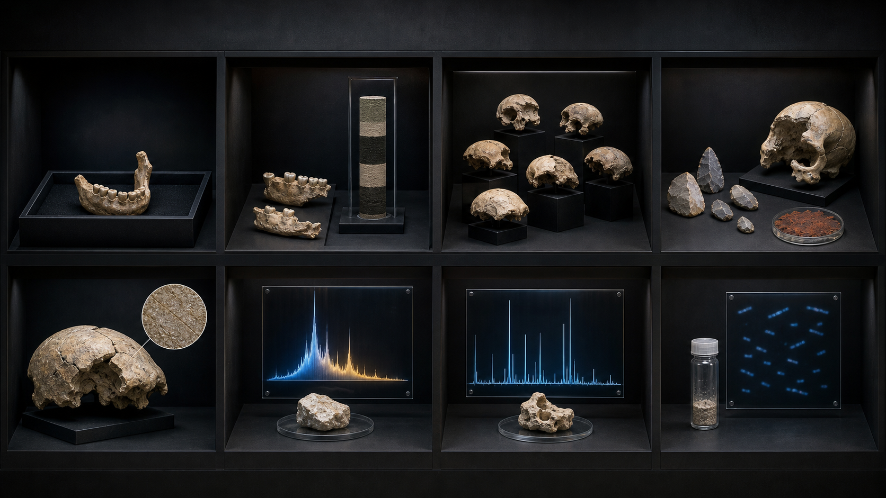
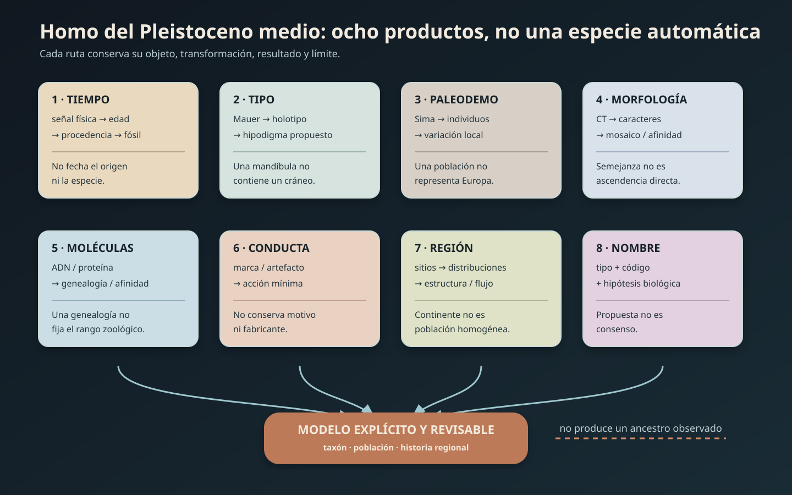
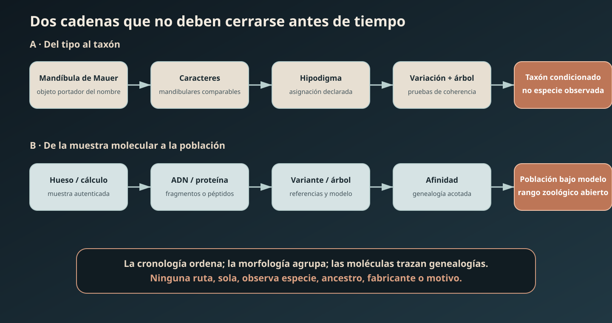

# Investigación 039 — ¿Cómo reconstruimos las poblaciones humanas del Pleistoceno medio sin convertir *Homo heidelbergensis* en un cajón de sastre ni cada fósil en un ancestro?



> **Portada conceptual:** reúne una mandíbula tipo, cráneos fragmentarios, estratigrafía, industria y archivos moleculares en vitrinas separadas. No representa individuos coetáneos, un cuerpo compuesto, una marcha evolutiva ni parentesco directo. La procedencia generativa y sus límites están registrados en `assets/visuales/README.md`.





## Pregunta y definiciones

Esta investigación pregunta qué puede saberse de las poblaciones de `Homo` durante el Chibaniense —la edad formal cuya base está en `774.1 ka`— y su entorno temporal inmediato. El intervalo cronológico, el fósil, el hipodigma, el taxón, la afinidad molecular y la población regional se mantienen como objetos distintos (`CLAIM-HOMO-MIDDLE-SCOPE-001`, `CLAIM-HOMO-MIDDLE-TIMEBIN-001`).

`Homo heidelbergensis` se usa sólo cuando se declara qué concepto se adopta. En sentido mínimo remite al tipo, la mandíbula de Mauer; en usos amplios ha absorbido fósiles europeos, africanos y a veces asiáticos muy diferentes. `Homo rhodesiensis`, `Homo bodoensis`, «Homo arcaico» y «Homo del Pleistoceno medio» no son sinónimos automáticos (`CLAIM-HOMO-MIDDLE-TAXONOMY-001`).

## Respuesta breve provisional

La mandíbula de Mauer es el holotipo de `H. heidelbergensis` y fue fechada en `609 ± 40 ka`. No existe un «cráneo tipo de Heidelberg» y una mandíbula aislada no define por sí sola la variación craneal, postcraneal o genética de una especie continental. La edad del tipo es sólida; extender su nombre a otros fósiles exige caracteres comparables y una hipótesis taxonómica explícita (`CLAIM-HEIDELBERGENSIS-TYPE-001`, `CLAIM-HEIDELBERGENSIS-MAUER-AGE-001`, `CLAIM-HEIDELBERGENSIS-MAUER-LIMIT-001`).

El registro no forma una fila de transición. El proteoma dental de `H. antecessor`, de Gran Dolina, lo sitúa como grupo hermano cercano del clado que incluye humanos posteriores, pero no demuestra que esos individuos fueran ancestros directos. Fósiles de Thomas Quarry I en Casablanca, publicados en 2026 y fechados cerca de la inversión Matuyama–Brunhes (`773 ± 4 ka` nominales), son distintos de `H. antecessor` y combinan caracteres primitivos y derivados; sostienen una rama africana basal respecto a `H. sapiens` bajo el análisis publicado, no una identidad individual con el último ancestro común (`CLAIM-ANTECESSOR-PROTEOME-001`, `CLAIM-CASABLANCA-773KA-2026-001`, `CLAIM-CASABLANCA-AFFINITY-001`, `CLAIM-HOMO-MIDDLE-ANCESTRY-LIMIT-001`).

Sima de los Huesos conserva una muestra excepcional, cercana a `430 ka`, con al menos 28 individuos y 17 cráneos reconstruidos. La cara y la región anterior del cráneo muestran caracteres neandertales derivados, mientras otras regiones son más primitivas: es evolución en mosaico. Su ADN mitocondrial fue más afín al linaje denisovano conocido, pero su ADN nuclear es más afín a neandertales. Esa discordancia restringe la historia de poblaciones y permite escenarios de reemplazo de linaje mitocondrial, estructura ancestral o flujo; no convierte a los individuos en denisovanos ni prueba por sí sola un evento concreto de hibridación (`CLAIM-SIMA-AGE-001`, `CLAIM-SIMA-MORPH-MOSAIC-001`, `CLAIM-SIMA-MTDNA-001`, `CLAIM-SIMA-NUCLEAR-001`, `CLAIM-SIMA-DISCORDANCE-001`).

Aroeira 3 (`390–436 ka`) combina rasgos que amplían la diversidad europea y aparece con industria achelense; Bodo, cerca de `600 ka`, conserva marcas de corte compatibles con descarnamiento intencional; Kabwe/Broken Hill fue fechado directamente en `299 ± 25 ka`. Ningún resultado autoriza a inferir que el Achelense identifica una especie, que Bodo documenta canibalismo o ritual, o que Kabwe tiene necesariamente medio millón de años (`CLAIM-AROEIRA-MOSAIC-001`, `CLAIM-AROEIRA-TECH-LIMIT-001`, `CLAIM-BODO-DEFLESHING-001`, `CLAIM-BODO-MOTIVE-LIMIT-001`, `CLAIM-KABWE-AGE-001`).

En África, las morfologías del Pleistoceno medio tardío son compatibles con estructura y diversidad regional; los modelos de «último ancestro virtual» son comparaciones geométricas condicionadas, no fósiles descubiertos. La propuesta `H. bodoensis` de 2022 intentó reorganizar parte de ese material, pero recibió objeciones nomenclaturales y evolutivas explícitas. Es una propuesta debatida, no una especie aceptada por decreto (`CLAIM-AFRICA-MIDDLE-DIVERSITY-001`, `CLAIM-BODOENSIS-PROPOSAL-001`, `CLAIM-BODOENSIS-STATUS-001`).

Harbin ilustra por qué los nombres deben permanecer revisables. Su morfología fue usada en 2021 para proponer `H. longi`; en 2025, 95 proteínas endógenas y variantes informativas, junto con ADN mitocondrial recuperado del cálculo dental, lo vincularon con denisovanos. La molécula conecta un individuo con una población molecular de referencia, pero no resuelve por sí sola si «denisovano» debe recibir un nombre de especie zoológica (`CLAIM-HARBIN-MORPH-NAME-001`, `CLAIM-HARBIN-DENISOVAN-2025-001`).

## Definiciones operacionales

| Término | Significado aquí | No significa |
|---|---|---|
| Chibaniense | edad formal del Pleistoceno entre `774.1` y `129 ka` aproximadamente | especie, industria o población |
| Pleistoceno medio | uso histórico cercano al Chibaniense; se declara si incluye bordes | conjunto biológico natural |
| holotipo | espécimen portador del nombre | promedio, ancestro o diagnóstico completo |
| hipodigma | conjunto de fósiles asignados a un taxón | población reproductiva observada |
| grado morfológico | combinación general de rasgos parecidos | clado monofilético o especie |
| afinidad molecular | proximidad bajo secuencias y modelo | nombre zoológico automático |
| paleodemo | población local inferida en tiempo y lugar acotados | especie entera o continente |
| industria | patrón técnico recurrente | fabricante taxonómico identificado |

## 1. Objetos observables hoy

| Expediente | Objetos | Qué puede observarse | Qué no está en el objeto |
|---|---|---|---|
| Mauer | una mandíbula, sedimentos y fauna | anatomía del tipo y contexto de edad | cráneo, cuerpo, ADN o rango de especie |
| Gran Dolina TD6 | dientes y huesos de `H. antecessor` | péptidos, caracteres y contexto | genealogía individual directa |
| Casablanca ThI-GH | mandíbulas, dientes, vértebras, fémur y estratigrafía | combinación anatómica y posición próxima a la inversión | cráneo completo o último ancestro común observado |
| Sima de los Huesos | restos de al menos 28 individuos, 17 cráneos y ADN | variación local, mosaico y dos genealogías moleculares | especie biológica completa o historia demográfica única |
| Aroeira | cráneo parcial, brecha, industria y combustión | mosaico anatómico y asociaciones locales | identidad del fabricante o control del fuego por individuo |
| Bodo | cráneo con modificaciones superficiales | secuencia y patrón de marcas | motivo, rito, consumo o identidad del agente |
| Kabwe | cráneo y señal de ESR/U-series | edad directa modelada y morfología | depósito primario completo o posición genealógica segura |
| Harbin | cráneo, petroso y cálculo dental | morfología, proteínas y mtDNA | genoma nuclear completo o nomenclatura obligatoria |

## 2. Mediciones e instrumentos

| Variable | Instrumento/protocolo | Señal real | Transformación | Sesgo dominante |
|---|---|---|---|---|
| edad de Mauer | IR-RF, ESR/U-series y fauna | luminiscencia, centros paramagnéticos y series U | edad de sedimento/diente → contexto del tipo | sistema abierto y asociación `[DATE][PROV]` |
| inversión magnética | magnetómetro y desmagnetización | remanencia y direcciones | polaridad → correlación Matuyama–Brunhes | excursiones y tasa sedimentaria `[ALTER][MODEL]` |
| morfología | CT, superficie, landmarks y caracteres | voxeles/coordenadas | reconstrucción → comparación → agrupación | deformación, alometría, sexo y muestra `[MODEL][SAMP]` |
| ADN antiguo | extracción, librerías y secuenciación | fragmentos cortos dañados | autenticación → consenso → árbol | contaminación, cobertura y linaje único `[CONT][PRES]` |
| proteoma | LC–MS/MS y búsqueda peptídica | espectros masa/carga | espectro → péptido → variante → afinidad | base de referencia y persistencia ancestral `[MODEL][CONT]` |
| marcas de corte | microscopía, morfometría y experimento | sección, estrías y superposición | traza → agente/proceso probable | pseudomarcas y equifinalidad `[ALTER][PRES]` |
| industria/fuego | tecnología lítica, micromorfología y magnetismo | negativos, remontajes, carbón y alteración | rasgo → proceso técnico/térmico | mezcla, palimpsesto y asociación `[PROV][ALTER]` |

## 3. Principios y condiciones de fallo

1. **Tipo y nomenclatura:** el nombre queda fijado al holotipo, no a una esencia. Falla cuando material incomparable se agrega por época o aspecto general.
2. **Contexto y edad:** una medición fecha una muestra o proceso; su traslado al fósil requiere procedencia. Falla con redeposición, sistemas abiertos o correlaciones forzadas.
3. **Homología y filogenia:** caracteres o variantes compartidas informan parentesco si están polarizados. Falla con convergencia, retención ancestral, selección o datos faltantes.
4. **Genealogías distintas:** ADN nuclear y mtDNA tienen historias y tamaños efectivos diferentes. Discordancia no es error; requiere modelos demográficos comparados.
5. **Población antes que continente:** variación en un depósito puede estimar un paleodemo. Falla si se extrapola una muestra local a una especie transcontinental.
6. **Tafonomía:** una marca puede identificar instrumento o secuencia con experimentos. El motivo social no está contenido en la geometría.
7. **Asociación arqueológica:** herramientas y fósiles en una unidad pueden compartir contexto sin identificar fabricante, cognición o lengua.

## 4. Cadenas de inferencia

```text
mandíbula tipo → caracteres preservados → comparación → hipodigma propuesto → taxón revisable
                                              ≠ especie continental observada

sedimento/diente → señal física → edad modelada → procedencia → edad del fósil
                                                        ≠ edad del linaje

cráneo/diente → ADN o proteína → variante → genealogía/afinidad → población bajo modelo
                                                        ≠ nombre zoológico automático

traza/artefacto → diagnóstico tafonómico → acción mínima → conducta posible
                                                   ≠ motivo o fabricante taxonómico
```

## 5. Cronología mínima auditada

| Expediente | Intervalo usado | Resultado | Reserva |
|---|---:|---|---|
| Casablanca ThI-GH | `773 ± 4 ka` nominales | población africana próxima a la base chibaniense | edad por inversión/contexto; afinidad morfológica modelada |
| Mauer | `609 ± 40 ka` | edad del holotipo de `H. heidelbergensis` | una mandíbula; no rango de especie |
| Bodo | `~600 ka` | cráneo africano con marcas de corte | edad/contexto menos directa que Kabwe; motivo abierto |
| Sima de los Huesos | `~430 ka` | paleodemo europeo con mosaico y ADN | acumulación y representación local |
| Aroeira 3 | `390–436 ka` | diversidad europea con Achelense | cráneo parcial y asociación local |
| Kabwe | `299 ± 25 ka` | fósil africano más joven de lo supuesto históricamente | datación directa modelada; procedencia antigua incompleta |
| Harbin | `>146 ka` | individuo de afinidad denisovana molecular | edad mínima y recuperación histórica problemática |

## 6. Mauer: un nombre apoyado en una mandíbula

La mandíbula fue descubierta en 1907 y nombrada en 1908. La datación radiométrica de 2010 combinó varios sistemas y situó el contexto en `609 ± 40 ka`. Es el espécimen portador del nombre; por ello, cualquier definición de `H. heidelbergensis` debe comenzar por lo que esa mandíbula permite comparar (`CLAIM-HEIDELBERGENSIS-TYPE-001`, `CLAIM-HEIDELBERGENSIS-MAUER-AGE-001`).

La ausencia de cráneo asociado crea un cuello taxonómico: cráneos como Petralona, Arago, Bodo o Kabwe no pueden unirse al tipo mediante caracteres craneales del tipo. La edad y una apariencia «intermedia» no llenan ese hueco. Un uso amplio puede ser una convención útil, pero debe declararse como hipótesis de hipodigma (`CLAIM-HEIDELBERGENSIS-MAUER-LIMIT-001`, `CLAIM-HOMO-MIDDLE-TAXONOMY-001`).

## 7. El borde de `~770 ka`: dos regiones, dos archivos

El proteoma de `H. antecessor` recuperó afinidad cercana al clado de poblaciones humanas posteriores. La palabra «hermano» en una topología no significa «padre» en una genealogía; la resolución de proteínas y la muestra impiden señalar una población ancestral concreta (`CLAIM-ANTECESSOR-PROTEOME-001`, `CLAIM-HOMO-MIDDLE-ANCESTRY-LIMIT-001`).

En Casablanca, la magnetoestratigrafía registra la transición Matuyama–Brunhes y sitúa los fósiles cerca de `773 ka`. Mandíbulas y dientes difieren de TD6 y combinan estados primitivos con afinidades hacia grupos posteriores. El análisis fortalece la existencia de diferenciación regional África–Europa cerca del borde, pero «basal respecto a la rama sapiens» sigue siendo una posición de árbol condicionada (`CLAIM-CASABLANCA-773KA-2026-001`, `CLAIM-CASABLANCA-AFFINITY-001`).

## 8. Sima de los Huesos: anatomía y dos árboles moleculares

La cronología por luminiscencia y paleomagnetismo converge cerca de `430 ka`. La muestra permite comparar individuos de un mismo sistema deposicional: caracteres neandertales derivados se concentran en cara y dentición anterior, mientras la bóveda conserva estados más primitivos. Esto sostiene una adquisición modular, no un «neandertal a medias» ordenado por porcentaje (`CLAIM-SIMA-AGE-001`, `CLAIM-SIMA-MORPH-MOSAIC-001`).

El mtDNA de un fémur resultó más cercano al linaje denisovano conocido. ADN nuclear posterior de varios especímenes los vinculó con neandertales. Como mitocondria y núcleo siguen genealogías distintas, el resultado mínimo es discordancia; reemplazo mitocondrial, estructura profunda o flujo son explicaciones rivales. El split de las ramas neandertal y denisovana debe ser anterior a la población de Sima, pero su fecha exacta sigue condicionada por tasa y demografía (`CLAIM-SIMA-MTDNA-001`, `CLAIM-SIMA-NUCLEAR-001`, `CLAIM-SIMA-DISCORDANCE-001`, `CLAIM-NEAND-DENIS-SPLIT-MIN-001`).

## 9. Aroeira: mosaico, Achelense y fuego no son una sola variable

Aroeira 3 amplía la variación europea del Pleistoceno medio. Su contexto entre `390 y 436 ka` incluye bifaces y evidencias de combustión. La independencia es desigual: cráneo, herramientas y sedimento comparten sitio, pero la anatomía, la tecnología y la alteración térmica se miden con instrumentos distintos (`CLAIM-AROEIRA-MOSAIC-001`).

La asociación demuestra que hubo homininos, Achelense y fuego en el sistema arqueológico; no identifica qué individuo talló, si encendió o conservó el fuego, ni qué nombre de especie debe llevar. Tecnología compleja tampoco funciona como diagnóstico anatómico (`CLAIM-AROEIRA-TECH-LIMIT-001`, `CLAIM-HOMO-MIDDLE-TOOLS-LIMIT-001`).

## 10. Bodo: de la marca al motivo queda un salto

El cráneo de Bodo muestra marcas cuya morfología, localización y secuencia son compatibles con descarnamiento mediante piedra. Es una inferencia tafonómica fuerte sobre una acción mínima (`CLAIM-BODO-DEFLESHING-001`).

Canibalismo requeriría evidencia de consumo; ritual funerario requeriría patrón contextual adicional; extracción de tejido, tratamiento mortuorio y violencia son alternativas. La marca no conserva intención ni institución social (`CLAIM-BODO-MOTIVE-LIMIT-001`).

## 11. Kabwe: una fecha directa reordena coexistencias

La datación combinada del cráneo y los sedimentos asociados produjo `299 ± 25 ka`, mucho más joven que varias estimaciones históricas. Kabwe coincide temporalmente con fósiles tempranos de `H. sapiens` y con otras poblaciones africanas. La edad demuestra coexistencia temporal potencial a escala continental, no contacto ni relación de ancestro–descendiente (`CLAIM-KABWE-AGE-001`).

Su procedencia minera histórica y la química abierta exigen modelar incorporación de uranio. La fecha es una mejora sustancial y condicionada, no una lectura sin supuestos.

## 12. África: diversidad regional antes que una especie paraguas

Comparaciones morfométricas recuperan diferencias entre Jebel Irhoud, Florisbad, Eliye Springs, Omo, Bodo, Kabwe y otros fósiles. Modelos de último ancestro virtual permiten preguntar qué combinación sería central bajo una muestra y un árbol, pero el resultado es una forma computada, no un espécimen (`CLAIM-AFRICA-MIDDLE-DIVERSITY-001`).

Un escenario de poblaciones estructuradas conectadas por flujo explica por qué mosaicos y rasgos derivados aparecen en regiones distintas; modelos de rama única o varios linajes también pueden ajustarse a partes del registro. Sin ADN africano de esta antigüedad y con cronologías desiguales, los pesos permanecen abiertos (`CLAIM-HOMO-MIDDLE-REGIONAL-001`).

## 13. `Homo bodoensis`: proponer no equivale a resolver

Roksandic y colegas propusieron `H. bodoensis` para reagrupar fósiles africanos y retirar usos problemáticos de `heidelbergensis/rhodesiensis`. La publicación y su diagnóstico son hechos verificables (`CLAIM-BODOENSIS-PROPOSAL-001`).

Delson y Stringer respondieron que el reemplazo incumplía reglas nomenclaturales y no resolvía los hipodigmas; otros desacuerdos afectan geografía y filogenia. El estado correcto es «propuesta controvertida». La descolonización de nombres, la validez nomenclatural y la coherencia biológica son preguntas relacionadas pero no intercambiables (`CLAIM-BODOENSIS-STATUS-001`).

## 14. Harbin: cuando la molécula revisa el expediente morfológico

En 2021, un cráneo masivo de Harbin fue comparado morfológicamente y convertido en holotipo de `H. longi`; su procedencia fue reconstruida indirectamente y su edad es un mínimo de `146 ka` (`CLAIM-HARBIN-MORPH-NAME-001`).

En 2025, el petroso produjo más de 20 000 péptidos correspondientes a 95 proteínas endógenas; variantes informativas lo agruparon con denisovanos. De manera independiente en material y laboratorio, cálculo dental produjo mtDNA dentro de la variación denisovana. Las dos rutas convergen en afinidad poblacional, pero comparten el mismo individuo y referencias moleculares (`CLAIM-HARBIN-DENISOVAN-2025-001`).

Este caso no clausura la nomenclatura. Muestra que una especie descrita sólo por forma puede resultar incluida en una población previamente reconocida por moléculas, y que «Denisovano» es primero una rama molecular antes que un rango zoológico acordado.

## 15. Corroboración e independencia

| Resultado | Rutas | Independencia | Lectura prudente |
|---|---|---|---|
| edad de Mauer | IR-RF, ESR/U-series y biocronología | instrumentos distintos; mismo contexto | alta para edad del tipo, no para rango taxonómico |
| Sima neandertal | cara/dientes + ADN nuclear | archivos distintos; misma población | convergencia fuerte de afinidad, no especie completa |
| discordancia de Sima | mtDNA + nuclear | moléculas diferentes; muestreo pequeño | observación robusta, mecanismo abierto |
| Aroeira | cráneo + industria + fuego | observables diferentes; sitio compartido | coexistencia local, autoría no identificada |
| Harbin denisovano | petroso/proteínas + cálculo/mtDNA | preparaciones distintas; mismo individuo | afinidad fuerte, taxonomía formal abierta |
| diversidad africana | múltiples fósiles + edades + morfometría | sitios distintos; comparadores/modelos compartidos | estructura probable, genealogía condicionada |

## 16. Historia del conocimiento

El recorrido histórico completo está en [`HISTORIA_039_HOMO_PLEISTOCENO_MEDIO_HEIDELBERGENSIS.md`](../18_historia_ciencia/HISTORIA_039_HOMO_PLEISTOCENO_MEDIO_HEIDELBERGENSIS.md). El patrón general va del tipo de Mauer y las especies paraguas a cronologías directas, paleodemos locales y genealogías moleculares discordantes.

## 17. Regla del adversario

### Adversario A — Una sola especie amplia `H. heidelbergensis`

**Mejor caso:** caracteres intermedios y continuidad temporal permiten una especie politípica extendida que dio origen a neandertales y sapiens.

**Pruebas:** diagnóstico aplicable al tipo, monofilia bajo matrices, continuidad regional y ausencia de agrupaciones mejores.

**Problemas:** tipo mandibular, hipodigmas incompatibles, Sima en rama neandertal y diversidad africana.

### Adversario B — Varias especies regionales (`heidelbergensis`, `rhodesiensis/bodoensis`, `longi`)

**Mejor caso:** diferencias persistentes reflejan linajes regionales suficientemente separados.

**Pruebas:** caracteres exclusivos reproducibles, topologías estables y congruencia molecular.

**Problemas:** muestras pequeñas, nombres ligados a tipos incomparables y flujo entre poblaciones.

### Adversario C — Paleodemos conectados sin forzar especies fósiles

**Mejor caso:** una metapoblación estructurada produce mosaicos, continuidad parcial y genealogías diferentes.

**Pruebas:** gradientes espaciales/temporales, modelos demográficos y nuevas moléculas regionales.

**Problemas:** puede volverse una etiqueta vaga si no fija escalas, tasas de flujo y predicciones.

### Adversario D — Grados morfológicos y nombres mínimos

**Mejor caso:** «Homo del Pleistoceno medio» evita falsa precisión hasta obtener mejores muestras.

**Pruebas:** análisis robustos sin depender de asignaciones específicas.

**Problemas:** una categoría cronológica no explica ramas biológicas y puede ocultar diversidad real.

## 18. Claims y evidencia

| Grupo | Evidencia principal | Resultado | Confianza |
|---|---|---|---|
| tiempo/tipo | Chiba + Mauer | intervalo formal y edad del holotipo | A/B |
| borde de `~770 ka` | proteoma TD6 + fósiles de Casablanca | linajes diferenciados cerca del nodo | B-COND |
| Europa | Sima + Aroeira | paleodemos mosaico; rama neandertal en Sima | B a B-COND |
| África | Bodo + Kabwe + morfometría | diversidad regional y coexistencia | B-COND |
| nomenclatura | `bodoensis` + respuesta | propuesta real, aceptación no resuelta | A estado; C taxón |
| Asia | Harbin morfología + proteína + mtDNA | afinidad denisovana del individuo | B |
| conducta | corte, Achelense y fuego | acciones/asociaciones mínimas | B; D autor/motivo |

## LO OBSERVADO

- La mandíbula de Mauer es el tipo y no incluye cráneo.
- Casablanca conserva mandíbulas, dientes y postcráneo en contexto próximo a la inversión Matuyama–Brunhes.
- Sima conserva numerosos individuos, cráneos reconstruibles y material molecular.
- Aroeira asocia un cráneo parcial, artefactos y señales térmicas.
- Bodo conserva marcas de corte; Kabwe conserva señal apta para datación directa.
- Harbin conserva un cráneo, proteínas y mtDNA de cálculo dental.

## LO MEDIDO

- Base chibaniense: `774.1 ka`.
- Casablanca: nominalmente `773 ± 4 ka`; Mauer: `609 ± 40 ka`.
- Sima de los Huesos: aproximadamente `430 ka`; Aroeira: `390–436 ka`.
- Kabwe: `299 ± 25 ka`; Harbin: más de `146 ka`.
- Sima: afinidad mitocondrial denisovana y afinidad nuclear neandertal.
- Harbin: 95 proteínas endógenas con variantes denisovanas y mtDNA denisovano.

## LO INFERIDO

- `H. heidelbergensis` amplio probablemente reúne material que no forma una unidad taxonómica simple.
- La divergencia neandertal–denisovana precede a Sima.
- Casablanca cae cerca de una separación entre ramas africanas y euroasiáticas bajo la matriz publicada.
- África albergó poblaciones estructuradas y morfológicamente diversas.
- Harbin representa un individuo de una población denisovana.

## LOS SUPUESTOS

- Que contextos fechados y fósiles no fueron retrabajados de forma no reconocida.
- Que caracteres comparados son homólogos y no sólo alométricos o convergentes.
- Que daño molecular y contaminación fueron modelados adecuadamente.
- Que referencias neandertales/denisovanas representan suficiente diversidad.
- Que hipodigmas históricos no mezclan señales incompatibles.
- Que modelos de uranio y luminiscencia describen la historia del sistema.

## LAS INCERTIDUMBRES

- Extensión biológica de `H. heidelbergensis` más allá de Mauer.
- Identidad del último ancestro común de sapiens, neandertales y denisovanos.
- Mecanismo exacto de la discordancia mitocondrial/nuclear en Sima.
- Estructura, conectividad y límites de poblaciones africanas.
- Rango zoológico de denisovanos y relación nomenclatural con `H. longi`.
- Fabricantes, control del fuego y motivos de procesamiento corporal.

## LAS ALTERNATIVAS

- Una especie politípica amplia, varias especies regionales o metapoblaciones conectadas.
- Afinidad por ascendencia común, retención ancestral o convergencia.
- Reemplazo mitocondrial, estructura profunda o flujo para Sima.
- `rhodesiensis`, `bodoensis` o categorías sin especie para parte del registro africano.
- Defleshing alimentario, mortuorio, práctico o violento para Bodo.

## LAS CONTROVERSIAS

- Alcance y validez de `H. heidelbergensis`.
- Prioridad y uso de `H. rhodesiensis`.
- Validez nomenclatural y filogenética de `H. bodoensis`.
- Identidad y geografía del último ancestro común.
- Asignación taxonómica de Sima y explicación de su mtDNA.
- Modelos de estructura africana.
- Ritmo de acreción neandertal en Europa.
- Sistema taxonómico de Asia y relación `H. longi`–denisovanos.
- Valor taxonómico de industrias y fuego.

## QUÉ PODRÍA FALSARLO

- Un diagnóstico craneomandibular que una de forma estable Mauer con hipodigmas amplios bajo matrices independientes.
- ADN o proteomas adicionales que reubiquen Sima, Casablanca o Harbin.
- Nuevas dataciones/procedencias que separen fósiles de los contextos usados.
- Muestras africanas asociadas que absorban o dividan la variación actual.
- Pruebas nomenclaturales y filogenéticas convergentes que estabilicen `bodoensis`.
- Micromorfología que descarte combustión primaria o tafonomía que invalide marcas de Bodo.
- Fósil diagnóstico unido directamente a una cadena operativa que identifique fabricante.

## NIVEL DE CONFIANZA

| Resultado | Nivel | Motivo |
|---|---|---|
| base chibaniense y tipo de Mauer | A | estándar formal y espécimen nomenclatural |
| edad de Mauer, Sima, Aroeira, Kabwe | B/B-COND | varias señales con modelos de contexto |
| mosaico de Sima y discordancia molecular | B | archivos anatómicos y moleculares directos |
| rama neandertal de Sima | B | ADN nuclear más anatomía, muestra limitada |
| Casablanca basal a sapiens | B-COND | edad fuerte; posición depende de matriz |
| `H. heidelbergensis` amplio como especie | C-D | hipodigma y diagnóstico no estables |
| estructura africana | B-COND | patrón multi-sitio; sin genomas antiguos equivalentes |
| `H. bodoensis` válido | C | propuesta y refutación activas |
| Harbin denisovano | B | proteína y mtDNA convergentes en un individuo |
| fabricante/motivo/conducta compleja | D | no observados por los archivos disponibles |

## QUÉ SABEMOS REALMENTE

El Chibaniense contiene poblaciones humanas regionalmente diferenciadas, con anatomía mosaico y, donde se preservan, genealogías moleculares que no siempre coinciden. Mauer fija un nombre, no una especie mundial; Sima documenta una rama cercana a neandertales; África conserva diversidad que no cabe limpiamente en una sola caja; y Harbin muestra que las moléculas pueden revisar una clasificación morfológica.

## QUÉ TODAVÍA NO SABEMOS

No conocemos el hipodigma universalmente aceptado de `H. heidelbergensis`, la población exacta ancestral a cada rama posterior, la intensidad de flujo entre regiones, el mecanismo único detrás del mtDNA de Sima, el rango formal de los denisovanos ni quién fabricó cada industria. Tampoco sabemos si futuras moléculas estabilizarán nombres fósiles o revelarán todavía más poblaciones.

## Fuentes e imágenes

Las fuentes auditadas están en `SOURCES.md`; sus relaciones con observaciones y claims, en `EVIDENCE_LEDGER.md`. Los visuales de esta investigación son conceptuales y epistemológicos: no sustituyen los fósiles, figuras o mediciones originales.
