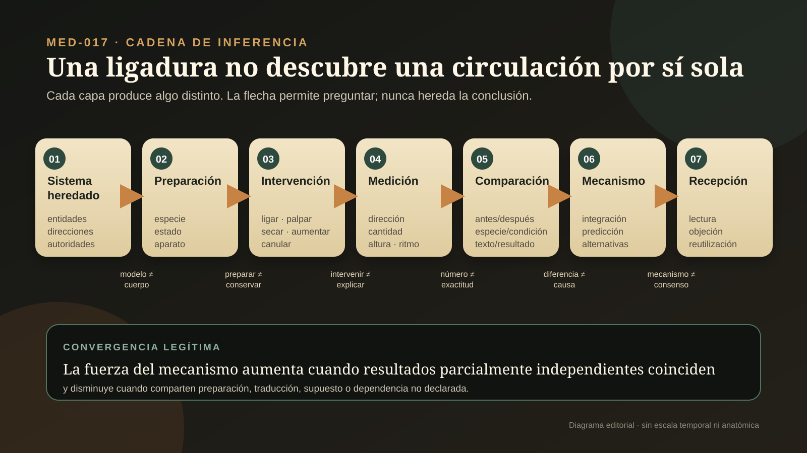
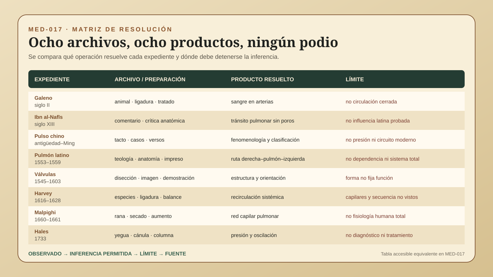

# MED-017 — Una ligadura no descubre una circulación por sí sola

> **Alcance:** audita ocho expedientes entre el siglo II y 1733: experimentos y sistema vascular de Galeno; el comentario de Ibn al-Nafīs; archivos chinos de palpación del pulso y Li Shizhen; Servet, Colombo y Valverde en la circulación pulmonar impresa; las válvulas venosas de Fabricius y predecesores; los ensayos de William Harvey; la microscopía de Marcello Malpighi; y la medición invasiva de Stephen Hales. Compara operaciones y límites, no culturas, genios ni grados de modernidad.

## Pregunta central

¿Cómo pasamos de sistemas corporales heredados, palpación, vivisección y comentario a intervenciones comparables, cantidades, mecanismos y recepción sin confundir una preparación, un instrumento o un nombre célebre con la demostración completa?

## Respuesta breve

Una teoría fisiológica no nace de una sola mirada. Galeno combinó vivisección animal, ligaduras, argumentos y un sistema de venas, arterias, corazón, hígado y *pneuma*. Demostró que las arterias vivas contienen sangre, pero no describió una circulación cerrada: su modelo conservó producción hepática, consumo periférico, movimiento no recirculante y paso por poros interventriculares invisibles (`CLAIM-MED-PHYS-GALEN-ARTERIAL-BLOOD-001`, `CLAIM-MED-PHYS-GALEN-NONCIRCULATION-001`).

Ibn al-Nafīs negó esos poros y articuló el paso del ventrículo derecho al pulmón y de allí al izquierdo dentro de un comentario crítico al *Canon*. Eso no hereda una circulación sistémica harveyana ni documenta por sí solo una cadena directa hacia autores latinos del siglo XVI (`CLAIM-MED-PHYS-IBN-PULMONARY-001`, `CLAIM-MED-PHYS-IBN-NONSYSTEMIC-001`, `CLAIM-MED-PHYS-IBN-TRANSMISSION-UNKNOWN-001`). En China, la palpación produjo otro archivo fisiológico: posiciones, cualidades táctiles, ritmos, memoria versificada y asociaciones clínicas. Es evidencia de observación corporal organizada; no es una medición de flujo ni una versión anticipada de la circulación cerrada (`CLAIM-MED-PHYS-PULSE-ARCHIVE-001`, `CLAIM-MED-PHYS-PULSE-NONCIRCULATION-001`).

Harvey reunió observación del corazón en distintas especies, ligaduras, dirección valvular, comparación y estimaciones de volumen. La cantidad expulsada en poco tiempo hacía insostenible que todo ese material fuera producido y consumido de nuevo: la recirculación se volvió una necesidad explicativa. Pero la secuencia exacta de su razonamiento se reconstruye desde textos publicados y testimonios tardíos; el capilar permanecía invisible y la recepción transformó su programa (`CLAIM-MED-PHYS-HARVEY-QUANTITY-001`, `CLAIM-MED-PHYS-HARVEY-DISCOVERY-RECONSTRUCTION-001`).

Malpighi vio redes pulmonares en rana mediante preparación y aumento; Hales conectó una arteria de yegua a una columna de vidrio y observó altura y oscilación. Cada operación añadió resolución, pero ninguna convirtió automáticamente animal en humano, visualización en mecanismo total o presión invasiva en diagnóstico clínico (`CLAIM-MED-PHYS-MALPIGHI-HUMAN-LIMIT-001`, `CLAIM-MED-PHYS-HALES-NONCLINICAL-001`).

La cadena legítima es **sistema heredado → preparación → intervención → medición → comparación → mecanismo → recepción**. Una ligadura modifica flujo; no nombra por sí sola un circuito. Una cantidad constriñe explicaciones; no prueba cada conexión. Una imagen aumentada revela una preparación; no entrega directamente fisiología humana. Una publicación hace disponible una propuesta; no demuestra aceptación, uso ni beneficio clínico (`CLAIM-MED-PHYS-MODEL-001`).

## UNA LIGADURA NO DESCUBRE UNA CIRCULACIÓN POR SÍ SOLA

### 1. Siete capas que deben conservarse

| Capa | Pregunta | Producto legítimo | Salto inválido |
|---|---|---|---|
| Sistema heredado | ¿qué entidades, direcciones, causas y autoridades ya ordenan el cuerpo? | modelo histórico atribuible | tratarlo como observación directa o caricatura inmóvil |
| Preparación | ¿qué especie, órgano, estado, acceso, conservación y aparato hacen visible el fenómeno? | condiciones materiales del objeto | heredar el cuerpo intacto o humano |
| Intervención | ¿qué se liga, corta, comprime, abre, palpa o conecta? | contraste producido | convertir una manipulación en mecanismo único |
| Medición | ¿qué altura, volumen, ritmo, dirección o cambio se registra y con qué unidad? | dato situado | confundir número con exactitud o causalidad |
| Comparación | ¿contra qué especie, condición, texto, lado, momento o observador? | diferencia delimitada | generalizar sin denominador ni control |
| Mecanismo | ¿qué modelo explica conjuntamente los resultados y qué predice? | inferencia contrastable | llenar conexiones invisibles con certeza |
| Recepción | ¿quién leyó, objetó, reprodujo, modificó o enseñó la propuesta? | trayectoria documentada | convertir publicación en consenso o clínica |

### 2. Preparar es transformar

Vivisección, disección, palpación, ligadura, secado, transparencia, aumento óptico y canulación producen fenómenos distintos. La especie, anestesia inexistente o incompleta, temperatura, pérdida de sangre, postura, tiempo post mortem y habilidad manual alteran lo observado (`CLAIM-MED-PHYS-PREPARATION-MEDIATED-001`, `CLAIM-MED-PHYS-ANIMAL-HUMAN-001`). El experimento histórico debe leerse como una operación material y ética, no sólo como una idea acertada.

Medir tampoco elimina teoría. Harvey estimó cantidades con supuestos sobre capacidad y frecuencia; Hales leyó una columna hidrostática conectada a un vaso concreto. El número restringe modelos, pero su exactitud depende de aparato, unidad, calibración y preparación (`CLAIM-MED-PHYS-MEASUREMENT-NOT-MECHANISM-001`).

## OCHO EXPEDIENTES AUDITADOS

### 3. Galeno, siglo II: experimento dentro de un sistema no circulatorio

Contra la tesis erasistratea de arterias normalmente llenas de *pneuma*, Galeno aisló y abrió arterias en animales y sostuvo que contenían sangre en vida (`CLAIM-MED-PHYS-GALEN-ARTERIAL-BLOOD-001`, `CLAIM-MED-PHYS-GALEN-ANIMAL-EXPERIMENT-001`). Sus tratados muestran diseño experimental y argumentación, no obediencia puramente textual.

El resultado quedó integrado en un sistema donde hígado y venas distribuían nutrición, corazón y arterias llevaban sangre elaborada y espíritu vital, los tejidos consumían material y parte del flujo alcanzaba el lado izquierdo por poros septales no visibles. Esa explicación no era una circulación cerrada repetida (`CLAIM-MED-PHYS-GALEN-TWO-SYSTEMS-001`, `CLAIM-MED-PHYS-GALEN-SEPTAL-PORES-001`, `CLAIM-MED-PHYS-GALEN-NONCIRCULATION-001`). Un experimento correcto puede sostener un mecanismo más amplio posteriormente rechazado.

### 4. Ibn al-Nafīs, siglo XIII: corrección pulmonar en comentario árabe

El *Sharḥ tashrīḥ al-Qānūn* pertenece a una cultura de comentario que podía verificar y modificar teoría, no sólo repetirla (`CLAIM-MED-PHYS-IBN-TEXT-001`, `CLAIM-MED-PHYS-IBN-VERIFICATION-001`). Ibn al-Nafīs negó que el tabique tuviera poros y exigió que la sangre llegara del lado derecho al izquierdo a través de pulmón, arteria y vena pulmonares (`CLAIM-MED-PHYS-IBN-SEPTUM-001`, `CLAIM-MED-PHYS-IBN-PULMONARY-001`).

El texto no describe la misma totalidad que Harvey ni prueba una intervención anatómica específica detrás de cada frase. Tampoco se ha demostrado una transmisión documental directa hacia Servet o Colombo; prioridad textual, semejanza conceptual, acceso material e influencia son preguntas separadas (`CLAIM-MED-PHYS-IBN-NONSYSTEMIC-001`, `CLAIM-MED-PHYS-IBN-TRANSMISSION-UNKNOWN-001`).

### 5. China, antigüedad–siglo XVII: tocar el pulso produce otro archivo

La palpación arterial china convirtió variaciones táctiles en memoria clínica, clasificación y transmisión. La obra de Elisabeth Hsu muestra que el pulso temprano debe reconstruirse desde casos, posiciones, gestos y vocabularios históricos, no traducirse de inmediato a frecuencia, presión o electrocardiografía (`CLAIM-MED-PHYS-PULSE-ARCHIVE-001`, `CLAIM-MED-PHYS-PULSE-TACTILE-001`).

*Bīnhú màixué*, asociado con Li Shizhen y compuesto en el siglo XVI, reordenó cualidades y versos dentro de una larga tradición. Su testigo digital permite estudiar texto y clasificación, no la concordancia diagnóstica de todos los practicantes ni la validez contemporánea de cada asociación (`CLAIM-MED-PHYS-LI-CLASSIFICATION-001`, `CLAIM-MED-PHYS-PULSE-VALIDITY-LIMIT-001`). Palpar una onda arterial es fisiología situada, pero no demuestra por sí mismo un circuito anatómico cerrado (`CLAIM-MED-PHYS-PULSE-NONCIRCULATION-001`).

### 6. Europa latina, 1553–1559: circulación pulmonar y rutas inciertas

Miguel Servet describió tránsito pulmonar en *Christianismi restitutio* (1553), una obra teológica perseguida; Realdo Colombo publicó en *De re anatomica* (1559) una explicación pulmonar apoyada en observaciones anatómicas; Juan Valverde había impreso en castellano una formulación vinculada con Colombo en 1556 (`CLAIM-MED-PHYS-LATIN-SERVETUS-001`, `CLAIM-MED-PHYS-COLOMBO-PULMONARY-001`, `CLAIM-MED-PHYS-VALVERDE-PRINT-001`).

Semejanza y proximidad no resuelven quién leyó a quién. Servet, Colombo, Valverde e Ibn al-Nafīs tienen testigos, géneros, fechas y redes diferentes. La circulación pulmonar tampoco equivale automáticamente a retorno sistémico continuo (`CLAIM-MED-PHYS-TRANSMISSION-UNRESOLVED-001`, `CLAIM-MED-PHYS-PULMONARY-NONSYSTEMIC-001`).

### 7. Válvulas venosas, ca. 1545–1603: ver una estructura no fija su función

Estienne, Canano, Amato Lusitano, Sylvius y Alberti registraron válvulas antes o al margen de la demostración de Fabricius. *De venarum ostiolis* ofreció una descripción e imágenes amplias, por lo que una prioridad única depende del producto que se compare (`CLAIM-MED-PHYS-VALVES-DESCRIPTION-001`).

Fabricius interpretó que las válvulas moderaban movimiento hacia la periferia dentro de un marco heredado. Harvey reutilizó su orientación para probar retorno hacia el corazón. La misma estructura admite funciones distintas; presencia, descripción, figura, interpretación y uso experimental no son un solo descubrimiento (`CLAIM-MED-PHYS-VALVES-FUNCTION-ERROR-001`, `CLAIM-MED-PHYS-VALVES-NOT-CIRCULATION-001`).

### 8. Harvey, 1616–1628 y después: una convergencia, no un instante

*De motu cordis* apareció en Frankfurt en 1628 tras años de lecciones, observación y experimentación (`CLAIM-MED-PHYS-HARVEY-BOOK-1628-001`). Ligaduras ajustadas con distinta intensidad separaban pulso arterial y llenado venoso; compresión digital alrededor de válvulas mostraba dirección de paso (`CLAIM-MED-PHYS-HARVEY-LIGATURE-001`). Corazones de animales con ritmos distintos permitían descomponer fases difíciles de ver en mamíferos rápidos (`CLAIM-MED-PHYS-HARVEY-MULTISPECIES-001`).

La estimación de cuánto expulsaba el corazón por latido y por intervalo no fue una medición clínica exacta; fue un argumento de balance: la cantidad excedía una producción y consumo continuos plausibles (`CLAIM-MED-PHYS-HARVEY-QUANTITY-001`). Junto con dirección valvular, continuidad pulmonar y retorno venoso, sostuvo una circulación repetida (`CLAIM-MED-PHYS-HARVEY-CIRCULATION-001`). Harvey no vio capilares y dejó abierta la conexión microscópica (`CLAIM-MED-PHYS-HARVEY-CAPILLARY-UNSEEN-001`).

Los relatos posteriores que hacen nacer todo de válvulas, cálculo o una iluminación simplifican un proceso cuya secuencia exacta sigue debatida. La recepción tampoco fue mera aceptación: Descartes, Boyle y otros incorporaron resultados a programas que Harvey no controló (`CLAIM-MED-PHYS-HARVEY-DISCOVERY-RECONSTRUCTION-001`, `CLAIM-MED-PHYS-HARVEY-RECEPTION-001`).

### 9. Malpighi, 1660–1661: el cierre visible depende de rana, preparación y óptica

Malpighi observó pulmones de rana vivos y secos; la transparencia y la simplicidad de la preparación hicieron visibles redes que el ojo desnudo no resolvía (`CLAIM-MED-PHYS-MALPIGHI-FROG-001`). Publicó en 1661 cartas a Borelli con dibujos de capilares pulmonares. Lente, iluminación, especie, secado y dibujo formaron la evidencia (`CLAIM-MED-PHYS-MALPIGHI-MICROSCOPE-001`, `CLAIM-MED-PHYS-MALPIGHI-CAPILLARIES-001`).

Eso proporcionó una conexión anatómica que Harvey había inferido, pero no observó flujo humano completo ni cerró de una vez la discusión sobre pared capilar. La extrapolación requiere comparación adicional (`CLAIM-MED-PHYS-MALPIGHI-HUMAN-LIMIT-001`).

### 10. Hales, 1733: una columna mide una preparación, no una enfermedad

*Haemastaticks* describe una yegua inmovilizada, una arteria expuesta, una cánula y un tubo vertical. La altura de la columna y sus oscilaciones hicieron mensurable la fuerza lateral de la sangre en esa preparación (`CLAIM-MED-PHYS-HALES-MARE-001`, `CLAIM-MED-PHYS-HALES-MANOMETER-001`, `CLAIM-MED-PHYS-HALES-PULSATILITY-001`).

La operación era invasiva, animal y dependiente de geometría, sitio, postura y perturbación. No era un esfigmomanómetro humano, no definía hipertensión y no autorizaba decisiones terapéuticas. La genealogía clínica necesitó instrumentos no invasivos, estandarización, poblaciones y desenlaces posteriores (`CLAIM-MED-PHYS-HALES-NONCLINICAL-001`, `CLAIM-MED-PHYS-CLINICAL-LIMIT-001`).

## LO OBSERVADO

- tratados, comentarios, ediciones y traducciones con pasajes atribuibles;
- preparaciones animales, ligaduras, palpaciones, dibujos y aparatos descritos;
- direcciones de llenado, presencia de sangre, redes visibles, alturas y oscilaciones;
- objeciones, apropiaciones y revisiones que documentan recepción;
- silencios: conexiones no vistas, transmisión no demostrada y resultados clínicos ausentes.

## LO MEDIDO

- dirección de paso bajo compresión y ligadura;
- frecuencia, capacidad y volumen estimado como argumento de balance;
- altura de columna y variación pulsátil en una arteria canulada;
- fechas de testigos, ediciones, cartas y publicaciones;
- resolución óptica y preparación suficiente para distinguir una red capilar.

## LO INFERIDO

La circulación cerrada se volvió defendible por convergencia de resultados que ningún archivo entregaba solo: anatomía pulmonar, orientación valvular, intervenciones reversibles, cantidades incompatibles con consumo continuo y una conexión microscópica observada después. Otras tradiciones de pulso y comentario produjeron fisiologías rigurosas en operaciones distintas; no deben medirse por parecido con Harvey (`CLAIM-MED-PHYS-SCOPE-001`, `CLAIM-MED-PHYS-COMPARISON-001`, `CLAIM-MED-PHYS-NONRANKING-001`).

## LOS SUPUESTOS

- que la traducción conserva el alcance de términos como sangre, espíritu, pulso y circulación;
- que una descripción experimental representa la operación realizada, aunque no cada intento fallido;
- que una cantidad estimada puede excluir modelos sin ser exacta;
- que semejanza textual no demuestra transmisión;
- que rana, mamífero y humano requieren puentes explícitos;
- que recepción documentada no equivale a consenso, práctica o beneficio.

## QUÉ PODEMOS COMPARAR

| Expediente | Archivo dominante | Producto mejor resuelto | Límite decisivo |
|---|---|---|---|
| Galeno | tratados y traducciones | experimento arterial dentro de sistema coherente | no circulación cerrada ni anatomía humana exclusiva |
| Ibn al-Nafīs | comentario manuscrito | corrección septal y tránsito pulmonar | intervención directa y transmisión latina |
| Pulso chino | casos, manuales y versos | fenomenología táctil y clasificación | concordancia, flujo y validez moderna |
| Servet–Colombo–Valverde | impresos y anatomía | formulaciones pulmonares fechables | dependencia entre autores y circuito sistémico |
| Válvulas | textos, imágenes y demostraciones | estructura y orientaciones observables | función fisiológica no heredada de la forma |
| Harvey | libro, figuras y testimonios | convergencia experimental y cuantitativa | secuencia privada y capilares invisibles |
| Malpighi | cartas, dibujos y microscopía | red capilar pulmonar en rana | flujo humano total y pared capilar definitiva |
| Hales | libro, aparato y números | presión hidrostática invasiva animal | clínica humana, diagnóstico y tratamiento |

La comparación mide archivo, operación y resolución; no reparte puntos de progreso (`CLAIM-MED-PHYS-NONRANKING-001`).

## CONTROLES ADVERSARIOS

- **Experimento correcto dentro de mecanismo rechazado:** Galeno mostró sangre arterial sin circulación cerrada.
- **Corrección textual sin cadena de influencia demostrada:** Ibn al-Nafīs no necesita ser convertido en precursor secreto de cada autor latino.
- **Observación fisiológica sin anatomía de circuito:** la palpación del pulso no es ignorancia por no medir flujo.
- **Estructura con función equivocada:** Fabricius describió válvulas sin asignarles retorno venoso.
- **Mecanismo sin conexión visible:** Harvey sostuvo circulación antes de que el capilar fuera observado.
- **Visualización que no cierra toda controversia:** Malpighi resolvió una red en rana; la pared capilar siguió discutida.
- **Número sin medicina clínica:** Hales produjo una presión, no una categoría diagnóstica.

## LAS LIMITACIONES

Sobreviven publicaciones exitosas mejor que demostraciones fallidas, animales descartados, ayudantes, instrumentos rotos y prácticas ordinarias. Varias fuentes modernas celebran prioridades nacionales o un “padre” de la fisiología; aquí se usan sólo cuando su evidencia concreta puede separarse de esa retórica. La violencia de vivisección y canulación animal forma parte de la preparación histórica y no se neutraliza llamándola progreso.

## LAS INCERTIDUMBRES

- secuencia exacta por la que Harvey integró cantidad, válvulas y retorno;
- grado de acceso de autores latinos a tradiciones árabes específicas;
- relación entre Servet, Colombo y Valverde;
- estabilidad interobservador de clasificaciones táctiles históricas;
- óptica exacta de algunas observaciones de Malpighi;
- representatividad fisiológica de cada especie y preparación;
- momento y vías de adopción en enseñanza y práctica.

## LAS ALTERNATIVAS

- un mismo resultado puede apoyar mecanismos rivales si el sistema heredado cambia;
- semejanzas pueden surgir de una fuente común, lectura directa, conversación, convergencia o reconstrucción posterior;
- la dirección valvular puede observarse sin comprender su papel sistémico;
- una red visible puede ser artefacto de secado, iluminación o interpretación gráfica;
- una columna puede variar por presión, postura, sitio, diámetro, respiración o perturbación experimental;
- aceptación pública puede depender de redes, lengua, patrocinio y enseñanza además de fuerza probatoria.

## LAS CONTROVERSIAS

Permanecen abiertas la traducción exacta de conceptos galénicos, el estatuto experimental de algunos argumentos de Ibn al-Nafīs, la independencia o contacto entre descripciones pulmonares latinas, la prioridad de válvulas según producto, la cronología cognitiva de Harvey, el instrumento óptico de Malpighi y el alcance que debe darse a las mediciones de Hales. El proyecto conserva estas preguntas como registros contrastables, no como una competencia de nombres.

## QUÉ PODRÍA FALSARLO

- un manuscrito fechado y con procedencia que documente una ruta de transmisión hoy no demostrada;
- notas experimentales que cambien la secuencia atribuida a Harvey;
- cotejos de traducción que alteren el alcance de un término fisiológico clave;
- reconstrucciones controladas que muestren que una preparación no podía producir el resultado descrito;
- series interobservador históricamente comparables para cualidades del pulso;
- nueva evidencia óptica o material sobre los instrumentos de Malpighi;
- archivos de recepción que demuestren adopción, rechazo o uso antes de lo hoy documentado.

## NIVEL DE CONFIANZA

**A** para existencia, fecha y contenido básico de los principales impresos y testigos; **A/B** para operaciones descritas y resultados replicables en su alcance histórico; **B** para secuencias de razonamiento, recepción y relaciones de transmisión; **C** para influencia no documentada o consecuencia clínica. La tesis general —ninguna ligadura, imagen o cifra demuestra sola una circulación— es **A-SEM**.

## LO NO DEMOSTRADO

- que una persona o cultura descubriera sola toda la circulación;
- que Ibn al-Nafīs influyera directamente en Servet, Colombo o Harvey;
- que palpación china equivalga a presión arterial o circulación moderna;
- que ver válvulas revele automáticamente su función;
- que el cálculo de Harvey fuera exacto o el primer paso de su razonamiento;
- que Malpighi observara circulación humana completa;
- que la presión de Hales diagnosticara hipertensión;
- que una nueva fisiología mejorara de inmediato tratamiento o supervivencia.

## QUÉ SABEMOS REALMENTE

Entre el siglo II y 1733, conocer el movimiento interno exigió hacer visible lo que el cuerpo intacto ocultaba: abrir, ligar, palpar, comparar especies, contar, aumentar y conectar un vaso a una columna. Esas operaciones no reemplazaron de golpe textos ni sistemas; los reordenaron. La circulación sistémica se sostuvo por una convergencia histórica de archivos, intervenciones y restricciones, mientras su conexión microscópica, medida física y recepción se resolvían en tiempos distintos.

## QUÉ TODAVÍA NO SABEMOS

No podemos recuperar cada ensayo, animal, conversación, lectura o rechazo que produjo los textos conservados. Tampoco podemos trasladar sin mediación una preparación temprana a fisiología humana, clínica o resultado terapéutico. El siguiente expediente estudiará cómo química, balanzas, gases y materia médica convirtieron cualidades en sustancias y cantidades sin confundir aislamiento con mecanismo ni laboratorio con eficacia.

## Fuentes y navegación

Los IDs enlazan este expediente con [CLAIMS](../CLAIMS.md), [EVIDENCE_LEDGER](../EVIDENCE_LEDGER.md), [SOURCES](../SOURCES.md), [CONTROVERSIES](../CONTROVERSIES.md) y [SCIENTIFIC_ERRORS](../SCIENTIFIC_ERRORS.md). La portada y los diagramas son editoriales; procedencia y límites constan en [ATLAS_VISUAL](../ATLAS_VISUAL.md).
