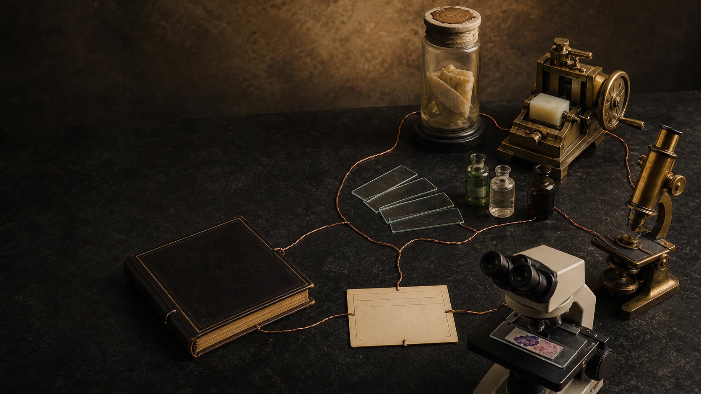
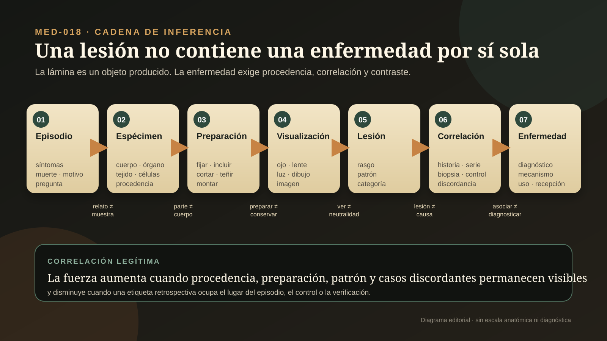
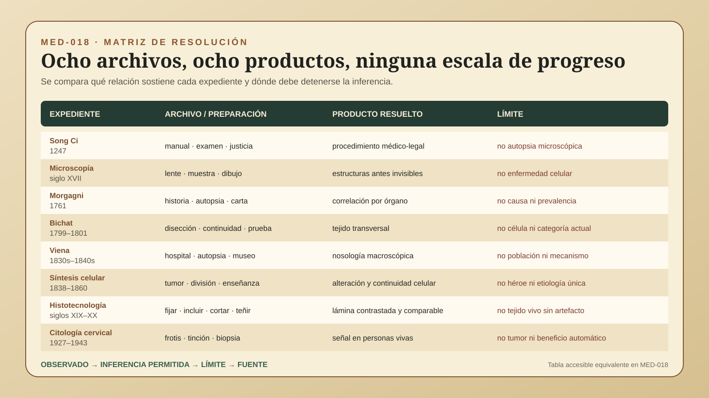

# MED-018 — Una lesión no contiene una enfermedad por sí sola

> **Alcance:** audita ocho expedientes entre 1247 y 1943: el manual médico-legal de Song Ci; la microscopía naturalista de Hooke, Malpighi y van Leeuwenhoek; la correlación anatomoclínica de Morgagni; la teoría tisular de Bichat; la autopsia institucional de Rokitansky en Viena; la síntesis celular de Müller, Schwann, Remak y Virchow; la infraestructura material de fijación, inclusión, corte y tinción; y la citología cervical asociada con Babeș, George y Andromache Papanicolaou y Herbert Traut. Compara cadenas probatorias, no culturas, héroes, especialidades ni grados de modernidad.

## Pregunta central

¿Cómo pasamos de inspeccionar cuerpos y describir alteraciones a relacionar una lesión macroscópica, un tejido o una célula preparada con una enfermedad, sin confundir lo visible con el organismo vivo, la correlación con la causa o una clasificación con un beneficio clínico?

## Respuesta breve

La anatomía patológica no apareció cuando alguien miró por primera vez un cuerpo o una lente. Surgió de cadenas que conservaron —con éxito desigual— quién había enfermado, qué episodio se narraba, qué cuerpo o muestra se examinó, cómo se transformó, qué rasgo se volvió visible, cómo se clasificó, con qué historia se correlacionó y quién aceptó o corrigió la atribución (`CLAIM-MED-PATH-CHAIN-001`).

El *Xiyuan jilu* de Song Ci sistematizó inspecciones médico-legales, procedimientos y cautelas en 1247. Es un archivo decisivo de observación corporal y administración judicial, pero no fue una autopsia microscópica ni una anatomía patológica moderna; la imagen de Song como “padre mundial” pertenece en buena medida a una reconstrucción nacional y profesional mucho más reciente (`CLAIM-MED-PATH-SONG-MANUAL-001`, `CLAIM-MED-PATH-SONG-NONAUTOPSY-001`, `CLAIM-MED-PATH-SONG-FATHER-MYTH-001`).

Hooke, Malpighi y van Leeuwenhoek hicieron visibles superficies, tejidos, vasos, fluidos y seres diminutos mediante lentes, luz, cortes, secado, montaje, dibujo y correspondencia. Esa expansión no entregó por sí sola una teoría celular de la enfermedad. El microscopio no es un ojo neutral: observa un espécimen seleccionado y transformado (`CLAIM-MED-PATH-MICROSCOPY-DISTRIBUTED-001`, `CLAIM-MED-PATH-MICROSCOPE-NOT-PATHOLOGY-001`).

Morgagni relacionó historias clínicas y hallazgos post mortem; Bichat descompuso órganos en tejidos sin depender del microscopio; Rokitansky convirtió autopsia, museo y enseñanza en una infraestructura de gran volumen; Müller, Schwann, Remak y Virchow desplazaron la unidad explicativa hacia células y proliferación. Ninguno de esos pasos sustituyó al anterior ni convirtió localización en etiología. Una lesión puede ser secuela, acompañante, artefacto, variante o resultado final de varios procesos (`CLAIM-MED-PATH-LESION-NOT-CAUSE-001`).

La histología diagnóstica necesitó además un trabajo material colectivo: fijar, deshidratar, incluir, orientar, cortar, teñir, montar y controlar. Formaldehído, parafina, microtomo y hematoxilina-eosina preservan unas relaciones y destruyen o alteran otras; la lámina es un objeto fabricado (`CLAIM-MED-PATH-TECH-STACK-001`, `CLAIM-MED-PATH-ARTIFACT-001`). La hematoxilina también tiene una historia material atlántica vinculada con el palo de Campeche y su extracción colonial, no sólo una genealogía de laboratorio (`CLAIM-MED-PATH-HEMATOXYLIN-COLONIAL-001`).

La citología cervical trasladó parte del razonamiento desde el cadáver hacia células exfoliadas de personas vivas. Babeș y Papanicolaou publicaron aproximaciones independientes en 1928; Andromache sostuvo durante años el archivo de muestras; Traut aportó acceso clínico y verificación histológica. Un frotis anormal selecciona a quién estudiar y requiere correlación; no es por sí mismo el tumor, su historia natural o el efecto poblacional de un programa (`CLAIM-MED-PATH-PRIORITY-DISTRIBUTED-001`, `CLAIM-MED-PATH-CYTOLOGY-SCREENING-LIMIT-001`).

La cadena legítima es **episodio → espécimen → preparación → visualización → lesión → correlación → enfermedad**. Si una capa desaparece, la imagen puede seguir siendo bella y la clasificación plausible, pero la inferencia pierde trazabilidad.

## UNA LESIÓN NO CONTIENE UNA ENFERMEDAD POR SÍ SOLA

### 1. Siete capas que deben conservarse

| Capa | Pregunta | Producto legítimo | Salto inválido |
|---|---|---|---|
| Episodio | ¿qué síntomas, muerte, lesión, pregunta judicial o motivo de muestreo precede al examen? | problema situado y temporal | inventar una historia clínica desde el objeto final |
| Espécimen | ¿qué cuerpo, órgano, tejido, fluido o células se obtuvieron, de quién, dónde y con qué selección? | muestra con procedencia | tratar la parte como organismo o población completa |
| Preparación | ¿qué disección, fijación, secado, inclusión, corte, tinción o montaje transformó la muestra? | condiciones de producción | imaginar materia viva intacta detrás de la lámina |
| Visualización | ¿qué ojo, lente, luz, aumento, dibujo o imagen hace resoluble una señal? | rasgo observable bajo condiciones | convertir resolución en neutralidad o verdad total |
| Lesión | ¿qué diferencia morfológica se describe y con qué categoría? | clasificación reproducible | llamar enfermedad o causa a toda diferencia |
| Correlación | ¿con qué síntomas, desenlace, autopsia, biopsia, control o serie se relaciona? | asociación delimitada | confundir coincidencia y causalidad |
| Enfermedad | ¿qué diagnóstico, entidad, mecanismo, pronóstico o uso clínico se propone y cómo fue recibido? | atribución revisable | heredar certeza, utilidad o beneficio por fama |

### 2. La muestra no sobrevive intacta al método

Una autopsia selecciona a quienes murieron en determinadas instituciones; una biopsia selecciona una zona; un frotis recupera las células que llegaron al instrumento; un corte representa un plano diminuto. Procedencia, orientación y denominador no son trámites administrativos: definen qué pregunta puede responder el objeto (`CLAIM-MED-PATH-SPECIMEN-PROVENANCE-001`, `CLAIM-MED-PATH-AUTOPSY-SELECTION-001`).

Preparar permite ver y simultáneamente transforma. El alcohol extrae, el calor deforma, el formaldehído entrecruza, la parafina contrae, el cuchillo pliega o arrastra y una tinción varía con reactivo y tiempo. Un artefacto no vuelve inútil toda histología, pero obliga a distinguir estructura del organismo y huella del procedimiento (`CLAIM-MED-PATH-PREPARATION-MEDIATED-001`, `CLAIM-MED-PATH-ARTIFACT-001`).

## OCHO EXPEDIENTES AUDITADOS

### 3. Song Ci, 1247: inspección médico-legal no es autopsia moderna

El *Xiyuan jilu* reunió procedimientos para examinar muertes, registrar lesiones, comparar explicaciones y reducir errores administrativos dentro del orden judicial de los Song (`CLAIM-MED-PATH-SONG-MANUAL-001`, `CLAIM-MED-PATH-SONG-EXAMINATION-001`). Su valor reside en el testigo textual y en la operación descrita, no en una equivalencia retrospectiva con patología forense contemporánea.

El manual privilegia examen externo y procedimientos compatibles con normas históricas sobre el cuerpo; no documenta una secuencia de autopsia interna, tejido, corte, tinción y microscopía (`CLAIM-MED-PATH-SONG-NONAUTOPSY-001`). Daniel Asen mostró que la biografía heroica de Song y la etiqueta de “padre mundial de la medicina legal” adquirieron fuerza en culturas forenses modernas. Antigüedad, influencia histórica y paternidad global son tres afirmaciones distintas (`CLAIM-MED-PATH-SONG-FATHER-MYTH-001`).

### 4. Siglo XVII: una lente amplía objetos antes de ampliar enfermedades

*Micrographia* (1665) de Robert Hooke combinó microscopio compuesto, preparación, iluminación, dibujo e impresión. Sus compartimentos en corcho dieron circulación al término *cell*, pero eran paredes de tejido vegetal muerto: no demostraban que todos los seres vivos estuvieran hechos de células ni que la enfermedad fuera celular (`CLAIM-MED-PATH-HOOKE-CORK-001`).

Malpighi empleó preparaciones animales y vegetales para resolver microestructuras, mientras van Leeuwenhoek construyó instrumentos de una sola lente y comunicó observaciones de fluidos, tejidos y seres microscópicos. Las trayectorias dependieron de artesanos, corresponsales, grabadores, sociedades y técnicas de persuasión visual; no de una invención instantánea ni de un observador aislado (`CLAIM-MED-PATH-MICROSCOPY-DISTRIBUTED-001`, `CLAIM-MED-PATH-MALPIGHI-TISSUE-001`, `CLAIM-MED-PATH-LEEUWENHOEK-SAMPLES-001`).

Ver una unidad diminuta no decide su función, universalidad o relación con una enfermedad. La microscopía temprana creó un campo de señales; la patología celular necesitó categorías, series, preparación comparable y correlación posteriores (`CLAIM-MED-PATH-MICROSCOPE-NOT-PATHOLOGY-001`).

### 5. Morgagni, 1761: el hallazgo post mortem necesita historia

*De sedibus et causis morborum per anatomen indagatis* organizó centenares de historias y disecciones en setenta cartas. El producto decisivo no fue “la primera autopsia”, sino la relación repetida entre curso clínico, tratamiento, muerte, hallazgo y discusión de alternativas (`CLAIM-MED-PATH-MORGAGNI-1761-001`, `CLAIM-MED-PATH-MORGAGNI-CORRELATION-001`).

Esa relación localizó enfermedad en órganos con una fuerza que una lista de rarezas no tenía. Pero los casos procedían de personas muertas, descritas y seleccionadas; faltaban denominadores de quienes sobrevivieron, lesiones subclínicas y controles equivalentes (`CLAIM-MED-PATH-MORGAGNI-SELECTION-001`). Una localización consistente puede explicar síntomas sin identificar la causa inicial ni demostrar que el hallazgo sea necesario o suficiente (`CLAIM-MED-PATH-MORGAGNI-CAUSE-LIMIT-001`).

### 6. Bichat, 1799–1801: tejido sin microscopio

Bichat trató órganos como combinaciones de sistemas tisulares y los comparó mediante disección, continuidad, textura y respuestas físicas o químicas. Su *Anatomie générale* hizo del tejido una unidad transversal: una membrana o sistema podía estudiarse a través de varios órganos (`CLAIM-MED-PATH-BICHAT-TISSUE-001`, `CLAIM-MED-PATH-BICHAT-EXPERIMENT-001`).

Ese programa no dependió del microscopio y no anticipó automáticamente la célula moderna (`CLAIM-MED-PATH-BICHAT-NOMICROSCOPE-001`). Sus veintiuna categorías, vitalismo y experimentos pertenecen a un marco histórico concreto; reagruparlos con taxonomías actuales puede iluminar continuidades, pero no demostrar identidad conceptual (`CLAIM-MED-PATH-BICHAT-CATEGORY-LIMIT-001`).

### 7. Rokitansky y Viena, décadas de 1830–1840: la autopsia se vuelve infraestructura

El Hospital General de Viena, la prosección, el museo, la enseñanza y una provisión abundante de cadáveres permitieron acumular protocolos y especímenes a una escala excepcional. Rokitansky ayudó a institucionalizar la anatomía patológica y a convertir la lesión macroscópica en una clasificación enseñable (`CLAIM-MED-PATH-ROKITANSKY-INSTITUTION-001`, `CLAIM-MED-PATH-ROKITANSKY-GROSS-NOSOLOGY-001`).

Las cifras de decenas de miles de autopsias describen un archivo institucional, no observaciones independientes de poblaciones representativas ni trabajo personal aislado (`CLAIM-MED-PATH-ROKITANSKY-AUTOPSY-VOLUME-001`). La disponibilidad de cadáveres estuvo atravesada por hospitalización, pobreza, administración y política urbana. Además, una taxonomía morfológica extensa podía coexistir con mecanismos humorales o discrásicos posteriormente rechazados (`CLAIM-MED-PATH-ROKITANSKY-CAUSAL-LIMIT-001`). Volumen aumenta contraste y memoria; no garantiza causalidad.

### 8. 1838–1858: la patología celular fue una síntesis distribuida

Johannes Müller comparó estructura microscópica de tumores; Schleiden y Schwann generalizaron formulaciones celulares en plantas y animales; Robert Remak documentó división celular y continuidad; Virchow articuló en conferencias y publicaciones una patología centrada en alteraciones celulares (`CLAIM-MED-PATH-MULLER-CANCER-HISTOLOGY-001`, `CLAIM-MED-PATH-CELL-THEORY-DISTRIBUTED-001`).

La fórmula asociada con Virchow no debe borrar a Remak ni convertir una doctrina compleja en una frase. Barreras antijudías limitaron la carrera de Remak, y la asignación retrospectiva de crédito depende de qué se compare: observación de división, rechazo de formación libre, aplicación patológica, enseñanza o difusión (`CLAIM-MED-PATH-REMAK-DIVISION-001`, `CLAIM-MED-PATH-VIRCHOW-CREDIT-LIMIT-001`).

*Die Cellularpathologie* y sus traducciones reunieron histología fisiológica y patológica en un programa influyente. Afirmar que procesos patológicos ocurren en células no significa que toda entidad clínica sea visible en una célula aislada ni que morfología identifique etiología (`CLAIM-MED-PATH-VIRCHOW-1858-001`, `CLAIM-MED-PATH-IMAGE-NOT-DISEASE-001`).

### 9. Siglos XIX–XX: fijar, incluir, cortar y teñir fabrica la lámina

Los avances no fueron una sola mejora óptica. Microtomos hicieron más repetibles los cortes; ceras de parafina sostuvieron tejido; el formaldehído estabilizó relaciones moleculares y morfológicas; hematoxilina y eosina produjeron contrastes interpretables (`CLAIM-MED-PATH-MICROTOME-PARAFFIN-001`, `CLAIM-MED-PATH-FORMALIN-001`). La lámina estándar es la salida coordinada de reactivos, instrumentos, protocolos y trabajo técnico (`CLAIM-MED-PATH-TECH-STACK-001`, `CLAIM-MED-PATH-HISTOTECH-LABOR-001`).

La hematoxilina procede del palo de Campeche mesoamericano. Su tránsito hacia tintes y laboratorio estuvo enlazado con conquista, comercio atlántico, piratería, plantación y química industrial. Llamarla sólo “invención de un tinte histológico” borra la biogeografía y el trabajo material que la hicieron disponible (`CLAIM-MED-PATH-HEMATOXYLIN-COLONIAL-001`).

Cada paso conserva y destruye información de modo selectivo. Por eso la calidad de H&E, los controles y el reconocimiento de pliegues, contracción, precipitados, arrastre y mala orientación forman parte del diagnóstico; no son un prólogo invisible (`CLAIM-MED-PATH-ARTIFACT-001`).

### 10. 1927–1943: células exfoliadas, prioridad distribuida y verificación

Aurel Babeș presentó en 1927 y publicó en 1928 una técnica de frotis cervical; George Papanicolaou comunicó en 1928 el potencial diagnóstico de células anormales en material cervicovaginal. Las técnicas, rutas de muestreo y programas no eran idénticos, pero constituyen desarrollos contemporáneos que impiden una prioridad simple (`CLAIM-MED-PATH-BABES-1928-001`, `CLAIM-MED-PATH-PAPANICOLAOU-1928-001`, `CLAIM-MED-PATH-PRIORITY-DISTRIBUTED-001`).

Andromache Papanicolaou proporcionó muestras repetidas durante años y reclutó participantes; su trabajo hizo posible una línea basal longitudinal que la eponimia suele ocultar (`CLAIM-MED-PATH-ANDROMACHE-ARCHIVE-001`). En 1941, Papanicolaou y Herbert Traut publicaron una serie clínica; su monografía de 1943 sistematizó toma, fijación, tinción, patrones y comparación con biopsia (`CLAIM-MED-PATH-TRAUT-1941-001`).

La citología abrió una vía hacia personas vivas y detección presintomática (`CLAIM-MED-PATH-CYTOLOGY-LIVING-001`). Sin embargo, una célula exfoliada puede no representar toda la lesión, la lectura exige entrenamiento y un resultado anormal conduce a verificación. La difusión poblacional, la historia natural de lesiones y el balance entre beneficios y daños pertenecen a cadenas posteriores; MED-018 no formula recomendaciones actuales de tamizaje (`CLAIM-MED-PATH-CYTOLOGY-SCREENING-LIMIT-001`, `CLAIM-MED-PATH-LIVING-DIAGNOSIS-LIMIT-001`).

## LO OBSERVADO

- manuales, tratados, cartas, láminas, protocolos, catálogos y publicaciones con testigos fechables;
- cuerpos, órganos, tejidos, fluidos y células bajo procedencias y selecciones distintas;
- cambios macroscópicos, estructuras aumentadas, contrastes teñidos y artefactos documentados;
- correlaciones entre síntomas, muerte, lesión, biopsia, frotis y recepción;
- silencios sobre población, evolución temporal, causalidad, transmisión y beneficio.

## LO MEDIDO

- fechas, series y volumen institucional de exámenes;
- localización de alteraciones por órgano, tejido, célula o preparación;
- grosor y repetibilidad del corte, estabilidad de fijación y contraste de tinción;
- concordancia entre observadores, muestras o modalidades cuando está disponible;
- presencia de patrones morfológicos, no una historia clínica completa dentro de la imagen.

## LO INFERIDO

La anatomía patológica ganó fuerza cuando archivos parcialmente independientes convergieron: episodio, espécimen trazable, preparación conocida, señal visible, categoría reproducible y correlación con casos o desenlaces. El tamaño de la lesión no fija su importancia, la resolución no fija el mecanismo y la frecuencia en autopsias no fija prevalencia. La unidad de explicación pudo cambiar de órgano a tejido y célula sin que la medicina avanzara como una escalera universal (`CLAIM-MED-PATH-CORRELATION-001`, `CLAIM-MED-PATH-NONRANKING-001`).

## LOS SUPUESTOS

- que el espécimen conserva una relación conocida con el cuerpo y el episodio;
- que la preparación no creó el rasgo decisivo o que el artefacto puede reconocerse;
- que los nombres históricos de lesiones no son diagnósticos actuales sin validación;
- que una asociación anatomoclínica no identifica por sí sola causa o tratamiento;
- que el archivo institucional no representa automáticamente a toda una población;
- que una publicación, cátedra o epónimo no mide por sí solo recepción, trabajo colectivo o utilidad.

## LAS INCERTIDUMBRES

- la representatividad de cuerpos, piezas, cortes y frotis seleccionados por instituciones distintas;
- el volumen exacto de autopsias atribuible a personas, servicios y periodos concretos;
- qué rasgos se perdieron o aparecieron por autólisis, fijación, orientación, corte, tinción y conservación;
- la secuencia privada de observación, colaboración, corrección y crédito detrás de varios epónimos;
- la correspondencia entre categorías históricas de tejido, lesión, tumor o malignidad y taxonomías posteriores.

## LAS ALTERNATIVAS

- una diferencia visible puede ser lesión biológica, variante, cambio post mortem o artefacto técnico;
- una lesión correlacionada puede ser causa, consecuencia, acompañante, secuela o hallazgo incidental;
- una semejanza microscópica puede reflejar continuidad, convergencia, preparación compartida o una categoría demasiado amplia;
- una prioridad puede pertenecer a la observación, al instrumento, a la publicación, a la verificación o a la difusión, no a una persona para todos los productos;
- una recepción extensa puede seguir a infraestructura, autoridad o enseñanza sin validar cada mecanismo propuesto.

## QUÉ PODEMOS COMPARAR

| Expediente | Archivo dominante | Producto mejor resuelto | Límite decisivo |
|---|---|---|---|
| Song Ci | manual judicial y tradición editorial | inspección corporal y procedimiento médico-legal | no autopsia interna, histología ni paternidad global automática |
| Microscopía temprana | libros, cartas, lentes y dibujos | estructuras antes invisibles en preparaciones concretas | no teoría celular de enfermedad |
| Morgagni | historias y autopsias organizadas | correlación anatomoclínica por órgano | selección post mortem y causa no demostrada |
| Bichat | tratados, disección y experimento | tejido como unidad transversal | categorías históricas y ausencia de célula moderna |
| Rokitansky/Viena | hospital, protocolos, museo y manual | nosología macroscópica institucional | cuerpo disponible, denominador y mecanismo causal |
| Síntesis celular | microscopía, embriología, tumor y conferencias | continuidad y alteración celular | crédito distribuido y enfermedad no reducible a una célula |
| Técnica histológica | reactivos, instrumentos y control de calidad | lámina reproducible y contrastada | pérdida, distorsión y trabajo técnico oculto |
| Citología cervical | frotis, series clínicas y biopsia | señal en personas vivas y selección para verificación | muestreo, lectura, historia natural y beneficio poblacional |

Comparar aquí significa preguntar qué objeto se produjo, qué relación conservó y qué salto bloqueó. No reparte puntos de modernidad (`CLAIM-MED-PATH-NONRANKING-001`).

## QUÉ NO PODEMOS CONCLUIR

- que toda lesión hallada explica los síntomas o la muerte;
- que la ausencia en un corte demuestra ausencia en el órgano;
- que una imagen teñida reproduce color, volumen o composición del tejido vivo;
- que la autopsia de un hospital estima prevalencia poblacional;
- que “celular” significa que una célula aislada basta para diagnosticar;
- que un epónimo identifica a todas las personas que produjeron una técnica;
- que una clasificación histórica autoriza diagnóstico retrospectivo de individuos (`CLAIM-MED-PATH-RETRODIAGNOSIS-001`);
- que la capacidad diagnóstica demuestra tratamiento eficaz, acceso justo o mejor supervivencia.

## LAS CONTROVERSIAS

| Pregunta | Alternativas | Qué discrimina |
|---|---|---|
| ¿el rasgo es lesión o artefacto? | estructura biológica / fijación / corte / tinción / montaje | repetir preparación, controles, otro plano y otra modalidad |
| ¿la lesión explica el episodio? | causa / consecuencia / acompañante / incidental | temporalidad, distribución, mecanismo y casos discordantes |
| ¿un espécimen representa el cuerpo? | focal / multifocal / sistémico / muestra no representativa | muestreo adicional, orientación, márgenes y correlación clínica |
| ¿una categoría histórica coincide con una actual? | continuidad parcial / reagrupación / homónimo | criterios originales, relectura ciega y marcadores independientes |
| ¿la autopsia estima población? | archivo hospitalario seleccionado / muestra amplia | denominador de ingreso, muerte, examen y comparación externa |
| ¿quién “descubrió” una técnica? | observación / instrumento / publicación / validación / difusión | definir el producto y reconstruir contribuciones materiales |
| ¿un frotis anormal es enfermedad? | señal verdadera / falso positivo / cambio transitorio / muestra inadecuada | repetición, biopsia, seguimiento y desenlace |

## ERRORES QUE ESTA INVESTIGACIÓN BLOQUEA

1. **“Morgagni inventó la autopsia.”** Correlacionó sistemáticamente historias y hallazgos dentro de una tradición anterior.
2. **“Bichat vio tejidos al microscopio.”** Su teoría tisular se construyó principalmente sin microscopía.
3. **“Hooke descubrió la célula moderna.”** Nombró compartimentos de corcho; teoría celular y continuidad llegaron después.
4. **“Virchow creó solo la patología celular.”** El programa integró trabajo de Müller, Schwann, Remak y muchos otros.
5. **“Una H&E muestra el tejido tal como estaba vivo.”** Fijación, inclusión, corte y tinción producen el objeto visible.
6. **“Más autopsias equivalen a población representativa.”** La provisión de cuerpos y la selección hospitalaria importan.
7. **“La lesión es la causa.”** Puede ser efecto, marcador, secuela, coincidencia o artefacto.
8. **“Pap fue una idea individual.”** Babeș, Andromache, Traut, participantes y personal técnico quedan fuera del epónimo.
9. **“Un frotis diagnostica todo el tumor.”** Muestreo y verificación conservan límites.
10. **“La imagen histórica permite diagnosticar hoy a una persona.”** Sin espécimen, criterios y contexto, sólo permite describir un registro histórico.

## NIVEL DE CONFIANZA

- **A:** existencia, fecha y contenido general de los principales tratados, manuales y publicaciones; materialidad básica de las técnicas.
- **B:** reconstrucción de operaciones, instituciones, correlaciones y trayectorias de recepción cuando convergen fuentes primarias y estudios históricos.
- **B-COND:** alcance de categorías tisulares, celulares o citológicas entre contextos y observadores.
- **C:** volumen exacto atribuido a una persona, secuencia privada de descubrimiento o influencia no acompañada por transmisión documental.
- **D/E:** diagnóstico retrospectivo individual, causalidad desde una lesión aislada y beneficio clínico o poblacional heredado de una imagen.

## QUÉ PODRÍA FALSARLO

Este expediente deberá corregirse si nuevas ediciones, protocolos, colecciones o estudios muestran que:

- una atribución de procedimiento no pertenece al testigo citado;
- una cifra de autopsias mezcla institución, periodo y trabajo individual;
- un supuesto precursor no empleó la operación o categoría atribuida;
- una ruta de transmisión se demuestra o se refuta documentalmente;
- una contribución técnica o laboral omitida cambia la genealogía;
- una interpretación de preparación confunde artefacto y estructura.

## QUÉ SABEMOS REALMENTE

Sabemos que inspección médico-legal, autopsia correlacionada, clasificación tisular, microscopía, patología celular, histotecnología y citología produjeron archivos diferentes que sólo se vuelven comparables al conservar su preparación y su pregunta. Sabemos también que una lámina es un objeto fabricado, que la selección post mortem limita la población y que el diagnóstico requiere correlación más allá de la forma (`CLAIM-MED-PATH-CHAIN-001`, `CLAIM-MED-PATH-PREPARATION-MEDIATED-001`, `CLAIM-MED-PATH-CORRELATION-001`).

## QUÉ TODAVÍA NO SABEMOS

No conocemos una secuencia única de origen de la anatomía patológica, la representatividad de todos sus archivos, la autoría completa de cada práctica técnica ni la equivalencia estable de todas las categorías históricas con diagnósticos actuales. Tampoco puede este expediente derivar eficacia terapéutica, acceso justo o beneficio poblacional desde la capacidad de observar y clasificar (`CLAIM-MED-PATH-NONRANKING-001`, `CLAIM-MED-PATH-LIVING-DIAGNOSIS-LIMIT-001`).

## CONCLUSIÓN

La historia de la anatomía patológica no es la marcha de una mirada que se vuelve cada vez más poderosa. Es la construcción de objetos comparables y relaciones criticables. Song Ci ordenó inspecciones sin convertirse por eso en histopatólogo; Hooke, Malpighi y van Leeuwenhoek ampliaron lo visible sin obtener una teoría completa de enfermedad; Morgagni enlazó historia y autopsia; Bichat hizo del tejido una unidad; Viena industrializó el archivo post mortem; la patología celular distribuyó explicación entre células y procesos; la histotecnología fabricó láminas reproducibles; y la citología llevó señales hacia personas vivas.

Lo que sabemos depende de conservar la cadena. Una lesión es un hallazgo. Una lámina es una preparación. Una categoría es una decisión comparativa. La enfermedad aparece sólo cuando esas capas se relacionan con episodio, contexto, alternativas, verificación y uso. Por eso una lesión no contiene una enfermedad por sí sola (`CLAIM-MED-PATH-SCOPE-001`, `CLAIM-MED-PATH-IMAGE-NOT-DISEASE-001`).

## NAVEGACIÓN

- [Historia de la ciencia de MED-018](../20_historia_ciencia/HISTORIA_MED_018_MICROSCOPIA_ANATOMIA_PATOLOGICA.md)
- [Cronología especializada de MED-018](../21_cronologias/CRONOLOGIA_MED_018_MICROSCOPIA_ANATOMIA_PATOLOGICA.md)
- [Mapa epistemológico de MED-018](../22_mapas_epistemologicos/MAPA_MED_018_MICROSCOPIA_ANATOMIA_PATOLOGICA.md)
- [Programa cronológico de Medicina](PROGRAMA_CRONOLOGICO_HISTORIA_MEDICINA.md)
- [Explorador público de evidencia](../EVIDENCE_LEDGER.md)
