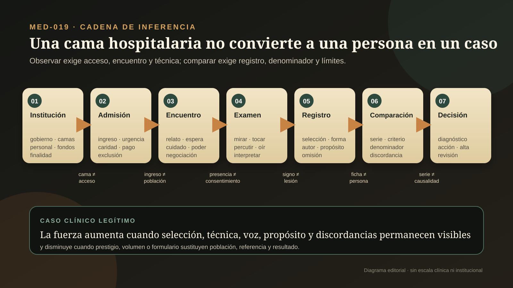
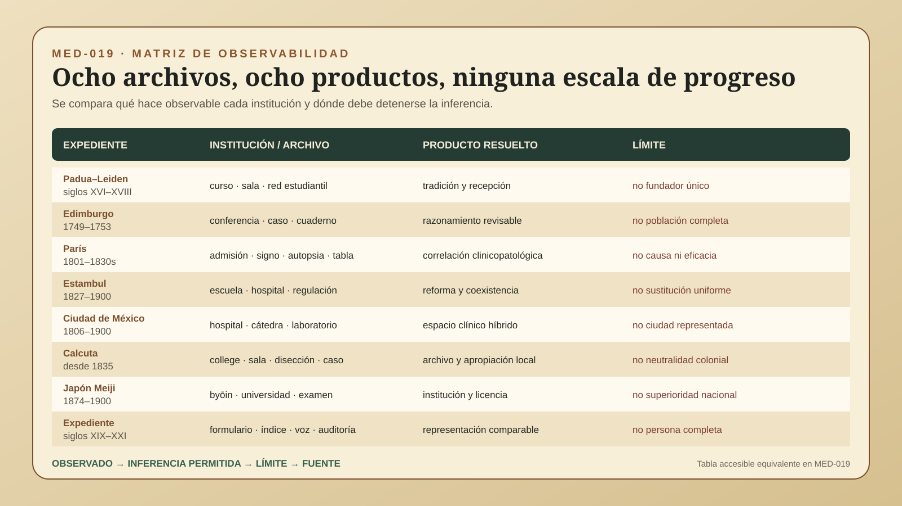

# MED-019 — Una cama hospitalaria no convierte a una persona en un caso por sí sola

> **Alcance:** audita ocho expedientes entre los siglos XVI y XX: las tradiciones de enseñanza práctica de Padua y Leiden; las conferencias y cuadernos clínicos de Edimburgo; la reorganización hospitalaria, la percusión y la auscultación en París; la escuela imperial y el hospital de Bezm-i Alem en Estambul; el Hospital de San Andrés en Ciudad de México; el Medical College de Calcuta; la construcción estatal de *byōin*, educación y licencia en Japón Meiji; y la estandarización material del expediente clínico. Compara cadenas de observación y decisión, no culturas, hospitales, médicos ni grados de modernidad.

## Pregunta central

¿Cómo hospitales, enseñanza a la cabecera, examen físico y expedientes convirtieron encuentros singulares en conocimiento clínico comparable sin confundir ingreso con población, signo con enfermedad, nota con persona, serie con causalidad o autoridad institucional con consentimiento?

## Respuesta breve

El hospital no produjo conocimiento sólo por reunir camas. Hizo posibles observaciones repetidas porque coordinó admisión, salas, horarios, personal, enseñanza, registro, alta y, en algunos contextos, autopsia. Pero cada operación seleccionó personas y silenció alternativas. La población hospitalaria dependía de pobreza, caridad, urgencia, recomendación, raza, género, jurisdicción, capacidad y confianza (`CLAIM-MED-CLINIC-INSTITUTION-NOT-NEUTRAL-001`, `CLAIM-MED-CLINIC-ADMISSION-SELECTION-001`).

La enseñanza a la cabecera tampoco fue una invención individual. Padua y Leiden conservaron tradiciones anteriores a Boerhaave; en Leiden, Sylvius integró visitas, examen y discusión antes del nombramiento de Boerhaave. Este último fue un maestro influyente, pero la imagen del “padre de la enseñanza clínica” combina recepción posterior con afirmaciones que exceden el archivo (`CLAIM-MED-CLINIC-LEIDEN-LINEAGE-001`, `CLAIM-MED-CLINIC-BOERHAAVE-MYTH-001`).

Edimburgo vinculó teoría, observación, examen y razonamiento en conferencias clínicas de John Rutherford desde 1749. Sus cuadernos permiten estudiar qué se preguntaba y anotaba, pero conservan la selección y la voz profesional de quienes escribieron. El caso clínico es una construcción documental, no la persona reducida a papel (`CLAIM-MED-CLINIC-RUTHERFORD-SYSTEMATIC-001`, `CLAIM-MED-CLINIC-RECORD-NOT-PERSON-001`).

Percusión y auscultación añadieron señales corporales mediadas. Auenbrugger publicó la percusión torácica en 1761; Corvisart contribuyó a su recepción francesa; Laennec organizó la auscultación mediata en 1819. Golpear, escuchar y nombrar sonidos no entregaban diagnósticos automáticamente: exigían técnica, comparación, curso y correlación post mortem (`CLAIM-MED-CLINIC-INSTRUMENT-INTERPRETATION-001`, `CLAIM-MED-CLINIC-PARIS-CLINICOPATH-001`).

Estambul, México, Calcuta y Japón muestran que “el hospital moderno” no fue una exportación idéntica. En el hospital de Bezm-i Alem coexistieron continuidades otomanas y novedades administrativas; San Andrés fue hospital, escuela y espacio híbrido de clínica y experimentación; Calcuta enlazó cabecera, registro, disección y gobierno colonial sobre cuerpos desigualmente disponibles; Japón convirtió *byōin*, escuela, hospital afiliado, examen y licencia en categorías estatales disputadas (`CLAIM-MED-CLINIC-OTTOMAN-COEXISTENCE-001`, `CLAIM-MED-CLINIC-MEXICO-HYBRID-001`, `CLAIM-MED-CLINIC-CALCUTTA-COLONIAL-SELECTION-001`, `CLAIM-MED-CLINIC-JAPAN-LICENSURE-001`).

La cadena legítima es **institución → admisión → encuentro → examen → registro → comparación → decisión**. El conocimiento se fortalece cuando cada capa conserva procedencia, denominadores, discordancias y quién pudo hablar, tocar, anotar, cuidar, negarse o quedar fuera. Ninguna cama transforma por sí sola a una persona en un caso válido.

## UNA CAMA HOSPITALARIA NO CONVIERTE A UNA PERSONA EN UN CASO POR SÍ SOLA

### 1. Siete capas que deben conservarse

| Capa | Pregunta | Producto legítimo | Salto inválido |
|---|---|---|---|
| Institución | ¿quién financia, gobierna, dota de camas y define funciones? | capacidad situada | llamar neutral a una arquitectura de caridad, Estado, imperio o profesión |
| Admisión | ¿quién entra, quién queda fuera y con qué denominador? | población hospitalaria definida | tratar ingresados como población general |
| Encuentro | ¿qué relatan, preguntan, esperan y negocian paciente, familia y cuidadores? | episodio relacional | imaginar observación sin agencia ni asimetría |
| Examen | ¿qué maniobra, instrumento, posición y entrenamiento producen un signo? | señal reproducible bajo condiciones | convertir sonido, pulso o hallazgo en diagnóstico automático |
| Registro | ¿quién selecciona, ordena y omite información, y para qué uso? | nota trazable | confundir expediente con experiencia completa |
| Comparación | ¿qué casos, desenlaces, autopsias o grupos se contrastan? | patrón delimitado | generalizar sin denominador ni discordancias |
| Decisión | ¿qué diagnóstico, enseñanza, tratamiento, alta o política se adoptó y con qué recepción? | acción revisable | heredar exactitud, eficacia, justicia o consentimiento |

### 2. La institución crea observabilidad y sesgo a la vez

Una sala hace repetibles horarios, rondas y formas. También agrupa por reglas administrativas. La admisión parisina de 1801 dirigió, rechazó o remitió solicitantes; las enfermerías voluntarias dependían de recomendación y caridad; hospitales coloniales clasificaron por raza, estatus o servicio; hospitales escolares buscaron cuerpos y casos útiles para aprender. El denominador de “personas enfermas” no coincide con el de “personas admitidas” (`CLAIM-MED-CLINIC-ADMISSION-SELECTION-001`).

El encuentro sigue siendo recíproco aunque el archivo sea asimétrico. Las personas buscan alivio, negocian ingresos, aceptan o rechazan maniobras, describen sufrimiento y movilizan redes. Médicos, estudiantes, enfermeras, asistentes, familiares, intérpretes y escribientes producen observación y cuidado. La nota final suele concentrar autoridad en quien firma (`CLAIM-MED-CLINIC-ENCOUNTER-RECIPROCAL-001`, `CLAIM-MED-CLINIC-CARE-LABOR-001`).

## OCHO EXPEDIENTES AUDITADOS

### 3. Padua y Leiden: una genealogía antes que un padre

La enseñanza clínica europea tuvo antecedentes institucionales y prácticos antes de Boerhaave. En Padua, Giambattista da Monte llevó estudiantes al hospital de San Francesco; en Leiden, Johannes y Otto Heurnius, Franciscus Sylvius y otros integraron visitas, discusión, semiología y, en ciertos periodos, autopsia (`CLAIM-MED-CLINIC-LEIDEN-LINEAGE-001`).

Sylvius visitó la sala con estudiantes y vinculó historia, signos y examen. Ese archivo impide atribuir el inicio de la cabecera a una sola figura (`CLAIM-MED-CLINIC-SYLVIUS-001`). Boerhaave impartió demostraciones clínicas influyentes desde 1714, pero su práctica documentada fue más limitada en tiempo, camas y operaciones de lo que afirmaron biografías heroicas posteriores (`CLAIM-MED-CLINIC-BOERHAAVE-PRACTICE-001`).

La fama de Leiden sí tuvo consecuencias: estudiantes, apuntes, libros y nombramientos transportaron repertorios a Edimburgo y otras escuelas. Influencia no equivale a invención ni reproducción idéntica (`CLAIM-MED-CLINIC-LEIDEN-RECEPTION-001`).

### 4. Edimburgo, 1749–1753: preguntar, examinar y admitir incertidumbre

John Rutherford obtuvo autorización para impartir conferencias clínicas en la Royal Infirmary a fines de 1748; las series conservadas de 1749–1753 muestran enseñanza en la interfaz paciente–enfermedad–médico (`CLAIM-MED-CLINIC-RUTHERFORD-LECTURES-001`). Historia, observación, examen, razonamiento y respuesta terapéutica se ordenaban para formar practicantes (`CLAIM-MED-CLINIC-RUTHERFORD-SYSTEMATIC-001`).

Los cuadernos clínicos y libros de sala permiten seguir diagnósticos y cursos, pero no son transcripciones transparentes. Pasan por selección docente, lenguaje profesional, memoria y conservación archivística (`CLAIM-MED-CLINIC-EDINBURGH-CASEBOOKS-001`). Rutherford enseñó también límites, fracaso y revisión; esa humildad forma parte del método, no un adorno moral (`CLAIM-MED-CLINIC-RUTHERFORD-FAILURE-001`).

### 5. París, 1761–1830s: del sonido al caso comparado

Auenbrugger publicó en 1761 un método para percutir el tórax y relacionar cambios sonoros con estados internos. La maniobra produjo un signo bajo posición, fuerza y experiencia; no una imagen anatómica directa (`CLAIM-MED-CLINIC-AUENBRUGGER-1761-001`). La traducción comentada de Corvisart en 1808 favoreció una recepción parisina posterior y recuerda que publicación y adopción son eventos distintos (`CLAIM-MED-CLINIC-CORVISART-1808-001`).

Laennec publicó *De l’auscultation médiate* en 1819. El cilindro separó oído y cuerpo, hizo comparables ciertos sonidos y articuló vocabulario, historias y autopsias (`CLAIM-MED-CLINIC-LAENNEC-1819-001`). Pero una señal acústica depende del instrumento, el cuerpo, el observador, la categoría y el contraste; el estetoscopio no contiene la lesión (`CLAIM-MED-CLINIC-INSTRUMENT-INTERPRETATION-001`).

La reorganización postrevolucionaria concentró pacientes, enseñanza y patología en hospitales parisinos. También creó admisión central: en sus primeros dieciocho meses desde 1801, aproximadamente 44 % de solicitantes fueron admitidos por la oficina central, mientras otros recibieron atención, remisión o exclusión. Esa cifra describe un sistema de triaje, no necesidad poblacional total (`CLAIM-MED-CLINIC-PARIS-ADMISSION-1801-001`).

Las series clínicas y post mortem reforzaron localización y comparación (`CLAIM-MED-CLINIC-PARIS-CLINICOPATH-001`). Los recuentos de Pierre Louis enlazaron este archivo con una pregunta distinta —qué efecto tuvo una intervención en grupos comparables— que será auditada en MED-020; aquí sólo funcionan como puente, no como ensayo moderno ya completo (`CLAIM-MED-CLINIC-NUMERICAL-BRIDGE-001`).

### 6. Estambul, 1827–1845: reforma no significa sustitución

La escuela médica imperial otomana fundada en 1827 y reorganizada en 1839 vinculó formación, Estado, licencia y servicio. No creó de golpe una profesión uniforme ni borró otros practicantes (`CLAIM-MED-CLINIC-OTTOMAN-SCHOOL-1827-001`, `CLAIM-MED-CLINIC-OTTOMAN-PROFESSION-001`).

El hospital fundado por Bezm-i Alem en 1845 combinó patronazgo, caridad, administración y nuevas formas hospitalarias (`CLAIM-MED-CLINIC-BEZMIALEM-1845-001`). Su archivo muestra coexistencia y competencia entre repertorios otomanos y técnicas asociadas con reformas europeizantes. “Modernización” es una categoría política e historiográfica; no demuestra reemplazo uniforme ni superioridad clínica (`CLAIM-MED-CLINIC-OTTOMAN-COEXISTENCE-001`).

### 7. Ciudad de México, 1806–1904: hospital, escuela y laboratorio híbrido

En el Hospital General de San Andrés se estableció una cátedra de clínica o medicina práctica en 1806; el curso pasó de optativo a obligatorio en 1808 (`CLAIM-MED-CLINIC-SANANDRES-1806-001`, `CLAIM-MED-CLINIC-SANANDRES-1808-001`). Durante el siglo XIX, estudiantes y profesores articularon cabecera, cirugía, anatomía patológica y registros dentro de un hospital que también respondía a beneficencia y administración urbana (`CLAIM-MED-CLINIC-MEXICO-HOSPITAL-SCHOOL-001`).

A fines del siglo, San Andrés alojó espacios contiguos de clínica, análisis y experimentación vinculados con el Instituto Médico Nacional. El hospital–escuela–laboratorio fue híbrido: urgencia terapéutica y temporalidad experimental no coincidían (`CLAIM-MED-CLINIC-MEXICO-HYBRID-001`). La producción de conocimiento sobre “patologías de los mexicanos” estuvo ligada con proyectos de higiene, orden y control urbano; no fue sólo una importación técnica (`CLAIM-MED-CLINIC-MEXICO-CITY-POWER-001`).

### 8. Calcuta, 1835–1852: del paciente al “caso” colonial

El Medical College de Calcuta se fundó en 1835 para enseñar medicina occidental en inglés dentro de una reorganización colonial que redujo apoyo oficial a programas paralelos (`CLAIM-MED-CLINIC-CALCUTTA-1835-001`). La enseñanza enlazó examen a la cabecera, curso, disección y anatomía mórbida; el hospital del College amplió esa infraestructura (`CLAIM-MED-CLINIC-CALCUTTA-BEDSIDE-POSTMORTEM-001`).

Los registros y series transformaron episodios en casos comparables, pero el número no borró la política de producción (`CLAIM-MED-CLINIC-CALCUTTA-CASE-MAKING-001`). Personas pobres, cuerpos no reclamados y poblaciones sometidas a jerarquías raciales quedaron desproporcionadamente disponibles para observación y disección. El archivo clínico y anatómico colonial exige reconstruir admisión, clasificación y destino del cuerpo (`CLAIM-MED-CLINIC-CALCUTTA-COLONIAL-SELECTION-001`).

Estudiantes y médicos indios apropiaron, disputaron y extendieron ese conocimiento, mientras credenciales y servicios conservaron escalones raciales y ocupacionales. Hegemonía institucional no implica recepción pasiva (`CLAIM-MED-CLINIC-CALCUTTA-KNOWLEDGE-HIERARCHY-001`).

### 9. Japón Meiji, 1860s–1890s: nombrar, regular y afiliar

La palabra *byōin* tuvo apariciones anteriores, pero su asociación estable con “hospital” se construyó durante traducciones y reformas del siglo XIX (`CLAIM-MED-CLINIC-JAPAN-BYOIN-001`). El *Isei* de 1874 reguló establecimientos y práctica; la clasificación por camas y capacidades se estabilizó de forma gradual, no instantánea (`CLAIM-MED-CLINIC-JAPAN-ISEI-1874-001`).

La Universidad de Tokio reunió facultad médica y hospital afiliado desde 1877. Escuela, sala y Estado difundieron currículos y jerarquías hacia otros centros (`CLAIM-MED-CLINIC-JAPAN-TOKYO-1877-001`). Elegir un modelo alemán fue una decisión institucional sobre universidad, licencia y autoridad, no una simple prueba de que una medicina nacional era “mejor” (`CLAIM-MED-CLINIC-JAPAN-GERMAN-INSTITUTION-001`). Exámenes y licencias delimitaron quién podía ejercer oficialmente, sin hacer desaparecer de inmediato otras prácticas (`CLAIM-MED-CLINIC-JAPAN-LICENSURE-001`).

### 10. Del cuaderno al formulario: estandarizar también omite

Los expedientes pasaron de notas locales y narrativas variables a registros organizados para continuidad, enseñanza, administración, facturación, investigación y auditoría (`CLAIM-MED-CLINIC-RECORD-STANDARDIZATION-001`, `CLAIM-MED-CLINIC-RECORD-PURPOSE-001`). El papel delimitó campos, secuencias y tiempos; lo que no cabía podía perder visibilidad.

La historiografía ha descrito una reducción de la voz del paciente cuando signos, pruebas y categorías profesionales ocuparon el registro. Ese patrón es importante, pero no universal ni total: pacientes y familias conservaron agencia en cartas, diarios, decisiones, demandas y usos estratégicos del hospital (`CLAIM-MED-CLINIC-PATIENT-VOICE-001`, `CLAIM-MED-CLINIC-VOICE-NOT-ABSENT-001`). Recuperar su experiencia exige fuentes externas al expediente.

No debe exigirse a actores del siglo XVIII una forma jurídica contemporánea de consentimiento ni usar esa diferencia para absolver coerción. La auditoría distingue normas históricas, asimetrías documentadas y criterios éticos actuales (`CLAIM-MED-CLINIC-CONSENT-POWER-001`, `CLAIM-MED-CLINIC-RETROCONSENT-LIMIT-001`).

## LO OBSERVADO

- reglamentos, libros de admisión, cuadernos de sala, conferencias, tratados, instrumentos y formularios;
- relatos de pacientes mediados por preguntas, traducción, escritura y selección profesional;
- maniobras corporales, signos acústicos, cursos, tratamientos, altas, muertes y autopsias;
- poblaciones admitidas y excluidas bajo reglas variables;
- instituciones conectadas con caridad, Estado, imperio, enseñanza, profesión y ciudad.

## LO MEDIDO

- camas, solicitantes, ingresos, altas, muertes, autopsias y duración cuando existen denominadores;
- presencia, distribución y repetibilidad de signos bajo una técnica declarada;
- frecuencia de categorías y desenlaces dentro de series delimitadas;
- completitud, secuencia y concordancia de registros;
- no la experiencia total de una persona, la necesidad poblacional ni la justicia del sistema.

## LO INFERIDO

El conocimiento clínico gana fuerza cuando una institución conserva quién entró, qué se preguntó, cómo se examinó, qué se anotó, con qué casos se comparó y qué decisión siguió. Un signo repetido puede apoyar localización; una serie puede revelar regularidades; un expediente puede sostener continuidad. Ninguno hereda por sí solo causalidad, representatividad, beneficio o consentimiento (`CLAIM-MED-CLINIC-CHAIN-001`, `CLAIM-MED-CLINIC-COMPARISON-DENOMINATOR-001`).

## LOS SUPUESTOS

- que las personas admitidas representan únicamente la población definida por reglas de acceso;
- que la maniobra se realizó y registró de modo suficientemente comparable;
- que palabras históricas de síntoma, signo y enfermedad no son equivalentes automáticos de categorías actuales;
- que una nota profesional no agota relato, sufrimiento, preferencia o trabajo de cuidado;
- que recepción institucional no demuestra eficacia;
- que una decisión documentada puede ser revisada contra alternativas y desenlaces.

## LAS INCERTIDUMBRES

- cuántas personas evitaron, rechazaron o no pudieron alcanzar cada hospital;
- cuánto de la voz del paciente fue omitido, traducido o reformulado;
- qué parte del examen fue demostración docente y cuál interacción terapéutica;
- quién realizó observación, higiene, alimentación, vigilancia y escritura no firmada;
- la comparabilidad entre diagnósticos, reglas de ingreso y desenlaces de instituciones distintas;
- el peso exacto de modelos importados frente a adaptación y disputa locales.

## LAS ALTERNATIVAS

- un signo puede reflejar lesión, variación, técnica, posición, expectativa o error de observador;
- una frecuencia hospitalaria puede reflejar enfermedad, acceso, derivación, clasificación o supervivencia hasta el ingreso;
- un expediente breve puede reflejar estabilidad, falta de tiempo, jerarquía o desinterés;
- una aparente ausencia de voz puede ser silencio impuesto, pérdida del archivo o elección de otra fuente;
- una reforma puede coexistir con prácticas previas sin reemplazarlas;
- una enseñanza difundida puede conservar forma y cambiar contenido.

## QUÉ PODEMOS COMPARAR

| Expediente | Archivo dominante | Producto mejor resuelto | Límite decisivo |
|---|---|---|---|
| Padua–Leiden | reglamentos, apuntes, biografías y casos | genealogía de enseñanza práctica | héroe posterior y práctica desigual |
| Edimburgo | conferencias y *casebooks* | historia, examen y razonamiento enseñables | voz mediada y selección docente |
| París | admisión, tratados, signos y autopsias | localización clínica y comparación | triaje, instrumento y denominador |
| Estambul | escuela, hospital, reglamentos y administración | coexistencia institucional en reforma | modernización no equivale a sustitución |
| San Andrés | cátedra, hospital, beneficencia y laboratorio | espacio híbrido de clínica y experimento | población pobre, ciudad y poder |
| Calcuta | *college*, hospital, casos, disección y servicio | cadena clínico-anatómica colonial | cuerpos disponibles y jerarquía racial |
| Japón Meiji | términos, leyes, escuela, hospital y licencia | profesionalización estatal | adopción desigual y otras prácticas persistentes |
| Expediente clínico | *casebooks*, formularios y archivos personales | continuidad y comparación documental | persona, voz y cuidado exceden la nota |

Comparar aquí significa declarar institución, población, operación, producto y omisión. No reparte puntos de progreso (`CLAIM-MED-CLINIC-NONRANKING-001`).

## QUÉ NO PODEMOS CONCLUIR

- que el hospital inventó la observación clínica;
- que Boerhaave fue el fundador único de la cabecera;
- que un sonido torácico es diagnóstico sin técnica y correlación;
- que una serie hospitalaria representa a toda la población;
- que una nota clínica reproduce literalmente lo dicho por el paciente;
- que más expedientes significan mejor cuidado;
- que una escuela o licencia eliminó otras prácticas;
- que la enseñanza junto a la cama implicó consentimiento contemporáneo;
- que saber localizar una enfermedad demostró tratamiento eficaz (`CLAIM-MED-CLINIC-DECISION-LIMIT-001`).

## LAS CONTROVERSIAS

| Pregunta | Alternativas | Qué discrimina |
|---|---|---|
| ¿quién inició la enseñanza de cabecera? | fundador / linaje / reinvenciones locales | definición de operación, fecha y testigo |
| ¿el signo es reproducible? | señal corporal / técnica / expectativa / ruido | protocolo, observadores y correlación independiente |
| ¿la serie representa enfermedad? | patrón clínico / selección de ingreso / clasificación | denominadores y población fuente |
| ¿el registro preserva la voz? | cita / paráfrasis / categoría / omisión | comparar expediente con cartas, diarios y testimonios |
| ¿una reforma sustituyó repertorios previos? | reemplazo / coexistencia / hibridación | práctica, currículo, licencia y uso documentados |
| ¿la institución mejoró atención? | conocimiento / acceso / control / daño | desenlaces, exclusiones, carga y alternativas |
| ¿la cabecera fue consentida? | aceptación / negociación / dependencia / coerción | normas contemporáneas, testimonios y capacidad real de negarse |

## ERRORES QUE ESTA INVESTIGACIÓN BLOQUEA

1. **“Boerhaave inventó la enseñanza a la cabecera.”** Heredó y transformó prácticas anteriores; la paternidad fue amplificada después.
2. **“El hospital observa una población neutral.”** Admisión, caridad, pobreza, raza, género y jurisdicción seleccionan.
3. **“Percusión y estetoscopio revelan directamente la lesión.”** Producen signos interpretados y correlacionados.
4. **“La voz del paciente desapareció por completo.”** Fue reducida en ciertos registros, pero persistió en otros archivos y acciones.
5. **“Un expediente es la persona.”** Es una selección orientada a usos institucionales.
6. **“Más casos eliminan sesgo.”** Sin denominador pueden estabilizar una selección.
7. **“La modernización otomana reemplazó lo anterior.”** Coexistieron repertorios y autoridades.
8. **“San Andrés fue sólo hospital o sólo laboratorio.”** Sus espacios y ritmos fueron híbridos.
9. **“Calcuta recibió pasivamente medicina europea.”** Hubo apropiación india dentro de poder colonial desigual.
10. **“Japón copió un modelo alemán porque era el mejor.”** Fue una decisión estatal sobre autoridad, licencia y profesión.
11. **“Enseñar junto a una cama garantiza cuidado.”** El acto puede beneficiar, interrumpir, exponer o instrumentalizar.
12. **“Diagnóstico más preciso implica tratamiento eficaz.”** Son cadenas distintas.

## NIVEL DE CONFIANZA

- **A:** existencia, fecha y contenido general de tratados, reglamentos, cátedras, escuelas, hospitales y archivos citados.
- **B:** reconstrucción de operaciones clínicas, selección, circulación y coexistencia cuando convergen registros y estudios históricos.
- **B-COND:** representatividad y comparabilidad de series bajo denominadores parciales.
- **C:** experiencia subjetiva o trabajo no registrado reconstruido sólo desde notas profesionales.
- **D/E:** fundador único, progreso institucional universal, diagnóstico retrospectivo individual o beneficio heredado de un signo o expediente.

## QUÉ PODRÍA FALSARLO

Este expediente deberá corregirse si nuevos registros muestran que:

- una práctica atribuida no aparece en el testigo citado o pertenece a otra fecha;
- una cifra de admisión mezcla solicitantes, urgencias, traslados o periodos;
- una genealogía de enseñanza documenta una ruptura o transmisión distinta;
- una maniobra fue recibida antes o después de lo aquí delimitado;
- pacientes, enfermeras, asistentes o estudiantes omitidos cambian la autoría de un archivo;
- una reforma institucional tuvo una aplicación material diferente de su reglamento.

## QUÉ SABEMOS REALMENTE

Sabemos que hospitales y escuelas hicieron observaciones más repetibles al organizar admisión, cabecera, examen, registro, comparación y decisión. Sabemos que percusión y auscultación ampliaron signos sin volverlos diagnósticos autosuficientes. Sabemos también que el caso clínico fue producido por arquitectura, papel, trabajo y poder, y que los archivos de Estambul, México, Calcuta y Japón no son copias incompletas de París (`CLAIM-MED-CLINIC-CHAIN-001`, `CLAIM-MED-CLINIC-EXAM-MEDIATED-001`, `CLAIM-MED-CLINIC-NONRANKING-001`).

## QUÉ TODAVÍA NO SABEMOS

No podemos recuperar todas las conversaciones, rechazos, cuidados ni personas excluidas; tampoco convertir retrospectivamente un diagnóstico histórico en categoría actual. La magnitud de beneficios y daños de cada institución requiere desenlaces y comparadores que muchos archivos no conservan. MED-020 auditará cómo los números, grupos y probabilidades intentaron responder una parte de ese problema.

## CONCLUSIÓN

La clínica hospitalaria no nació cuando una puerta recibió una cama ni cuando un médico tocó un tórax. Nació muchas veces, en arreglos distintos, al coordinar personas, espacios, maniobras, notas, comparaciones y decisiones. Esa coordinación produjo signos y patrones poderosos. También produjo exclusiones, silencio y autoridad.

Por eso el expediente debe conservar siete capas. Institución no es población; admisión no es necesidad; encuentro no es obediencia; examen no es diagnóstico; registro no es persona; comparación no es causalidad; decisión no es verdad definitiva. Una cama hospitalaria no convierte a una persona en un caso por sí sola (`CLAIM-MED-CLINIC-SCOPE-001`, `CLAIM-MED-CLINIC-RECORD-NOT-PERSON-001`).

## NAVEGACIÓN

- [Historia de la ciencia de MED-019](../20_historia_ciencia/HISTORIA_MED_019_HOSPITALES_CABECERA_EXAMEN_CLINICO.md)
- [Cronología especializada de MED-019](../21_cronologias/CRONOLOGIA_MED_019_HOSPITALES_CABECERA_EXAMEN_CLINICO.md)
- [Mapa epistemológico de MED-019](../22_mapas_epistemologicos/MAPA_MED_019_HOSPITALES_CABECERA_EXAMEN_CLINICO.md)
- [Programa cronológico de Medicina](PROGRAMA_CRONOLOGICO_HISTORIA_MEDICINA.md)
- [Explorador público de evidencia](../EVIDENCE_LEDGER.md)
