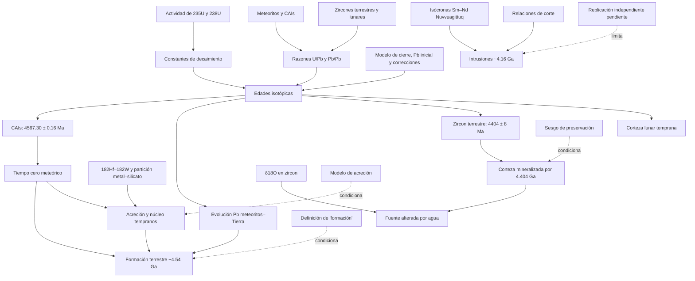

# Mapa epistemológico 001 — Edad y Tierra temprana

Este grafo muestra dependencias, no una secuencia histórica literal. Una flecha significa “aporta una premisa a”.

## Nodos de mayor dependencia

| Nodo | Por qué es cuello de botella | Cómo se audita |
|---|---|---|
| constantes U | afectan sistemáticamente U–Pb/Pb–Pb | metrología nuclear y propagación de covarianza |
| condición inicial/cierre | convierte razones en edades | isócronas, concordia, dominios, petrología |
| parentesco meteoritos–Tierra | conecta reloj extraterrestre con el planeta | cosmoquímica, dinámica y cronómetros distintos |
| significado de “formación” | convierte proceso en número único | publicar cronología de hitos |
| preservación hadeana | restringe el archivo observable | muestreo, procedencia y modelos de reciclaje |
| partición/equilibrio Hf–W | convierte anomalía en curva de acreción | sensibilidad a escenarios y datos experimentales |

## Rutas de falsación

- `F1`: constantes o calibraciones revisadas desplazan coherentemente las edades.
- `F2`: discordancia/textura muestra que el evento fechado no es primario.
- `F3`: un cronómetro materialmente independiente converge fuera del intervalo.
- `F4`: una alternativa explica las isócronas con mezcla sin evento común.
- `F5`: nueva muestra con procedencia segura contradice el orden temporal.

## Confianza por salida

| Salida | Nivel |
|---|---|
| Tierra de alrededor de 4.5 Ga | A |
| 4.54 Ga como valor operacional | B |
| acreción/diferenciación en decenas de Ma | B-COND |
| fecha exacta del impacto lunar | C |
| zircon terrestre a 4404 ± 8 Ma | B |
| agua superficial interpretada hacia 4.4 Ga | C |
| encajantes Nuvvuagittuq hadeanas | C-PROV |
