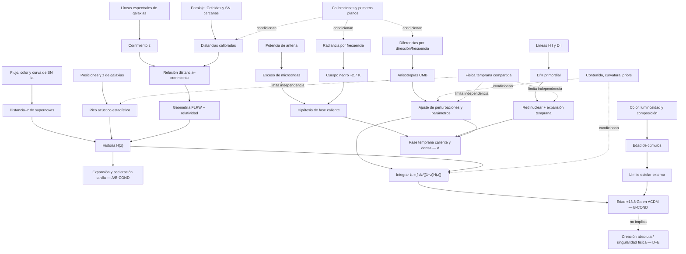

# Mapa epistemológico 002 — Historia y edad del universo

Este mapa separa señales, principios y conclusiones. Una flecha significa “aporta una premisa a”; no convierte al nodo de origen en una medición directa del nodo final.

## Nodos de mayor dependencia

| Nodo | Por qué es cuello de botella | Cómo se audita |
|---|---|---|
| escala de distancia | conecta ángulos/flujos con geometría | anclas independientes, cruces entre peldaños y residuos |
| separación de primeros planos | afecta espectro y mapas CMB | multibanda, máscaras, simulaciones e instrumentos distintos |
| horizonte sonoro | calibra BAO y enlaza época temprana/tardía | CMB, BBN, modelos alternativos y consistencia de `r_d` |
| historia `H(z)` | convierte tasa actual en edad integrada | SN, BAO, cronómetros, lentes, redshift drift futuro |
| familia de modelos | puede estrechar artificialmente `t0` | publicar priors, extensiones, evidencia y sensibilidad |
| física estelar | controla el límite externo de edad | paralaje, metalicidad, He, convección y códigos diferentes |

## Dependencia por dimensiones

| Línea | Muestra | Instrumento | Principio | Modelo compartido |
|---|---|---|---|---|
| CMB espectral | cielo completo | FIRAS | termodinámica | expansión adiabática |
| CMB anisotrópico | mismo cielo | radiómetros/bolómetros | plasma + gravedad | perturbaciones/FLRW |
| D/H | nubes de alto `z` | espectrógrafo echelle | atómica+nuclear | BBN/expansión |
| SN Ia | explosiones estelares | fotometría/espectros | estandarización | FLRW/`H(z)` |
| BAO | millones de galaxias | espectrógrafos de sondeo | correlación acústica | horizonte sonoro/FLRW |
| cúmulos | estrellas galácticas | fotometría/paralaje | evolución estelar | tiempo de formación, no `ΛCDM` completo |

## Rutas de falsación

- `F1`: un primer plano común reproduce espectro y anisotropías sin componente cósmico.
- `F2`: una geometría no expansiva explica también dilatación temporal, BAO, CMB y brillo.
- `F3`: D/H y otras abundancias precisas rompen de forma coherente la historia térmica.
- `F4`: `H(z)` medido por sondas independientes no integra a la edad CMB.
- `F5`: objetos estelares inequívocos exceden la edad máxima del modelo.
- `F6`: una extensión necesaria para resolver tensiones desplaza materialmente `t0`.

## Confianza por salida

| Salida | Nivel |
|---|---|
| existencia del CMB casi térmico | A |
| fase temprana caliente y densa | A |
| expansión cósmica | A-COND |
| aceleración tardía | B-COND |
| edad ~13.8 Ga en `ΛCDM` base | B-COND |
| causa de la tensión de Hubble | D |
| naturaleza de energía oscura | D |
| origen absoluto o mecanismo del borde | E |
