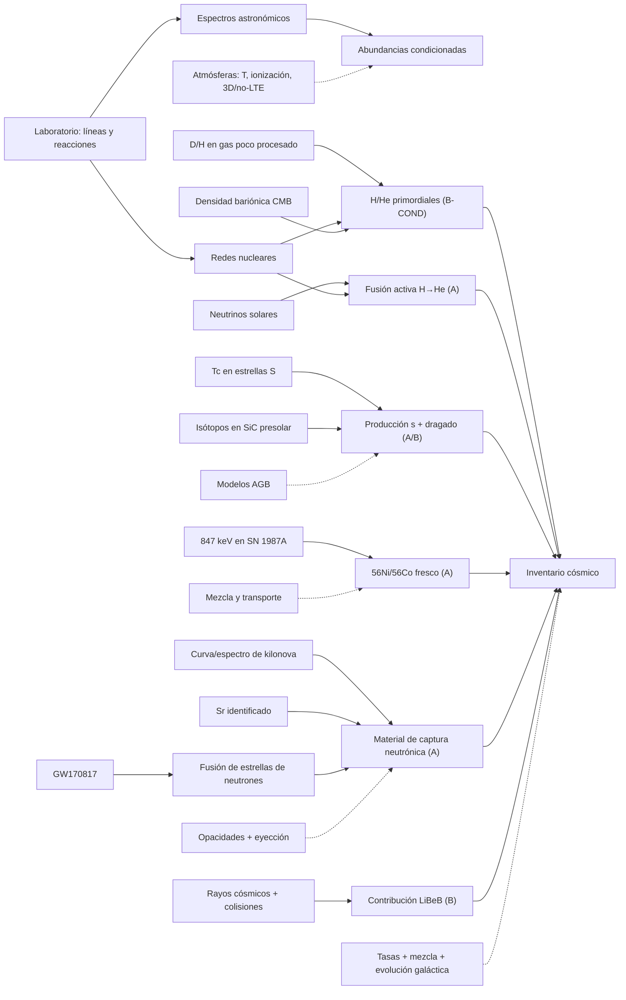

# Mapa 003 — Cómo conectamos una línea con una historia nuclear

Este mapa muestra dependencias, no una cronología a escala. La versión gráfica está en [`../assets/visuales/mapa-investigacion-003.svg`](../assets/visuales/mapa-investigacion-003.svg) y la matriz de contribuciones en [`../assets/visuales/matriz-origen-elementos.svg`](../assets/visuales/matriz-origen-elementos.svg).

## 1. Grafo principal



Las líneas discontinuas son dependencias de modelo o calibración. Las sólidas enlazan señales con inferencias, pero tampoco significan “medición sin teoría”.

## 2. Cinco capas que no deben colapsarse

| Capa | Ejemplo | Pregunta de auditoría |
|---|---|---|
| objeto | fotón, neutrino, grano, deformación interferométrica | ¿qué existe en el detector? |
| magnitud | `λ`, energía, conteo, razón isotópica | ¿cómo se calibró? |
| identificación | Fe I, Tc I, `56Co`, Sr II | ¿qué alternativas de línea sobreviven? |
| proceso | fusión, captura, decaimiento, espalación | ¿qué física local lo conecta? |
| historia | fuente y fracción del inventario galáctico | ¿qué tasas, transporte y selección se añadieron? |

Saltar de la primera a la quinta capa produce casi todos los errores populares del tema.

## 3. Matriz de evidencia por proceso

| Proceso | Evidencia directa o cercana | Corroboración | Cuello de botella | Claim |
|---|---|---|---|---|
| identificación elemental | múltiples líneas de laboratorio/cielo | bases evaluadas y estados de ionización | atmósfera y datos atómicos | `CLAIM-COSMOS-SPECTRA-001` |
| BBN | D/H en gas poco procesado | CMB + reacción `D(p,γ)3He` | cosmología y litio | `CLAIM-COSMOS-BBN-ELEMENTS-001` |
| fusión solar | neutrinos de reacciones solares | luminosidad y modelo solar | oscilación/fondos | `CLAIM-STARS-FUSION-001` |
| quema avanzada | abundancias y física nuclear | poblaciones y modelos evolutivos | transporte/rendimientos | `CLAIM-STARS-ADVANCED-BURNING-001` |
| proceso `s` | Tc atmosférico | isótopos en SiC | pulsos y mezcla AGB | `CLAIM-STARS-SPROCESS-001` |
| supernova | línea gamma de `56Co` | curva de luz y espectros | geometría de eyección | `CLAIM-SN-NUCLEOSYNTHESIS-001` |
| proceso `r` en fusiones | GW + kilonova + Sr | evolución temporal multibanda | presupuesto galáctico | `CLAIM-MERGER-RPROCESS-001` |
| espalación | física de colisión + LiBeB | evolución de abundancias | historia de rayos cósmicos | `CLAIM-COSMICRAY-LIBEB-001` |
| herencia presolar | anomalías multielementales en granos | comparación entre laboratorios | progenitor/modelo de condensación | `CLAIM-PRESOLAR-GRAINS-001` |

## 4. Independencia por dimensiones

| Ruta | Objeto | Instrumento | Calibración | Principio | Modelo compartido |
|---|---|---|---|---|---|
| neutrinos solares | partículas del Sol | centelleador | energía/fondos | interacción débil | solar + oscilación |
| Tc estelar | fotones de gigante S | espectrógrafo | longitud/continuo | estructura atómica | atmósfera + AGB |
| SN 1987A | gamma de ejecta | espectrómetro espacial | energía/respuesta | decaimiento nuclear | transporte SN |
| GW170817 | espacio-tiempo + luz | interferómetros + telescopios | strain/fotometría | relatividad + átomo | binaria + kilonova |
| grano SiC | sólido meteorítico | SIMS/NanoSIMS | estándares isotópicos | masas/isótopos | AGB + condensación |

La convergencia es fuerte porque ningún único detector ni muestra sostiene todo. La independencia no es total: las mismas tasas nucleares y modelos atómicos reaparecen en varias rutas.

## 5. Borde de cada claim

```text
líneas identificadas
  └─ no implican abundancia sin atmósfera

sitio que produce un núcleo
  └─ no implica fuente dominante de la galaxia

elemento en un evento
  └─ no identifica el origen de cada átomo terrestre

modelo que reproduce un patrón
  └─ no prueba unicidad del progenitor
```

## 6. Falsadores discriminantes

| Claim | Resultado que lo debilitaría de verdad | Resultado que no basta |
|---|---|---|
| `CLAIM-STARS-FUSION-001` | fuente no solar que reproduzca dirección, energía y tasa neutrínica | una revisión menor del modelo solar |
| `CLAIM-STARS-SPROCESS-001` | identificación de Tc incompatible en todas las líneas y granos sin señal `s` | cambiar el rendimiento de una masa estelar |
| `CLAIM-SN-NUCLEOSYNTHESIS-001` | energía gamma incompatible con decaimiento tras recalibración | mezcla más asimétrica de la esperada |
| `CLAIM-MERGER-RPROCESS-001` | explicación conjunta de GW170817/kilonova/Sr sin material recién producido | que fusiones no dominen todo el proceso `r` |
| `CLAIM-PRESOLAR-GRAINS-001` | origen solar/contaminante que reproduzca anomalías correlacionadas | reasignar una subclase de granos |

## 7. Preguntas abiertas enlazadas

- `OPEN-ELEMENT-RPROCESS-001`: pesos relativos de sitios `r`;
- `OPEN-ELEMENT-LITHIUM-001`: discrepancia primordial de litio;
- `OPEN-ELEMENT-YIELDS-001`: rendimientos y mezcla por tipo de estrella/evento.

## 8. Regla visual del proyecto

El archivo [`../assets/visuales/matriz-origen-elementos.svg`](../assets/visuales/matriz-origen-elementos.svg) usa puntos de contribución. Un punto significa “ruta importante o demostrada para parte de esta familia”; no significa propiedad exclusiva ni porcentaje exacto.
