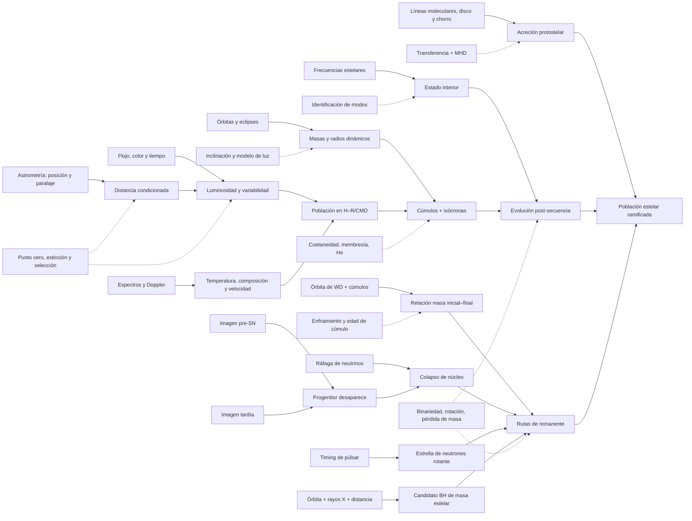
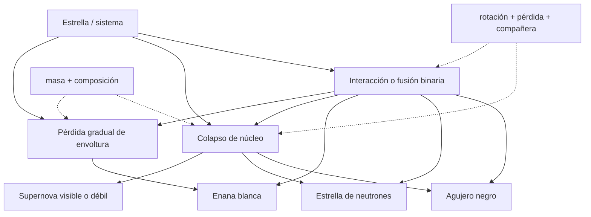

# Mapa 004 — Cómo convertimos una población presente en historias estelares

Este mapa separa señal, magnitud, diagnóstico y trayectoria. La versión gráfica está en [`../assets/visuales/mapa-investigacion-004.svg`](../assets/visuales/mapa-investigacion-004.svg); las rutas y modificadores están en [`../assets/visuales/rutas-evolucion-estelar.svg`](../assets/visuales/rutas-evolucion-estelar.svg).

## 1. Grafo principal



Las líneas discontinuas marcan dependencias de calibración o modelo. Las continuas no significan “dato sin teoría”; señalan el puente físico principal.

## 2. El error que el mapa impide

```text
puntos en un diagrama H–R hoy
  ≠ fotogramas observados de una sola estrella

puntos + masas + población coetánea + oscilaciones + remanentes
  + un modelo que predice todas esas relaciones
  → trayectoria evolutiva contrastada
```

La distinción no rebaja la conclusión. Explica por qué tiene contenido empírico.

## 3. Cinco capas de una inferencia estelar

| Capa | Ejemplo | Pregunta de auditoría |
|---|---|---|
| señal | conteos CCD, fase de visibilidad, voltaje del detector | ¿qué cambió físicamente en el instrumento? |
| magnitud | flujo, paralaje, velocidad radial, frecuencia | ¿cómo se calibró y qué covarianzas tiene? |
| propiedad | luminosidad, masa, radio, temperatura | ¿qué geometría o atmósfera la tradujo? |
| estado | protostrella, secuencia principal, gigante, remanente | ¿qué alternativas observacionales se excluyeron? |
| historia | edad, ruta y destino | ¿qué población y modelo conectan los estados? |

Una etiqueta de etapa pertenece a las capas cuarta o quinta. No debe presentarse como si estuviera escrita en el píxel.

## 4. Matriz de evidencia por claim

| Claim | Evidencia ancla | Corroboración | Dependencia crítica | Borde |
|---|---|---|---|---|
| `CLAIM-STARS-DISTANCE-001` | paralaje Gaia | binarias/cúmulos | punto cero y estadística de distancia | geometría no entrega edad |
| `CLAIM-STARS-HR-001` | HRD observacional Gaia | cúmulos y espectros | extinción, color–T, selección | población no es trayectoria |
| `CLAIM-STARS-MASS-001` | órbitas/eclipses | Sirius B, cúmulos | inclinación y modelo superficial | masa no fija sola el destino |
| `CLAIM-STARS-BIRTH-001` | B335 + HH 212 | fuentes embebidas y outflows | transferencia, química y MHD | no fija eficiencia universal |
| `CLAIM-STARS-EVOLUTION-001` | cúmulos + sismología | masas/radios y conteos | isócronas, He, convección | edad/modelo cuantitativos |
| `CLAIM-STARS-LIFETIME-001` | punto de giro por masa | relaciones masa–luminosidad | mezcla y composición | tendencia, no potencia universal |
| `CLAIM-STARS-WD-001` | Sirius B + IFMR | secuencias de enfriamiento | edades y pérdida de masa | frontera inicial–final dispersa |
| `CLAIM-STARS-CORECOLLAPSE-001` | desaparición + neutrinos | remanentes y nucleosíntesis | asociación y modelo de colapso | no toda estrella masiva explota igual |
| `CLAIM-STARS-REMNANT-001` | timing y masa dinámica | remanentes/SN/binarias | emisión e inclinación | microfísica del objeto |
| `CLAIM-STARS-BOUNDARY-001` | diversidad de sistemas | interacción binaria | selección poblacional | niega ruta única, no la física común |

## 5. Qué controla qué

| Variable | Observable aproximado | Efecto principal | Degeneraciones |
|---|---|---|---|
| masa inicial | masa dinámica en sistemas; población/modelo en aisladas | presión central, luminosidad, tiempos y núcleos accesibles | transferencia/pérdida cambia masa actual |
| composición | espectros y atmósferas | opacidad, redes, vientos y posición H–R | temperatura, 3D/no-LTE, difusión |
| edad | cúmulo/isócrona/enfriamiento | qué masas ya abandonaron secuencia | He, convección, rotación, distancia |
| rotación | ensanchamiento, periodos, asterosismología | mezcla, forma y vida | inclinación y magnetismo |
| binariedad | eclipses, Doppler, astrometría | masa, envoltura, giro y fusión | compañeras no resueltas/selección |
| pérdida de masa | vientos, perfiles, polvo, remanentes | masa final y tipo de explosión | clumping, geometría y fase breve |

“Masa determina el destino” es una primera aproximación. “Masa inicial más modificadores produce una distribución de rutas” es la formulación auditable.

## 6. Independencia por dimensiones

| Ruta | Muestra | Detector | Calibración | Principio | Modelo compartido |
|---|---|---|---|---|---|
| Gaia HR | fotones de población | CCD astrométrico/fotométrico | actitud, punto cero, filtros | geometría + radiometría | atmósfera/extinción |
| binaria | dos estrellas | espectrógrafo + fotómetro | velocidad/tiempo/flujo | gravedad orbital | superficie/forma |
| cúmulo | población relacionada | multibanda | membresía/distancia | comparación coetánea | evolución/isócronas |
| sismología | serie temporal | Kepler | tiempo/respuesta | ondas interiores | modos/estructura |
| protostrella | líneas moleculares | interferómetro radio | frecuencia/haz | Doppler/transferencia | química + MHD |
| supernova | fuente antes/después + neutrinos | imagen + detector de partículas | astrometría/fondo/energía | desaparición/interacción débil | colapso/distancia |
| compacto | pulsos u órbita | radio/X/óptico | reloj, posición, velocidad | rotación y gravedad | emisión/acreción |

La independencia es alta entre detectores, menor en la física común. Gravedad y distancia reaparecen; eso debe registrarse como enlace, no contarse como evidencia duplicada.

## 7. Tres relojes que no son el mismo

| Reloj | Qué cambia | Qué entrega | Límite |
|---|---|---|---|
| punto de giro | qué masas agotaron H central | edad de población modelada | composición/convección/rotación |
| asterosismología | densidad y cavidades internas | estado/masa/edad condicionados | escalas y modelo modal |
| enfriamiento WD | luminosidad/temperatura del remanente | tiempo desde formación del WD | cristalización, atmósfera e historia previa |

Si convergen en un cúmulo, la prueba es más fuerte porque responden a fases distintas. No son totalmente independientes si comparten distancia y composición.

## 8. Rutas de nacimiento

```text
perfil molecular asimétrico
  + mapa espacial
  + gradiente cinemático
  + fuente embebida
  → infall condicionado

disco resuelto
  + chorro bipolar
  + gradiente transversal
  → extracción de momento angular condicionada por MHD
```

Un perfil azul por sí solo no basta: outflow, rotación, capas múltiples y abundancia pueden producir asimetría. El mapa espacial y varias transiciones reducen la degeneración.

## 9. Rutas de muerte y remanente



El grafo muestra rutas posibles, no probabilidades ni umbrales. Una estrella puede perder masa por interacción antes del colapso; una enana blanca en binaria puede tener evolución posterior fuera del alcance principal de esta investigación.

## 10. Falsadores discriminantes

| Claim | Resultado que lo debilitaría de verdad | Resultado que no basta |
|---|---|---|
| `CLAIM-STARS-HR-001` | estructura desaparece al corregir calibración y selección | mover ligeramente una secuencia con nueva extinción |
| `CLAIM-STARS-MASS-001` | órbitas no cumplen gravedad en sistemas bien resueltos sin efecto alternativo | corregir una inclinación individual |
| `CLAIM-STARS-BIRTH-001` | modelos sin acreción reproducen conjuntamente líneas, disco y outflow y predicen casos nuevos | reinterpretar un perfil aislado |
| `CLAIM-STARS-EVOLUTION-001` | cúmulos coetáneos + sismología contradicen sistemáticamente toda trayectoria física viable | cambiar edad o overshoot de un cúmulo |
| `CLAIM-STARS-WD-001` | masas/radios y membresías muestran que las WD no son remanentes de miembros evolucionados | dispersión en la IFMR |
| `CLAIM-STARS-CORECOLLAPSE-001` | progenitores confirmados sobreviven o neutrinos de colapsos cercanos faltan con sensibilidad suficiente | diversidad de luminosidad de supernova |
| `CLAIM-STARS-REMNANT-001` | una clase material estable no compacta reproduce masas, timing, radios y energía | revisión de masa de un sistema |
| `CLAIM-STARS-BOUNDARY-001` | todas las poblaciones se explican mejor con una ruta única y sin interacción | que una estrella aislada siga un track simple |

## 11. Preguntas abiertas enlazadas

- `OPEN-STARS-FORMATION-001`: inicio y eficiencia de formación;
- `OPEN-STARS-MIXING-001`: convección, overshoot, rotación y magnetismo;
- `OPEN-STARS-MASSLOSS-001`: vientos y pérdida episódica;
- `OPEN-STARS-REMNANTS-001`: mapa inicial–final y explosiones fallidas.

## 12. Regla visual del proyecto

El archivo [`../assets/visuales/rutas-evolucion-estelar.svg`](../assets/visuales/rutas-evolucion-estelar.svg) usa bifurcaciones y modificadores. Una flecha significa “ruta física posible y respaldada para parte de la población”; no significa destino inevitable, intervalo temporal a escala ni umbral exacto de masa.
