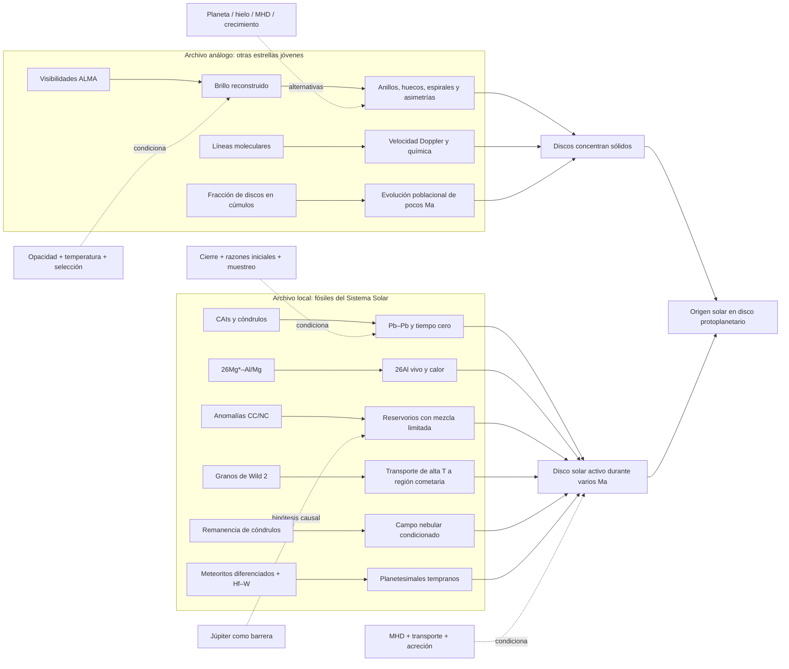

# Mapa 005 — Formación del Sistema Solar

Este mapa separa datos, transformaciones, puentes y claims. Las flechas no significan observación directa del pasado.

## Pregunta

¿Qué combinación de archivos permite inferir un disco solar ancestral sin convertir análogos, meteoritos o simulaciones en una película literal?

## Grafo principal



## Dos archivos, dos límites

| Archivo | Fortalezas | Límite que no puede cruzar solo |
|---|---|---|
| discos análogos | observa gas/polvo alrededor de estrellas jóvenes; mide diversidad y subestructuras | no identifica la genealogía del Sol ni cada mecanismo |
| fósiles locales | pertenece al Sistema Solar; conserva edades, composición y procesamiento | muestreo sesgado, sin geometría global completa y con historias secundarias |

La inferencia conjunta es más fuerte que cada archivo por separado, pero comparte física de disco. No son dos teorías independientes que se “votan”.

## Matriz claim–evidencia

| Claim | Evidencia decisiva | Puente | Alternativa o límite |
|---|---|---|---|
| `CLAIM-SOLAR-DISK-001` | DSHARP, vida de discos, fósiles | dinámica de gas/polvo + genealogía | encuentro/captura debe reproducir todo |
| `CLAIM-SOLAR-SUBSTRUCTURE-001` | contrastes ALMA y trampa Oph IRS 48 | transferencia + arrastre | hueco no identifica causa única |
| `CLAIM-SOLAR-AGE-001` | CAIs Pb–Pb | decaimiento y cierre | fecha sólidos, no todo el sistema |
| `CLAIM-SOLAR-CHRONOLOGY-001` | edades de cóndrulos | eventos de fusión/cierre | muestreo superviviente |
| `CLAIM-SOLAR-RADIONUCLIDE-001` | isócrona `26Al–26Mg` | decaimiento extinto + calor | fuente/homogeneidad abiertas |
| `CLAIM-SOLAR-RESERVOIRS-001` | anomalías CC/NC + edades | mezcla incompleta | Júpiter es una explicación, no el dato |
| `CLAIM-SOLAR-TRANSPORT-001` | refractario en Wild 2 | termodinámica/mineralogía | mecanismo y caudal no únicos |
| `CLAIM-SOLAR-MAGNETIC-001` | remanencia Semarkona | adquisición/fidelidad magnética | remagnetización y transporte MHD |
| `CLAIM-SOLAR-PLANETESIMAL-001` | meteoritos diferenciados + Hf–W | partición metal–silicato + reloj | modelo térmico y acreción |
| `CLAIM-SOLAR-GROWTH-001` | colisiones + simulaciones | arrastre, retroacción, autogravedad | mecanismo histórico no observado |

## Dependencias que impiden contar votos

```text
CAI Pb–Pb ─┬─ define tiempo cero ─┬─ 26Al relativo
           │                      └─ Hf–W y edades de cuerpos
           └─ muestreo meteorítico compartido

ALMA continuo ─ opacidad + temperatura ─ anillos/huecos
ALMA líneas   ─ química + transferencia ─ gas/cinemática

Wild 2 ─ mineralogía de alta T ─ transporte necesario
CC/NC   ─ anomalías nucleosintéticas ─ mezcla limitada
           ↑ ambos restringen simultáneamente movilidad y aislamiento
```

## Adversarios por nivel

1. **Nivel geométrico:** un origen no discoidal debe explicar coplanaridad y sentido orbital tras evolución dinámica.
2. **Nivel material:** debe producir CAIs, cóndrulos, radionúclidos extintos y diferenciación temprana.
3. **Nivel de transporte:** debe llevar sólidos calientes a regiones cometarias sin homogeneizar todos los reservorios.
4. **Nivel poblacional:** debe explicar por qué discos son comunes en estrellas jóvenes.
5. **Nivel microfísico:** dentro del disco, varios mecanismos rivalizan; aquí la controversia no es disco frente a no disco, sino qué hizo cada transformación.

## Falsadores operativos

| Claim | Observación que lo debilitaría |
|---|---|
| disco solar | alternativa no discoidal que prediga conjuntamente fósiles, órbitas y población de discos |
| hueco planetario | cinemática/temperatura que descarte masa perturbadora y favorezca otra causa |
| campo nebular | remagnetización secundaria que reproduzca todas las componentes y direcciones |
| separación por Júpiter | cronología incompatible o barrera alternativa con mejor poder predictivo |
| transporte radial | formación local a baja temperatura capaz de producir la misma mineralogía sin reubicación |
| mecanismo de planetesimales | condiciones iniciales y población de cuerpos incompatibles con sus predicciones |

## Regla de lectura

El mapa permite decir con alta confianza **que hubo un disco** y con confianza mucho menor **cómo fue cada episodio dentro del disco**. La incertidumbre de mecanismo no debe rebajar artificialmente la existencia del entorno; la existencia del entorno tampoco autoriza a cerrar su historia detallada.
