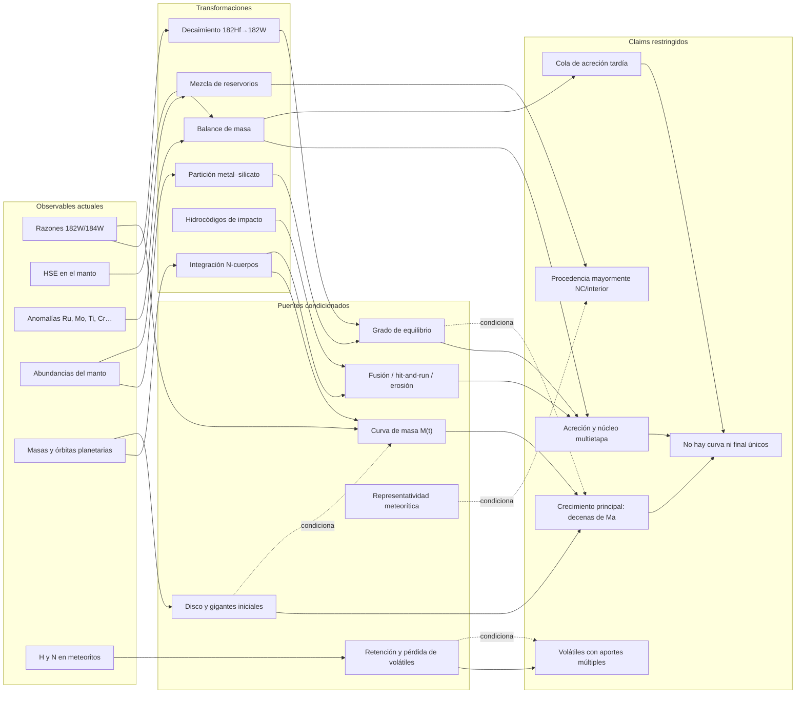
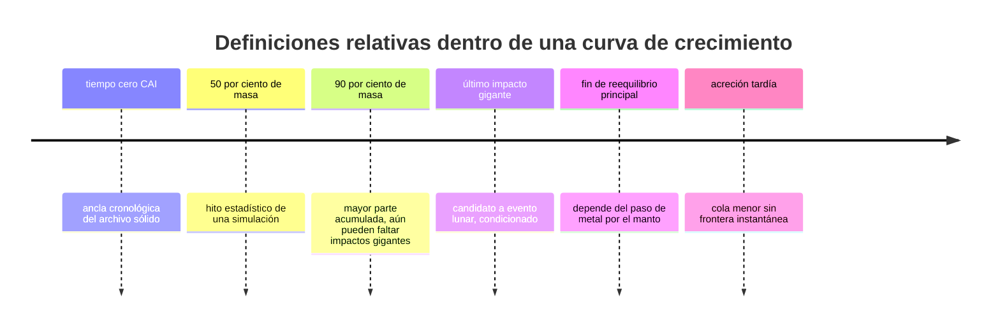

# Mapa 006 — Acreción terrestre

Este mapa separa señales actuales, transformaciones, puentes físicos e historias compatibles. Ninguna flecha significa que el ensamblaje de la Tierra haya sido observado directamente.

## Pregunta

¿Cómo restringen cuatro archivos incompletos una historia común sin convertir un cronómetro, un meteorito o una simulación en una biografía literal?

## Grafo principal

## Matriz señal–puente–claim

| Señal | Transformación necesaria | Claim que restringe | Qué no entrega sola |
|---|---|---|---|
| `182W` en manto/meteoritos | decaimiento + partición + equilibrio + `M(t)` | `CLAIM-EARTH-HFW-001`, `CLAIM-EARTH-ACCRETION-001` | fecha única de terminación |
| elementos moderadamente siderófilos | experimentos P–T–fO₂ + balance | `CLAIM-EARTH-MULTISTAGE-001` | geometría observada de cada océano de magma |
| HSE del manto | partición + masa condrítica equivalente | `CLAIM-EARTH-LATEACCRETION-001` | momento y cuerpos individuales |
| Ru/Mo/Ti/Cr/O | agrupación de reservorios + pesos por etapa | `CLAIM-EARTH-PROVENANCE-001` | receta mineralógica exacta |
| masas y órbitas actuales | ensambles N-cuerpos + selección de análogos | `CLAIM-EARTH-DYNAMICS-001` | repetición determinista del pasado |
| simulaciones hidrodinámicas | ecuación de estado + escalado | `CLAIM-EARTH-COLLISIONS-001` | desenlace de cada choque real |
| H/N en condritas EC | escalado + retención + mezcla | `CLAIM-EARTH-VOLATILES-001` | fracción histórica de agua terrestre |
| HSE + estadística de impactos | relación masa tardía–último gigante | `CLAIM-EARTH-MOON-CLOCK-001` | edad radiométrica directa de la Luna |

## Cinco “finales” que no se pueden intercambiar

La posición relativa es conceptual. No se asignan aquí edades universales porque cada una depende de un modelo y una definición.

## Matriz de dependencia

| Ruta A | Ruta B | Dependencia compartida | Consecuencia |
|---|---|---|---|
| Hf–W | HSE | formación núcleo–manto | no contar como dos relojes plenamente independientes |
| Hf–W | dinámica | curva `M(t)` | la dinámica puede actuar como prior del reloj |
| Ru/Mo | dinámica radial | mapa meteorito→radio | la procedencia espacial es modelada |
| HSE | edad lunar | último gigante = Luna | el resultado es un reloj compuesto |
| manto multielemental | Rubie/Grand Tack | mismos ensambles y parámetros ajustados | validar con salidas no usadas en el ajuste |
| H/N meteorítico | entrega de agua | representatividad y retención | capacidad de aporte ≠ presupuesto real |

## Adversarios por nivel

1. **Monolítico:** un colapso o episodio único tendría que explicar núcleo, W, HSE, Luna y órbitas sin acreción por población.
2. **Equilibrio total:** debe demostrar que todo metal impactor tocó suficiente silicato en cada etapa y reproducir la firma completa.
3. **Desequilibrio extremo:** debe evitar destruir la coherencia multielemental del manto.
4. **Dinámica única:** Grand Tack, anillo estrecho o disco clásico deben predecir Marte, cinturón, Tierra/Venus, tiempos y procedencia conjuntamente.
5. **Agua exclusivamente tardía:** debe explicar el H interior medido y por qué no contribuyó al reservorio terrestre.
6. **Sin acreción tardía:** debe retener HSE y reproducir Ru/W por procesos núcleo–manto cuantitativos.

## Falsadores operativos

| Hipótesis | Prueba discriminatoria |
|---|---|
| equilibrio parcial | simulaciones de mezcla validadas + suite multielemental que fije la fracción sin degeneración |
| Grand Tack | predicciones incompatibles de cinturón, reservorios o arquitectura de gigantes |
| anillo estrecho | mecanismo de disco incapaz de producir/conservar la concentración requerida |
| último gigante tardío | reloj lunar directo y robusto incompatible con la relación HSE–dinámica |
| acreción tardía interior | Ru y otros trazadores del manto que exijan una fuente carbonácea exterior dominante |
| aporte interior de agua | inventario representativo EC incompatible en abundancia o isótopos con la Tierra tras retención realista |

## Regla de lectura

El mapa permite afirmar con confianza que la Tierra creció y se diferenció por etapas durante decenas de millones de años. No permite sustituir el eje de una simulación por el pasado, identificar una condrita como el ingrediente único ni llamar a `95 ± 32 Ma` una medición directa del impacto lunar.

El aumento de precisión debe ocurrir donde está la incertidumbre: no solo en las razones isotópicas, sino en mezcla, condiciones iniciales, colisiones, retención y representatividad.
