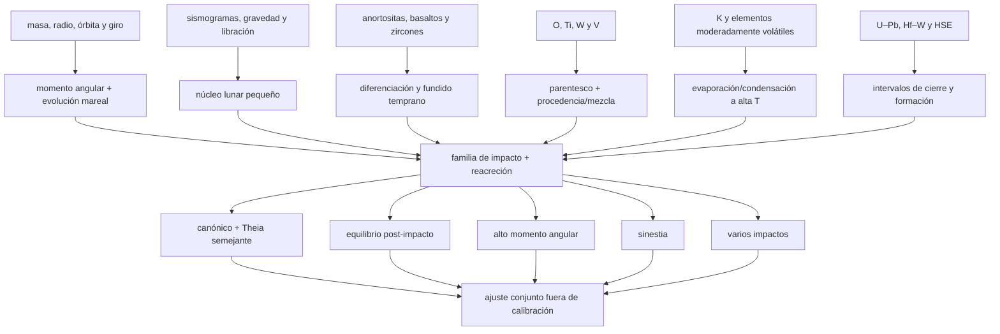

# Mapa epistemológico 008 — Origen de la Luna

## Grafo principal

## Cadena de cada archivo

| Archivo | Señal | Magnitud | Puente | Claim |
|---|---|---|---|---|
| órbita | posiciones y distancias | masa, `L`, recesión | mareas/resonancias | estado inicial restringido, no único |
| interior | tiempos y gravedad | radio/densidad del núcleo | inversión | Luna pobre en metal |
| petrología | minerales y texturas | modos/edades | cristalización | diferenciación extensa |
| isótopos | razones O/Ti/V/W | offsets ppm–‰ | mezcla/núcleo/exposición | parentesco extraordinario, no identidad simple |
| volátiles | abundancia + isótopos | depleción/fraccionamiento | vapor/condensación | procesamiento de alta T |
| simulación | partículas/celdas | masa y `L` del disco | ecuación de estado + acreción | mecanismo viable, no repetición |

## Qué está directamente medido

- muestras, señales sísmicas, gravedad, masa y órbita;
- abundancias y razones isotópicas;
- edades de minerales y sistemas;
- resultados numéricos bajo entradas declaradas.

No están medidos directamente:

- Theia como cuerpo;
- el ángulo o velocidad históricos;
- una sinestia pasada;
- el porcentaje exacto de cada progenitor;
- el instante del contacto.

## Matriz de dependencia

| Ruta | Muestra | Instrumento | Calibración | Modelo | Dependencia dominante |
|---|---|---|---|---|---|
| O/Ti/V/W | lunar + terrestre | espectrometría | estándares/blancos | rayos cósmicos y reservorios | muestreo Apollo |
| anortosita/zircon | roca/mineral | microsonda + MS | estándares | cierre/petrogénesis | contexto geológico |
| núcleo lunar | moonquakes | sismómetros Apollo | tiempo/respuesta | inversión radial | red de cara cercana |
| SPH | condiciones iniciales | cómputo | tests numéricos | EOS/resolución | selección de escenarios |
| momento angular | órbita/rotación | láser/astrometría | efemérides | mareas/resonancias | disipación pasada |

Reanalizar las mismas muestras con mejor precisión agrega información, pero no crea procedencia geográfica nueva.

## Competencia entre modelos

| Familia | Resuelve bien | Tensión principal | Predicción discriminatoria |
|---|---|---|---|
| canónico | masa, poco Fe, `L` cercano | disco muy impactor | pequeña diferencia multielemental coherente |
| equilibrio | homogeneidad O | tiempos/transporte selectivo | patrón por volatilidad/difusión |
| alto `L` | material terrestre | retiro posterior de `L` | ruta mareal/resonante robusta |
| sinestia | mezcla + presión de vapor | estado extremo y enfriamiento | fraccionamiento acoplado y termodinámica |
| múltiples | probabilidad + promedio | supervivencia/fusión de moonlets | distribución dinámica y química integrada |

## Niveles de certeza

| Frase | Nivel |
|---|---|
| Luna diferenciada y predominantemente silicatada | A–B |
| gran parentesco isotópico Tierra–Luna | A-COND |
| impacto/reacreción como mejor familia causal | B-COND |
| procesamiento volátil de alta temperatura | B-COND |
| formación en primeras decenas–~100 Ma | C |
| una Theia de masa marciana concreta | D |
| geometría y trayectoria históricas | D–E |

## Falsadores útiles

- una alternativa sin impacto que reproduzca todas las restricciones con menos supuestos;
- un núcleo lunar grande y composición bulk incompatible con eyección silicatada;
- muestras profundas/de cara lejana que rompan sistemáticamente el parentesco terrestre;
- una ruta de alto `L` incapaz de alcanzar el sistema actual para toda disipación plausible;
- edades co-genéticas replicadas que excluyan los intervalos aceptados;
- un modelo que prediga antes de medir O, Ti, V, W, K, masa y `L` y falle conjuntamente.

## Regla editorial

Una animación debe rotularse como realización de un modelo. “Theia chocó a 45° hace X Ma” no es una observación; debe reemplazarse por el rango, las entradas y el claim que esa ejecución prueba.
