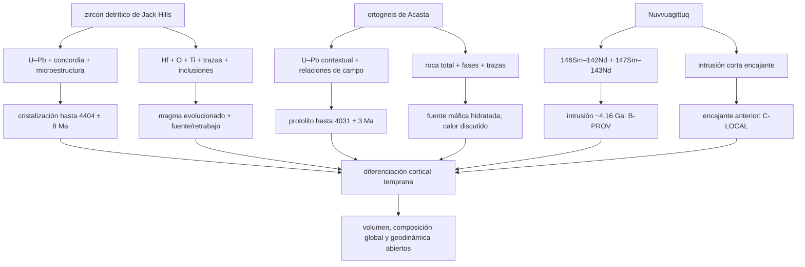

# Mapa epistemológico 009 — Primera corteza terrestre

## Grafo principal



## Tres objetos, tres verbos

| Archivo | Verbo correcto | Resultado | No autoriza |
|---|---|---|---|
| zircon detrítico | cristalizó | edad/composición del mineral y magma | afloramiento o continente preservado |
| ortogneis | preserva un protolito | cuerpo ígneo anterior al metamorfismo | superficie original intacta |
| intrusión | corta | edad directa del intrusivo y límite del huésped | edad exacta de toda la encajante |

## Cadena de medición

| Señal | Magnitud | Puente | Claim | Riesgo dominante |
|---|---|---|---|---|
| U/Pb y Pb/Pb en dominios | edad concordante | decaimiento + cierre | zircon/protolito | pérdida, mezcla, herencia |
| Hf inicial + edad | `εHf(t)`/trayectoria | evolución Lu–Hf | juvenil/retrabajado | reservorio y edad modelo |
| Nb–Sc–U–Yb | razones de trazas | partición zircon–fundido | afinidad magmática | coeficientes y no unicidad tectónica |
| química de Acasta | fases y roca total | equilibrio/fusión | fuente máfica hidratada | P–T y fuente degeneradas |
| Sm/Nd + Nd isotópico | pendiente de isócrona | co-geneticidad y decaimiento | evento intrusivo | mezcla/reseteo |
| contacto NGB | orden espacial | principio de corte | encajante más antigua | tectonización/correlación |

## El embudo de extrapolación

```text
dominio mineral medido                         confianza mayor
        ↓
magma fuente inferido
        ↓
litología/terreno de procedencia
        ↓
volumen regional de corteza
        ↓
estado global de la Tierra
        ↓
régimen tectónico planetario                   confianza menor
```

Cada descenso requiere datos nuevos; no se hereda la confianza de la edad U–Pb.

## Matriz de independencia

| Ruta | Localidad | Objeto | Reloj/modelo | Independencia útil |
|---|---|---|---|---|
| Jack Hills U–Pb | Australia | mineral detrítico | dos cadenas U–Pb | edad mineral |
| Jack Hills Hf/trazas | Australia | mismos granos/población | partición + reservorios | química adicional; muestra compartida |
| Acasta | Canadá NW | cuerpo rocoso | U–Pb + petrología | contexto distinto |
| NGB Sm–Nd | Québec | intrusión/roca total | corto + largo | cronómetros distintos |
| NGB campo | Québec | contacto | orden relativo | física independiente del decaimiento |

La convergencia más valiosa es entre mineral detrítico, roca preservada y contacto intrusivo. Dentro de cada bloque hay correlaciones fuertes.

## Competencia geodinámica

| Familia | Puede producir | Tensión | Prueba discriminatoria |
|---|---|---|---|
| placas móviles modernas | hidratación, arcos, reciclaje | escala/globalidad no medidas | paleogeografía, metamorfismo y poblaciones múltiples coherentes |
| subducción local/intermitente | firmas de arco sin placas globales | duración y cinemática | episodios y gradientes P–T espacialmente resueltos |
| tapa estancada + plumas/goteo | corteza máfica y remelting | explicar hidratación/trazas tipo arco | química conjunta O–Hf–trazas predicha |
| impactos | calor somero y retrabajo | evento no identificado | firmas de choque y edades co-genéticas |

## Niveles de certeza

| Frase | Nivel |
|---|---|
| zircon de `4404 ± 8 Ma` | B |
| magmas diferenciados/retrabajo hadeano | B-COND |
| protolitos Acasta hasta `4031 ± 3 Ma` | B |
| fuente máfica hidratada de Idiwhaa | C |
| impacto como calor de Idiwhaa | D |
| intrusiones NGB ~4.16 Ga | B-PROV |
| encajante NGB hadeana | C-LOCAL |
| continentes/placas globales modernos a 4.4 Ga | D–E |

## Falsadores útiles

- demostrar mezcla o redistribución que elimine sistemáticamente los dominios U–Pb hadeanos;
- obtener Hf/trazas co-localizados que requieran fuentes juveniles máficas para las mismas edades;
- reasignar los zircones más antiguos de Acasta a herencia ajena al protolito;
- romper la concordancia Sm–Nd de NGB con nuevas muestras o demostrar que los contactos son tectónicos;
- aplicar un clasificador predefinido a poblaciones independientes y obtener un único régimen incompatible con la diversidad actual.

## Regla editorial

Toda cifra debe llevar sujeto y evento: “zircon cristalizó”, “protolito se emplazó”, “intrusión cortó” o “fuente se separó bajo un modelo”. “La roca tiene 4.4 Ga” queda prohibido si el objeto real es un grano detrítico o una edad de modelo.
