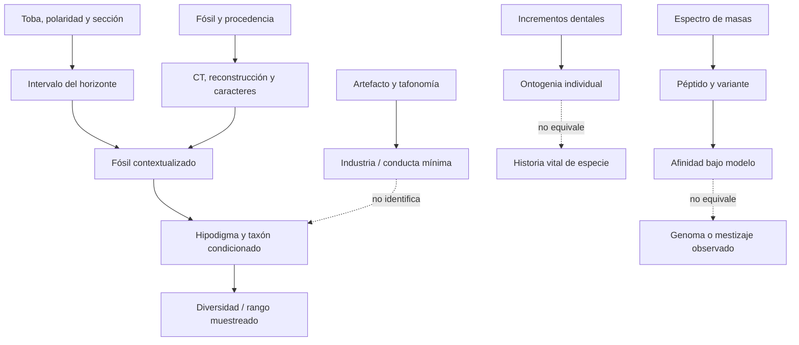

# Mapa epistemológico 038 — `Homo` temprano, diversidad, dispersión y tecnología

## Pregunta central

¿Qué cadenas permiten pasar de fragmentos, estratos, artefactos, dientes y péptidos a afirmaciones delimitadas sobre `Homo`, sin que edad, especie, conducta y genealogía se sustituyan entre sí?



## Ruta 1 — De marcador a intervalo fósil

```text
mineral de toba / remanencia
          ↓ medición y calibración
edad del marcador / polaridad
          ↓ estratigrafía y fallas
horizonte del fósil
          ↓ procedencia y retrabajo
intervalo de presencia
          ≠ origen o extinción del taxón
```

LD 350-1 hereda la precisión de los marcadores sólo después de demostrar su posición. DNH 134 y KNM-ER 2598 muestran el caso inverso: una atribución a `erectus` más frágil que su contexto geológico (`CLAIM-HOMO-LEDI-AGE-001`, `CLAIM-ERECTUS-EARLIEST-001`).

## Ruta 2 — De pieza a taxón

```text
fragmento preservado
   ↓ CT / superficie
forma observada
   ↓ reconstrucción explícita
caracteres comparables
   ↓ controla edad, sexo, tamaño y deformación
agrupación de hipodigma
   ↓ matriz / diagnóstico
taxón condicionado
```

OH 7, KNM-ER 1470, DNH 134 y DAN5/P1 pesan distinto porque preservan regiones y etapas ontogenéticas distintas. Un cerebro, mandíbula o cara no puede sustituir a las demás (`CLAIM-HOMO-TAXONOMY-MOSAIC-001`).

## Ruta 3 — De cuerpos individuales a distribución

```text
esqueleto asociado
  ↓ proporciones y edad al morir
cuerpo individual
  ↓ comparación de individuos
distribución de talla y forma
  ↓ muestreo regional/temporal
hipótesis de especie
```

KNM-WT 15000 demuestra que existió un adolescente alto y de piernas largas cerca de `1.6 Ma`; no demuestra que todo `erectus` compartiera su talla adulta (`CLAIM-ERECTUS-BODY-001`).

## Ruta 4 — De un sitio a diversidad evolutiva

```text
cinco cráneos de Dmanisi
       ↓ contexto común
variación poblacional local
       ↓ modelo de dimorfismo / ontogenia
una población muy variable
       ↓ añade tiempo y geografía
comparación con hipodigmas africanos
       ≠ colapso automático de todas las especies
```

Dmanisi tiene alta independencia entre individuos, pero baja independencia contextual: todos comparten sitio, cronología y preservación. Su poder está en estimar variación local, no toda variación del género (`CLAIM-DMANISI-VARIATION-001`).

## Ruta 5 — De artefacto a conducta

```text
piedra / hueso
   ↓ superficies, fracturas, remontajes
modificación intencional
   ↓ secuencia operativa
industria y repertorio
   ↓ asociación independiente necesaria
fabricante candidato
   ↓ fósil diagnóstico o residuo
atribución taxonómica
```

Namorotukunan prueba continuidad Oldowan; Kokiselei prueba Achelense temprano; T69 prueba talla ósea sistemática. Ninguno identifica por sí solo al fabricante (`CLAIM-HOMO-TOOLS-ATTRIBUTION-001`).

## Ruta 6 — De sitio a dispersión

```text
artefacto o fósil contextualizado
       ↓ edad local
presencia mínima
       ↓ red de sitios
rango geográfico muestreado
       ↓ paleogeografía y detectabilidad
escenario de dispersión
       ≠ ruta, dirección o número de pulsos observados
```

Shangchen informa presencia de un fabricante; Dmanisi añade fósiles de `Homo`; Sangiran añade `erectus` local. La diferencia de archivo impide tratarlos como tres estaciones del mismo viaje (`CLAIM-ASIA-EARLY-TOOLS-001`, `CLAIM-JAVA-CHRONOLOGY-001`).

## Ruta 7 — Del diente a la ontogenia

```text
esmalte y dentina
   ↓ PPC-SRµCT
líneas incrementales
   ↓ conteo, tasas y reconstrucción
secuencia dental individual
   ↓ comparación primate
ontogenia mosaico
   ≠ cooperación o infancia moderna observada
```

D2700/D2735 combina tasas rápidas con retraso posterior. La señal es individual y dental; pasar a organización social requiere evidencia que el diente no contiene (`CLAIM-DMANISI-GROWTH-001`).

## Ruta 8 — Del péptido a la historia de linajes

```text
esmalte fósil
   ↓ extracción y LC–MS/MS
espectro
   ↓ búsqueda y control de daño
péptido / variante
   ↓ árbol y referencia
afinidad molecular
   ↓ modelo demográfico
flujo posible
   ≠ genoma ni cruce observado
```

La recuperación de proteínas cambia el archivo material. El paso desde dos variantes a una contribución a denisovanos conserva dependencias en persistencia ancestral, muestreo y topología (`CLAIM-ERECTUS-PROTEINS-2026-001`, `CLAIM-ERECTUS-INTROGRESSION-LIMIT-001`).

## Nodos principales

| Nodo | Objeto | Transformación | Claim | Cuello de botella |
|---|---|---|---|---|
| `EVID-HOMO-LEDI-001` | mandíbula/dientes + tobas | contexto → presencia | `CLAIM-HOMO-LEDI-AGE-001` | definición de género |
| `EVID-HABILIS-OH7-001` | mandíbula/parietales | reconstrucción → comparación | `CLAIM-HABILIS-OH7-001` | deformación e hipodigma |
| `EVID-RUDOLFENSIS-KOOBI-001` | cara y mandíbulas | morfoespacio → agrupación | `CLAIM-RUDOLFENSIS-DISTINCT-001` | variación de especie |
| `EVID-ERECTUS-DAN5-001` | cráneo reconstruido | módulos → mosaico | `CLAIM-ERECTUS-MOSAIC-001` | un individuo y reconstrucción |
| `EVID-DMANISI-SKULLS-001` | cinco cráneos | variación local → modelo | `CLAIM-DMANISI-VARIATION-001` | extrapolación mundial |
| `EVID-OLDOWAN-NAMOROTUKUNAN-001` | tres horizontes | técnica → continuidad | `CLAIM-OLDOWAN-CONTINUITY-2025-001` | fabricante |
| `EVID-ERECTUS-PROTEOMICS-001` | seis dientes | espectro → variante | `CLAIM-ERECTUS-PROTEINS-2026-001` | referencia y demografía |

## Matriz de dependencias

| Resultado | Muestra | Reloj/contexto | Modelo compartido | Independencia real |
|---|---|---|---|---|
| `Homo` a `~2.8 Ma` | mandíbula + dientes | Ledi-Geraru | diagnóstico dentognático | dos campañas, misma región |
| diversidad temprana | varios hipodigmas | Olduvai/Turkana | comparativos y taxonomía | múltiples individuos/sitios |
| `erectus` a `~2 Ma` | juvenil + occipital | Drimolen/Turkana | caracteres de `erectus` | geología y regiones distintas |
| dispersión | fósiles + artefactos | Cáucaso/China/Java | presencia mínima | archivos y relojes distintos |
| innovación técnica | piedra + hueso | tres sitios | diagnóstico de manufactura | materia y secuencia distintas |
| afinidad molecular | seis esmaltes | China media | base proteica y árbol | archivo nuevo; muestra regional |

## Cuellos de botella

- Definir `Homo` sin usar como requisito las conclusiones que se quieren explicar.
- Reconstruir piezas deformadas sin ocultar alternativas geométricas.
- Separar variación local, regional, temporal, sexual y ontogenética.
- Conectar marcador, horizonte, fósil y evento sin convertir extremos en origen/extinción.
- Identificar fabricantes cuando industria y fósil sólo comparten paisaje.
- Inferir demografía desde proteínas sin genomas de referencia de las poblaciones candidatas.

## Falsadores transversales

- Procedencias revisadas que cambien los intervalos de Ledi-Geraru, Drimolen, Turkana o Dmanisi.
- Esqueletos asociados que unan o separen combinaciones actualmente asignadas por piezas.
- Muestras ontogenéticas que absorban morfologías diagnósticas dentro de crecimiento normal.
- Artefactos que fallen pruebas ciegas de modificación o asociación primaria.
- Proteomas adicionales que cambien la polaridad o distribución de variantes.

## Resultado operativo

El mapa no termina en una especie «ganadora». Termina en siete productos distintos: presencia, hipodigma, cuerpo, variación, conducta, dispersión y afinidad molecular. La conclusión es robusta sólo cuando conserva cuál de esos productos se midió y cuál sigue siendo inferencia.
