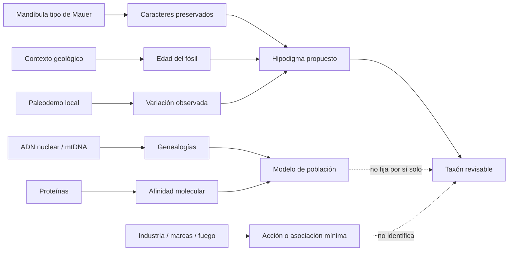

# Mapa 039 — De tipos y paleodemos a genealogías regionales

## Mapa general



## Ruta 1 — Del tipo a una especie posible

```text
mandíbula de Mauer
   ↓ descripción y nombre
holotipo
   ↓ caracteres mandibulares comparables
hipodigma mínimo
   ↓ añade fósiles con diagnóstico explícito
hipodigma ampliado
   ↓ prueba de variación y monofilia
especie condicionada
```

El cuello está entre el tipo mandibular y los cráneos que suelen ilustrarlo. No se preserva una región anatómica común suficiente para que el nombre salte automáticamente a Bodo, Kabwe, Petralona o Sima (`CLAIM-HEIDELBERGENSIS-TYPE-001`, `CLAIM-HEIDELBERGENSIS-MAUER-LIMIT-001`).

## Ruta 2 — De una señal de edad al fósil

```text
luminiscencia / ESR / U-series / polaridad
                ↓ calibración y modelo
edad de sedimento, diente o transición
                ↓ procedencia
edad del fósil
                ↓ muestreo
presencia local
                ≠ origen del linaje
```

Mauer combina relojes; Casablanca usa una transición magnética dentro de una secuencia; Kabwe requiere historia de incorporación de uranio. Los resultados numéricos no comparten los mismos supuestos (`CLAIM-HEIDELBERGENSIS-MAUER-AGE-001`, `CLAIM-CASABLANCA-773KA-2026-001`, `CLAIM-KABWE-AGE-001`).

## Ruta 3 — De Sima a un paleodemo

```text
restos de ≥28 individuos
       ↓ asociación deposicional
muestra local
       ↓ 17 cráneos + variación
mosaico morfológico
       ↓ comparación regional
paleodemo próximo a neandertales
       ≠ toda la especie europea
```

La fuerza de Sima es la repetición de individuos; su límite es que todos proceden del mismo sistema. La independencia individual es alta respecto de un fósil único, pero la independencia geográfica y tafonómica es baja (`CLAIM-SIMA-MORPH-MOSAIC-001`).

## Ruta 4 — Dos genealogías en la misma población

```text
fémur/diente → ADN dañado → autenticación
                         ├→ mtDNA → afinidad denisovana
                         └→ nuclear → afinidad neandertal

discordancia observada
   ↓ compara modelos
estructura / flujo / reemplazo mitocondrial
   ≠ hibridación concreta observada
```

Mitocondria y núcleo tienen tamaños efectivos y transmisión distintos. La discordancia de Sima no debe «resolverse» ignorando uno de los archivos (`CLAIM-SIMA-MTDNA-001`, `CLAIM-SIMA-NUCLEAR-001`, `CLAIM-SIMA-DISCORDANCE-001`).

## Ruta 5 — Del borde temporal al nodo

```text
TD6 / antecessor → proteoma → grupo hermano cercano ─┐
Casablanca → forma + 773 ka → rama africana basal ───┼→ vecindad del nodo
genomas posteriores → divergencia modelada ──────────┘
                                                    ≠ último ancestro fósil identificado
```

Las tres rutas limitan dónde y cuándo pudo existir una población ancestral. Ninguna identifica un espécimen como progenitor directo (`CLAIM-ANTECESSOR-PROTEOME-001`, `CLAIM-CASABLANCA-AFFINITY-001`, `CLAIM-HOMO-MIDDLE-ANCESTRY-LIMIT-001`).

## Ruta 6 — De África a estructura regional

```text
fósiles fechados por sitio
      ↓ morfometría comparable
distribuciones locales
      ↓ espacio + tiempo + modelo
estructura poblacional
      ↓ flujo y persistencia hipotéticos
metapoblación o varios linajes
```

El «último ancestro virtual» es una predicción geométrica bajo muestra y árbol. Es útil para comparar, pero no debe aparecer en una cronología como individuo descubierto (`CLAIM-AFRICA-MIDDLE-DIVERSITY-001`, `CLAIM-HOMO-MIDDLE-REGIONAL-001`).

## Ruta 7 — De una marca al comportamiento mínimo

```text
superficie de Bodo
   ↓ microscopía y experimento
marca antrópica probable
   ↓ localización y secuencia
descarnamiento intencional
   ↓ evidencia contextual adicional necesaria
consumo / rito / violencia / tratamiento
```

La cadena es fuerte hasta descarnamiento y débil al asignar motivo. Alternativas culturalmente diferentes producen trazas parecidas (`CLAIM-BODO-DEFLESHING-001`, `CLAIM-BODO-MOTIVE-LIMIT-001`).

## Ruta 8 — De una asociación arqueológica al fabricante

```text
bifaz / carbón / sedimento
       ↓ diagnóstico y contexto
industria / combustión local
       ↓ asociación independiente
fabricante candidato
       ↓ residuo o fósil inequívoco
atribución taxonómica
```

Aroeira demuestra coexistencia local de archivos, no autoría anatómica ni equivalencia cognitiva. El nombre de una industria no debe funcionar como nombre de una especie (`CLAIM-AROEIRA-TECH-LIMIT-001`, `CLAIM-HOMO-MIDDLE-TOOLS-LIMIT-001`).

## Ruta 9 — De Harbin a una población molecular

```text
cráneo → caracteres → H. longi propuesto

petroso → espectros → 95 proteínas → variantes denisovanas ─┐
cálculo → fragmentos → mtDNA → rama denisovana ─────────────┼→ individuo denisovano
                                                            └→ rango zoológico abierto
```

Proteoma y mtDNA son rutas moleculares distintas pero comparten individuo y comparadores. La convergencia revisa la clasificación morfológica; no obliga a una única decisión sobre género, especie o sinónimo (`CLAIM-HARBIN-MORPH-NAME-001`, `CLAIM-HARBIN-DENISOVAN-2025-001`).

## Nodos principales

| Nodo | Objeto | Transformación | Claim | Cuello de botella |
|---|---|---|---|---|
| `EVID-MAUER-TYPE-001` | mandíbula + contexto | tipo/edad → hipodigma | `CLAIM-HEIDELBERGENSIS-TYPE-001` | no hay cráneo tipo |
| `EVID-ANTECESSOR-PROTEOME-001` | esmalte | péptido → topología | `CLAIM-ANTECESSOR-PROTEOME-001` | resolución y ascendencia |
| `EVID-CASABLANCA-2026-001` | fósiles + polaridad | contexto/forma → rama | `CLAIM-CASABLANCA-AFFINITY-001` | matriz y nodo no observado |
| `EVID-SIMA-CHRONOLOGY-001` | sedimento/remanencia | reloj → paleodemo | `CLAIM-SIMA-AGE-001` | asociación y resolución |
| `EVID-SIMA-NUCLEAR-001` | huesos/dientes | ADN → genealogías | `CLAIM-SIMA-DISCORDANCE-001` | mecanismo demográfico |
| `EVID-BODO-CUTMARKS-001` | superficie craneal | marca → acción | `CLAIM-BODO-DEFLESHING-001` | motivo no observable |
| `EVID-KABWE-DIRECT-DATE-001` | cráneo | U-series/ESR → edad | `CLAIM-KABWE-AGE-001` | sistema abierto |
| `EVID-HARBIN-MOLECULAR-001` | petroso + cálculo | proteína/mtDNA → afinidad | `CLAIM-HARBIN-DENISOVAN-2025-001` | individuo y nomenclatura |

## Matriz de dependencias

| Resultado | Muestra | Reloj/contexto | Modelo compartido | Independencia real |
|---|---|---|---|---|
| edad del tipo | mandíbula + sedimentos | Mauer | transporte y sistema abierto | tres relojes; un contexto |
| rama neandertal temprana | 28 individuos | Sima | diagnóstico/árbol | varios individuos; un paleodemo |
| discordancia molecular | pocas muestras | Sima | referencias y daño | loci distintos; misma población |
| diversidad africana | múltiples cráneos | varios sitios | morfometría y taxonomía | buena geografía; cronología desigual |
| Harbin denisovano | un cráneo | edad mínima/procedencia indirecta | referencias denisovanas | proteína + mtDNA; un individuo |
| conducta técnica | artefactos/marcas | Aroeira/Bodo | tafonomía/tecnología | archivos distintos; autor abierto |

## Cuellos de botella

- Unir al tipo mandibular con fósiles que no preservan anatomía comparable.
- Separar categoría cronológica, grado morfológico, especie y paleodemo.
- Fechar el fósil y no sólo una muestra próxima.
- Polarizar caracteres sin confundir convergencia o retención ancestral.
- Comparar genealogías mitocondriales, nucleares y proteicas con muestreo mínimo.
- Trasladar diversidad local a estructura regional sin homogeneizar continentes.
- Inferir fabricante o motivo desde asociaciones y trazas.
- Aplicar reglas nomenclaturales sin sustituir la pregunta biológica.

## Falsadores transversales

- Nuevos fósiles asociados de Mauer que conecten mandíbula, cráneo y postcráneo.
- Moléculas adicionales que reubiquen los paleodemos europeos, africanos o asiáticos.
- Dataciones directas que alteren solapamientos centrales.
- Matrices independientes que estabilicen un hipodigma amplio o lo dividan consistentemente.
- Genomas africanos del intervalo que prueben número, flujo y continuidad de poblaciones.
- Contextos arqueológicos que identifiquen fabricante mediante asociación directa.

## Resultado operativo

El mapa no termina en un nombre ganador. Produce ocho resultados que deben conservarse separados: edad, tipo, hipodigma, paleodemo, morfología, genealogía, acción y nomenclatura. Sólo al declarar sus puentes puede evaluarse si `H. heidelbergensis` describe una especie, una convención regional o la historia de un problema.
