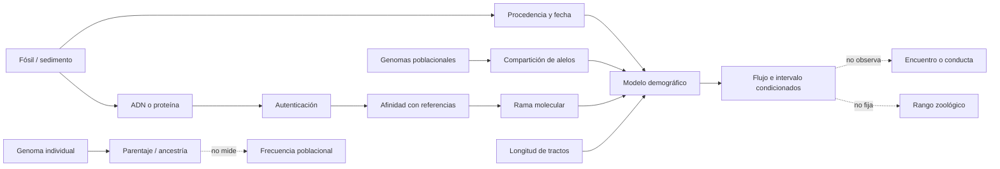

# Mapa 040 — De restos y moléculas a genealogías reticuladas

## Mapa general



## Ruta 1 — Neandertal fósil y neandertal genómico

```text
espécimen/contexto → anatomía comparada → hipodigma neandertal
         hueso → ADN auténtico → referencia neandertal

solapamiento contrastable
        ≠ identidad perfecta de categorías
```

Los dos usos de `neandertal` pueden corroborarse cuando coinciden en un individuo. La referencia de Altái o Vindija no representa toda la variación fósil y geográfica (`CLAIM-NEAND-OPERATIONAL-001`, `CLAIM-LATE-NEAND-STRUCTURE-001`).

## Ruta 2 — Una categoría denisovana nacida de moléculas

```text
falange Denisova → mtDNA inesperado
                 → nuclear → hermana de neandertales
                 → alta cobertura → comparador

Xiahe / Penghu / Harbin → proteína o ADN → afinidad
                                      ≠ una morfología universal
```

La categoría se extiende sólo cuando la biomolécula conecta el individuo con referencias. Parecido regional sin moléculas sigue siendo candidato (`CLAIM-DENISOVAN-OPERATIONAL-001`, `CLAIM-XIAHE-DENISOVAN-001`, `CLAIM-PENGHU-DENISOVAN-2025-001`, `CLAIM-HARBIN-DENISOVAN-2025-001`).

## Ruta 3 — De Denisova 11 a una hija F1

```text
fragmento → daño auténtico → genoma diploide
                         ├→ mitad neandertal + mtDNA neandertal
                         └→ mitad denisovana
                                  ↓
                         madre N + padre D
                                  ↓
                 tractos N extra en el padre
                                  ≠ frecuencia de contacto
```

La resolución individual es excepcional. La extrapolación demográfica es el cuello de botella (`CLAIM-DENISOVA11-F1-001`, `CLAIM-DENISOVA11-OLDER-FLOW-001`).

## Ruta 4 — De asimetría a mezcla

```text
alelos derivados compartidos
        ↓ estadística D / f
árbol simple rechazado
        ↓ compara estructura, flujo y errores
mezcla favorecida
        ↓ tractos y tiempo
episodio condicionado
```

Una `D` distinta de cero no entrega por sí sola dirección, fecha o porcentaje. Las series temporales y tractos largos añaden discriminación (`CLAIM-NEAND-GENOME-2010-001`, `CLAIM-ADMIXTURE-STRUCTURE-ADVERSARY-001`).

## Ruta 5 — Del bloque al reloj

```text
segmento arcaico → longitud genética
                 → recombinación por generación
                 → generaciones desde contacto
                 → edad de la muestra
                 → intervalo calendario
```

Oase y Bacho Kiro conservan segmentos de ancestros recientes. Iasi y Sümer combinan múltiples individuos para el episodio compartido. Los resultados tienen escala distinta (`CLAIM-OASE-RECENT-NEAND-001`, `CLAIM-BACHO-RECENT-NEAND-001`, `CLAIM-NEAND-ADMIXTURE-DATE-2024-001`).

## Ruta 6 — Del porcentaje actual a su significado limitado

```text
tractos detectados / genoma analizable
        ↓ referencia + filtro + población
fracción de ancestría retenida
        ↓ recombinación + deriva + selección + migración
distribución actual
        ≠ identidad total / cuerpo / número de ancestros
```

Cambiar denominador o referencia cambia la cifra. La selección hace que el presente no copie el episodio original (`CLAIM-ARCHAIC-PERCENT-LIMIT-001`, `CLAIM-NEAND-SELECTION-001`).

## Ruta 7 — De cueva a presencia, no a convivencia

```text
sedimento cuadriculado → OSL/modelo de capa
                      → mtDNA dañado
                      → linaje presente
                      → recurrencia local
                      ≠ grupo, cuerpo o industria asignados
```

Denisova y Baishiya ofrecen series, pero el ADN sedimentario puede desplazarse y no conserva identidad individual (`CLAIM-DENISOVA-CAVE-CHRONOLOGY-2025-001`, `CLAIM-BAISHIYA-DENISOVAN-001`).

## Ruta 8 — De proteína a afinidad

```text
esmalte/petroso → péptidos → daño/modificación
                          → variantes informativas
                          → afinidad molecular
                          ≠ genoma o taxón resuelto
```

Xiahe y Penghu muestran la potencia de la paleoproteómica. La edad de Penghu no hereda la fuerza de su identificación (`CLAIM-XIAHE-DENISOVAN-001`, `CLAIM-PENGHU-AGE-LIMIT-001`).

## Ruta 9 — Varias ancestrías denisovanas

```text
genomas de Oceanía/Asia
        ↓ tractos reference-free
conjuntos con afinidades distintas
        ↓ modelos de pulsos
≥2 poblaciones donantes diferenciadas
        ≠ lista completa de ramas
```

La referencia de Altái detecta unas contribuciones mejor que otras. Los donantes reales siguen sin genoma directo (`CLAIM-DENISOVAN-MELANESIAN-001`, `CLAIM-DENISOVAN-MULTIPULSE-001`).

## Ruta 10 — De introgresión a adaptación

```text
haplotipo EPAS1 → afinidad denisovana
               → frecuencia extrema
               → selección
               → asociación fisiológica
               ≠ ventaja universal o donante exacto
```

El origen del segmento y su aumento son inferencias relacionadas pero distintas (`CLAIM-EPAS1-DENISOVAN-001`, `CLAIM-ADAPTIVE-INTROGRESSION-LIMIT-001`).

## Nodos principales

| Nodo | Objeto | Transformación | Claim | Cuello de botella |
|---|---|---|---|---|
| `EVID-NEAND-DRAFT-2010-001` | 3 individuos | alelos → asimetría | `CLAIM-NEAND-GENOME-2010-001` | estructura/referencias |
| `EVID-NEAND-ADMIXTURE-2024-001` | 59 antiguos + actuales; Ranis/Zlatý | tractos → intervalo | `CLAIM-NEAND-ADMIXTURE-DATE-2024-001` | mapa/duración |
| `EVID-OASE-NEAND-001` | mandíbula/genoma | tractos largos → generaciones | `CLAIM-OASE-RECENT-NEAND-001` | individuo sin continuidad |
| `EVID-NEAND-SOCIAL-001` | 13 individuos | parentesco/diversidad → comunidad | `CLAIM-NEAND-SOCIAL-LOCAL-001` | extrapolación |
| `EVID-DENISOVA-CHRONOLOGY-001` | 963 sedimentos | OSL+mtDNA → recurrencia | `CLAIM-DENISOVA-CAVE-CHRONOLOGY-2025-001` | capa/agente |
| `EVID-PENGHU-PROTEOME-001` | mandíbula dragada | péptidos → afinidad/sexo | `CLAIM-PENGHU-DENISOVAN-2025-001` | edad |
| `EVID-DENISOVA11-GENOME-001` | fragmento óseo | genoma → parentaje | `CLAIM-DENISOVA11-F1-001` | frecuencia |
| `EVID-DENISOVAN-MODERN-001` | 5 639 + 161 genomas | tractos → donantes | `CLAIM-DENISOVAN-MULTIPULSE-001` | ramas no muestreadas |
| `EVID-EPAS1-001` | haplotipos tibetanos | afinidad+selección → adaptación | `CLAIM-EPAS1-DENISOVAN-001` | fuente/función |
| `EVID-STRUCTURE-ADVERSARY-001` | simulaciones | estructura → falsos pulsos | `CLAIM-ADMIXTURE-STRUCTURE-ADVERSARY-001` | aplicabilidad empírica |

## Matriz de escalas

| Resultado | Unidad | Qué puede decir | Qué no puede decir |
|---|---|---|---|
| tipo fósil | individuo/hipodigma | caracteres y nombre | genoma continental |
| mtDNA | línea materna | genealogía locus | especie completa |
| nuclear individual | individuo | parentaje/ancestría | frecuencia poblacional |
| tractos de cohorte | población/modelo | flujo, tiempo, selección | contexto social |
| sedimento | capa/localidad | presencia molecular | cuerpo/fabricante |
| proteína | regiones codificadas | afinidad/sexo limitado | demografía completa |
| porcentaje | genoma analizable | fracción retenida | identidad o mezcla inicial |

## Cuellos de botella

- Referencias neandertales y denisovanas escasas y geográficamente sesgadas.
- Diferenciar flujo, estructura ancestral y errores del detector.
- Traducir recombinación en calendario sin falsa precisión.
- Separar un individuo F1 de prevalencia poblacional.
- Asociar ADN sedimentario con capas sin asignar industrias automáticamente.
- Convertir proteínas en afinidad sin tratarlas como genoma.
- Conectar segmentos candidatos con funciones causales.
- Mantener taxonomía separada de compatibilidad reproductiva.

## Falsadores transversales

- Modelos estructurados que ajusten conjuntamente todos los observables sin flujo.
- Nuevas referencias que eliminen la asimetría o reasignen los tractos.
- Replicaciones moleculares que muestren contaminación o identificación peptídica errónea.
- Genomas directos asiáticos que contradigan las afinidades proteicas actuales.
- Series antiguas que no muestren el acortamiento esperado de segmentos.
- Fechas directas que rompan asociaciones entre fósil y capa.
- Ensayos funcionales que separen el haplotipo arcaico del fenotipo atribuido.

## Resultado operativo

El mapa produce cinco salidas y prohíbe fusionarlas: **individuo**, **linaje**, **parentaje**, **flujo poblacional** y **ancestría retenida**. La historia reticulada es sólida cuando varias escalas convergen; su detalle continúa condicionado por muestra y modelo.
