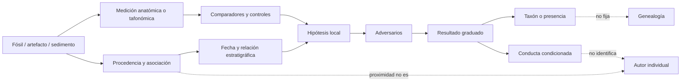

# Mapa 041 — Del fragmento al taxón y de la cámara a la conducta

## Mapa general



## Ruta 1 — Del fragmento al taxón

```text
pieza con procedencia → caracteres repetibles → comparadores
                    → combinación diagnóstica → hipodigma
                    → nombre revisable
                    ≠ población completa / especie biológica observada
```

`H. floresiensis`, `H. luzonensis` y `H. naledi` se sostienen por combinaciones y repetición entre restos, no por un carácter aislado (`CLAIM-TAXONOMY-SPECIES-LIMIT-001`).

## Ruta 2 — De estrato a tiempo

```text
objeto ↔ unidad estratigráfica → relación con tefra/espeleotema
                             → reloj físico y modelo
                             → intervalo
                             ≠ fecha exacta de conducta
```

La inconformidad de Liang Bua, la ignimbrita de Wolo Sege y el modelo compuesto de Rising Star producen límites de distinto tipo (`CLAIM-FLORES-CHRONOLOGY-2016-001`, `CLAIM-FLORES-WOLO-SEGE-001`, `CLAIM-NALEDI-DATE-001`).

## Ruta 3 — De Wolo Sege y Kalinga a presencia sin nombre

```text
herramienta / marcas de carnicería → manufactura o acción hominina
                                  → presencia en fecha y lugar
                                  ≠ fabricante taxonómico
                                  ≠ continuidad hasta fósil posterior
```

Flores antes de `1.02 Ma` y Luzón hacia `709 ± 68 ka` prueban dispersión insular, no que los fabricantes fueran las especies tardías conocidas (`CLAIM-LUZON-KALINGA-001`, `CLAIM-KALINGA-CALLAO-LINK-OPEN-001`).

## Ruta 4 — De Mata Menge a continuidad condicionada

```text
mandíbula + dientes + húmero (~700 ka)
        → tamaño y caracteres
        → semejanza con Liang Bua
        → linaje insular compatible con erectus reducido
        ≠ ancestro directo demostrado
```

El húmero de 2024 refuerza pequeñez antigua; la discontinuidad temporal y la homoplasia dejan la genealogía abierta (`CLAIM-MATA-MENGE-AFFINITY-001`, `CLAIM-MATA-MENGE-BODY-2024-001`, `CLAIM-FLORES-ORIGIN-OPEN-001`).

## Ruta 5 — De anatomía a función, no a artefacto

```text
muñeca / mano / pie → geometría y cargas → capacidad funcional
                                      → repertorio compatible
                                      ≠ herramienta fabricada
                                      ≠ conducta observada
```

La mano de `H. naledi` y la muñeca/pie de `H. floresiensis` informan locomoción y manipulación; sin artefacto asociado no identifican tecnología (`CLAIM-FLORES-FOOT-WRIST-001`, `CLAIM-NALEDI-TOOLS-LIMIT-001`).

## Ruta 6 — De fauna modificada a estrategia de subsistencia

```text
surco microscópico → comparación experimental → corte
                  → acceso a carcasa
                  → orden de agentes + partes
                  → carroñeo favorecido
                  ≠ caza coordinada excluida universalmente
```

Liang Bua prueba acceso de homininos a `Stegodon`; la estrategia es una inferencia tafonómica graduada (`CLAIM-FLORES-BEHAVIOR-2026-001`).

## Ruta 7 — De acumulación profunda a entierro

```text
cuerpos relativamente completos → exclusión de agua/carnívoros
                                → concentración y articulación
                                → fosa/relleno propuestos
                                → depósito deliberado condicionado
                                → entierro cultural (controvertido)
```

Cada flecha necesita microestratigrafía. Una acumulación inusual no identifica por descarte la intención (`CLAIM-NALEDI-DEPOSITION-001`, `CLAIM-NALEDI-BURIAL-2025-001`).

## Ruta 8 — De línea de pared a autor

```text
línea → microestrías/intersecciones → alteración artificial probable
                                     → fecha directa (ausente)
                                     → agente (ausente)
proximidad a naledi ──────────────────┘ ≠ autoría
```

La artificialidad de algunas marcas, su edad y su autor son tres resultados distintos (`CLAIM-NALEDI-ENGRAVINGS-2025-001`).

## Ruta 9 — De clima a desaparición local

```text
estalagmita + esmalte → lluvia/estacionalidad
                     → aridificación 76–61 ka
fósiles → última presencia ~61 ka
convergencia temporal → presión ecológica plausible
                     ≠ causa única de extinción
```

La coincidencia genera una hipótesis causal contrastable, no un mecanismo observado (`CLAIM-FLORES-CLIMATE-2025-001`).

## Ruta 10 — De morfología a genealogía sin ADN

```text
matriz de caracteres → codificación y ausencias → árbol/modelo
                                          ↘ homoplasia insular
resultado → afinidad condicionada
          ≠ ancestro directo / flujo génico / taxón definitivo
```

Los árboles discordantes de Flores, Luzón y Rising Star hacen de la homoplasia un adversario central (`CLAIM-FLORES-ORIGIN-OPEN-001`, `CLAIM-LUZON-PHYLOGENY-2026-001`, `CLAIM-NALEDI-PHYLOGENY-001`).

## Nodos principales

| Nodo | Objeto | Transformación | Claim | Cuello de botella |
|---|---|---|---|---|
| `EVID-FLORES-TYPE-001` | LB1 + hipodigma | anatomía → taxón | `CLAIM-FLORES-TAXON-001` | patología/variación |
| `EVID-FLORES-CHRONOLOGY-001` | capas Liang Bua | estratigrafía+relojes → intervalo | `CLAIM-FLORES-CHRONOLOGY-2016-001` | asociación, no extinción |
| `EVID-MATA-MENGE-HUMERUS-001` | húmero/dientes | tamaño+comparación → cuerpo pequeño | `CLAIM-MATA-MENGE-BODY-2024-001` | estimación/incompletitud |
| `EVID-FLORES-BEHAVIOR-001` | fauna modificada | tafonomía → acceso/estrategia | `CLAIM-FLORES-BEHAVIOR-2026-001` | agente y selección |
| `EVID-FLORES-CLIMATE-001` | espeleotema/esmalte | proxies → aridificación | `CLAIM-FLORES-CLIMATE-2025-001` | correlación causal |
| `EVID-LUZON-TYPE-001` | 13 elementos | combinación → taxón | `CLAIM-LUZON-TAXON-001` | muestra pequeña |
| `EVID-KALINGA-001` | rinoceronte + 57 piezas | marcas+fechas → presencia | `CLAIM-LUZON-KALINGA-001` | fabricante |
| `EVID-NALEDI-TYPE-001` | >1,500 especímenes | anatomía → taxón | `CLAIM-NALEDI-TAXON-001` | localidad única |
| `EVID-NALEDI-DATE-001` | dientes/sedimentos/espeleotemas | relojes → 335–236 ka | `CLAIM-NALEDI-DATE-001` | modelos combinados |
| `EVID-NALEDI-BURIAL-001` | tres concentraciones | geometría+tafonomía → entierro | `CLAIM-NALEDI-BURIAL-2025-001` | fosa/relleno/replicación |
| `EVID-NALEDI-BURIAL-ADVERSARY-001` | sedimento reanalizado | geoquímica → solapamiento | `CLAIM-NALEDI-BURIAL-2025-001` | muestreo publicado |
| `EVID-NALEDI-ENGRAVINGS-001` | panel con líneas | microtrazas → artificialidad | `CLAIM-NALEDI-ENGRAVINGS-2025-001` | fecha/autor |

## Matriz de escalas

| Resultado | Unidad | Qué puede decir | Qué no puede decir |
|---|---|---|---|
| carácter | pieza | forma medible | especie por sí solo |
| hipodigma | restos asignados | variación observada | población censada |
| fecha directa | objeto/reloj | intervalo del objeto | toda la capa sin contexto |
| fecha estratigráfica | unidad | máximo, mínimo o modelo | instante de conducta |
| herramienta | pieza | manufactura hominina | nombre del fabricante |
| tafonomía | conjunto | agentes/procesos favorecidos | intención mental directa |
| cladística | matriz/modelo | afinidad condicionada | ancestro observado |
| genoma moderno negativo | población muestreada | señal retenida no detectada | ausencia histórica de contacto |

## Cuellos de botella

- ADN antiguo ausente para los tres taxones.
- Hipodigmas pequeños o concentrados en una sola localidad.
- Intervalos largos entre industria antigua y fósiles diagnósticos.
- Convergencia y homoplasia bajo insularidad.
- Procedencia compleja en cuevas y superficies erosionadas.
- Capacidad anatómica confundida con acción realizada.
- Acumulación excepcional confundida con intención por descarte.
- Marcas sin fecha ni autor directo.

## Falsadores transversales

- ADN o proteínas antiguas que contradigan las afinidades morfológicas.
- Nuevos cuerpos intermedios que rompan la continuidad propuesta entre Mata Menge y Liang Bua.
- Refechado directo que desasocie fósiles y unidades actuales.
- Experimentos tafonómicos que reproduzcan marcas o acumulaciones sin conducta hominina.
- Excavaciones independientes que no recuperen límites, relleno o articulación de las fosas propuestas.
- Datación de las marcas de Rising Star fuera del intervalo de `H. naledi`.
- Genomas antiguos insulares que muestren o excluyan introgresión.

## Resultado operativo

El mapa produce cuatro salidas que no deben fusionarse: **taxón anatómico**, **presencia hominina**, **capacidad funcional** y **conducta situada**. La diversidad tardía es robusta cuando varios objetos convergen; genealogía, autoría e intención permanecen abiertas allí donde faltan biomoléculas, asociación o microestratigrafía.
