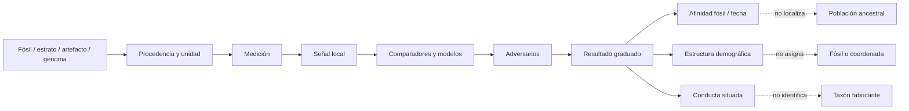

# Mapa 042 — Del fósil al clado y del genoma a la estructura

## Mapa general



## Ruta 1 — Del fragmento al clado

```text
fragmento con procedencia → anatomía y deformación → caracteres
                           → comparadores y alometría
                           → mosaico repetible
                           → afinidad sapiens condicionada
                           ≠ primer individuo / ancestro directo
```

Jebel Irhoud apoya una etapa temprana del clado por una combinación, no por «modernidad» total (`CLAIM-JEBEL-IRHOUD-TAXON-001`, `CLAIM-SAPIENS-MOSAIC-001`).

## Ruta 2 — Del sílex calentado a un episodio

```text
sílex excavado → paleodosis + dosis anual → TL 315 ± 34 ka
             → última exposición intensa al calor
             → asociación con unidad fosilífera
             → episodio local
             ≠ edad directa de cada hueso
```

La US-ESR dental aporta otro reloj, pero ambos comparten la estratigrafía de Irhoud (`CLAIM-JEBEL-IRHOUD-DATE-001`).

## Ruta 3 — De una toba superior a un mínimo

```text
KHS Tuff → composición → correlación con Shala
         → 40Ar/39Ar 233 ± 22 ka
         → superposición sobre Omo I
         → fósil ≥233 ± 22 ka
         ≠ muerte en 233 ka
```

La dirección estratigráfica es parte del resultado: una capa superior produce un mínimo (`CLAIM-OMO-I-MINIMUM-AGE-001`).

## Ruta 4 — De varios sitios a distribución, no red

```text
Irhoud + Omo + Herto + Florisbad → presencia regional discontinua
                                 → diversidad morfológica
                                 → origen africano distribuido
                                 ≠ contemporaneidad
                                 ≠ flujo entre sitios
```

Un mapa de puntos no mide conectividad (`CLAIM-AFRICA-FOSSIL-DISTRIBUTION-001`, `CLAIM-SAPIENS-SINGLE-CRADLE-LIMIT-001`).

## Ruta 5 — Del mtDNA a una TMRCA

```text
mtDNA actual → variantes → árbol + reloj
            → ancestro común del locus
            → una línea materna superviviente
            ≠ única mujer viva
            ≠ origen de población/especie
```

La deriva elimina linajes aun cuando sus portadores dejen descendencia nuclear (`CLAIM-MTDNA-EVE-LIMIT-001`, `CLAIM-COALESCENCE-SPLIT-LIMIT-001`).

## Ruta 6 — De ligamiento a tallo débil

```text
genomas actuales → LD + diversidad → modelos competidores
                 → validación con estadísticas no ajustadas
                 → tallos débilmente diferenciados con flujo
                 ≠ dos especies / dos regiones identificadas
```

El modelo 2023 favorece conectividad prolongada y divergencias recientes entre poblaciones actuales (`CLAIM-SAPIENS-WEAK-STEM-2023-001`, `CLAIM-SAPIENS-WEAK-STEM-GEOGRAPHY-LIMIT-001`).

## Ruta 7 — De coalescencias vecinas a estructura profunda

```text
heterocigosidad contigua → HMM/SMC → transiciones coalescentes
                         → pulso estructurado mejora ajuste
                         → separación ~1.5 Ma / mezcla ~300 ka
                         ≠ historia única fuera del modelo
```

`cobraa` distingue su pulso de panmixia con tamaño cambiante, pero no de toda combinación posible de flujo y selección (`CLAIM-SAPIENS-DEEP-STRUCTURE-2025-001`, `CLAIM-SAPIENS-DEMOGRAPHIC-IDENTIFIABILITY-001`).

## Ruta 8 — De señal sin referencia a población fantasma

```text
espectro de frecuencia + tramos → simulaciones/ABC + detector
                               → componente divergente favorecido
                               → introgresión fantasma bajo modelo
                               ≠ fósil o especie descubiertos
```

La estructura ancestral es el adversario principal de esta ruta (`CLAIM-SAPIENS-ARCHAIC-GHOST-OPEN-001`).

## Ruta 9 — Del ADN holoceno al límite temporal

```text
genoma antiguo 10.2–0.15 ka → autenticación + cobertura
                            → diversidad antes de mezclas recientes
                            → continuidad regional holocena
                            ≠ genoma del origen ~300 ka
```

El ADN antiguo mejora las referencias sin cerrar el intervalo profundo (`CLAIM-SOUTH-AFRICA-GENOMES-2026-001`, `CLAIM-AFRICAN-ADNA-TIME-LIMIT-001`).

## Ruta 10 — De obsidiana a conectividad social condicionada

```text
obsidiana → composición → fuente ≥25–50 km
          → transporte directo o en cadena
          → movilidad/intercambio
          ≠ apareamiento / flujo génico / taxón
```

Olorgesailie apoya redes técnicas sin convertirlas en red genética (`CLAIM-OLORGESAILIE-NETWORKS-001`, `CLAIM-OLORGESAILIE-GENEFLOW-LIMIT-001`).

## Ruta 11 — De MSA a conducta, no especie

```text
núcleos/puntas/pigmento → cadena operativa → práctica local
                       → comparación regional → mosaico conductual
                       ≠ marcador biológico sapiens
```

La emergencia cercana a `230 ± 18 ka` en Amanzi no coincide con todos los registros africanos (`CLAIM-AMANZI-REGIONAL-2026-001`, `CLAIM-MSA-NOT-TAXONOMIC-001`).

## Nodos principales

| Nodo | Objeto | Transformación | Claim | Cuello de botella |
|---|---|---|---|---|
| `EVID-JEBEL-IRHOUD-MORPH-001` | fósiles Irhoud | morfometría → afinidad | `CLAIM-JEBEL-IRHOUD-TAXON-001` | definición/comparadores |
| `EVID-JEBEL-IRHOUD-DATE-001` | sílex + diente | TL/US-ESR → intervalo | `CLAIM-JEBEL-IRHOUD-DATE-001` | asociación/historia U |
| `EVID-OMO-I-AGE-001` | KHS Tuff | correlación+Ar/Ar → mínimo | `CLAIM-OMO-I-MINIMUM-AGE-001` | unicidad/retrabajo |
| `EVID-HERTO-001` | fósiles/contexto | anatomía+estrato → población | `CLAIM-HERTO-CONTEXT-001` | rango/taxonomía |
| `EVID-FLORISBAD-001` | diente/cráneo | ESR → edad atribuida | `CLAIM-FLORISBAD-AGE-001` | asociación/dosis |
| `EVID-AFRICA-MORPH-DIVERSITY-001` | fósiles africanos | GM/modelo → diversidad | `CLAIM-SAPIENS-MOSAIC-001` | muestra/vLCA virtual |
| `EVID-WEAK-STEM-001` | genomas actuales | LD/diversidad → tallos | `CLAIM-SAPIENS-WEAK-STEM-2023-001` | clase de modelos |
| `EVID-DEEP-STRUCTURE-COBRAA-001` | genomas actuales | SMC/HMM → pulso | `CLAIM-SAPIENS-DEEP-STRUCTURE-2025-001` | supuestos fuertes |
| `EVID-GHOST-ARCHAIC-001` | genomas occidentales | CSFS/ABC → fantasma | `CLAIM-SAPIENS-ARCHAIC-GHOST-OPEN-001` | donante sin referencia |
| `EVID-SOUTH-AFRICA-ANCIENT-GENOMES-001` | 28 genomas | autenticación/PCoA → diversidad | `CLAIM-SOUTH-AFRICA-GENOMES-2026-001` | todos holocenos |
| `EVID-MTDNA-GENEALOGY-001` | mtDNA | árbol/reloj → TMRCA | `CLAIM-MTDNA-EVE-LIMIT-001` | un locus |
| `EVID-OLORGESAILIE-MSA-001` | industria/pigmento/obsidiana | tecnología/procedencia → red | `CLAIM-OLORGESAILIE-NETWORKS-001` | autor/flujo genético |
| `EVID-AMANZI-MSA-001` | secuencia lítica | estratigrafía/fechas → transición | `CLAIM-AMANZI-REGIONAL-2026-001` | trayectoria local |

## Matriz de escalas

| Resultado | Unidad | Qué puede decir | Qué no puede decir |
|---|---|---|---|
| rasgo | fósil | forma preservada | población completa |
| edad directa/modelada | material | intervalo del objeto | toda la especie |
| mínimo estratigráfico | relación de capas | fósil anterior a evento | edad exacta |
| afinidad taxonómica | hipodigma/comparadores | pertenencia favorecida | ancestro directo |
| TMRCA | locus | genealogía de copias | fecha de especiación |
| divergencia modelada | poblaciones/modelo | historia compatible | separación observada |
| estructura | tasas de apareamiento/flujo | diferenciación conectada | especies o regiones fijas |
| procedencia lítica | artefacto/fuente | transporte | genes o fabricante |
| tecnología | conjunto | práctica regional | taxón exclusivo |

## Cuellos de botella

- Ausencia de ADN africano de `~300–200 ka`.
- Muestreo fósil pobre en África central y occidental.
- Definiciones taxonómicas cambiantes para fósiles mosaico.
- Fechas indirectas que comparten asociación estratigráfica.
- Etiquetas actuales proyectadas sobre geografías antiguas.
- Señales genómicas compatibles con más de una historia.
- Tasas de mutación, recombinación y generación inciertas.
- Convergencia tecnológica y fabricante ausente.

## Falsadores transversales

- Genomas pleistocenos africanos que favorezcan panmixia frente a todos los modelos estructurados.
- Fósiles bien fechados que produzcan un gradiente inequívoco desde una región.
- Refechados que rompan la asociación de Irhoud u Omo.
- Un genoma donante para la población fantasma.
- Estadísticas no usadas que separen flujo continuo de pulso profundo.
- Cuerpos diagnósticos repetidamente asociados a una MSA exclusiva.
- Nuevas regiones que reviertan el patrón norte–este–sur actual.

## Resultado operativo

El mapa produce cinco salidas que no deben fusionarse: **afinidad fósil**, **edad local**, **distribución africana**, **estructura demográfica** y **conducta situada**. La convergencia sostiene origen africano; el puente hacia una región fundadora o una historia poblacional exacta permanece condicionado.
