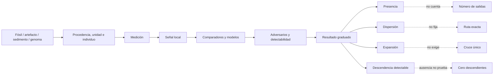

# Mapa 043 — De presencia fuera de África a descendencia detectable

## Mapa general



## Ruta 1 — Del fragmento a presencia

```text
fragmento con procedencia → anatomía → taxón condicionado
                         → reloj corporal/contextual
                         → presencia mínima
                         ≠ salida contada
                         ≠ continuidad
```

Misliya y Al Wusta entregan presencia; Apidima añade un cuello de botella de reconstrucción (`CLAIM-MISLIYA-PRESENCE-001`, `CLAIM-AL-WUSTA-PRESENCE-001`, `CLAIM-APIDIMA-EARLY-OPEN-001`).

## Ruta 2 — De luminiscencia a ocupación

```text
granos minerales → paleodosis + dosis anual → última exposición
                → modelo de depósito → edad de sedimento
                → asociación con cuerpo/artefacto
                → ocupación condicionada
                ≠ fecha directa del viaje
```

Tam Pà Ling, Lida Ajer y Madjedbebe heredan la integridad estratigráfica (`CLAIM-TAM-PA-LING-PRESENCE-001`, `CLAIM-LIDA-AJER-PRESENCE-001`, `CLAIM-SAHUL-MINIMUM-LIMIT-001`).

## Ruta 3 — De varias presencias a varias dispersiones

```text
sitios tempranos separados → cronologías y regiones
                           → rango ampliado repetidamente
                           → múltiples dispersiones
                           ≠ un episodio por sitio
                           ≠ total de cruces
```

El resultado cualitativo es B; el número exacto sigue abierto (`CLAIM-OOA-MULTIPLE-DISPERSALS-001`, `CLAIM-OOA-COUNT-LIMIT-001`).

## Ruta 4 — De diversidad actual a expansión mayor

```text
genomas actuales → variantes + LD → modelos demográficos
                 → cuello/separación/flujo
                 → expansión ancestral ~70–50 ka
                 ≠ caravana / día / corredor único
```

El modelo recupera ascendencia mayoritaria, no movimientos individuales (`CLAIM-OOA-MAJOR-ANCESTRY-001`).

## Ruta 5 — De tramos neandertales a reloj compartido

```text
segmentos arcaicos → referencia + longitud → recombinación
                   → mezcla ~50.5–43.5 / 49–45 ka
                   → fase ancestral conectada
                   ≠ fecha de salida
```

Pulsos adicionales en Oase y Bacho Kiro no invalidan la marca compartida (`CLAIM-OOA-NEAND-CLOCK-001`).

## Ruta 6 — De un genoma antiguo a una rama

```text
individuo antiguo → autenticidad + afinidad → posición relativa
                  → aporte posterior detectable/no detectable
                  → rama temprana
                  ≠ destino de toda población
```

Ranis/Zlatý kůň, Ust’-Ishim, Oase, Bacho Kiro y Tianyuan no forman una sucesión lineal (`CLAIM-EARLY-EURASIAN-LINEAGES-001`).

## Ruta 7 — De ausencia de señal a límite

```text
sin afinidad posterior detectable → referencias + umbral + modelo
                                  → aporte no resuelto o pequeño
                                  ≠ ausencia de reproducción
                                  ≠ cero descendientes históricos
```

La detectabilidad es propiedad del análisis además de la historia (`CLAIM-DETECTABILITY-NOT-ZERO-DESCENT-001`).

## Ruta 8 — De genomas papúes a pulso temprano

```text
exceso de afinidad → grafo/simulaciones → componente temprano
                   → ~2 % bajo un modelo
                   ↔ estructura/mezcla alternativa
                   ≠ ruta observada
```

Malaspinas y Pagani representan modelos rivales auditables (`CLAIM-PAPUAN-EARLY-PULSE-OPEN-001`).

## Ruta 9 — De paleoclima a corredor posible

```text
paleoclima + topografía → idoneidad → ventana/hub plausible
                        → predicción arqueológica
                        ≠ presencia
                        ≠ dirección
```

La meseta persa es una localización modelada (`CLAIM-PERSIAN-HUB-OPEN-001`).

## Ruta 10 — De sitios africanos a expansión de nicho

```text
sitios + biomas simulados → distribución de nicho → amplitud temporal
                          → expansión ~70–50 ka
                          → mecanismo facilitador plausible
                          ≠ causa única / población identificada
```

Dos simulaciones paleoclimáticas fortalecen el patrón, no la causalidad (`CLAIM-AFRICAN-NICHE-EXPANSION-001`).

## Nodos principales

| Nodo | Objeto | Transformación | Claim | Cuello de botella |
|---|---|---|---|---|
| `EVID-MISLIYA-001` | maxilar/contexto | anatomía+relojes → presencia | `CLAIM-MISLIYA-PRESENCE-001` | asociación y taxón |
| `EVID-APIDIMA-001` | bóveda parcial | reconstrucción+U-series → propuesta | `CLAIM-APIDIMA-EARLY-OPEN-001` | fragmentación/contexto |
| `EVID-AL-WUSTA-001` | falange/paleolago | morfología+edad → presencia | `CLAIM-AL-WUSTA-PRESENCE-001` | comparadores/intervalo |
| `EVID-TAM-PA-LING-001` | restos/secuencia | varios relojes → presencia | `CLAIM-TAM-PA-LING-PRESENCE-001` | depósito/ADN ausente |
| `EVID-LIDA-AJER-001` | dientes/cueva | taxón+cronología → presencia | `CLAIM-LIDA-AJER-PRESENCE-001` | asociación |
| `EVID-SAHUL-EARLY-001` | artefactos/sedimento | OSL+estrato → ocupación | `CLAIM-SAHUL-MINIMUM-LIMIT-001` | integridad/blanqueo |
| `EVID-OOA-GENOMIC-MAJOR-001` | genomas actuales | LD/coalescencia → expansión | `CLAIM-OOA-MAJOR-ANCESTRY-001` | modelo/tasas |
| `EVID-NEAND-ADMIXTURE-2024-001` | tractos arcaicos | recombinación → reloj | `CLAIM-OOA-NEAND-CLOCK-001` | mapa/selección |
| `EVID-RANIS-ZLATY-CONTINUITY-001` | genomas tempranos | afinidad/modelo → rama | `CLAIM-EARLY-EURASIAN-LINEAGES-001` | muestra pequeña |
| `EVID-EURASIAN-EARLY-GENOMES-001` | cinco individuos/conjuntos | afinidades → destinos | `CLAIM-EARLY-EURASIAN-LINEAGES-001` | muestreo espaciotemporal |
| `EVID-PAPUAN-DISPERSAL-MODELS-001` | genomas modernos | grafos → pulsos rivales | `CLAIM-PAPUAN-EARLY-PULSE-OPEN-001` | identificabilidad |
| `EVID-PERSIAN-HUB-001` | genomas+paleoclima | proxies/modelo → hub | `CLAIM-PERSIAN-HUB-OPEN-001` | geografía indirecta |
| `EVID-AFRICAN-NICHE-001` | sitios+biomas | SDM → amplitud | `CLAIM-AFRICAN-NICHE-EXPANSION-001` | muestreo/causa |

## Cuellos de botella decisivos

1. **Objeto fechado:** cuerpo, sedimento, artefacto y mezcla no comparten reloj.
2. **Unidad contada:** sitio, fase, población, pulso y cruce no son intercambiables.
3. **Taxón:** un fragmento puede no discriminar sapiens de variación regional.
4. **Asociación:** una edad llega al cuerpo o artefacto mediante estratigrafía.
5. **Preservación:** trópicos y antigüedad borran ADN de forma desigual.
6. **Modelo:** estructura y pulsos pueden producir señales parecidas.
7. **Detectabilidad:** ausencia de señal depende de muestras y umbral.
8. **Geografía:** idoneidad y afinidad proxy no localizan una población.

## Dependencias compartidas

- Misliya, Al Wusta y Apidima comparten comparadores anatómicos, pero no procedencia ni todos los relojes.
- Los genomas antiguos reutilizan referencias y mapas de recombinación; cambiar de individuo no elimina esa dependencia.
- Iasi y Sümer convergen con cohortes distintas, pero ambos modelan segmentos neandertales.
- Malaspinas y Pagani usan parte del mismo mundo genómico actual; la diferencia mide modelos, no experimentos totalmente independientes.
- Vallini y Hallett reutilizan simulaciones paleoclimáticas y un registro arqueológico sesgado.

## Falsadores prioritarios

- ADN o proteína autenticados de Misliya, Al Wusta, Tam Pà Ling o sitios equivalentes;
- genomas `80–45 ka` de África nororiental, Arabia, Levante, Irán y sur de Asia;
- nuevas dataciones ciegas y micromorfología de depósitos tempranos de Sahul;
- simulaciones que comparen pulsos tempranos con estructura continua y selección;
- fósiles en corredores predichos por el hub persa o alternativas rivales;
- reconstrucciones independientes de Apidima con sensibilidad a deformación y comparadores.

## Regla de lectura

Cada flecha debe leerse como «bajo estos supuestos». El mapa no representa continentes, fronteras, itinerarios ni ancestros directos. Su función es impedir que una presencia se convierta en salida contada o que una ausencia genómica se convierta en ausencia histórica.
