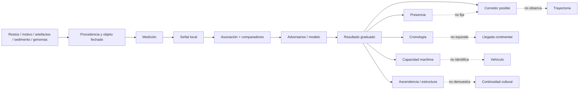

# Mapa 044 — De presencia local a poblamiento de Asia y Sahul

## Mapa general



## Ruta 1 — De cueva a presencia

```text
resto humano → anatomía/taxón → reloj del cuerpo o contexto
             → asociación estratigráfica → presencia local
             ≠ corredor ≠ continuidad
```

Tam Pà Ling y Lida Ajer conservan distinta fuerza de procedencia (`CLAIM-TAM-PA-LING-PRESENCE-001`, `CLAIM-LIDA-AJER-PRESENCE-001`).

## Ruta 2 — De costra a mínimo del motivo

```text
calcita sobre pigmento → U/Th → edad de calcita
                      → motivo anterior a 67.8 ka
                      ≠ fecha directa del pigmento
                      ≠ autor observado
```

La posición microestratigráfica da la dirección del límite; contexto y comparación sostienen taxón con menor confianza (`CLAIM-SULAWESI-ART-MINIMUM-001`).

## Ruta 3 — De espeleotema a una asociación que puede fallar

```text
edad de espeleotema/sedimento + diente próximo
→ hipótesis de asociación
↔ ADN o fecha directa del diente
→ confirmar / revisar cronología
```

Fuyan enseña que proximidad no transfiere edad automáticamente (`CLAIM-FUYAN-CHRONOLOGY-REVISION-001`).

## Ruta 4 — De bathimetría a cruce necesario

```text
Sunda | canales de Wallacea | Sahul
→ ninguna conexión terrestre completa
→ uno o más cruces de agua necesarios
→ capacidad marítima mínima
≠ bote / vela / intención individual
```

La geografía recibe A; el medio técnico, D (`CLAIM-WALLACEA-WATER-CROSSING-001`, `CLAIM-SAHUL-MARITIME-CAPACITY-001`).

## Ruta 5 — De deriva simulada a capacidad

```text
corriente + viento + salida + deriva/control
→ probabilidad de alcanzar isla
→ azar puro bajo / control mínimo más viable
→ travesías probablemente coordinadas
≠ navegación observada
```

La salida hereda desempeño supuesto y paleocorrientes (`CLAIM-SAHUL-MARITIME-CAPACITY-001`).

## Ruta 6 — De coste mínimo a corredor

```text
paleotopografía + visibilidad + corrientes + coste
→ caminos comparables
→ norte/mixto favorecido bajo el modelo
→ predicción arqueológica
≠ ruta realizada
```

Kealy 2019 y Borreggine 2026 son familias modeladas, no registros de pasos (`CLAIM-ASIA-SAHUL-ROUTES-OPEN-001`).

## Ruta 7 — De sedimento estéril a ausencia local

```text
sedimento acumulado 59–54 ka
+ micromorfología sin combustión/talla
→ ausencia de ocupación detectada en Laili
→ adversa estación meridional temprana simple
≠ ausencia en Timor / Wallacea
```

La extrapolación geográfica pierde confianza (`CLAIM-LAILI-LOCAL-ABSENCE-001`).

## Ruta 8 — De OSL y artefactos a Madjedbebe

```text
granos OSL + artefactos + coordenadas/refits
→ asociación con ~65 ka
↔ blanqueo / bioturbación / movimiento vertical
→ ocupación condicionada
```

El adversario altera la asociación, no la existencia de artefactos (`CLAIM-SAHUL-MINIMUM-LIMIT-001`).

## Ruta 9 — De varios sitios a ventana continental

```text
Madjedbebe condicionado + Niah + Ivane + contextos regionales
→ Sahul poblado con firmeza ~50–45 ka
→ quizá antes bajo Madjedbebe
≠ primer desembarco exacto
```

La síntesis no promedia fechas incompatibles (`CLAIM-SAHUL-ARRIVAL-WINDOW-001`).

## Ruta 10 — De parámetros a fundadores viables

```text
mortalidad + fecundidad + estructura de edad + productividad
→ simulación estocástica
→ 1,300–1,550 o flujos ≥130 durante siglos
→ condición de viabilidad bajo modelo
≠ censo arqueológico
```

El intervalo es C-MOD (`CLAIM-SAHUL-FOUNDING-SIZE-MODEL-001`).

## Ruta 11 — De genomas actuales a divergencia

```text
variantes + LD + referencias
→ topología + ABC/coalescencia
→ separación papú–australiana modelada
→ 25–40 ka o ~47 ka [27–64]
≠ fecha de llegada
```

El solapamiento es compatible con modelos diferentes (`CLAIM-SAHUL-GENETIC-DIVERGENCE-001`).

## Ruta 12 — De estructura genética a continuidad limitada

```text
afinidad geográfica + IBD/FST + mitogenomas
→ estructura regional profunda
→ persistencia biológica parcial
≠ identidad cultural/lingüística inmutable
```

La escala cultural requiere otros archivos (`CLAIM-SAHUL-REGIONAL-STRUCTURE-001`).

## Ruta 13 — De tramos arcaicos a mezcla denisovana

```text
alelos/tramos denisovanos → referencias + grafo
→ múltiples ancestrías divergentes
→ historia de mezcla compleja
≠ fósil donante / lugar / fecha exacta
```

La geografía sigue abierta (`CLAIM-DENISOVAN-WALLACEA-OPEN-001`).

## Matriz de nodos

| Nodo | Objeto | Transformación | Resultado | Cuello de botella |
|---|---|---|---|---|
| `EVID-TAM-PA-LING-001` | restos/secuencia | varios relojes → presencia | `CLAIM-TAM-PA-LING-PRESENCE-001` | dinámica de cueva |
| `EVID-LIDA-AJER-001` | dos dientes/contexto | morfología+relojes | `CLAIM-LIDA-AJER-PRESENCE-001` | colección/asociación |
| `EVID-FUYAN-REDATING-001` | dientes/espeleotemas | aDNA+multimétodo | `CLAIM-FUYAN-CHRONOLOGY-REVISION-001` | piezas/sitios muestreados |
| `EVID-MUNA-ART-001` | calcita sobre motivo | LA-U-series → mínimo | `CLAIM-SULAWESI-ART-MINIMUM-001` | sistema/autoría |
| `EVID-WALLACEA-CROSSING-001` | paleogeografía/simulación | barrera+deriva → capacidad | `CLAIM-SAHUL-MARITIME-CAPACITY-001` | desempeño/vehículo |
| `EVID-LAILI-SEQUENCE-001` | sedimento/microfacies | ausencia+inicio → fase | `CLAIM-LAILI-LOCAL-ABSENCE-001` | escala local |
| `EVID-SAHUL-ROUTE-MODELS-001` | corrientes/costas | LCP → corredor | `CLAIM-ASIA-SAHUL-ROUTES-OPEN-001` | modelo/no observación |
| `EVID-SAHUL-ARRIVAL-001` | sitios regionales | síntesis → ventana | `CLAIM-SAHUL-ARRIVAL-WINDOW-001` | cobertura/controversia |
| `EVID-SAHUL-DEMOGRAPHY-001` | parámetros | simulación → viabilidad | `CLAIM-SAHUL-FOUNDING-SIZE-MODEL-001` | priors/tasas |
| `EVID-SAHUL-DIVERGENCE-001` | genomas actuales | ABC/coalescencia | `CLAIM-SAHUL-GENETIC-DIVERGENCE-001` | tasa/topología |
| `EVID-SAHUL-STRUCTURE-001` | genomas/mitogenomas | afinidad/IBD | `CLAIM-SAHUL-REGIONAL-STRUCTURE-001` | muestra/locus |
| `EVID-PAPUAN-DENISOVAN-001` | tramos arcaicos | grafo/modelo | `CLAIM-DENISOVAN-WALLACEA-OPEN-001` | referencia/geografía |

## Supuestos compartidos

1. Procedencia y posición estratigráfica son suficientemente correctas.
2. Los relojes cumplen cierre, blanqueo o calibración declarados.
3. Paleobatimetría y corrientes resuelven los pasos relevantes.
4. El coste del modelo aproxima decisiones humanas sin agotarlas.
5. Tasas genómicas y generaciones son transportables al intervalo.
6. Las muestras actuales retienen señal informativa del pasado.

## Falsadores prioritarios

- genomas antiguos `70–40 ka` de Wallacea y Sahul;
- secuencias basales continuas en islas de rutas rivales;
- redatación directa/independiente de cuerpos y motivos;
- micromorfología y remontajes replicados en Madjedbebe;
- modelos de ruta evaluados fuera de las localidades usadas para ajustarlos;
- simulaciones demográficas que crucen tasas y estructuras alternativas.

## Visuales asociados

- [`mapa-investigacion-044.svg`](../assets/visuales/mapa-investigacion-044.svg): cadena de objeto a resultado con cortafuegos semánticos.
- [`cronologia-archivos-asia-sahul.svg`](../assets/visuales/cronologia-archivos-asia-sahul.svg): carriles separados de sitio, mar, modelo y genoma.

Los SVG son diagramas editoriales, no mapas geográficos ni reconstrucciones de viajes.
