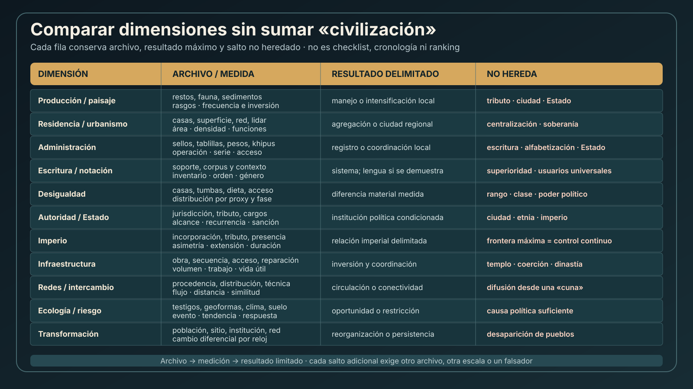
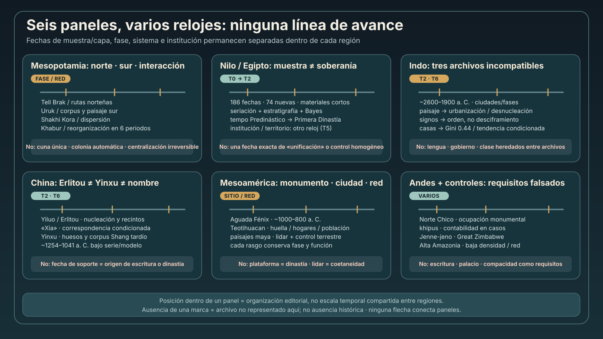

# Mapa epistemológico 052 — Comparar trayectorias sin construir una escala de civilización

| Campo | Valor |
|---|---|
| ID | `MAP-CIVILIZATIONS-001` |
| Investigación | `INV-CIVILIZATIONS-001` |
| Estado | `AUDITADO` |
| Versión | `0.1.51` |





Los SVG no son mapas de difusión, tablas de puntuación ni líneas de avance. La matriz separa dimensiones; los paneles cronológicos conservan escalas regionales y distinguen muestra, fase, institución y entidad política.

## 1. Ontología: «civilización» no es un nodo causal

```text
                          ARCHIVOS MATERIALES
                                  │
             ┌────────────────────┼────────────────────┐
             ▼                    ▼                    ▼
        dimensiones          relojes/escalas       sesgos/acceso
             │                    │                    │
             └────────────► resultados limitados ◄────┘
                                  │
                                  ▼
                      comparación explícita
                                  │
                 ┌────────────────┴──────────────┐
                 ▼                               ▼
            semejanzas                      diferencias

«civilización» = etiqueta de navegación, no variable que sume resultados
```

## 2. Matriz dimensión → archivo → resultado → no heredado

| Dimensión | Archivo mínimo | Medida | Resultado máximo sin archivo adicional | No heredado |
|---|---|---|---|---|
| producción/paisaje | macro/microrestos, fauna, sedimento, rasgos | taxón, frecuencia, morfología, inversión | manejo/intensificación local | tributo/Estado |
| residencia | casas, pisos, renovaciones | duración, acceso, densidad | ocupación/agregación | agricultura |
| urbanismo | prospección, lidar, funciones, red | área, densidad, centralidad | ciudad bajo definición regional | gobierno central |
| administración | sello, token, tablilla, khipu, almacén | operación, serie, acceso | registro/coordinación local | escritura o soberanía |
| escritura/notación | corpus, soporte, contexto | inventario, orden, género | sistema convencional; lengua si se demuestra | alfabetización universal |
| desigualdad | casas, tumbas, dieta, salud | distribución/diferencia | desigualdad del proxy | clase/poder |
| autoridad | jurisdicción, extracción, cargos, respuestas | alcance, recurrencia | institución política condicionada | imperio |
| imperio | incorporación, tributo, presencia administrativa | asimetría, persistencia, extensión | relación imperial delimitada | frontera máxima continua |
| infraestructura | obra, reparación, acceso | volumen, trabajo, secuencia | inversión/coordinación | templo/coerción |
| redes | procedencia, distribución, técnica | distancia, flujo, similitud | circulación/conectividad | difusión desde una cuna |
| ecología/riesgo | proxy ambiental + respuesta | tendencia/evento | oportunidad/restricción | causa política suficiente |
| transformación | series de población/sitio/institución/red | cambio diferencial | reorganización | desaparición de pueblos |

## 3. Grafo de relojes

```text
T0 MUESTRA/OBJETO ──► edad material
       │
       ▼ asociación
T1 CAPA/RASGO ──────► depósito, incendio, construcción
       │
       ▼ seriación/modelo
T2 FASE ────────────► conjunto arqueológico
       │
       ├────────────► T3 SITIO/BARRIO
       │                    │
       │                    ▼ agregación y remodelación
       └────────────► T4 REGIÓN/RED
                            │
                            ▼ puente institucional
                      T5 INSTITUCIÓN/POLIDAD

T6 SISTEMA/CORPUS ── tradición de notación/escritura
T7 BIOLOGÍA ──────── individuo, parentesco, movilidad, mezcla
```

Saltos prohibidos:

- `T0 → T5`: carbón/objeto fecha soberanía;
- `T2 → nombre histórico`: fase arqueológica identifica dinastía;
- `T3 planta total`: todos los edificios fueron coetáneos;
- `T6 primer testimonio`: fecha de origen del sistema;
- `T7 → T5`: ancestría identifica ciudadanía o Estado.

## 4. Panel Mesopotamia

```text
Tell Brak / norte
prospección + excavación
        ↓
concentración y funciones por fase
        ↓
urbanización septentrional [B]
        ⇢ Estado uniforme [no]

Uruk / sur
arquitectura + corpus administrativo + paisaje
        ↓
ciudad, operaciones y oportunidades hidráulicas [B]
        ⇢ despotismo inevitable [D]

Shakhi Kora
hogares institucionales + materiales locales/Uruk + abandono
        ↓
experimento centralizador y dispersión [B-COND]
        ⇢ «decisión» observada [no]
```

Dependencias: cronología cerámica, coetaneidad superficial, función arquitectónica y reconstrucción paleoambiental. Resultado comparativo: norte/sur/interacción no forman una flecha única (`EVID-CIVILIZATIONS-MESOPOTAMIA-052-001`).

## 5. Panel Nilo/Egipto

```text
186 resultados 14C
 + materiales de vida corta
 + seriación/estratigrafía
        ↓ Bayes
tempo de fases tempranas [B-COND]
        +
asentamientos + cementerios + administración + iconografía
        ↓
consolidación institucional [B-C-COND]
        ⇢ «unificación» observada en una fecha [no]
```

Un intervalo preciso estrecha `T0–T2`; soberanía permanece en `T5` (`EVID-CIVILIZATIONS-EGYPT-052-001`).

## 6. Panel Indo

### Paisaje y transformación

```text
geoformas + OSL/sedimentos + sitios armonizados
        ↓
red urbana madura / patrón posterior desnucleado [B-COND]
        ⇢ sequía = causa única [no]
        ⇢ pueblos desaparecidos [no]
```

### Signos

```text
sellos/tabletas/cerámica + corpus
        ↓ inventario y secuencias
regularidad posicional [B]
        ⇢ lengua identificada [D]
        ⇢ desciframiento [D]
```

### Desigualdad

```text
planos legados → polígonos residenciales → Gini 0.44 / series
        ↓
disparidad residencial baja/descendente en modelo [B-COND]
        ⇢ clase total o gobierno colectivo demostrado [C-D]
```

Convergencia de tres archivos no los vuelve intercambiables (`EVID-CIVILIZATIONS-INDUS-052-001`).

## 7. Panel China

```text
Yiluo: prospección regional
        ↓ nucleación + cuatro niveles
Erlitou: vías, talleres, recintos, fases
        ↓
centralidad/integración [B-COND]
        ⇢ capital Xia [C-D]

Yinxu: omóplatos inscritos + grupos + AMS/Bayes
        ↓
cronología Shang tardía/corpus real [B-COND]
        ⇢ escritura de Erlitou [no]
        ⇢ origen de autoridad china [no]
```

El nombre histórico es una hipótesis de correspondencia, no un rasgo tipológico (`EVID-CIVILIZATIONS-CHINA-052-001`).

## 8. Panel Mesoamérica

```text
Aguada Fénix
lidar + excavación + 14C
        ↓
plataforma y coordinación 1000–800 a. C. [B]
        ⇢ rey/Estado [no]

Teotihuacan
mapa + complejos residenciales + modelo
        ↓
gran ciudad / ~100,000 condicionado [B-COND]
        ⇢ autocracia o colectividad automática [no]

Maya lowlands
lidar + control terrestre
        ↓
rasgos, conectividad, terrazas, defensas [B-COND]
        ⇢ coetaneidad/guerra concreta [no]
```

Monumentalidad, urbanismo y gobierno necesitan cadenas separadas (`EVID-CIVILIZATIONS-MESOAMERICA-052-001`).

## 9. Panel Andes

```text
Norte Chico
95 fechas / 13 sitios + arquitectura
        ↓
ocupaciones monumentales ~3000–1800 a. C. [B]
        ⇢ forma estatal/clase [C-D]

khipus
cuerdas + nudos + jerarquías numéricas + correspondencias
        ↓
contabilidad en expedientes concretos [B]
        ⇢ sistema único / lengua / déficit de escritura [no]
```

La administración no requiere escritura glotográfica; el monumento no hereda Estado (`EVID-CIVILIZATIONS-ANDES-052-001`).

## 10. Controles africanos y amazónicos

| Caso | Archivo | Resultado | Requisito falsado |
|---|---|---|---|
| Jenne-jeno | excavación, prospección, hierro, intercambio | funciones urbanas/red regional | palacio/escritura/Estado central necesarios |
| Great Zimbabwe | Bayes, secuencia, importaciones, demografía | centralidad policéntrica y fases solapadas | megaciudad compacta/relevo lineal |
| Alta Amazonia | campo, lidar, plataformas, caminos, drenaje | urbanismo-jardín de baja densidad | núcleo pétreo compacto |

Un control no es una sociedad «incompleta»; es una prueba de necesidad (`EVID-CIVILIZATIONS-CONTROLS-052-001`).

## 11. Mapa de escritura, notación y oralidad

```text
SOPORTE ──► MARCAS ──► CONVENCIÓN ──► SISTEMA
                                         │
                     ┌───────────────────┴───────────────────┐
                     ▼                                       ▼
              notación/operación                    codificación lingüística
                     │                                       │
                     ▼                                       ▼
             género y usuarios                     desciframiento/corpus

ORALIDAD: eje paralelo de transmisión, memoria, actuación e institución
```

| Archivo | Estado en 052 | Límite |
|---|---|---|
| proto-cuneiforme | operaciones y géneros administrativos | lengua inicial/distribución social |
| Indo | sistema estructurado no descifrado | lenguaje/contenido abiertos |
| huesos Shang | escritura real contextual y fechada | corpus socialmente selectivo |
| khipu | contabilidad demostrada en casos | repertorio histórico completo abierto |

No existe una flecha cognitiva entre filas (`EVID-CIVILIZATIONS-WRITING-052-001`).

## 12. Mapa de formas políticas

```text
COORDINACIÓN ── no implica ──► AUTORIDAD
AUTORIDAD ───── no implica ──► COERCIÓN
COERCIÓN ────── no basta ────► ESTADO
ESTADO ──────── no basta ────► IMPERIO

CIUDAD: eje de residencia/función/red
ESTADO: eje de jurisdicción/extracción/persistencia
IMPERIO: eje de incorporación asimétrica suprarregional
```

| Observación | Inferencia permitida | Puente adicional |
|---|---|---|
| obra colectiva | coordinación | acceso, obligación, agentes, recurrencia |
| administración local | registro/autoridad local | alcance supralocal y jurisdicción |
| tributo documentado | extracción | persistencia, territorio y respuesta local |
| guarnición | presencia coercitiva | integración administrativa y duración |
| estilo extendido | circulación | agentes, dirección y relación política |

## 13. Mapa de desigualdad

```text
CASA ── área/inversión ──► distribución residencial
  │                            │
  ├─ casa ≠ hogar             ├─ riqueza mínima/modelada
  └─ fases/preservación       └─ no clase/poder

TUMBA ─ tratamiento/bienes ──► diferencia mortuoria
  │                               │
  ├─ rito/edad/selección           └─ rango condicionado
  └─ vida ≠ muerte

CUERPO ─ dieta/salud/movilidad ─► acceso biológico parcial
PARENTESCO + recurrencia + recursos ─► transmisión posible
```

Mohenjo-daro: Gini residencial bajo/descendente en la partición 2026 no equivale a igualdad total. Comparación global: escala/productividad dejan mucha variación sin explicar (`EVID-CIVILIZATIONS-INEQUALITY-052-001`).

## 14. Grafo causal recíproco

```text
clima/ecología ─┐
demografía ─────┤
producción ─────┤
comercio ───────┼──► costes/oportunidades ──► agregación/instituciones
guerra ─────────┤                                │
ritual ─────────┤                                ▼
información ────┤                         extracción/redes
agencia ────────┘                                │
       ▲                                         ▼
       └──────── consecuencias y realimentación ─┘
```

Cada flecha exige precedencia, mecanismo, escala y caso negativo. Casos adversarios: hidráulica sin despotismo demostrado; intercambio intenso sin centralización necesaria; centralización seguida por dispersión; urbanización con desigualdad residencial decreciente; Estados codificados sin escritura (`EVID-CIVILIZATIONS-CAUSES-052-001`).

## 15. Red y difusión: árbol de alternativas

```text
objeto exótico / similitud / técnica compartida
                    │
       ┌────────────┼────────────┬─────────────┐
       ▼            ▼            ▼             ▼
 intercambio    movilidad     imitación    convergencia
       │            │            │             │
       └────────────┴──────┬─────┴─────────────┘
                           ▼
              tributo/saqueo/redeposición
```

Para elegir se necesitan procedencia, reloj, distribución, agente y contexto. Ninguna rama se selecciona por parecido visual (`EVID-CIVILIZATIONS-NETWORKS-052-001`).

## 16. Transformación: matriz de unidades

| Unidad | Persistencia | Transformación | Pérdida |
|---|---|---|---|
| población | continuidad local | mezcla/movilidad | mortalidad/salida |
| asentamiento | reocupación | desnucleación/traslado | abandono |
| institución | cargos/reglas | fragmentación/reforma | cese |
| red | rutas mantenidas | redirección | desconexión |
| práctica | transmisión | préstamo/recombinación | abandono |
| archivo | conservación | redeposición/reuso | erosión/saqueo/destrucción |

«Colapso» sin fila, escala y reloj es insuficiente (`EVID-CIVILIZATIONS-TRANSFORM-052-001`).

## 17. Biología y movilidad

```text
isótopo individual ──► dieta/procedencia condicionada
ADN individual ──────► parentesco/afinidad/mezcla condicionada

NO HEREDAN:
etnia · lengua · ciudadanía · clase · civilización · legitimidad · Estado
```

Dependencias: selección funeraria, preservación, referencias, modelos, permisos, custodia y tamaño de muestra (`EVID-CIVILIZATIONS-BIOLOGY-052-001`).

## 18. Sesgos y gobernanza

| Sesgo | Efecto | Control |
|---|---|---|
| preservación | sobrerrepresenta piedra/cerámica | modelar ausencia y materiales perdidos |
| excavación histórica | mezcla/destruye contexto | historia de colección y datos legados |
| cobertura | regiones/sitios desiguales | declarar universo y huecos |
| idioma/acceso | concentra bibliografía | autorías regionales, traducción y nivel de acceso |
| financiación/tecnología | distribuye lidar/aDNA de modo desigual | registrar proyecto, permisos y repositorio |
| colonialidad | categorías/autoridad extractivas | gobernanza, devolución y marcos situados |
| archivo escrito | representa géneros/usuarios selectos | contrastar hogares, paisaje y oralidad |

## 19. Tabla de confianza

| Paso | Confianza típica | Baja cuando |
|---|---|---|
| identidad/edad de objeto | A–B | procedencia o conservación inciertas |
| fase/rasgo | B-COND | mezcla, priors o residualidad |
| área/conectividad | B-COND | coetaneidad o clasificación remota abiertas |
| operación administrativa | B | contexto/género repetidos |
| lengua/desciframiento | A si reproducible; D en Indo | corpus breve/sin bilingüe |
| ciudad | B-COND | definición regional y funciones vagas |
| Estado | C-COND | jurisdicción/extracción no convergen |
| imperio | C-COND | incorporación/asimetría no se observan localmente |
| clase/poder | C-D | un solo proxy o muestra sesgada |
| causalidad global única | D | equifinalidad y casos negativos |

## 20. Alternativas adversarias mínimas

| Señal | Hipótesis focal | Alternativas obligatorias |
|---|---|---|
| monumento | Estado/élite | coordinación comunal, reunión, ritual, obra episódica |
| muralla | guerra | agua, animales, control de paso, exhibición |
| tablilla/sello | Estado escrito | administración local/archivo selecto |
| regularidad de signos | lengua | sistema no glotográfico estructurado |
| Gini residencial | desigualdad total | inversión/ocupación/preservación diferencial |
| abandono urbano | desaparición | migración, desnucleación, cambio de función |
| material foráneo | colonia | intercambio, movilidad, imitación, tributo |
| cambio ambiental | causa suficiente | mediación, coincidencia, respuesta divergente |
| genoma afín | pueblo | parentesco, muestra funeraria, movilidad |

## 21. Falsadores prioritarios

1. nuevas series cambian la coetaneidad de grandes plantas;
2. excavación invalida la identificación/fecha de rasgos remotos;
3. un bilingüe y lectura reproducible resuelven parte del Indo;
4. documentación jurisdiccional contradice una forma política inferida;
5. cobertura residencial completa revierte resultados de desigualdad;
6. procedencia y cronología excluyen una red o dirección propuesta;
7. demografía muestra desaparición donde se modeló redistribución;
8. controles comparables eliminan la asociación causal;
9. categorías locales contradicen la taxonomía analítica;
10. historia de colección revela mezcla o atribución moderna.

## 22. Reconciliación de estados e IDs

```text
INV-NEOLITHIC-001        AUDITADO  (producción/domesticación)
INV-CITIES-STATES-001    AUDITADO  (asentamientos/instituciones)
INV-CIVILIZATIONS-001    AUDITADO  (comparación dimensional)

INV-CIV-ORIGINS-001      TRAZADO   (no promovido ni sustituido)
MARCO/PROGRAMA                     (instrumentos, no investigaciones auditadas)
```

Reutilización literal:

- `CLAIM-CIV-CATEGORY-001`;
- `CLAIM-URBANISM-STATE-SEPARATE-001`;
- `CLAIM-WRITING-NOT-STATE-REQUIREMENT-001`;
- `CLAIM-INEQUALITY-MULTIDIMENSIONAL-001`;
- `CLAIM-COLLAPSE-TRANSFORMATION-001`;
- `CLAIM-ANCESTRY-NOT-POLITY-001`.

Los IDs CIV conservan `TRAZADO`; las capas 051 y 052 tienen evidencia/estado propios.

## 23. Regla de lectura final

```text
¿qué objeto o rasgo?
→ ¿qué procedencia/unidad?
→ ¿qué reloj?
→ ¿qué medición y error?
→ ¿qué puente?
→ ¿qué dimensión y escala?
→ ¿qué alternativa?
→ ¿qué falsador?
→ ¿qué confianza?
```

Si falta una respuesta, la inferencia se detiene o baja de confianza. No hay atajos mediante tamaño, escritura, monumento, genética ni la palabra «civilización».
