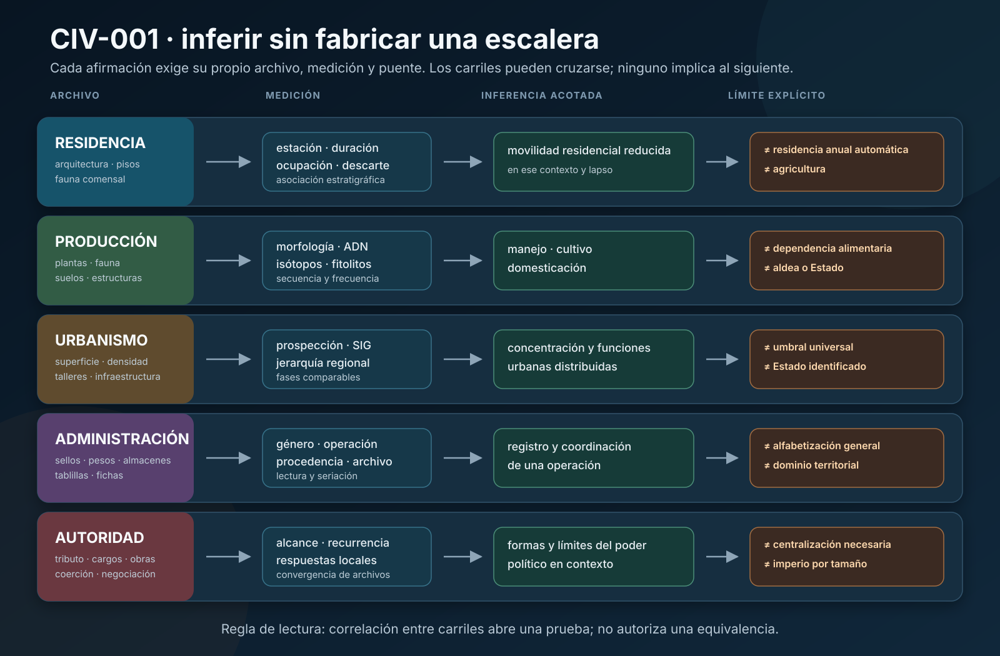
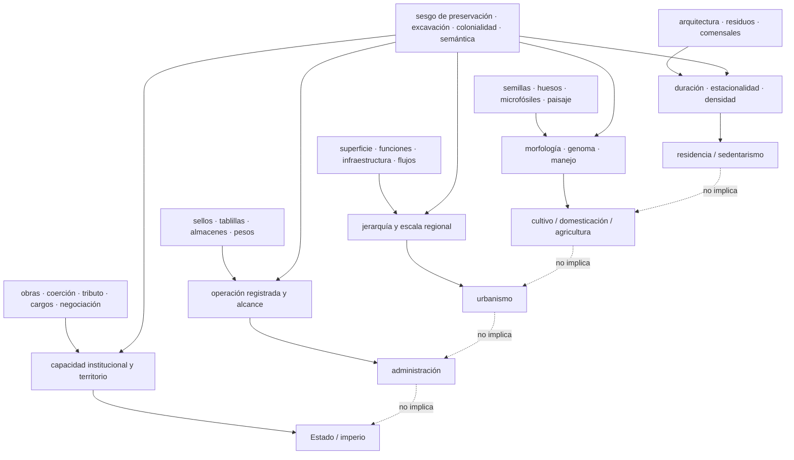

# Mapa epistemológico — sedentarismo, domesticación, ciudades y Estados

## Pregunta central

¿Qué cadenas independientes permiten reconstruir residencia, producción, concentración, administración y autoridad, y dónde se introducen los supuestos que podrían fabricar una escalera de «civilización»?

## Nodos y archivos

| Nodo | Tipo | Objeto o medición | Claim que puede sostener | Dependencia crítica |
|---|---|---|---|---|
| `EVID-CIV-OHALO-001` | asentamiento | suelos de cabaña, hogares, botánica y `14C` | ocupación construida anterior al Holoceno | asociación de carbones y duración de ocupación |
| `EVID-CIV-MICE-AINMALLAHA-001` | zooarqueología | dientes y morfometría de *Mus* | movilidad residencial reducida local antes de agricultura | modelo actual de comensalismo y resolución de fase |
| `EVID-CIV-DHRA-GRANARIES-001` | arquitectura/arqueobotánica | estructuras elevadas, instalaciones y contexto PPNA | almacenamiento especializado antes de cereales domesticados morfológicamente | función arquitectónica y contemporaneidad |
| `EVID-CIV-DOMESTICATION-COMPARATIVE-001` | síntesis comparativa | series de rasgos de cultivos de varias regiones | domesticaciones paralelas y ritmos no instantáneos | calidad desigual y definición de domesticación |
| `EVID-CIV-KUK-001` | paisaje modificado | paleosuelos, montículos, zanjas, microfósiles y `14C` | manejo/cultivo y agricultura tropical en fases | procesos naturales del humedal y afinidad de plantas |
| `EVID-CIV-GUILA-CUCURBITA-001` | planta fechada | semillas, pedúnculos y cortezas + AMS | domesticación local de calabaza en el intervalo publicado | diagnóstico morfológico y contexto de cueva |
| `EVID-CIV-TIANLUOSHAN-RICE-001` | serie arqueobotánica | bases de espiguilla y malezas | cambio local en rasgos/uso de arroz | tafonomía, muestreo y significado de desprendimiento |
| `EVID-CIV-CATALHOYUK-BIO-001` | bioarqueología | huesos, dientes, isótopos, residuos y fases | efectos variables de densidad y agricultura en una comunidad | representatividad, diagnóstico y extrapolación global |
| `EVID-CIV-TELLBRAK-SURVEY-001` | asentamiento regional | dispersión cerámica, superficie y excavación | urbanización septentrional no reducible a difusión sureña | densidad, duración y cronología cerámica |
| `EVID-CIV-CDLI-P003414-001` | documento | tablilla administrativa catalogada | escritura administrativa en Uruk IV | paleografía, procedencia y lengua no determinada |
| `EVID-CIV-HOUSE-GINI-001` | comparación cuantitativa | superficies de casas en 64 casos | variación de desigualdad residencial en la muestra | casa como proxy, abandono y cobertura regional |

## Cuellos de botella

1. **La unidad de fecha:** carbón, semilla, relleno, muro, fase y evento social no son intercambiables.
2. **La función del objeto:** un silo, sello, palacio o arma necesita controles antes de convertirse en institución.
3. **La escala:** hogar, barrio, sitio, valle, red y territorio político pueden producir patrones distintos.
4. **La ausencia:** escritura, palacios o enterramientos ricos pueden faltar por práctica, excavación o preservación.
5. **La independencia:** varios indicadores de un mismo contexto pueden compartir fecha, selección y modelo.
6. **La categoría:** definir «ciudad» o «Estado» después de ver el caso puede hacer circular el argumento.
7. **La representación:** textos oficiales y monumentos sobrerrepresentan instituciones capaces de producirlos.

## Pruebas de tensión

- Si almacenamiento especializado sólo apareciera después de domesticación en secuencias mejor resueltas, se revisaría `CLAIM-CIV-STORAGE-BEFORE-DOMESTICATION-001`.
- Si las señales de comensalismo natufienses resultaran mezcladas o no dependieran de residencia prolongada, bajaría `CLAIM-CIV-SEDENTISM-BEFORE-AGRICULTURE-001`.
- Si todas las rutas urbanas propuestas pudieran derivarse de un mismo foco mediante cronología y materiales trazables, se debilitaría `CLAIM-CIV-URBANISM-MULTIPATH-001`.
- Si la desigualdad por tamaño de casa no correlacionara con otras dimensiones de riqueza en muestras ampliadas, se restringiría `CLAIM-CIV-INEQUALITY-PROXY-001`.
- Ningún caso aislado puede falsar la diversidad total de trayectorias; sí puede falsar una generalización regional mal formulada.
