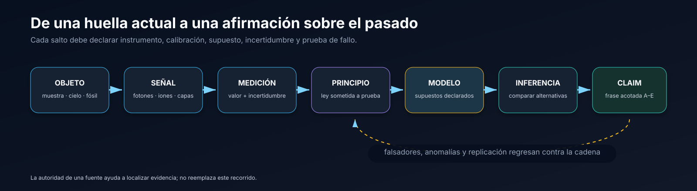
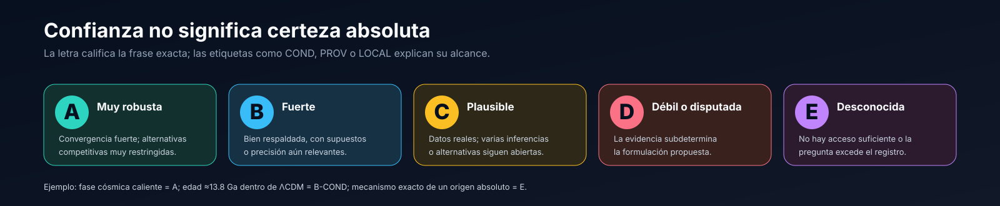
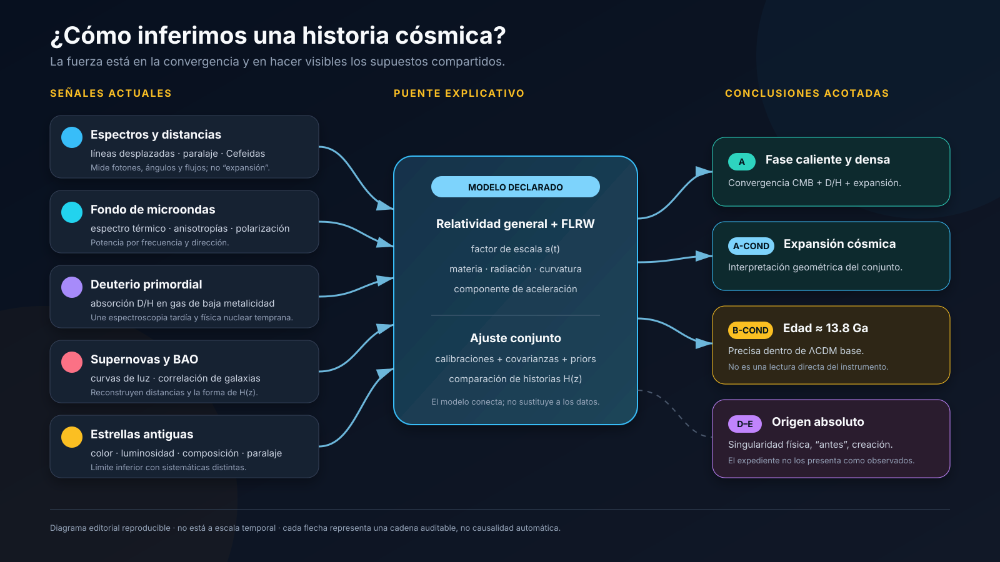

# Atlas visual

El atlas ofrece entradas rápidas sin reducir la investigación a infografías. Cada pieza declara si es conceptual o si representa una cadena auditable.

> **Portada conceptual:** comprime más de trece mil millones de años en un paisaje continuo. No está a escala y no constituye evidencia científica.

## 1. Cómo trabaja el proyecto

La observación no se convierte sola en conclusión. Instrumentos, calibraciones, principios, modelos y falsadores deben quedar visibles.

## 2. Cómo se expresa la confianza

Una letra no corona una disciplina: califica la frase exacta escrita en un claim.

## 3. Investigación 002 — Historia y edad del universo

El mapa muestra convergencia, no independencia total. CMB, BAO y nucleosíntesis comparten parte del modelo temprano; supernovas y edades estelares cambian instrumentos y sistemáticas.

## Procedencia

El registro de creación, límites y prompt de cada pieza está en [`assets/visuales/README.md`](assets/visuales/README.md).
