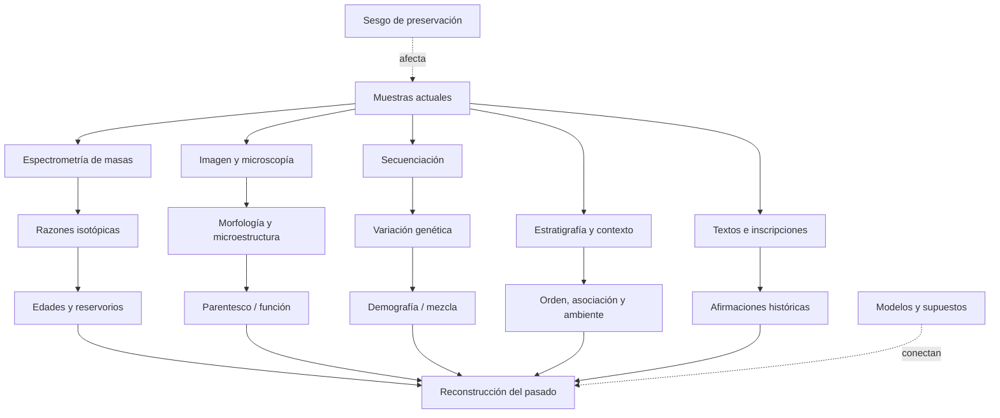

# Mapa de conocimiento

Este mapa separa una jerarquía narrativa de una red epistemológica. La primera dice “qué viene después”; la segunda muestra de qué mediciones depende lo que afirmamos.

## Jerarquía cronológica y biológica

```text
COSMOS
├── expansión y fondo cósmico
├── nucleosíntesis primordial
└── estrellas y elementos
    └── SISTEMA SOLAR
        └── sólidos nebulares y planetesimales
            └── TIERRA–LUNA
                ├── núcleo, manto, corteza, océanos y atmósfera
                └── VIDA
                    ├── replicación, metabolismo y membranas
                    ├── procariotas
                    │   └── fotosíntesis y oxigenación
                    └── eucariotas
                        ├── sexo y multicelularidad
                        └── ANIMALES
                            ├── sistemas nerviosos, ojos y esqueletos
                            └── VERTEBRADOS
                                ├── mandíbulas y extremidades
                                └── AMNIOTAS
                                    ├── reptiles y aves
                                    └── MAMÍFEROS
                                        └── PRIMATES
                                            └── HOMININOS
                                                └── HOMO
                                                    └── HOMO SAPIENS
                                                        ├── migraciones y mezcla
                                                        ├── lenguaje, símbolos y cooperación
                                                        └── CIVILIZACIONES
                                                            ├── agricultura y ciudades
                                                            ├── escritura, estados y leyes
                                                            └── Mesopotamia, Egipto, Indo,
                                                                China, Mesoamérica y Andes
```

## Navegación por módulos

| Nodo | Directorio principal | Preguntas de evidencia |
|---|---|---|
| Cosmos y Sistema Solar | `01_cosmos` | ¿Cómo se miden expansión, CMB, abundancias, formación estelar, nucleosíntesis y discos? ¿Qué depende del modelo? |
| Formación terrestre | `02_formacion_tierra` | ¿Qué fecha cada reloj? ¿Cómo se infieren acreción, núcleo y Luna? |
| Hadeano | `03_hadeano` | ¿Qué conservan zircones, rocas raras y la Luna? |
| Arcaico | `04_arcaico` | ¿Qué evidencia de corteza, océanos y vida sobrevive? |
| Proterozoico | `05_proterozoico` | ¿Cómo se reconstruyen oxígeno, eucariotas y multicelularidad? |
| Paleozoico | `06_paleozoico` | ¿Cómo se fechan radiaciones, colonización terrestre y extinciones? |
| Mesozoico | `07_mesozoico` | ¿Qué conectan fósiles, estratos, paleomagnetismo e impactos? |
| Cenozoico | `08_cenozoico` | ¿Cómo se reconstruyen clima, mamíferos y primates? |
| Origen de la vida | `09_origen_vida` | ¿Qué puede probar laboratorio y qué solo restringe plausibilidad histórica? |
| Transiciones de la vida | `10_evolucion_vida` | ¿Cómo se combinan fósiles, desarrollo, comparación y genes? |
| Evolución humana | `11_evolucion_humana` | ¿Qué huesos existen y qué anatomía se reconstruye? |
| Homo sapiens | `12_homo_sapiens` | ¿Qué significa “origen” en una población estructurada? |
| Migraciones | `13_migraciones` | ¿Cómo convergen arqueología, ADN, clima y lingüística? |
| Civilizaciones | `14_civilizaciones` | ¿Qué proviene de objetos, textos o modelos sociales? |
| Genética humana | `15_genetica_humana` | ¿Qué mide un haplogrupo y qué no implica? |
| Controversias | `16_controversias` | ¿Qué dato comparten rivales y qué prueba discrimina? |
| Preguntas abiertas | `17_preguntas_abiertas` | ¿Qué se desconoce y por qué? |
| Historia de la ciencia | `18_historia_ciencia` | ¿Qué cambió el consenso y cómo? |

## Red de métodos



## Cuellos de botella epistemológicos

| Cuello de botella | Claims afectados | Riesgo |
|---|---|---|
| significado del evento fechado | casi toda la cronología | confundir cristalización, cierre, alteración y evento histórico |
| preservación diferencial | fósiles, rocas hadeanas, arqueología | ausencia de evidencia presentada como evidencia de ausencia |
| calibraciones compartidas | geocronología, relojes moleculares, `14C` | falsa independencia |
| procedencia/contexto | meteoritos, fósiles, artefactos, ADN antiguo | asociación errónea o contaminación |
| categorías humanas | especie, cultura, civilización, lenguaje | convertir etiquetas analíticas en entidades nítidas del pasado |
| resolución temporal | origen de la vida, radiaciones, migraciones | transformar límites mínimo/máximo en fechas puntuales |

## Ruta epistemológica actual

Las rutas implementadas son:

```text
espectros y distancias ─┐
CMB espectral/anisótropo ├→ FLRW + física térmica → fase caliente y expansión
deuterio primordial ─────┤                          → H(z) → edad ~13.8 Ga (B-COND)
supernovas y BAO ─────────┤
edades estelares ─────────┘
```

Véase `INV-COSMOS-AGE-001` en `01_cosmos` y su mapa en `assets/visuales/mapa-investigacion-002.svg`.

La ruta del origen de los elementos es:

```text
líneas atómicas + modelos de atmósfera → identidad y abundancias condicionadas
tasas nucleares + D/H + CMB           → inventario primordial H/He
neutrinos solares                     → fusión activa H→He
Tc estelar + granos presolares        → proceso s y mezcla AGB
gamma de SN 1987A                     → material 56Ni/56Co fresco
GW170817 + kilonova + Sr              → captura neutrónica en fusiones
rayos cósmicos + abundancias          → contribución LiBeB
                                      ↓
tasas + eyección + mezcla galáctica   → inventario solar (fracciones abiertas)
```

Véase `INV-COSMOS-ELEMENTS-001` en `01_cosmos`, su mapa en `assets/visuales/mapa-investigacion-003.svg` y la matriz en `assets/visuales/matriz-origen-elementos.svg`.

La ruta de evolución estelar es:

```text
paralaje + flujo + color              → distancia, luminosidad y población H–R
órbitas + eclipses                    → masas y radios dinámicos
cúmulos aproximadamente coetáneos     → orden por masa y edades condicionadas
oscilaciones                          → estado de combustión interior
líneas moleculares + disco + chorro   → acreción protostelar
órbitas WD + cúmulos                  → relación masa inicial–final
progenitor desaparecido + neutrinos   → colapso de núcleo en casos observados
timing + binarias compactas           → estrellas de neutrones y agujeros negros
                                       ↓
composición + rotación + pérdida + binariedad → rutas, no ciclo universal
```

Véase `INV-COSMOS-STARS-001` en `01_cosmos`, su mapa en `assets/visuales/mapa-investigacion-004.svg` y las rutas en `assets/visuales/rutas-evolucion-estelar.svg`.

La ruta terrestre es:

```text
CAIs y meteoritos
  → razones U–Pb/Pb–Pb
  → tiempo cero del Sistema Solar
  → modelos de acreción y Hf–W
  → formación terrestre no instantánea
  → Luna y diferenciación
  → zircones/rocas hadeanas
  → primeras restricciones sobre corteza y agua
```

Véase `INV-EARTH-AGE-001` en `02_formacion_tierra`.
