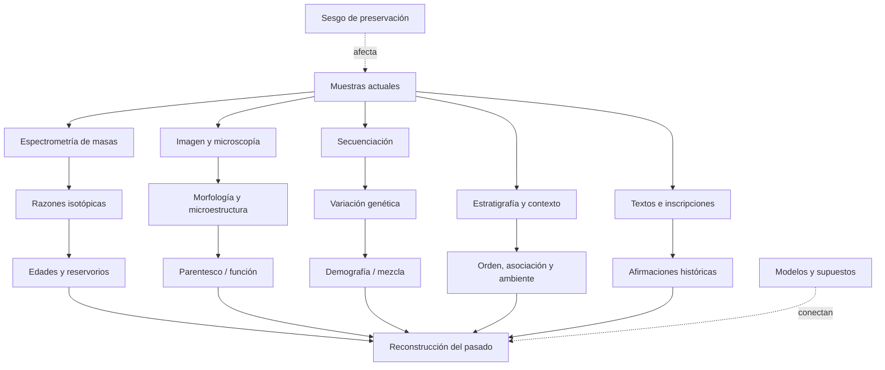

# Mapa de conocimiento

Este mapa separa una jerarquía narrativa de una red epistemológica. La primera dice “qué viene después”; la segunda muestra de qué mediciones depende lo que afirmamos.

## Jerarquía cronológica y biológica

```text
COSMOS
├── expansión y fondo cósmico
├── nucleosíntesis primordial
└── estrellas y elementos
    └── SISTEMA SOLAR
        └── sólidos nebulares y planetesimales
            └── TIERRA–LUNA
                ├── núcleo, manto, corteza, océanos y atmósfera
                └── VIDA
                    ├── replicación, metabolismo y membranas
                    ├── procariotas
                    │   └── fotosíntesis y oxigenación
                    └── eucariotas
                        ├── sexo y multicelularidad
                        └── ANIMALES
                            ├── sistemas nerviosos, ojos y esqueletos
                            └── VERTEBRADOS
                                ├── mandíbulas y extremidades
                                └── AMNIOTAS
                                    ├── reptiles y aves
                                    └── MAMÍFEROS
                                        └── PRIMATES
                                            └── HOMININOS
                                                └── HOMO
                                                    └── HOMO SAPIENS
                                                        ├── migraciones y mezcla
                                                        ├── lenguaje, símbolos y cooperación
                                                        └── CIVILIZACIONES
                                                            ├── agricultura y ciudades
                                                            ├── escritura, estados y leyes
                                                            └── Mesopotamia, Egipto, Indo,
                                                                China, Mesoamérica y Andes
```

## Navegación por módulos

| Nodo | Directorio principal | Preguntas de evidencia |
|---|---|---|
| Cosmos y Sistema Solar | `01_cosmos` | ¿Cómo se miden expansión, CMB, abundancias, formación estelar, nucleosíntesis y discos? ¿Qué depende del modelo? |
| Formación terrestre | `02_formacion_tierra` | ¿Qué fecha cada reloj? ¿Cómo se infieren acreción, núcleo y Luna? |
| Hadeano | `03_hadeano` | ¿Qué conservan zircones, rocas raras y la Luna? |
| Arcaico | `04_arcaico` | ¿Qué evidencia de corteza, océanos y vida sobrevive? |
| Proterozoico | `05_proterozoico` | ¿Cómo se reconstruyen oxígeno, eucariotas y multicelularidad? |
| Paleozoico | `06_paleozoico` | ¿Cómo se fechan radiaciones, colonización terrestre y extinciones? |
| Mesozoico | `07_mesozoico` | ¿Qué conectan fósiles, estratos, paleomagnetismo e impactos? |
| Cenozoico | `08_cenozoico` | ¿Cómo se reconstruyen clima, mamíferos y primates? |
| Origen de la vida | `09_origen_vida` | ¿Qué puede probar laboratorio y qué solo restringe plausibilidad histórica? |
| Transiciones de la vida | `10_evolucion_vida` | ¿Cómo se combinan fósiles, desarrollo, comparación y genes? |
| Evolución humana | `11_evolucion_humana` | ¿Qué huesos existen y qué anatomía se reconstruye? |
| Homo sapiens | `12_homo_sapiens` | ¿Qué significa “origen” en una población estructurada? |
| Migraciones | `13_migraciones` | ¿Cómo convergen arqueología, ADN, clima y lingüística? |
| Civilizaciones | `14_civilizaciones` | ¿Qué proviene de objetos, textos o modelos sociales? |
| Genética humana | `15_genetica_humana` | ¿Qué mide un haplogrupo y qué no implica? |
| Controversias | `16_controversias` | ¿Qué dato comparten rivales y qué prueba discrimina? |
| Preguntas abiertas | `17_preguntas_abiertas` | ¿Qué se desconoce y por qué? |
| Historia de la ciencia | `18_historia_ciencia` | ¿Qué cambió el consenso y cómo? |

## Red de métodos



## Cuellos de botella epistemológicos

| Cuello de botella | Claims afectados | Riesgo |
|---|---|---|
| significado del evento fechado | casi toda la cronología | confundir cristalización, cierre, alteración y evento histórico |
| preservación diferencial | fósiles, rocas hadeanas, arqueología | ausencia de evidencia presentada como evidencia de ausencia |
| calibraciones compartidas | geocronología, relojes moleculares, `14C` | falsa independencia |
| procedencia/contexto | meteoritos, fósiles, artefactos, ADN antiguo | asociación errónea o contaminación |
| categorías humanas | especie, cultura, civilización, lenguaje | convertir etiquetas analíticas en entidades nítidas del pasado |
| resolución temporal | origen de la vida, radiaciones, migraciones | transformar límites mínimo/máximo en fechas puntuales |

## Ruta epistemológica actual

Las rutas implementadas son:

```text
espectros y distancias ─┐
CMB espectral/anisótropo ├→ FLRW + física térmica → fase caliente y expansión
deuterio primordial ─────┤                          → H(z) → edad ~13.8 Ga (B-COND)
supernovas y BAO ─────────┤
edades estelares ─────────┘
```

Véase `INV-COSMOS-AGE-001` en `01_cosmos` y su mapa en `assets/visuales/mapa-investigacion-002.svg`.

La ruta del origen de los elementos es:

```text
líneas atómicas + modelos de atmósfera → identidad y abundancias condicionadas
tasas nucleares + D/H + CMB           → inventario primordial H/He
neutrinos solares                     → fusión activa H→He
Tc estelar + granos presolares        → proceso s y mezcla AGB
gamma de SN 1987A                     → material 56Ni/56Co fresco
GW170817 + kilonova + Sr              → captura neutrónica en fusiones
rayos cósmicos + abundancias          → contribución LiBeB
                                      ↓
tasas + eyección + mezcla galáctica   → inventario solar (fracciones abiertas)
```

Véase `INV-COSMOS-ELEMENTS-001` en `01_cosmos`, su mapa en `assets/visuales/mapa-investigacion-003.svg` y la matriz en `assets/visuales/matriz-origen-elementos.svg`.

La ruta de evolución estelar es:

```text
paralaje + flujo + color              → distancia, luminosidad y población H–R
órbitas + eclipses                    → masas y radios dinámicos
cúmulos aproximadamente coetáneos     → orden por masa y edades condicionadas
oscilaciones                          → estado de combustión interior
líneas moleculares + disco + chorro   → acreción protostelar
órbitas WD + cúmulos                  → relación masa inicial–final
progenitor desaparecido + neutrinos   → colapso de núcleo en casos observados
timing + binarias compactas           → estrellas de neutrones y agujeros negros
                                       ↓
composición + rotación + pérdida + binariedad → rutas, no ciclo universal
```

Véase `INV-COSMOS-STARS-001` en `01_cosmos`, su mapa en `assets/visuales/mapa-investigacion-004.svg` y las rutas en `assets/visuales/rutas-evolucion-estelar.svg`.

La ruta de formación del Sistema Solar es:

```text
OTROS SISTEMAS JÓVENES                 ARCHIVO LOCAL
visibilidades + continuo ─────┐        CAIs/cóndrulos + Pb–Pb ───────┐
líneas moleculares + Doppler ─┼→       26Al + Hf–W ─────────────────┤
fracción de discos por edad ──┘        CC/NC + Wild 2 + remanencia ─┤
          ↓                                      ↓                   │
discos estructurados como clase          cronología, transporte,     │
                                         mezcla parcial y cuerpos ───┘
                    \                    /
                     → origen en disco protoplanetario (A-COND)
                       masa/radio/mecanismos exactos (C–D)
```

Véase `INV-SOLAR-FORMATION-001` en `01_cosmos`, su mapa en `assets/visuales/mapa-investigacion-005.svg` y la comparación en `assets/visuales/dos-archivos-formacion-solar.svg`.

La ruta terrestre es:

```text
CAIs y meteoritos
  → razones U–Pb/Pb–Pb
  → tiempo cero del Sistema Solar
  → modelos de acreción y Hf–W
  → formación terrestre no instantánea
  → Luna y diferenciación
  → zircones/rocas hadeanas
  → primeras restricciones sobre corteza y agua
```

Véase `INV-EARTH-AGE-001` en `02_formacion_tierra`.

La ruta específica de acreción terrestre es:

```text
182W + Hf/W ──────────────→ separación integrada + equilibrio ─┐
manto multielemental ─────→ partición metal–silicato ──────────┤
HSE + Ru + W antiguo ─────→ masa/procedencia tardía ───────────┤
masas + órbitas ──────────→ ensambles N-cuerpos ───────────────┤
hidrocódigos ─────────────→ fusión / hit-and-run / erosión ────┤
H/N + reservorios NC/CC ──→ procedencia y retención ───────────┘
                                      ↓
             crecimiento y núcleo multietapa: B-COND
             curva/impactores/final únicos: D–E
```

Véase `INV-EARTH-ACCRETION-001` en `02_formacion_tierra`, su mapa en `assets/visuales/mapa-investigacion-006.svg` y la distinción de hitos en `assets/visuales/cinco-finales-acrecion.svg`.

La ruta específica del núcleo terrestre es:

```text
P, PKP, PKIKP, SKS ───────→ discontinuidades + estado mecánico ─┐
modos normales ───────────→ perfiles globales de ρ, Vp y Vs ────┤
masa + I/MR² ─────────────→ concentración central de masa ──────┤
siderófilos del manto ─────→ separación metal–silicato ─────────┤
experimentos P–T ─────────→ Fe–Ni + elementos ligeros ──────────┤
182W + Hf/W ──────────────→ diferenciación integrada temprana ──┤
paleomagnetismo + calor ──→ geodinamo y nucleación interna ─────┘
                                      ↓
            existencia/geometría/estado global: A–B
            composición detallada/edad interna: C–D
```

Véase `INV-EARTH-CORE-001` en `02_formacion_tierra`, su mapa en `assets/visuales/mapa-investigacion-007.svg` y la guía conceptual de fases en `assets/visuales/fases-sismicas-nucleo.svg`.

La ruta específica del origen lunar es:

```text
masa + órbita + giro ─────→ momento angular / mareas ───────────┐
núcleo pequeño ───────────→ eyección preferente de silicato ────┤
anortositas + zircon ─────→ fusión y diferenciación tempranas ──┤
O + Ti + V + W ───────────→ fuente, mezcla y acreción tardía ────┤
K + volátiles ────────────→ vapor, pérdida y condensación ───────┤
SPH + disco + enfriamiento→ familias mecánicamente viables ─────┘
                                      ↓
                 impacto + reacreción: B-COND
                 Theia/geometría exactas: D–E
```

Véase `INV-MOON-ORIGIN-001` en `02_formacion_tierra`, su mapa en `assets/visuales/mapa-investigacion-008.svg` y la matriz en `assets/visuales/restricciones-origen-luna.svg`.

La ruta específica de la primera corteza es:

```text
zircon detrítico + U–Pb ───→ edad de cristal, roca fuente perdida ─┐
Hf + O + trazas ───────────→ fuente diferenciada / retrabajo ─────┤
Acasta + U–Pb de campo ────→ protolito preservado ~4.03 Ga ───────┤
petrología de Idiwhaa ─────→ fuente máfica hidratada ──────────────┤
dos Sm–Nd en NGB ──────────→ intrusión ~4.16 Ga ──────────────────┤
contacto de corte NGB ─────→ encajante anterior ───────────────────┘
                                      ↓
                 diferenciación temprana: B-COND
                 volumen / placas globales: D–E
```

Véase `INV-HADEAN-CRUST-001` en `02_formacion_tierra`, su mapa en `assets/visuales/mapa-investigacion-009.svg` y la comparación en `assets/visuales/tres-archivos-corteza-hadeana.svg`.

La ruta específica del agua hadeana es:

```text
U–Pb + textura + hidratación ─→ dominio de zircon primario ──────┐
δ18O alto ────────────────────→ protolito alterado a baja T ─────┤
δ18O bajo ────────────────────→ roca hidrotermal/agua meteórica ─┤
Acasta + O bimodal ───────────→ fuente somera preservada ────────┤
NGB + O triple + H ───────────→ alteración hidrotermal antigua ──┤
desgasificación + clima ──────→ trayectorias físicamente viables ┘
                                      ↓
             agua–roca / hidrosfera temprana: B–C
             océano global / clima estable: D–E
```

Véase `INV-HADEAN-WATER-001` en `03_hadeano`, su mapa en `assets/visuales/mapa-investigacion-010.svg` y la cadena en `assets/visuales/cadena-oxigeno-agua.svg`.

La ruta específica de la atmósfera hadeana es:

```text
Ce/U + U–Pb en zircon ─────→ fO₂ de fundidos seleccionados ──────┐
CHONS + solubilidad + P–T ─→ familias de gases desgasificados ───┤
D/H ───────────────────────→ límite condicional de H₂/escape ────┤
Xe en cuarzo ~3.3 Ga ──────→ evolución y desgasificación ─────────┤
S-MIF pre-3.77 Ga ─────────→ anoxia en el borde eoarcaico ────────┤
N/Ar + vesículas arqueanas → cotas posteriores de presión ────────┘
                                      ↓
             redox magmático y atmósfera dinámica: B–C
             mezcla / presión hadeanas exactas: D–E
```

Véase `INV-HADEAN-ATMOSPHERE-001` en `03_hadeano`, su mapa en `assets/visuales/mapa-investigacion-011.svg` y la cadena en `assets/visuales/de-magma-a-aire.svg`.

La ruta específica del bombardeo hadeano es:

```text
edad isotópica + textura ─────────→ cierre, cristalización o reinicio ─┐
composición + cartografía ────────→ procedencia y evento candidato ───┤
cráteres + superposición ─────────→ orden y densidad acumulada ────────┤
preservación + transporte ────────→ función de selección ──────────────┤
dinámica de poblaciones ──────────→ familias de flujo compatibles ─────┘
                                            ↓
              bombardeo temprano intenso/declinante: B-COND
              pico terminal único a ~3.9 Ga: D
              curva y efectos exactos sobre la Tierra: D–E
```

Véase `INV-HADEAN-IMPACTS-001` en `03_hadeano`, su mapa en `assets/visuales/mapa-investigacion-012.svg` y la cadena en `assets/visuales/de-muestra-a-flujo-impactos.svg`.

La ruta específica de la vida más antigua es:

```text
edad del huésped ───────────→ ¿qué objeto y evento fecha el número? ─┐
interior + controles ───────→ señal indígena, no contaminación ──────┤
capas + inclusiones ────────→ señal singenética, no tardía ──────────┤
3-D + química + facies ─────→ señal biogénica frente a abiótica ─────┤
comparación poblacional ────→ límite temporal con confianza heredada ┘
                                         ↓
                 vida por lo menos hacia ~3.43 Ga: B-COND
                 señal biológica en Isua ≥3.7 Ga: C↑
                 origen exacto y candidatas más antiguas: D–E
```

Véase `INV-ARCHEAN-LIFE-001` en `04_arcaico`, su mapa en `assets/visuales/mapa-investigacion-013.svg` y la cadena en `assets/visuales/de-senal-a-biosignatura.svg`.

La ruta específica de la fotosíntesis y el oxígeno es:

```text
tapetes + zona fótica ───────→ fototrofía por 3.416 Ga ─────────────┐
donadores + redox ───────────→ anoxigénica probable ────────────────┤
Mn/Mo/Fe en testigo ─────────→ oasis local ≥2.95 Ga ────────────────┤
Ce negativo + reloj La–Ce ───→ oxidación singenética por 2.87 Ga ───┤
D1/D2 + fósiles + HGT ───────→ ventana molecular condicionada ─────┤
tilacoides en célula ─────────→ productor directo ~1.75 Ga ─────────┘
                                         ↓
                 fotosíntesis oxigénica por 2.87 Ga: B-COND
                 Pongola puede adelantar el mínimo: C↑
                 origen exacto y demora atmosférica: D–E
```

Véase `INV-ARCHEAN-PHOTOSYNTHESIS-001` en `04_arcaico`, su mapa en `assets/visuales/mapa-investigacion-014.svg` y la cadena en `assets/visuales/de-fototrofia-a-oxigenacion.svg`.

La ruta específica de la Gran Oxidación es:

```text
S múltiple + fotoquímica ───→ umbral atmosférico cruzado ────────────┐
U–Pb/Re–Os + testigos ──────→ intervalo y pulsos por cuenca ─────────┤
procedencia de sulfuros ─────→ memoria crustal frente a aire ────────┤
pirita + Mo/S + paleosuelos ─→ meteorización aún limitada ───────────┤
V/Tl + Fe/Mo/U marinos ─────→ plataforma oxigenada / fondo anóxico ─┤
diamictitas + modelos ───────→ acoplamiento clima–O₂ sin causa única ┘
                                         ↓
                 transición atmosférica ~2.45–2.32 Ga: B-COND
                 plataformas oxigenadas hacia ~2.32 Ga: B-COND
                 pO₂ exacto y disparador: D–E
```

Véase `INV-PROT-GOE-001` en `05_proterozoico`, su mapa en `assets/visuales/mapa-investigacion-015.svg` y la cadena en `assets/visuales/de-proxy-a-atmosfera.svg`.

La ruta específica de LUCA es:

```text
rRNA + ribosoma ───────────→ ascendencia y traducción profundas ─────┐
parálogos pre-LUCA ────────→ raíz Bacteria | Archaea ────────────────┤
árboles de genes ──────────→ duplicación / transferencia / pérdida ──┤
reconciliación D/T/L ──────→ P(familia presente en LUCA) ────────────┤
anotación + estructura ────→ ruta y función candidatas ──────────────┤
reloj + calibraciones ─────→ edad modelada, no fósil ────────────────┘
                                         ↓
                 ascendencia y traducción: A-COND / A-B
                 célula, energía y DNA: B-COND
                 inventario, metabolismo y edad exacta: C-D
                 aspecto, especie y localidad: E
```

Véase `INV-LIFE-LUCA-001` en `09_origen_vida`, su mapa en `assets/visuales/mapa-investigacion-016.svg` y la cadena en `assets/visuales/de-gen-a-luca.svg`.

La ruta específica de la eucariogénesis es:

```text
genes informacionales ──→ árbol arqueano ──────────────→ afinidad Asgard ─────┐
ESP + estructuras ──────→ función/célula Asgard ───────→ piezas previas ──────┤
genoma/ribosoma mito ───→ árbol bacteriano ────────────→ endosimbiosis Alpha ┤
MRO + pérdidas ─────────→ reconstrucción comparativa ──→ LECA mitocondriado ──┤
sistemas eucariotas ────→ ortología/pérdidas ──────────→ LECA complejo ───────┤
duplicaciones + fósiles ─→ reloj / edad mínima ─────────→ intervalo condicionado┘
                                             ↓
                     dos genealogías integradas: A-COND / A-B
                     rama, orden y ecología: C-COND / C-D
                     engullimiento, membranas y especie: D-E
```

Véase `INV-LIFE-EUK-001` en `10_evolucion_vida`, su mapa en `assets/visuales/mapa-investigacion-017.svg` y la cadena en `assets/visuales/de-simbiosis-a-organelo.svg`.

La ruta específica del origen y función del sexo es:

```text
reparación homóloga + Top6A ─→ Spo11 / rotura programada ───────────┐
ortólogos en ramas profundas ─→ repertorio meiótico de LECA ────────┤
HAP2 + Fsx1 ─────────────────→ fusión antigua, dirección abierta ───┤
ciclos + genómica poblacional → sexo/intercambio críptico ──────────┤
experimentos controlados ─────→ ventajas y costos contextuales ─────┤
Bangiomorpha + Re–Os ─────────→ mínimo fósil condicionado ──────────┘
                                           ↓
                    meiosis extensa antes de LECA: B
                    ciclo sexual completo en LECA: B-COND
                    orden, función inicial y fusógeno: C-D
                    fecha absoluta del origen: D
```

Véase `INV-LIFE-SEX-001` en `10_evolucion_vida`, su mapa en `assets/visuales/mapa-investigacion-018.svg` y la cadena en `assets/visuales/de-intercambio-a-ciclo-sexual.svg`.

La ruta específica de los orígenes de la multicelularidad es:

```text
filogenias amplias ──────────→ orígenes independientes por clado ───┐
división / agregación ───────→ modo de formación y parentesco ──────┤
genomas + perturbaciones ────→ cooptación de módulos previos ───────┤
ciclos y propágulos ─────────→ heredabilidad y aptitud grupales ────┤
evolución experimental ──────→ rutas causalmente accesibles ────────┤
fósiles + estratigrafía ─────→ edades mínimas condicionadas ────────┘
                                           ↓
                  orígenes repetidos: B
                  clonalidad facilita integración: B-COND
                  individuo y complejidad por caso: C-D
                  primer origen y causa histórica: D-E
```

Véase `INV-LIFE-MULTI-001` en `10_evolucion_vida`, su mapa en `assets/visuales/mapa-investigacion-019.svg` y la cadena en `assets/visuales/de-celulas-a-individuo.svg`.

La ruta específica de Snowball Earth es:

```text
facies + clastos + estrías ─────→ origen glacial local ───────────────┐
U–Pb + Re–Os + estratigrafía ──→ edad y correlación entre cuencas ──┤
paleomagnetismo ────────────────→ hielo depositado a baja latitud ───┤
balance radiativo + GCM ────────→ familias hard/thin/waterbelt ─────┼─→ modelo Snowball delimitado
carbonatos de capa + isótopos ─→ reorganización posglacial ─────────┤
Fe/Ce/Mn + C/N + macrofósiles ─→ refugios locales habitables ───────┘
                                  │
                                  ├── dos episodios globales: B
                                  ├── hielo tropical: B-COND
                                  ├── océano totalmente sellado: D
                                  └── causa evolutiva única: E
```

Véase `INV-PROT-SNOWBALL-001` en `05_proterozoico`, su mapa en `assets/visuales/mapa-investigacion-020.svg` y la cadena en `assets/visuales/de-diamictita-a-snowball.svg`.

La ruta específica de la biota ediacárica es:

```text
toba + zircon + capas ─────────→ edad de la superficie ───────────────┐
molde + película + sedimento ─→ anatomía tafonómicamente filtrada ──┤
tamaños + unidades ───────────→ crecimiento y polaridad ─────────────┤
cuerpo + traza ───────────────→ locomoción y alimentación ───────────┼─→ expediente por taxón
posición + abundancia ────────→ reclutamiento, nicho y comunidad ────┤
esteroides + redox ───────────→ productor/ambiente condicionados ────┘
                                  │
                                  ├── comunidades complejas: A-B
                                  ├── varios animales: B-COND
                                  ├── rangomorfos/nodos finos: C-D
                                  └── clado único o fracaso: E
```

Véase `INV-EDIACARA-001` en `05_proterozoico`, su mapa en `assets/visuales/mapa-investigacion-021.svg` y la cadena en `assets/visuales/de-impresion-a-organismo.svg`.

La ruta específica de la radiación cámbrica es:

```text
GSSP + FAD + U–Pb ────────────→ límite y edad de capas ──────────────┐
cuerpos + esqueletos ─────────→ presencia y anatomía preservadas ───┤
trazas + sustrato ────────────→ conducta e ingeniería ecológica ────┤
Lagerstätten + descomposición → ventana y detectabilidad ───────────┼─→ radiaciones por indicador
caracteres + filogenia ───────→ tallos, coronas y orden de ramas ───┤
genomas + relojes ────────────→ divergencias/tasas condicionadas ───┤
redox + nutrientes + redes ───→ habilitación y retroalimentación ───┘
                                  │
                                  ├── radiación geológicamente rápida: B
                                  ├── pulsos y sucesión: B-COND
                                  ├── duración/causa única: D
                                  └── origen animal en el GSSP: E
```

Véase `INV-CAMBRIAN-001` en `06_paleozoico`, su mapa en `assets/visuales/mapa-investigacion-022.svg` y la cadena en `assets/visuales/de-aparicion-a-radiacion.svg`.

La ruta específica de la radiación ordovícica y su crisis terminal es:

```text
ocurrencias + colecciones ─────→ riqueza/origination corregidas ─────┐
rasgos + asociaciones ─────────→ ecospace, tiering y redes ──────────┤
plancton + arrecifes ──────────→ pulsos ecológicos diacrónicos ──────┤
δ18O + GCM ────────────────────→ enfriamiento habilitador ───────────┼─→ radiaciones marinas sucesivas
C/S + δ238U + I/Ca ────────────→ oxígeno por reservorio/escala ──────┤
paleoplacas + facies ──────────→ provincialismo y detectabilidad ────┘

criptosporas + paleosuelo ─────→ presencia terrestre mínima ─────────→ no bosque / productor abierto

rangos + U–Pb + selectividad ──→ dos fases de extinción ─────────────┐
temperatura + eustasia + redox → estresores acoplados por pulso ─────┴─→ LOME multicausal
                                  │
                                  ├── gran aumento marino: A-B
                                  ├── suma diacrónica: B
                                  ├── vida terrestre mínima: B-COND/C
                                  └── causa única de GOBE o LOME: E
```

Véase `INV-ORDOVICIAN-001` en `06_paleozoico`, su mapa en `assets/visuales/mapa-investigacion-023.svg` y la cadena en `assets/visuales/de-ocurrencias-a-biodiversificacion.svg`.

La ruta específica de la recuperación silúrica y el ensamblaje terrestre es:

```text
Dob’s Linn + A. ascensus ─────→ base formal ─────────────────────────────┐
ocurrencias + línea de base ──→ riqueza por región/métrica ──────────────┤
rasgos + dominancia ──────────→ composición y ecospace ──────────────────┼─→ recuperaciones marinas plurales
marcos + constructores ───────→ arrecifes antiguos regionales ───────────┤
cuerpos + filogenia ──────────→ mínimo/disparidad gnathostoma ───────────┘

rangos + biozonas ────────────→ Ireviken / Mulde / Lau ──────────────────┐
C/S/I/Fe + facies ────────────→ reservorios, redox y nivel ──────────────┴─→ mecanismos condicionados

criptosporas previas ─────────→ continuidad terrestre ──────────────────┐
triletes + transporte ────────→ productor reproductivo mínimo ───────────┤
eje + esporangio + traqueida ─→ cuerpo / vascularidad por ejemplar ──────┤
filamento + crecimiento ──────→ hongo mínimo ────────────────────────────┼─→ ensamblaje terrestre local
cutícula + espiráculo ────────→ respiración aérea ───────────────────────┤
coprolito + contenido ────────→ ingestión y reciclaje ───────────────────┤
facies + transporte ──────────→ hábitat frente a depósito ───────────────┘
                                  │
                                  ├── recuperación general: A-B
                                  ├── tiempo único global: E
                                  ├── tierra ensamblada: B-COND
                                  └── bosque/conquista: E
```

Véase `INV-SILURIAN-001` en `06_paleozoico`, su mapa en `assets/visuales/mapa-investigacion-024.svg` y la cadena en `assets/visuales/de-aparicion-a-ecosistema-terrestre.svg`.

### Investigación 025 — Bosques, peces y tetrápodos devónicos

```text
GSSP de Klonk ──correlación──> intervalo Devónico
                                   └── no fecha bosque, pez o paso a tierra

tallos/bases in situ + espaciamiento + paleosuelo ──> rodal/bosque local
raíces + sedimento + canales ──> transformación del paisaje
                                   └── CO₂ global exige balance y forzamientos rivales

anatomía + filogenia + edad ──> mosaicos de gnathostomos
aleta/huesos/dígitos ──> capacidad anatómica
huella + sustrato ──> interacción locomotora local
                                   └── vida terrestre permanente: inferencia adicional

rangos + edad + facies + proxies ──> crisis Kellwasser/Hangenberg
                                   └── causa exige sincronía, mecanismo y selectividad
```

La arquitectura conserva seis relojes: límite, bosque, paisaje/CO₂, diversidad de peces, transición locomotora y crisis terminales. Una nueva FAD o un nuevo «bosque más antiguo» modifica un mínimo preservado, no obliga a reescribir todos los relojes.

Véase `INV-DEVONIAN-001` en `06_paleozoico`, su mapa en `assets/visuales/mapa-investigacion-025.svg` y la doble cadena en `assets/visuales/de-fosil-a-bosque-y-de-aleta-a-tierra.svg`.

### Investigación 026 — Carbón, oxígeno, gigantismo y amniotas carboníferos

```text
materia vegetal + saturación ──> turba
turba + espacio + enterramiento ──> paleoturba preservada
compactación + temperatura + tiempo ──> carbón de rango concreto
                                      └── no implica pantano global

C/S + balance ────────────────> O₂ modelado ────────────────┐
carbón vegetal + combustión ──> ventana de O₂/fuego ────────┼──> atmósfera condicionada
halita + gas + corrección ─────> valor de muestra ──────────┘
                                      └── no existe 35 % directamente medido

alas + fisiología ──> tamaño máximo posible
exuvio + alometría ──> Arthropleura gigante estimado
micro-CT juvenil ────> parentesco miriápodo
                                      └── O₂ no es causa suficiente ni dieta observada

esqueleto + árbol ─────────────> amniota corporal mínimo
huella + dedos/garras + edad ──> amniota tournaisiense probable
                                      └── productor, huevo y origen exactos permanecen abiertos
```

La arquitectura conserva siete relojes: límite, turba, coalificación, hielo/vegetación, oxígeno/fuego, tamaño y amniotas. Un nuevo proxy atmosférico o una nueva huella puede mover su reloj sin convertir todos los demás en dependientes.

Véase `INV-CARBONIFEROUS-001` en `06_paleozoico`, su mapa en `assets/visuales/mapa-investigacion-026.svg` y la doble cadena en `assets/visuales/de-turba-a-carbon-y-de-huella-a-amniota.svg`.

### Investigación 027 — Pangea, sinápsidos y extinción terminal

```text
suturas + orógenos + procedencia ──> bloques y colisiones ─────────────┐
paleomagnetismo ───────────────────> latitud + rotación ────────────────┼──> Pangea condicionada
fósiles + facies + cinemática ─────> prueba cruzada ───────────────────┘
                                        └── longitud y configuración A/B abiertas

cráneo/dientes + matriz ───────────> árbol sinápsido
húmero 3D + comparadores ──────────> función/postura condicionada
espina + histología + térmica ─────> vela multifuncional posible
                                        └── no ancestro, escalera ni conducta observada

ceniza + U–Pb ─────────────────────> tiempo de crisis ─────────────────┐
lava/sill + U–Pb ──────────────────> fase de Traps ────────────────────┤
C/B/U/Fe/S + modelo ───────────────> carbono, pH, redox y clima ───────┼──> cadena causal
rangos + muestreo + fisiología ────> magnitud y selectividad ──────────┘
                                        └── no 96 % de toda la vida ni un asesino único
```

La arquitectura conserva siete relojes: límites, ensamblaje continental, clima/deglaciación, filogenia sinápsida, crisis capitaniense, cronología terminal y mecanismos de mortalidad. Un nuevo polo, fósil o proxy puede mover un reloj sin convertir los demás en copias.

Véase `INV-PERMIAN-001` en `06_paleozoico`, su mapa en `assets/visuales/mapa-investigacion-027.svg` y la doble cadena en `assets/visuales/de-roca-a-pangea-y-de-volcan-a-extincion.svg`.

### Investigación 028 — recuperación, dinosaurios y mamaliaformes

```text
ocurrencias + muestreo ───────────> riqueza estandarizada ─────────────┐
abundancia + rasgos ──────────────> equidad y función ─────────────────┼──> recuperación por métricas
Lagerstätte + U–Pb ───────────────> complejidad local temprana ────────┘
                                        └── una localidad no equivale al planeta

hueso/diente + CT ────────────────> caracteres y homología ────────────┐
estrato + U–Pb ───────────────────> mínimo temporal ────────────────────┼──> nodo condicionado
matriz + modelos ─────────────────> árbol arcosaurio/mamaliaforme ──────┘
                                        └── FAD no es origen; un rasgo no es paquete

lava/dique/sill + U–Pb ───────────> fase de CAMP ──────────────────────┐
C/Hg/redox/flora ─────────────────> forzamiento y ambiente ────────────┼──> cadena terminal
rangos + selectividad ────────────> extinción y supervivencia ─────────┘
                                        └── coincidencia no reparte causa ni competencia
```

La arquitectura conserva ocho relojes: límites, riqueza, función/red, clima, radiación arcosauria, origen dinosauriano, caracteres mamaliaformes y crisis terminal. `Nyasasaurus`, Guiyang o `Brasilodon` pueden cambiar una rama sin imponer por sí solos una fecha global.

Véase `INV-TRIASSIC-001` en `07_mesozoico`, su mapa en `assets/visuales/mapa-investigacion-028.svg` y la doble cadena en `assets/visuales/de-fosil-a-nodo-y-de-camp-a-recambio.svg`.

### Investigación 029 — Pangea, dinosaurios, avialanos y mamaliaformes jurásicos

```text
falla/cuenca + margen restaurado ─────> extensión y ruptura ───────────┐
anomalía + zona de fractura ──────────> fondo oceánico ────────────────┼──> fragmentación diacrónica
polo + circuito de placas ────────────> posición/rotación ─────────────┘
                                             └── rift no equivale a océano

C/U–Pb + magma/sill ──────────────────> fuente y tiempo ───────────────┐
Mo/U + modelo de caja ────────────────> fracción anóxica/euxínica ─────┼──> evento toarciense
ocurrencia + rasgo + red ─────────────> cascada y recuperación ────────┘
                                             └── lutita no equivale al océano entero

pluma/ala/cola + CT ──────────────────> carácter/capacidad ────────────┐
matriz + definición ──────────────────> nodo avialano ─────────────────┼──> mosaico, no escalera
esqueleto/patagio/diente/cemento ─────> nicho/crecimiento mamaliaforme ┘
                                             └── tallo no equivale a corona
```

La arquitectura conserva ocho relojes: base/techo, rifting, expansión oceánica, T-OAE, radiación dinosauriana, gigantismo saurópodo, mosaico avialano y radiación mamaliaforme. La publicación de `Zhengheornis` en julio de 2026 muestra que una nueva cola fósil puede cambiar el orden de caracteres sin reescribir la tectónica, el redox o la corona aviana.

Véase `INV-JURASSIC-001` en `07_mesozoico`, su mapa en `assets/visuales/mapa-investigacion-029.svg` y la doble cadena en `assets/visuales/de-rift-a-oceano-y-de-pluma-a-vuelo.svg`.

### Investigación 030 — Flores, insectos, aves y mamíferos cretácicos

```text
GSSP + biozona + datación ───────────> límites y pisos ───────────────┐
estado de ratificación ──────────────> frontera formal/revisable ─────┘
                                             └── intervalo no fecha innovaciones

mesofósil/polen/hoja + estrato ──────> presencia y rasgo mínimos ─────┐
ocurrencias + muestreo ──────────────> radiación/diversidad ──────────┤
venación + función ──────────────────> capacidad fisiológica ─────────┼──> transformación angiosperma
reloj + calibraciones/modelo ────────> edad de nodo ──────────────────┘
                                             └── reloj no es cuerpo; diversidad no es dominio

insecto + polen + ámbar ─────────────> interacción local directa ─────┐
rasgos + redes + modelo temporal ────> asociación macroevolutiva ─────┼──> red condicionada
                                             └── interacción no prueba coevolución pareada

cráneo/diente/pico + CT ─────────────> mosaico avialano ──────────────┐
matriz + definición de nodo ─────────> ave corona condicionada ───────┤
esqueleto/diente + rasgo + árbol ────> nicho/radiación mamaliana ─────┘
                                             └── rasgo moderno no equivale a corona
```

La arquitectura conserva nueve relojes: límites, fósiles de angiospermas, divergencia molecular, expansión funcional, interacciones, tasas de insectos, mosaicos avialanos, aves corona y radiaciones mamalianas. El límite K–Pg cierra el intervalo, pero sus mecanismos y selectividad se reservan para la Investigación 031.

Véase `INV-CRETACEOUS-001` en `07_mesozoico`, su mapa en `assets/visuales/mapa-investigacion-030.svg` y la doble cadena en `assets/visuales/de-polen-a-red-y-de-caracter-a-corona.svg`.

### Investigación 031 — Impacto, Deccan, extinción y recuperación K–Pg

```text
El Kef + tabla ICS ────────────────> límite formal ──────────────────┐
iridio + choque + esférulas ──────> ejecta extraterrestre ──────────┤
geofísica + pozos + núcleo ───────> Chicxulub ──────────────────────┼──> impacto enlazado
Ir dentro del cráter ─────────────> prueba recíproca ───────────────┘
                                            └── evento no equivale a mecanismo completo

U–Pb + 40Ar/39Ar + volumen ───────> pulsos Deccan ──────────────────┐
gases + GDGT + carbono ───────────> respuesta ambiental ────────────┼──> contribución condicionada
energía sísmica + estilo eruptivo → interacción posible ────────────┘
                                            └── lava no equivale a emisión

partículas + transporte radiativo → luz / temperatura ──────────────┐
boro + carbono + fósiles ─────────> pH / producción / exportación ──┼──> mecanismos comparables
rasgos + energía + ocurrencias ───> selectividad ───────────────────┘
                                            └── modelo no equivale a medición mundial

presencia + biomasa + riqueza ────> relojes de recuperación ────────┐
disparidad + red + exportación ───> función y complejidad ───────────┘
                                            └── no existe una fecha sin variable
```

La arquitectura conserva seis relojes. El vínculo Chicxulub–K–Pg alcanza confianza alta por triangulación; Deccan cruza la frontera pero su volumen por pulso y desgasificación siguen discutidos. La oscuridad conecta mejor el forzamiento con varios filtros fósiles, mientras calor, fuego, acidificación y estrés previo conservan contribuciones condicionadas. La recuperación se distribuye entre años y millones de años según objeto y región.

Véase `INV-KPG-001` en `07_mesozoico`, su mapa en `assets/visuales/mapa-investigacion-031.svg` y la doble cadena en `assets/visuales/de-anomalia-a-impacto-y-de-forzamiento-a-extincion.svg`.

### Investigación 032 — Paleógeno: recuperación, mamíferos, primates, ballenas y PETM

```text
Dababiya + Massignano + Aquitaniense ──> fronteras formales ─────────┐
fósiles + polen + cenizas ─────────────> recuperación regional ─────┤
                                                     └── edad ≠ evento ≠ causa

dientes + esqueletos + genomas ────────> caracteres y nodos ────────┐
ocurrencias + preservación + reloj ─────> distribución temporal ─────┼──> radiación mamaliana
                                                     └── Eutheria ≠ Placentalia

Purgatorius: diente/tobillo ────────────> primate de tallo ──────────┐
Archicebus: esqueleto/CT ───────────────> euprimate condicionado ────┤
oído/tobillo/pelvis cetáceos ───────────> mosaico terrestre–acuático ┘
                                                     └── basal/hermano ≠ ancestro

δ13C + δ11B + carbonato + Hg ──────────> C, pH y fuente modelados ───┐
δ18O + temperatura + nivel del mar ────> hielo condicionado ────────┼──> clima paleógeno
                                                     └── proxy ≠ reservorio único
```

La arquitectura conserva cinco relojes: límites, recuperación, radiaciones mamalianas, mosaicos primates/cetáceos y clima. La señal del PETM es robusta; su presupuesto de fuentes no está cerrado. La transición cetácea y los primeros primates se sostienen por conjuntos de caracteres, no por semejanzas dibujadas ni filas de ancestros.

Véase `INV-PALEOGENE-001` en `08_cenozoico`, su mapa en `assets/visuales/mapa-investigacion-032.svg` y la doble cadena en `assets/visuales/de-diente-a-nodo-y-de-isotopo-a-clima.svg`.

### Investigación 033 — Neógeno: pastizales, primates, clima e istmo de Panamá

```text
GSSP + magnetozona + astrocronología ──> fronteras formales ─────────┐
δ18O + Mg/Ca + CO₂ + modelo ───────────> temperatura/hielo ─────────┤
                                                       └── edad ≠ evento ≠ causa única

fitolito + polen + paleosuelo ─────────> presencia/estructura ──────┐
δ13C de esmalte/suelo ─────────────────> dieta/biomasa C4 ──────────┼──> paisaje condicionado
diente + desgaste + filogenia ─────────> dieta/abrasión ────────────┘
                                                       └── pasto ≠ pastizal ≠ dominio C4

hueso + CT + articulación ─────────────> carácter/capacidad ────────┐
matriz + taxones + modelo ─────────────> nodo hominoideo ───────────┼──> diversidad ramificada
geografía + edad ──────────────────────> historia biogeográfica ────┘
                                                       └── semejanza/basal ≠ ancestro humano

circón/procedencia + levantamiento ────> tierra emergida ───────────┐
salinidad/circulación + batimetría ────> restricción/cierre ────────┼──> istmo escalonado
ocurrencias + modelos de tasas ────────> dispersión/extinción ──────┘
                                                       └── primer cruce ≠ puente continuo
```

La arquitectura conserva cinco relojes: fronteras, clima, vegetación, hominoideos e istmo/intercambio. La expansión C4 tardía no fecha el origen de los pastos; un mosaico locomotor no identifica una marcha humana; y una señal de tierra emergida no fija por sí sola el cierre oceánico o terrestre. La asimetría del GABI exige separar llegada de supervivencia.

Véase `INV-NEOGENE-001` en `08_cenozoico`, su mapa en `assets/visuales/mapa-investigacion-033.svg` y la doble cadena en `assets/visuales/de-fitolito-a-habitat-y-de-circon-a-istmo.svg`.

### Investigación 034 — Cuaternario: glaciaciones, megafauna y cambios rápidos

```text
Monte San Nicola + Chiba + NGRIP2 ──> fronteras formales ──────────────┐
órbita + insolación estacional ──────> ritmo disponible ───────────────┤
δ18O + termómetros + hielo/gas ──────> clima e hielo condicionados ────┘
                                                       └── fecha ≠ proceso; ritmo ≠ respuesta

41 kyr → ~100 kyr + amplitud ────────> patrón MPT ─────────────────────┐
CO₂ + regolito + manto + océano ─────> mecanismos modelados ───────────┤
hielo Allan Hills discontinuo ───────> restricción de CO₂ ─────────────┘
                                                       └── ajuste ≠ causa única; instantánea ≠ serie

capas + isótopos + polvo ────────────> cambio abrupto regional ────────┐
metano + cronologías ────────────────> fase interpolar ─────────────────┤
espeleotema + U–Th ──────────────────> mosaico hidroclimático ──────────┘
                                                       └── Groenlandia ≠ planeta; sincronía ≠ mecanismo

resto + contexto + 14C/IntCal ───────> última aparición calibrada ─────┐
muestreo + tafonomía ────────────────> intervalo de extinción ─────────┤
humanos + clima + ecología ──────────> atribución regional ─────────────┘
                                                       └── último fósil ≠ último individuo ≠ culpable
```

La arquitectura conserva seis relojes: fronteras, ritmo orbital, MPT, cambios abruptos, deglaciación y extinciones. El patrón orbital y los episodios rápidos tienen apoyo alto; la causa de la MPT y el disparo del Younger Dryas permanecen abiertos en distinto grado. Las pérdidas de megafauna son selectivas y asincrónicas: la señal humana global no elimina clima, ecología ni diferencias entre especies y regiones.

Véase `INV-QUATERNARY-001` en `08_cenozoico`, su mapa en `assets/visuales/mapa-investigacion-034.svg` y la doble cadena en `assets/visuales/de-orbita-a-glaciacion-y-de-ultima-aparicion-a-extincion.svg`.

### Investigación 035 — Separación de los linajes humanos y otros simios

```text
homología + outgroups + genomas ──────> topología de especies ───────────┐
SNP + indel + copia + estructura ─────> divergencia con denominador ────┤
                                                        └── parecido ≠ ancestro; porcentaje ≠ universal

tríos + edad parental ─────────────────> mutación por generación ────────┐
historia de vida + clases de sitio ────> tasa anual condicionada ───────┤
                                                        └── mutación ≠ sustitución; generación ≠ año fijo

recombinación + árboles locales ───────> coalescencia e ILS ─────────────┐
estructura + selección + migración ────> modelo demográfico ─────────────┼──> separación poblacional
                                                        └── TMRCA ≠ split; ILS ≠ hibridación

espécimen + carácter + horizonte ──────> mínimo fósil condicionado ─────┐
sintenia + fusión cromosoma 2 ─────────> cambio derivado de rama ───────┘
                                                        └── fósil ≠ nodo; estructura ≠ reloj
```

La arquitectura conserva seis rutas: topología, divergencia, tasa, coalescencia, calibración fósil y estructura cromosómica. El árbol Homo–Pan es robusto; la separación cae prudentemente cerca de `~5.5–7 Ma`, pero inicio, fin de flujo y coalescencias no coinciden necesariamente. Los genomas T2T amplían regiones comparables y elevan la ILS visible sin convertir una referencia en pangenoma. El cromosoma 2 confirma una transformación de rama, no su fecha.

Véase `INV-HOMININ-SPLIT-001` en `08_cenozoico`, su mapa en `assets/visuales/mapa-investigacion-035.svg` y la doble cadena en `assets/visuales/de-diferencia-genomica-a-separacion-y-de-fosil-a-calibracion.svg`.

### Investigación 036 — Primeros homininos, asociación y locomoción

```text
contexto geológico ──> edad de horizonte ───────────────────────────┐
pieza + localidad ───> asociación de individuo/hipodigma ───────┐  │
CT + reconstrucción ─> forma corregida ───────────────────────┐  │  │
corteza + articulación + comparación ─> función probable ────┤  │  │
caracteres + outgroups + matriz ───────> rama condicionada ───┴──┴──┘
                                                │
                                                └─> candidato basal ≠ ancestro directo
```

La arquitectura impide que una ruta sustituya a otra. `Sahelanthropus` combina un cráneo deformado y postcráneos no articulados: 2026 fortaleció señales bípedas sin resolver la pertenencia ni la genealogía. `Orrorin` ofrece un fémur compatible con carga bípeda dentro de un hipodigma compuesto. `Ardipithecus` aporta el esqueleto parcial asociado más informativo; pelvis y pie apoyan bipedalismo, mientras mano y talus sostienen un repertorio arbóreo más amplio que el modelo inicial.

```text
Sahelanthropus: misma localidad ─┐
Orrorin: hipodigma compuesto ────┼─> tres fuerzas de asociación diferentes
Ardi: esqueleto parcial asociado ┘

edad → orden temporal
orden temporal ⇏ anagénesis
bipedalidad → función probable
bipedalidad ⇏ Hominini automático
```

Véase `INV-HOMININ-EARLY-001` en `08_cenozoico`, su mapa en `assets/visuales/mapa-investigacion-036.svg` y la doble cadena en `assets/visuales/de-fragmento-a-taxon-y-de-hueso-a-locomocion.svg`.

### Línea temática CIV-001 — De archivos locales a comparaciones regionales

```text
arquitectura + estacionalidad + comensales ──> movilidad residencial acotada ─┐
semillas + morfología + secuencia ──────────> manejo / domesticación ────────┤
superficie + densidad + funciones ──────────> urbanismo regional ────────────┼─> comparación histórica
tablillas + sellos + almacenes ─────────────> operaciones administrativas ───┤
tributo + obras + coerción + negociación ───> alcance de autoridad ──────────┘

sedentarismo ⇏ agricultura ⇏ ciudad ⇏ escritura ⇏ Estado
correlación entre rutas = hipótesis para probar, no equivalencia
```

La arquitectura usa casos desfasados y regiones distintas para someter a prueba una secuencia universal. Una edad pertenece primero a una muestra y a un contexto; cada salto a práctica, institución o escala requiere asociación y archivos adicionales. Véanse [`INV-CIV-ORIGINS-001`](14_civilizaciones/INVESTIGACION_CIV_001_ORIGENES_ALDEAS_CIUDADES_ESTADOS.md), el [`marco crítico`](14_civilizaciones/MARCO_CRITICO_CIVILIZACION.md), la [`cronología regional`](21_cronologias/CRONOLOGIA_CIV_001_CARRILES_REGIONALES.md) y el [`mapa epistemológico`](22_mapas_epistemologicos/MAPA_CIV_001_ORIGENES.md).
### Investigación 037 — Australopitecos y Paranthropus

```text
reloj + procedencia ─────────────────> edad del contexto ────────────┐
forma + variación + deformación ─────> hipótesis de taxón ───────────┤
esqueleto/huella + biomecánica ──────> repertorio locomotor ─────────┤
anatomía + δ13C + microdesgaste ─────> dieta por ventanas ───────────┤
artefacto/marca + tafonomía ─────────> acción/productores candidatos ┤
caracteres + matriz ─────────────────> topología condicionada ───────┘
                                                          │
                                                          └─> no hay una escalera única
```

MRD convierte una secuencia aparente en solapamiento posible; Dikika y Laetoli separan cuerpo de huella; `A. deyiremeda` muestra cómo nuevos fósiles fortalecen un taxón sin articular todas sus piezas. En `Paranthropus`, aparato masticatorio, isótopos, mano y Oldowan responden preguntas diferentes: capacidad no es menú y capacidad manual no es autoría.

```text
MRD + frontal de Hadar ─> solapamiento ≥~100 kyr ─> anagénesis estricta debilitada
pie BRT + dentición local ─> atribución parsimoniosa ─> mismo individuo no demostrado
KNM-ER 101000 ─> mano/pie de P. boisei ─> precisión y potencia ≠ herramienta fabricada
Nyayanga ─> Oldowan + Paranthropus presente ─> fabricante abierto
```

Véase `INV-AUSTRALOPITH-001` en `08_cenozoico`, su mapa en `assets/visuales/mapa-investigacion-037.svg` y la doble cadena en `assets/visuales/de-fosil-a-especie-y-de-diente-a-dieta.svg`.

### Investigación 038 — Homo temprano, habilis y erectus

```text
toba + polaridad + estrato ───────────────> edad/presencia mínima ─────────────┐
fragmento + CT + comparación ─────────────> afinidad/hipótesis de taxón ──────┤
esqueleto + ontogenia + alometría ────────> cuerpo y crecimiento locales ─────┤
sitios fechados + hiatos ─────────────────> distribución muestreada ──────────┤
artefacto + traza + réplica ──────────────> gesto técnico, autor abierto ─────┤
péptido + daño + modelo ──────────────────> variante/afinidad condicionada ───┘
                                                        │
                                                        └─> ninguna ruta prueba una escalera
```

Ledi-Geraru fija presencia anterior a una especie segura; OH 7 y Koobi Fora separan el nombre histórico de la variación observada; Drimolen, Turkana, Dmanisi y Asia documentan solapamientos y dispersiones sin trazar una ruta única. Nariokotome aporta un cuerpo individual extraordinario, no una plantilla universal.

```text
fósil → caracteres → variación → modelo taxonómico → nombre revisable
artefacto → trazas → cadena operativa → conducta → productores candidatos

morfología ≠ especie
sitio más antiguo ≠ lugar de origen
industria ≠ fabricante
proteína ≠ ADN
afinidad ≠ introgresión observada
```

Namorotukunan, Kokiselei y Olduvai sostienen continuidad y diversificación técnica, pero no firman al fabricante. Las proteínas de esmalte de 2026 abren una ruta molecular independiente y limitada: autentican péptidos, no recuperan un genoma de `H. erectus`.

Véase `INV-HOMO-EARLY-001` en `08_cenozoico`, su mapa en `assets/visuales/mapa-investigacion-038.svg` y la doble cadena en `assets/visuales/de-fosil-a-taxon-de-artefacto-a-conducta.svg`.

### Investigación 039 — Homo del Pleistoceno medio, tipos y paleodemos

```text
señal física + contexto ───────────────> edad del fósil ────────────────────────┐
holotipo + caracteres comparables ────> hipodigma / taxón condicionado ────────┤
paleodemo + variación ─────────────────> distribución local ────────────────────┤
CT + matriz ───────────────────────────> mosaico / afinidad morfológica ─────────┤
mtDNA + nuclear + proteína ────────────> genealogías / afinidad poblacional ────┤
sitios + morfometría ──────────────────> estructura regional modelada ──────────┤
marca + artefacto + fuego ─────────────> acción / asociación mínima ────────────┤
código + prioridad + diagnóstico ──────> nombre revisable ──────────────────────┘
                                                         │
                                                         └─> no hay especie paraguas automática
```

Mauer fija un nombre desde una mandíbula, no un cráneo continental. Casablanca y `H. antecessor` restringen la vecindad del nodo cerca de `~770 ka` sin identificar un ancestro. Sima ofrece un paleodemo con anatomía y núcleo neandertales, pero mtDNA de afinidad denisovana; la discordancia es el resultado que deben explicar los modelos.

```text
Mauer → tipo + 609 ± 40 ka → alcance taxonómico abierto
Sima → ~430 ka + 28 individuos → paleodemo, no toda Europa
Bodo → marca de corte → descarnamiento, no motivo
Kabwe → 299 ± 25 ka → coexistencia temporal, no genealogía
Harbin → H. longi propuesto + proteína/mtDNA → denisovano, rango zoológico abierto
```

La arquitectura africana separa diversidad observada de un «último ancestro virtual» modelado. La controversia `rhodesiensis/bodoensis` separa prioridad, descolonización y coherencia biológica. Aroeira mantiene fósil, Achelense y fuego como archivos asociados pero no equivalentes.

Véase `INV-HOMO-MIDDLE-001` en `08_cenozoico`, su mapa en `assets/visuales/mapa-investigacion-039.svg` y la doble cadena en `assets/visuales/de-mandibula-a-especie-de-molecula-a-poblacion.svg`.

### Investigación 040 — Neandertales, denisovanos y mestizaje

```text
fósil + contexto ───────────────────────> individuo / hipodigma ────────────────────┐
ADN o proteína + daño + comparadores ───> rama molecular ──────────────────────────┤
genoma diploide + parentesco ───────────> ancestría individual / F1 ───────────────┤
alelos + D/f + tractos ─────────────────> flujo poblacional condicionado ─────────┤
recombinación + edad de muestra ────────> intervalo generacional/calendario ───────┤
frecuencia + demografía + selección ────> ancestría retenida / adaptación ─────────┘
                                                     │
                                                     └─> no hay una escena social observada
```

El mapa mantiene dos historias complementarias. Neandertal parte de un expediente fósil y recibe genomas; denisovano parte de una genealogía molecular y después adquiere forma mediante Xiahe, Penghu y Harbin. Denisova 11 une ambas ramas en un individuo F1, mientras los tractos de cohortes reconstruyen procesos poblacionales.

```text
1997 mtDNA neandertal → línea materna sin aporte detectable ≠ aislamiento total
2010 nuclear → asimetría compartida → flujo favorecido bajo modelo
Denisova 11 → madre N + padre D → acontecimiento directo ≠ frecuencia
Oase / Bacho → tractos largos → ancestros recientes
Iasi / Sümer → tractos seriados → periodo compartido ~50.5–43.5 / 49–45 ka
Xiahe / Penghu / Harbin → moléculas → afinidad denisovana ≠ taxón cerrado
```

La fracción actual no es una etiqueta corporal. Es el mosaico que un detector reconoce después de recombinación, selección, deriva y migración. La estructura ancestral es el adversario explícito de los pulsos simples; los pedigrees y tractos muy largos aportan pruebas que no dependen del mismo modo de esa alternativa.

Véase `INV-NEAND-DENIS-001` en `08_cenozoico`, su mapa en `assets/visuales/mapa-investigacion-040.svg` y la doble cadena en `assets/visuales/de-fragmento-a-linaje-y-de-segmento-a-historia-demografica.svg`.

### Investigación 041 — *Homo floresiensis*, *H. luzonensis*, *H. naledi* y diversidad tardía

```text
fragmento + procedencia + caracteres + comparadores ──> taxón anatómico
herramienta o marca + fecha + contexto ────────────────> presencia hominina
mano / muñeca / pie + biomecánica ─────────────────────> capacidad funcional
conjunto + tafonomía + microestratigrafía ─────────────> conducta condicionada
matriz morfológica + modelo ────────────────────────────> afinidad filogenética
                                                       │
                                                       └─> no hay autor, intención o ancestro automáticos
```

El mapa conserva tres archivos regionales. Flores encadena tecnología anterior a `1.02 Ma`, cuerpos pequeños de Mata Menge hacia `700 ka` y el hipodigma de Liang Bua `~100–60 ka`. Luzón separa actividad de Kalinga `709 ± 68 ka` del taxón tardío de Callao. Rising Star une un hipodigma amplio con fecha `335–236 ka`, pero mantiene abierta la transformación de acumulación en entierro.

```text
Flores: Wolo Sege → presencia; Mata Menge → cuerpo; Liang Bua → taxón y conducta local
Luzón: Kalinga → actividad ≠ Callao → H. luzonensis
Rising Star: cuerpos → proceso de deposición → fosa propuesta → entierro C
pared: línea → artificialidad C → fecha D → autor D
```

Sin ADN antiguo de estas tres especies, genealogía y flujo no pueden heredarse de parecido. La homoplasia insular compite con parentesco; el volumen endocraneal no decide conducta. La convergencia entre clima y última presencia genera una hipótesis causal, no una extinción observada.

Véase `INV-HOMO-OTHER-001` en `08_cenozoico`, su mapa en `assets/visuales/mapa-investigacion-041.svg` y la doble cadena en `assets/visuales/de-fragmento-a-taxon-y-de-camara-a-conducta.svg`.

### Investigación 042 — Origen africano de *Homo sapiens*: región única o estructura

```text
fósil + procedencia + morfología ───────────────> afinidad sapiens temprana
material fechado + relación estratigráfica ─────> edad local / mínimo
sitios norte–este–sur ──────────────────────────> distribución africana
genoma + estadístico + modelos competidores ────> estructura condicionada
artefacto + procedencia + contexto ─────────────> conducta situada
                                                  │
                                                  └─> no hay cuna, especie o coordenada automáticas
```

El mapa separa Irhoud, Omo, Herto y Florisbad: TL en sílex no es edad directa de hueso; una toba superior produce un mínimo; una edad ESR no estabiliza taxonomía. La distribución sostiene un origen africano y un mosaico, pero no observa flujo entre localidades.

```text
mtDNA → TMRCA de locus ≠ primera mujer / población / especie
LD + diversidad → tallo débil con flujo (modelo 2023)
coalescencias vecinas → separación/pulso profundo (cobraa 2025)
SFS + tramos → introgresión fantasma (modelo 2020)
ADN holoceno → diversidad previa a mezclas ≠ genoma de 300 ka
```

La discrepancia entre modelos es parte del conocimiento: estructura ancestral está favorecida sobre panmixia simple, mientras número, duración y geografía de tallos permanecen C–D. Olorgesailie y Amanzi añaden conducta regional sin convertir MSA u obsidiana en taxón o flujo génico.

Véase `INV-SAPIENS-ORIGIN-001` en `08_cenozoico`, su mapa en `assets/visuales/mapa-investigacion-042.svg` y la doble cadena en `assets/visuales/de-fosil-a-clado-y-de-genoma-a-estructura.svg`.

### Investigación 043 — Salidas de África y descendencia detectable

```text
fósil + procedencia + reloj ───────────────> presencia local ──────────────┐
sitios + intervalos + regiones ────────────> dispersión repetida ─────────┤
genomas actuales + LD + coalescencia ─────> expansión ancestral mayor ───┤
tramos neandertales + recombinación ───────> fase conectada fechada ──────┤
genomas antiguos + afinidad ───────────────> rama / aporte detectable ────┤
paleoclima + sitios ───────────────────────> corredor o hub plausible ────┘
                                                                          │
                                                                          └─> no hay número, ruta o genealogía automáticos
```

El mapa conserva cuatro escalas. Misliya, Al Wusta, Tam Pà Ling y Lida Ajer entregan presencias; su distribución sostiene dispersiones múltiples sin contar cruces. Genomas actuales recuperan una expansión `~70–50 ka`; tramos neandertales restringen una fase compartida `~50.5–43.5/49–45 ka`, pero no localizan la salida.

```text
Ranis/Zlatý → rama temprana sin aporte posterior detectable
Ust’-Ishim → posición temprana, no fundador universal
Oase → ancestro neandertal reciente, continuidad amplia ausente
Bacho Kiro → afinidad oriental posterior y mezcla adicional
Tianyuan → conexión con asiáticos orientales posteriores

no detectable ≠ cero descendientes
pulso modelado ≠ caravana
ocupación de Sahul ≠ fecha de salida africana
idoneidad climática ≠ presencia
```

Papúa conserva una controversia entre una expansión principal y una contribución anterior pequeña. La meseta persa y la ampliación del nicho africano son hipótesis geográficas/ecológicas condicionadas. Ninguna sustituye al cuerpo o genoma que falta.

Véase `INV-SAPIENS-OoA-001` en `13_migraciones`, su mapa en `assets/visuales/mapa-investigacion-043.svg` y la doble cadena en `assets/visuales/de-presencia-a-dispersion-y-de-genoma-a-descendencia.svg`.

### Investigación 044 — Poblamiento de Asia y Sahul

```text
resto/motivo + procedencia + reloj ───────────> presencia o mínimo local ───────┐
bathimetría + nivel del mar ─────────────────> barrera acuática necesaria ─────┤
corrientes + visibilidad + coste ────────────> corredor posible ───────────────┤
sedimento + micromorfología ─────────────────> ocupación / ausencia local ─────┤
demografía + ambiente ───────────────────────> viabilidad y rapidez modeladas ┤
genomas + afinidad + coalescencia ───────────> divergencia / estructura ───────┘
                                                                                │
                                                                                └─> no hay ruta, bote, censo o continuidad automáticos
```

Tam Pà Ling y Lida Ajer fijan presencias condicionadas. Fuyan muestra que un cuerpo no hereda sin control la edad de su cueva. Muna conserva un mínimo U-series del motivo, no una fecha directa del pigmento o del autor. Laili aporta una ausencia local `59–54 ka` y ocupación intensa desde `~44 ka`; Madjedbebe conserva un extremo `~65 ka` discutido.

```text
Wallacea exige agua → capacidad marítima B-COND → vehículo D
LCP/paleocorrientes → norte o mixto C → viaje observado: no
modelo fundador → 1,300–1,550 / flujos ≥130 → censo: no
split papú–australiano → 25–40 o ~47 ka → desembarco: no
estructura regional → persistencia biológica → cultura inmutable: no
```

La síntesis conserva firme el poblamiento de Sahul hacia `~50–45 ka`, deja condicional el extremo de `~65 ka` y abre rutas, vehículo, tamaño real y lugar de mezcla denisovana. Costas sumergidas y preservación tropical dominan el sesgo espacial.

Véase `INV-MIGR-ASIA-AUS-001` en `13_migraciones`, su mapa en `assets/visuales/mapa-investigacion-044.svg` y la cronología multiarquivo en `assets/visuales/cronologia-archivos-asia-sahul.svg`.

### Investigación 045 — Llegada de sapiens a Europa y coexistencia neandertal

```text
resto + procedencia + taxón + reloj ─────────> presencia local ───────────────┐
industria + integridad + fabricante ─────────> asociación tecnológica ────────┤
primeras/últimas apariciones + región ───────> solapamiento cronológico ──────┤
genoma + tramos + recombinación ─────────────> mestizaje / contribución ───────┤
serie regional + preservación + modelo ──────> desaparición regional ─────────┘
                                                                                │
                                                                                └─> no hay contacto, taxón universal o causa única automáticos
```

Bacho Kiro y Ranis sostienen presencia sapiens alrededor de `47–43 ka`; Zlatý kůň pertenece a una rama temprana sin tecnocomplejo seguro. Mandrin y Apidima permanecen condicionados. Uluzziense, Protoauriñaciense, LRJ e IUP conservan su escala de asociación.

```text
intervalos europeos/regionales → coexistencia cronológica B-COND → encuentro D
Bacho/Oase → ancestros neandertales recientes B → lugar exacto abierto
pulso compartido → ~50.5–43.5 / ~49–45 ka C-MOD → coordenada D
NW 2026 → sin flujo reciente detectable B-REG → ausencia europea total: no
Thorin local + diversidad NW → estructura → deterioro general: no
```

La síntesis sustituye la escena de reemplazo por un mosaico de episodios, regiones y genealogías. Desaparición arqueológica y absorción genética parcial pueden coexistir; ninguna fuente asigna un mecanismo causal continental único.

Véase `INV-MIGR-EUROPE-001` en `13_migraciones`, su mapa en `assets/visuales/mapa-investigacion-045.svg` y la cronología multiarquivo en `assets/visuales/cronologia-solapamientos-europa.svg`.

### Investigación 046 — Poblamiento de las Américas

```text
huella/hueso/lítico + procedencia + reloj ─────> presencia local ─────────────┐
sitios replicados + escala regional ───────────> expansión ───────────────────┤
hielo/costa + exposición + paleoecología ──────> corredor compatible ─────────┤
individuo antiguo + genoma + edad ─────────────> genealogía muestreada ───────┤
genomas actuales + consentimiento + modelo ────> dispersiones posteriores ────┘
                                                                                │
                                                                                └─> no hay primera entrada o ruta automática
```

White Sands combina semillas, polen, OSL y geocronología paleolacustre para sostener presencia local `~23–21 ka`; no identifica población o ruta. Bluefish conserva una señal condicionada. Nipéhe/Cooper’s Ferry, Page-Ladson, Paisley, Friedkin y Gault forman anclas distintas entre `~16 y 14 ka`.

```text
costa por sectores ~17 ka → viable C → uso histórico abierto
corredor completo 13.8 ± 0.5 ka → apertura B-COND → uso inicial D
Clovis 13.05–12.75 ka → tecnocomplejo B → primera población: no
USR1 11.5 ka → individuo/rama B-COND → fecha de entrada: no
Monte Verde 14.5 vs 8.2–4.2 ka → cronología abierta → ruta: no
```

La fuente genómica de 2026 amplía diversidad y recupera al menos tres dispersiones hacia Sudamérica, pero sus cross-coalescence no fechan un sitio. Consentimiento, acuerdos comunitarios, acceso controlado y devolución de resultados son parte de la procedencia; comunidades actuales no funcionan como proxies sin tiempo.

Véase `INV-MIGR-AMERICAS-001` en `13_migraciones`, su mapa en `assets/visuales/mapa-investigacion-046.svg` y la cronología multiarquivo en `assets/visuales/cronologia-archivos-americas.svg`.

### Investigación 047 — Herramientas, fuego y cooperación

```text
pieza + fractura + conjunto + contexto ───────> secuencia técnica / uso ───────────────┐
fósil próximo + intervalo ───────────────────> candidatos taxonómicos ────────────────┤
marca + base experimental + error ───────────> agente más probable ──────────────────┤
calor + microestratigrafía + distribución ───> combustión / control / recurrencia ───┤
pirita + sílex + evento térmico ─────────────> ignición inferida ─────────────────────┤
transporte + refits + episodios ─────────────> organización / coordinación ──────────┘
                                                                                      │
                                                                                      └─> no hay especie, enseñanza, lenguaje o moral automáticos
```

Lomekwi conserva una modificación temprana con contexto discutido. Nyayanga prueba Oldowan temprano y movimiento selectivo de rocas, no autoría de *Paranthropus* o grupo cooperativo. T69 añade producción ósea sistemática sin identificar función o transmisión.

```text
Wonderwerk ~1.0 Ma → combustión in situ B-COND → ignición: no
GBY ~790–780 ka → uso reiterado/cocción compatible B-COND → encendido: no
Barnham ~400 ka → pirita + calor + sílex B-COND → chispa observada: no
Schöningen ~200 ka → coordinación probable C/B-COND → parentesco/lenguaje: no
```

Las marcas óseas se tratan como clasificación con error: pisoteo, carnívoros y cocodrilos son clases adversarias. Experimentos actuales separan eficacia de enseñanza, necesidad de copia y ocurrencia histórica; que una forma pueda transmitirse no demuestra que necesitara esa vía.

Véase `INV-MIND-TOOLS-FIRE-001` en `11_evolucion_humana`, su mapa en `assets/visuales/mapa-investigacion-047.svg` y la cronología multiarquivo en `assets/visuales/cronologia-archivos-tecnologia-fuego.svg`.

### Investigación 048 — Origen del lenguaje

```text
hioides + oído + contexto ───────────────> capacidad fonatoria/auditiva parcial ───┐
endocasto + comparadores ────────────────> organización superficial ──────────────┤
variante + clínica + regulación ─────────> red de desarrollo/aprendizaje ─────────┤
señal animal + tarea + métrica ──────────> componente comparable ─────────────────┤
cadena/cohorte + cambio observado ───────> mecanismo cultural ────────────────────┤
cognados + calibración + modelo ─────────> historia de una familia ───────────────┘
                                                                                   │
                                                                                   └─> no hay conversación, gramática o fecha única automáticas
```

Los hioides de Sima/Kebara y la audición neandertal reducen la plausibilidad de una incapacidad anatómica simple, pero no conservan tejidos, voz o sistema. Endocastos no preservan citoarquitectura; el canal torácico es un proxy condicionado.

```text
FOXP2 clínico → función de desarrollo A/B → gen suficiente: no
FOXP2 arcaico → estado compartido B → introgresión de lenguaje: no
barrido 2002 → no recuperado 2018 → cronología selectiva revisada
regulación 2026 → asociación actual B-COND → fenotipo fósil: D
```

Marmosetas, pinzones, cachalotes y bonobos aíslan turnos, aprendizaje vocal, contextualidad y combinación; no forman una escalera. Cadenas artificiales y lenguas de señas emergentes muestran que la estructura puede formarse culturalmente, pero parten de humanos actuales y no fechan el Paleolítico. La raíz modelada de una familia histórica tampoco equivale al origen biocultural.

Véase `INV-MIND-LANGUAGE-001` en `11_evolucion_humana`, su mapa en `assets/visuales/mapa-investigacion-048.svg` y la cronología multirreloj en `assets/visuales/cronologia-archivos-lenguaje.svg`.

### Investigación 049 — Entierros, arte, música, ritual y símbolos

```text
cuerpo + posición + sedimento ───────────────> proceso deposicional ───────┐
pigmento + receta + residuo ─────────────────> selección y uso ────────────┤
perforación + desgaste + serie ──────────────> ornamento/convención ───────┤
trazo + gesto + calcita ─────────────────────> agencia y límite de edad ───┤
tubo + manufactura + contexto ───────────────> instrumento/tradición ──────┤
disposición + acceso + U–Th ─────────────────> organización espacial ──────┘
                                                                            │
                                                                            └─> significado, cosmología, identidad o lengua no automáticos
```

Shanidar y La Ferrassie favorecen depósitos deliberados con límites distintos; La Chapelle permanece ambigua. Las abejas ofrecen una alternativa concreta al «ramo» de Shanidar. Panga ya Saidi conserva un entierro infantil robusto sin prueba de religión. Dinaledi mantiene la controversia registrada en 041.

```text
Blombos ~100 ka → mezcla de ocre A/B → superficie/función D
concha perforada + desgaste → ornamento B-COND → identidad D
Trinil/Gorham/Roche-Cotard → marca deliberada B → significado D
```

Iberia, Sulawesi y Muna separan costra e imagen. U–Th sobre calcita superpuesta produce una edad mínima; autoría y narración requieren otros puentes. Una cifra precisa no convierte carbonato en pigmento fechado directamente.

```text
Suabia → manufactura + serie → aerófonos/tradición regional B
Divje Babe → acústica posible + tafonomía rival → instrumento C/D-ABIERTA
Bruniquel → construcción profunda + edad/acceso B → ritual/cosmología D
```

Convención material restringe comunicación pero no conserva sintaxis o lengua concreta. La presencia pleistocena de prácticas denominadas simbólicas tampoco las convierte en causa única de domesticación, sedentarismo o urbanización.

Véase `INV-MIND-SYMBOL-001` en `11_evolucion_humana`, su mapa en `assets/visuales/mapa-investigacion-049.svg` y la cronología multiarquivo en `assets/visuales/cronologia-archivos-simbolismo.svg`.

### Investigación 050 — Agriculturas y domesticaciones múltiples

```text
macro/microresto + procedencia + reloj ───────> taxón / actividad / rasgo ────────────────┐
fauna + edad-sexo + isótopos ─────────────────> caza / dieta / manejo ────────────────────┤
sedimento + canal/granero + secuencia ────────> paisaje / almacenamiento / residencia ───┤
genoma de especie + edad/modelo ──────────────> linaje / alelo / flujo ───────────────────┤
genoma humano + individuo + fecha ────────────> afinidad / mezcla / continuidad ─────────┘
                                                                                          │
                                                                                          └─> no hay domesticación, economía, cultura o causa automáticas
```

Asia sudoccidental separa preparación vegetal, almacenamiento, cultivo y cambio de raquis; cebada 2025 añade mosaico haplotípico sin coordenada única. China separa arroz, mijos, cerdos y movilidad humana; arroz 2026 conserva variación subregional y efecto ambiental.

```text
Kuk → manejo/cultivo por fases B-COND → paquete cerealista: no
Sahara → residuo lácteo B → sedentarismo/cereal: no
KG23/Tilemsi → rasgos escalonados B-COND → revolución africana: no
Xihuatoxtla → maíz/calabaza ≥8.7 ka B → tríada/aldea plena: no
Nanchoc/Moxos → horticultura/paisaje B-COND → centro americano único: no
```

Los genomas humanos muestran migración importante en algunas expansiones y continuidad/adopción local en otras. Personas, especies y técnicas son flujos separables. Clima, demografía, nicho, riesgo, almacenamiento y redes se mantienen como modelos con predicciones; dieta, patógenos, trabajo y desigualdad se comparan por fase/grupo sin convertirlos en progreso.

Véase `INV-NEOLITHIC-001` en `14_civilizaciones`, su mapa en `assets/visuales/mapa-investigacion-050.svg` y la cronología multirreloj en `assets/visuales/cronologia-domesticaciones-multiples.svg`.

### Investigación 051 — Aldeas, especialización, jerarquías, ciudades y Estados

```text
prospección/lidar + fase ───────────────> distribución, densidad, conectividad ─────────┐
casas/barrios + secuencia ──────────────> residencia, actividad, variación doméstica ──┤
taller/almacén + residuos/acceso ───────> producción, almacenamiento, especialización ┤
sello/tablilla/peso + contexto ─────────> registro y práctica metrológica ─────────────┤
entierro/isótopo/genoma + individuo ────> tratamiento, movilidad, parentesco ──────────┤
paleoambiente + reloj ──────────────────> oportunidad, restricción y cambio ───────────┘
                                                                                       │
                                                                                       └─> ciudad, clase, Estado o causa no automáticos
```

Mesopotamia conserva rutas urbanas septentrionales y meridionales; P003414 prueba administración local, no alfabetización/territorio. La irrigación mareal propuesta en 2025 es un mecanismo ambiental contrastable, no una vía necesaria al despotismo.

```text
Egipto → 186 fechas + Bayes → tempo estatal B-COND → soberanía observada: no
Indo → paisaje + prospección → urbanización/desnucleación B-COND → desaparición: no
Erlitou → cuatro niveles + vías/talleres → centralidad B → capital/Estado C-COND
```

Mesoamérica separa plataforma monumental, huella urbana, hogares y rasgos lidar. Norte Chico fecha monumentos sin decidir régimen; la Alta Amazonia documenta urbanismo-jardín sin ciudad compacta. Jenne-jeno muestra funciones urbanas sin centralización demostrada; Great Zimbabwe combina solapamiento, no coetaneidad y población modelada, adversando megaciudad/relevo lineal.

```text
área de casa → proxy material → Gini B-COND → clase/poder: no
tumba rica → tratamiento diferencial → rango posible → clase fija: no
pesos semejantes → práctica metrológica → decreto central: no necesario
genoma → parentesco/afinidad → etnia/lengua/ciudadanía/Estado: no
```

Los modelos de demografía, circunscripción, irrigación, guerra, comercio, ritual, información, ecología y agencia conservan predicciones, casos negativos y causalidad inversa. «Colapso» se desagrega en población, asentamiento, institución, red y práctica. CIV-001 permanece `TRAZADO`; la 051 sólo reutiliza IDs cuando la proposición/evidencia es idéntica.

Véase `INV-CITIES-STATES-001` en `14_civilizaciones`, su mapa en `assets/visuales/mapa-investigacion-051.svg` y la cronología regional en `assets/visuales/cronologia-ciudades-estados-multirreloj.svg`.

### Investigación 052 — Comparación arqueológica de primeras civilizaciones

```text
producción/paisaje ─────────┐
residencia/urbanismo ───────┤
administración ─────────────┤
escritura/notación/oralidad ┤
desigualdad ────────────────┤
autoridad/Estado/imperio ───┼──> comparación por dimensión + reloj + límite
infraestructura ────────────┤                 │
redes/intercambio ──────────┤                 └─> nunca suma, ranking o esencia
ecología/riesgo ────────────┤
transformación/persistencia ┘
```

Mesopotamia conserva norte, sur, interacción y reversión: Tell Brak y Uruk no forman una única flecha; Shakhi Kora documenta hogares institucionales y dispersión; el Khabur descompone reorganización. Egipto muestra que un reloj bayesiano preciso no observa soberanía.

```text
Indo: paisaje B-COND + signos estructurados B + Gini residencial B-COND
      → lengua, forma política y clase total permanecen abiertas
China: Yiluo/Erlitou → centralidad B-COND; Xia C-D
       huesos Yinxu → archivo Shang tardío B-COND; origen de escritura: no
```

Aguada Fénix, Teotihuacan y lidar maya separan monumento, ciudad, red y gobierno. Norte Chico separa cronología monumental de Estado; khipus prueban contabilidad en expedientes sin déficit cognitivo. Jenne-jeno, Great Zimbabwe y Alta Amazonia funcionan como casos negativos de escritura, palacio, compacidad o relevo lineal obligatorios.

```text
objeto semejante/exótico
  ├─ intercambio
  ├─ movilidad
  ├─ imitación
  ├─ tributo/saqueo
  └─ convergencia

fecha de objeto ≠ fase ≠ institución ≠ entidad política
ADN/isótopo ≠ etnia/lengua/ciudadanía/clase/civilización
```

«Colapso» vuelve a su matriz de población, ciudad, institución, red, práctica y archivo. La 052 depende de 050/051 sin duplicarlas; `INV-CIV-ORIGINS-001` sigue `TRAZADO`. La secuencia global `001–052` queda completa y cualquier trabajo posterior se declara expansión.

Véase `INV-CIVILIZATIONS-001` en `14_civilizaciones`, su matriz en `assets/visuales/matriz-comparacion-civilizaciones.svg` y la cronología por paneles en `assets/visuales/cronologia-civilizaciones-paneles.svg`.

### CIV-002 — Cómo fechamos el pasado humano

```text
muestra ──► medición ──► distribución calendario
  │              │                 │
  │ biografía    │ curva/offset    │ asociación
  ▼              ▼                 ▼
residualidad   precisión        contexto
                                   │
                              orden + Bayes
                                   ▼
                                  fase
                                   │
                         archivo independiente
                                   ▼
                             acontecimiento
```

Los nodos no heredan significado. Radiocarbono AMS mide carbono; dendrocronología, anillos; OSL, último reinicio; arqueomagnetismo, remanencia; tefrocronología, correlación; textos, redacción/transmisión. Cada uno entrega un producto y transfiere dependencias distintas.

```text
Egipto: 186 edades + seriación + Bayes → tempo de fases
        ⇢ «unificación» instantánea: no observada

Kültepe/Acemhöyük: anillos + 14C + epónimos → marco condicionado
        ⇢ madera = edificio = texto: no

Thera: olivos + curva anual + sincronismos → modelos en tensión
        ⇢ año exacto: abierto

Great Zimbabwe: fechas + arquitectura + contexto legado → secuencia parcial
        ⇢ precisión restaura procedencia destruida: no

Minino: pares + 14C + isótopos → reservorio local
        ⇢ corrección universal: no
```

`CLAIM-CIV-DATING-CONTEXT-001` pasa de `TRAZADO` a `AUDITADO` por la cadena de CIV-002. El cambio pertenece al claim exacto: `INV-CIV-ORIGINS-001` conserva `TRAZADO`, y 051/052 conservan notas del estado que tenía el claim en sus cortes.

Véase `INV-CIV-DATING-001` en `14_civilizaciones`, `MAPA_CIV_002_FECHADO.md`, `CRONOLOGIA_CIV_002_RELOJES_SINCRONISMOS.md` y los visuales `cadena-muestra-acontecimiento-civ-002.svg` y `matriz-metodos-fechado-civ-002.svg`.

### CIV-003 — Asia sudoccidental: del sitio a la trayectoria regional

```text
objeto / muestra / edificio / persona
              ↓ procedencia + fecha
          contexto local
              ↓ proxy declarado
       relación o práctica delimitada
              ↓ serie comparable
      patrón de asentamiento regional
              ↓ mecanismo probado
        interacción entre regiones
```

Cinco paisajes se conservan separados: Levante meridional, Anatolia, Éufrates/Alta Mesopotamia, Zagros/piedemontes y sur aluvial. La comparación no permite `tipo → pueblo → lengua → Estado` ni `muestra → nacimiento de civilización`.

```text
Ohalo II       → construcción/plantas; cultivo C-COND
ʿAin Mallaha   → comensalismo; movilidad reducida B-LOCAL-COND
Dhra’          → almacenamiento predoméstico B-LOCAL
Aşıklı         → manejo ovicaprino gradual B-LOCAL-COND
Göbekli/WF16   → arquitectura especial; templo/Estado no heredados
Jericó/Siria   → movilidad individual; identidad no recuperada
Çatalhöyük     → parentesco cambiante; matriarcado no demostrado
```

La escala urbana separa norte y sur sin aislarlos:

```text
Tell Brak/series norte → rutas y pulsos propios
Uruk/P003414           → operación administrativa local
Lagash                 → densidad + multicentrismo
245 sitios             → abastecimiento urbano-rural variable
Shakhi Kora            → centralización reversible
```

Por CIV-003 pasan a `AUDITADO` cinco claims exactos antes trazados: secuencia no universal, sedentarismo antes de agricultura, almacenamiento antes de domesticación, urbanismo multipolar y tablilla administrativa con alcance limitado. CIV-001 no cambia de estado.

Véase `INV-CIV-SWASIA-001`, `MAPA_CIV_003_ASIA_SUDOCCIDENTAL.md`, `CRONOLOGIA_CIV_003_ASIA_SUDOCCIDENTAL.md`, `carriles-asia-sudoccidental-civ-003.svg` y `cadena-sitio-region-civ-003.svg`.

### MED-001 — De la intervención a un efecto aplicable

```text
P + I + C + O + tiempo + estimando
                ↓
         protocolo / registro
                ↓
    asignación → seguimiento → resultado
                ↓
      estimación + riesgo de sesgo
                ↓
       síntesis + certeza por desenlace
                ↓
       población y sistema objetivo
                ↓
     efectos + daños + carga + valores
                ↓
          decisión clínica situada
```

Cortafuegos principales: `pre–post ≠ efecto`, `reportado ≠ válido`, `marcador ≠ beneficio`, `no significativo ≠ equivalente`, `sin señal de daño ≠ seguro`, `promedio ≠ individuo`.

En cirugía, técnica, operador, equipo, centro, aprendizaje y cuidados concomitantes entran como dependencias medibles. CAST prueba la ruptura sustituto–desenlace; FIDELITY prueba la ruptura mejoría–componente específico. Ningún caso se exporta fuera de su población y comparador sin un puente.

Véase `INV-MED-INTERVENTIONS-001`, `MAPA_MED_001_INTERVENCIONES.md`, `CRONOLOGIA_MED_001_EVIDENCIA_CLINICA.md`, `cadena-pregunta-decision-med-001.svg` y `matriz-evidencia-intervenciones-med-001.svg`.
### MED-002 - De una señal a una consecuencia

```text
población + uso previsto + condición objetivo
                   ↓
       prueba índice + umbral
                   ↓
    referencia + verificación + flujo
                   ↓
 exactitud / calibración / incertidumbre
                   ↓
 probabilidad o clasificación contextual
                   ↓
       acción frente a comparador
                   ↓
 beneficios + daños + carga + recursos
                   ↓
         desenlace para pacientes
```

Cortafuegos principales: `detección ? diagnóstico`, `exactitud ? utilidad`, `AUC ? calibración`, `diagnóstico temprano ? beneficio`, `referencia ? verdad perfecta`, `validación interna ? transporte`.

RIFT conserva sexo, umbral y tasa de fallo; ADJUST-PE conserva la estrategia secuencial; PROPER compara rutas; UKCTOCS separa cambio de estadio y mortalidad. Los cuatro son expedientes metódicos, no protocolos ni recomendaciones actuales.

Para modelos e IA:

```text
desarrollo → validación externa → impacto prospectivo → vigilancia
    ───────── ninguna flecha se hereda automáticamente ─────────
```

Véase `INV-MED-DIAGNOSTICS-001`, `MAPA_MED_002_PRUEBAS_DIAGNOSTICAS.md`, `CRONOLOGIA_MED_002_PRUEBAS_DIAGNOSTICAS.md`, `cadena-prueba-decision-med-002.svg` y `matriz-pruebas-diagnosticas-med-002.svg`.

### MED-003 — Del archivo superviviente al sistema médico

~~~text
espécimen / testimonio
          ↓
contexto + fecha + asociación
          ↓
huella observada
          ↓
diferencial + comparación
          ↓
conducta posible
          ↓
sistema médico histórico
~~~

Cada flecha puede romperse. Los cortafuegos principales son: lesión ≠ diagnóstico; remodelación ≠ tratamiento eficaz; asistencia ≠ motivo; defecto ≠ operación; ADN patógeno ≠ síntomas, muerte, prevalencia u origen; residuo ≠ automedicación; texto ≠ práctica; primero documentado ≠ nacimiento de la medicina.

Man Bac modela dependencia y asistencia; Liang Tebo conserva un desacuerdo diagnóstico; las trepanaciones separan modificación, supervivencia e indicación; cálculo, paleofeces y ADN antiguo separan exposición, presencia molecular y escala poblacional; los textos añaden voces sin volverse expedientes clínicos transparentes.

Véase 15_medicina/INVESTIGACION_MED_003_ORIGENES_ARCHIVO_CUIDADO.md, 22_mapas_epistemologicos/MAPA_MED_003_ORIGENES_MEDICINA.md, 21_cronologias/CRONOLOGIA_MED_003_ORIGENES_MEDICINA.md, assets/visuales/cadena-archivo-sistema-med-003.svg y assets/visuales/matriz-huellas-inferencias-med-003.svg.


### MED-004 — Del documento a la práctica

```text
objeto conservado
        ↓
lectura + restauración
        ↓
género documental
        ↓
circulación + acceso
        ↓
práctica situada
        ↓
consecuencia observada
```

Los cortafuegos principales son: copia ≠ composición; receta ≠ uso; uso ≠ efecto; título ≠ profesión moderna; norma ≠ aplicación; ausencia laboral ≠ diagnóstico; cuerpo ≠ tratamiento; semejanza ≠ transmisión; primero conservado ≠ invención.

Nínive sostiene corpus y técnica escrita, Sakikkû clasificación histórica, Hammurabi norma jerárquica, Edwin Smith estructura de caso, Lahun salud reproductiva documentada y Deir el-Medina práctica situada. Ninguno hereda cobertura o eficacia.

Véase 15_medicina/INVESTIGACION_MED_004_MESOPOTAMIA_VALLE_NILO.md, 22_mapas_epistemologicos/MAPA_MED_004_MESOPOTAMIA_NILO.md, 21_cronologias/CRONOLOGIA_MED_004_MESOPOTAMIA_NILO.md, assets/visuales/cadena-documento-practica-med-004.svg y assets/visuales/matriz-archivos-med-004.svg.

### MED-005 — Un corpus no es una fecha

```text
testimonio material
        ↓
lectura + observación
        ↓
estrato + cronología
        ↓
circulación + traducción
        ↓
práctica situada
        ↓
consecuencia observada
```

Los cortafuegos principales son: cuerpo ≠ diagnóstico textual; copia ≠ composición; nombre tradicional ≠ biografía fechada; descripción ≠ ejecución; política ≠ institución; nombre de planta ≠ especie o formulación; antigüedad ≠ eficacia; semejanza ≠ transmisión; ausencia del canon ≠ ausencia de cuidado.

Mehrgarh sostiene modificación dental, Caraka y Suśruta historias editoriales por capas, KL 699 una copia de 878, Bower circulación centroasiática, Aśoka una política promulgada, Kumrahār una instalación probable y Tirumukkūḍal una institución local dotada. Ninguno hereda por sí solo continuidad, cobertura o efecto.

Véase 15_medicina/INVESTIGACION_MED_005_ASIA_MERIDIONAL_AYURVEDA_TRANSMISIONES.md, 22_mapas_epistemologicos/MAPA_MED_005_ASIA_MERIDIONAL.md, 21_cronologias/CRONOLOGIA_MED_005_ASIA_MERIDIONAL.md, assets/visuales/cadena-testimonio-practica-med-005.svg y assets/visuales/matriz-archivos-asia-meridional-med-005.svg.

### MED-006 — Un canon no es una práctica uniforme

```text
testigo material
        ↓
lectura + transcripción
        ↓
estrato + recensión
        ↓
operación formulada
        ↓
institución + circulación
        ↓
consecuencia observada
```

Los cortafuegos principales son: aflicción escrita ≠ diagnóstico moderno; voz de autoridad ≠ autor fechado; fecha de tumba ≠ fecha de composición; vaso temprano ≠ meridiano tardío idéntico; línea corporal ≠ técnica ejecutada; canon ≠ práctica uniforme; farmacopea ≠ abastecimiento; tacto clasificado ≠ exactitud diagnóstica; antigüedad ≠ eficacia.

Mawangdui y Zhangjiashan sostienen repertorios tempranos y variantes; Tianhui sostiene canales, punción y una figurilla sin cerrar autoría o función; Wuwei sostiene escritura técnica local; Dunhuang una biblioteca heterogénea; el modelo Song una estandarización didáctica; *Ishinpō* y *Donguibogam* selecciones regionales transformadoras. Ninguno hereda por sí solo cobertura o resultado.

Véase 15_medicina/INVESTIGACION_MED_006_CHINA_ASIA_ORIENTAL_CANONES_PRACTICAS.md, 22_mapas_epistemologicos/MAPA_MED_006_CHINA_ASIA_ORIENTAL.md, 21_cronologias/CRONOLOGIA_MED_006_CHINA_ASIA_ORIENTAL.md, assets/visuales/cadena-testigo-resultado-med-006.svg y assets/visuales/matriz-canones-practicas-med-006.svg.
### MED-007 — Observación escrita no es resultado clínico

```text
testimonio
        ↓
lectura + variante
        ↓
género + voz
        ↓
operación formulada
        ↓
institución + circulación
        ↓
consecuencia observada
```

Los cortafuegos principales son: Hipócrates ≠ corpus; corpus ≠ doctrina única; Cos/Cnido ≠ facultades modernas; caso ≠ cohorte; observación ≠ neutralidad; pronóstico ≠ exactitud validada; instrucción quirúrgica ≠ ejecución; Juramento ≠ licencia universal; *iama* ≠ desenlace consecutivo; decreto ≠ cobertura; disección ≠ efecto; testimonio tardío ≠ vivisección cierta; contacto ≠ préstamo; racionalidad ≠ eficacia.

El corpus sostiene pluralidad escrita; *Epidemias*, formas de curso y pronóstico; los tratados quirúrgicos, operaciones formuladas; Epidauro, memoria votiva pública; los decretos, contratación cívica local; y Alejandría, una ventana excepcional de anatomía humana reconstruida. Ninguno hereda por sí solo práctica uniforme, resultado o superioridad.

Véase 15_medicina/INVESTIGACION_MED_007_MEDITERRANEO_GRIEGO_HELENISTICO.md, 22_mapas_epistemologicos/MAPA_MED_007_MEDITERRANEO_GRIEGO_HELENISTICO.md, 21_cronologias/CRONOLOGIA_MED_007_MEDITERRANEO_GRIEGO_HELENISTICO.md, assets/visuales/cadena-testimonio-consecuencia-med-007.svg y assets/visuales/matriz-archivos-mediterraneo-med-007.svg.
