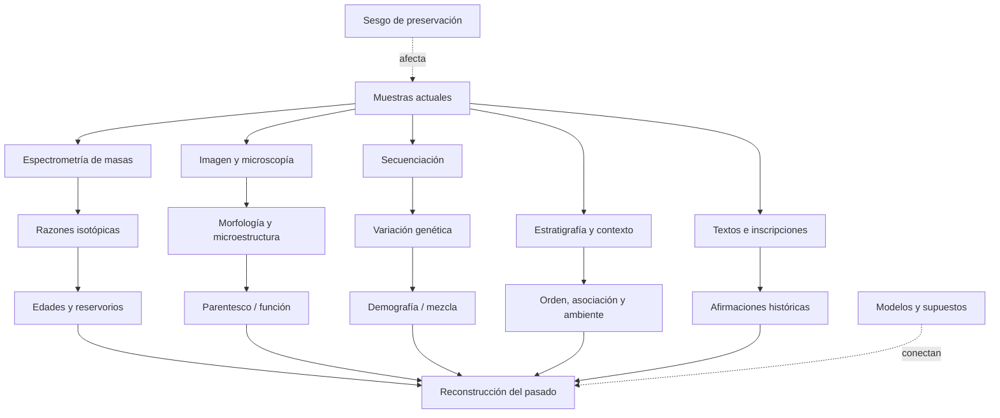

# Mapa de conocimiento

Este mapa separa una jerarquía narrativa de una red epistemológica. La primera dice “qué viene después”; la segunda muestra de qué mediciones depende lo que afirmamos.

## Jerarquía cronológica y biológica

```text
COSMOS
├── expansión y fondo cósmico
├── nucleosíntesis primordial
└── estrellas y elementos
    └── SISTEMA SOLAR
        └── sólidos nebulares y planetesimales
            └── TIERRA–LUNA
                ├── núcleo, manto, corteza, océanos y atmósfera
                └── VIDA
                    ├── replicación, metabolismo y membranas
                    ├── procariotas
                    │   └── fotosíntesis y oxigenación
                    └── eucariotas
                        ├── sexo y multicelularidad
                        └── ANIMALES
                            ├── sistemas nerviosos, ojos y esqueletos
                            └── VERTEBRADOS
                                ├── mandíbulas y extremidades
                                └── AMNIOTAS
                                    ├── reptiles y aves
                                    └── MAMÍFEROS
                                        └── PRIMATES
                                            └── HOMININOS
                                                └── HOMO
                                                    └── HOMO SAPIENS
                                                        ├── migraciones y mezcla
                                                        ├── lenguaje, símbolos y cooperación
                                                        └── CIVILIZACIONES
                                                            ├── agricultura y ciudades
                                                            ├── escritura, estados y leyes
                                                            └── Mesopotamia, Egipto, Indo,
                                                                China, Mesoamérica y Andes
```

## Navegación por módulos

| Nodo | Directorio principal | Preguntas de evidencia |
|---|---|---|
| Cosmos y Sistema Solar | `01_cosmos` | ¿Cómo se miden expansión, CMB, abundancias, formación estelar, nucleosíntesis y discos? ¿Qué depende del modelo? |
| Formación terrestre | `02_formacion_tierra` | ¿Qué fecha cada reloj? ¿Cómo se infieren acreción, núcleo y Luna? |
| Hadeano | `03_hadeano` | ¿Qué conservan zircones, rocas raras y la Luna? |
| Arcaico | `04_arcaico` | ¿Qué evidencia de corteza, océanos y vida sobrevive? |
| Proterozoico | `05_proterozoico` | ¿Cómo se reconstruyen oxígeno, eucariotas y multicelularidad? |
| Paleozoico | `06_paleozoico` | ¿Cómo se fechan radiaciones, colonización terrestre y extinciones? |
| Mesozoico | `07_mesozoico` | ¿Qué conectan fósiles, estratos, paleomagnetismo e impactos? |
| Cenozoico | `08_cenozoico` | ¿Cómo se reconstruyen clima, mamíferos y primates? |
| Origen de la vida | `09_origen_vida` | ¿Qué puede probar laboratorio y qué solo restringe plausibilidad histórica? |
| Transiciones de la vida | `10_evolucion_vida` | ¿Cómo se combinan fósiles, desarrollo, comparación y genes? |
| Evolución humana | `11_evolucion_humana` | ¿Qué huesos existen y qué anatomía se reconstruye? |
| Homo sapiens | `12_homo_sapiens` | ¿Qué significa “origen” en una población estructurada? |
| Migraciones | `13_migraciones` | ¿Cómo convergen arqueología, ADN, clima y lingüística? |
| Civilizaciones | `14_civilizaciones` | ¿Qué proviene de objetos, textos o modelos sociales? |
| Genética humana | `15_genetica_humana` | ¿Qué mide un haplogrupo y qué no implica? |
| Controversias | `16_controversias` | ¿Qué dato comparten rivales y qué prueba discrimina? |
| Preguntas abiertas | `17_preguntas_abiertas` | ¿Qué se desconoce y por qué? |
| Historia de la ciencia | `18_historia_ciencia` | ¿Qué cambió el consenso y cómo? |

## Red de métodos



## Cuellos de botella epistemológicos

| Cuello de botella | Claims afectados | Riesgo |
|---|---|---|
| significado del evento fechado | casi toda la cronología | confundir cristalización, cierre, alteración y evento histórico |
| preservación diferencial | fósiles, rocas hadeanas, arqueología | ausencia de evidencia presentada como evidencia de ausencia |
| calibraciones compartidas | geocronología, relojes moleculares, `14C` | falsa independencia |
| procedencia/contexto | meteoritos, fósiles, artefactos, ADN antiguo | asociación errónea o contaminación |
| categorías humanas | especie, cultura, civilización, lenguaje | convertir etiquetas analíticas en entidades nítidas del pasado |
| resolución temporal | origen de la vida, radiaciones, migraciones | transformar límites mínimo/máximo en fechas puntuales |

## Ruta epistemológica actual

Las rutas implementadas son:

```text
espectros y distancias ─┐
CMB espectral/anisótropo ├→ FLRW + física térmica → fase caliente y expansión
deuterio primordial ─────┤                          → H(z) → edad ~13.8 Ga (B-COND)
supernovas y BAO ─────────┤
edades estelares ─────────┘
```

Véase `INV-COSMOS-AGE-001` en `01_cosmos` y su mapa en `assets/visuales/mapa-investigacion-002.svg`.

La ruta del origen de los elementos es:

```text
líneas atómicas + modelos de atmósfera → identidad y abundancias condicionadas
tasas nucleares + D/H + CMB           → inventario primordial H/He
neutrinos solares                     → fusión activa H→He
Tc estelar + granos presolares        → proceso s y mezcla AGB
gamma de SN 1987A                     → material 56Ni/56Co fresco
GW170817 + kilonova + Sr              → captura neutrónica en fusiones
rayos cósmicos + abundancias          → contribución LiBeB
                                      ↓
tasas + eyección + mezcla galáctica   → inventario solar (fracciones abiertas)
```

Véase `INV-COSMOS-ELEMENTS-001` en `01_cosmos`, su mapa en `assets/visuales/mapa-investigacion-003.svg` y la matriz en `assets/visuales/matriz-origen-elementos.svg`.

La ruta de evolución estelar es:

```text
paralaje + flujo + color              → distancia, luminosidad y población H–R
órbitas + eclipses                    → masas y radios dinámicos
cúmulos aproximadamente coetáneos     → orden por masa y edades condicionadas
oscilaciones                          → estado de combustión interior
líneas moleculares + disco + chorro   → acreción protostelar
órbitas WD + cúmulos                  → relación masa inicial–final
progenitor desaparecido + neutrinos   → colapso de núcleo en casos observados
timing + binarias compactas           → estrellas de neutrones y agujeros negros
                                       ↓
composición + rotación + pérdida + binariedad → rutas, no ciclo universal
```

Véase `INV-COSMOS-STARS-001` en `01_cosmos`, su mapa en `assets/visuales/mapa-investigacion-004.svg` y las rutas en `assets/visuales/rutas-evolucion-estelar.svg`.

La ruta de formación del Sistema Solar es:

```text
OTROS SISTEMAS JÓVENES                 ARCHIVO LOCAL
visibilidades + continuo ─────┐        CAIs/cóndrulos + Pb–Pb ───────┐
líneas moleculares + Doppler ─┼→       26Al + Hf–W ─────────────────┤
fracción de discos por edad ──┘        CC/NC + Wild 2 + remanencia ─┤
          ↓                                      ↓                   │
discos estructurados como clase          cronología, transporte,     │
                                         mezcla parcial y cuerpos ───┘
                    \                    /
                     → origen en disco protoplanetario (A-COND)
                       masa/radio/mecanismos exactos (C–D)
```

Véase `INV-SOLAR-FORMATION-001` en `01_cosmos`, su mapa en `assets/visuales/mapa-investigacion-005.svg` y la comparación en `assets/visuales/dos-archivos-formacion-solar.svg`.

La ruta terrestre es:

```text
CAIs y meteoritos
  → razones U–Pb/Pb–Pb
  → tiempo cero del Sistema Solar
  → modelos de acreción y Hf–W
  → formación terrestre no instantánea
  → Luna y diferenciación
  → zircones/rocas hadeanas
  → primeras restricciones sobre corteza y agua
```

Véase `INV-EARTH-AGE-001` en `02_formacion_tierra`.

La ruta específica de acreción terrestre es:

```text
182W + Hf/W ──────────────→ separación integrada + equilibrio ─┐
manto multielemental ─────→ partición metal–silicato ──────────┤
HSE + Ru + W antiguo ─────→ masa/procedencia tardía ───────────┤
masas + órbitas ──────────→ ensambles N-cuerpos ───────────────┤
hidrocódigos ─────────────→ fusión / hit-and-run / erosión ────┤
H/N + reservorios NC/CC ──→ procedencia y retención ───────────┘
                                      ↓
             crecimiento y núcleo multietapa: B-COND
             curva/impactores/final únicos: D–E
```

Véase `INV-EARTH-ACCRETION-001` en `02_formacion_tierra`, su mapa en `assets/visuales/mapa-investigacion-006.svg` y la distinción de hitos en `assets/visuales/cinco-finales-acrecion.svg`.

La ruta específica del núcleo terrestre es:

```text
P, PKP, PKIKP, SKS ───────→ discontinuidades + estado mecánico ─┐
modos normales ───────────→ perfiles globales de ρ, Vp y Vs ────┤
masa + I/MR² ─────────────→ concentración central de masa ──────┤
siderófilos del manto ─────→ separación metal–silicato ─────────┤
experimentos P–T ─────────→ Fe–Ni + elementos ligeros ──────────┤
182W + Hf/W ──────────────→ diferenciación integrada temprana ──┤
paleomagnetismo + calor ──→ geodinamo y nucleación interna ─────┘
                                      ↓
            existencia/geometría/estado global: A–B
            composición detallada/edad interna: C–D
```

Véase `INV-EARTH-CORE-001` en `02_formacion_tierra`, su mapa en `assets/visuales/mapa-investigacion-007.svg` y la guía conceptual de fases en `assets/visuales/fases-sismicas-nucleo.svg`.

La ruta específica del origen lunar es:

```text
masa + órbita + giro ─────→ momento angular / mareas ───────────┐
núcleo pequeño ───────────→ eyección preferente de silicato ────┤
anortositas + zircon ─────→ fusión y diferenciación tempranas ──┤
O + Ti + V + W ───────────→ fuente, mezcla y acreción tardía ────┤
K + volátiles ────────────→ vapor, pérdida y condensación ───────┤
SPH + disco + enfriamiento→ familias mecánicamente viables ─────┘
                                      ↓
                 impacto + reacreción: B-COND
                 Theia/geometría exactas: D–E
```

Véase `INV-MOON-ORIGIN-001` en `02_formacion_tierra`, su mapa en `assets/visuales/mapa-investigacion-008.svg` y la matriz en `assets/visuales/restricciones-origen-luna.svg`.

La ruta específica de la primera corteza es:

```text
zircon detrítico + U–Pb ───→ edad de cristal, roca fuente perdida ─┐
Hf + O + trazas ───────────→ fuente diferenciada / retrabajo ─────┤
Acasta + U–Pb de campo ────→ protolito preservado ~4.03 Ga ───────┤
petrología de Idiwhaa ─────→ fuente máfica hidratada ──────────────┤
dos Sm–Nd en NGB ──────────→ intrusión ~4.16 Ga ──────────────────┤
contacto de corte NGB ─────→ encajante anterior ───────────────────┘
                                      ↓
                 diferenciación temprana: B-COND
                 volumen / placas globales: D–E
```

Véase `INV-HADEAN-CRUST-001` en `02_formacion_tierra`, su mapa en `assets/visuales/mapa-investigacion-009.svg` y la comparación en `assets/visuales/tres-archivos-corteza-hadeana.svg`.

La ruta específica del agua hadeana es:

```text
U–Pb + textura + hidratación ─→ dominio de zircon primario ──────┐
δ18O alto ────────────────────→ protolito alterado a baja T ─────┤
δ18O bajo ────────────────────→ roca hidrotermal/agua meteórica ─┤
Acasta + O bimodal ───────────→ fuente somera preservada ────────┤
NGB + O triple + H ───────────→ alteración hidrotermal antigua ──┤
desgasificación + clima ──────→ trayectorias físicamente viables ┘
                                      ↓
             agua–roca / hidrosfera temprana: B–C
             océano global / clima estable: D–E
```

Véase `INV-HADEAN-WATER-001` en `03_hadeano`, su mapa en `assets/visuales/mapa-investigacion-010.svg` y la cadena en `assets/visuales/cadena-oxigeno-agua.svg`.

La ruta específica de la atmósfera hadeana es:

```text
Ce/U + U–Pb en zircon ─────→ fO₂ de fundidos seleccionados ──────┐
CHONS + solubilidad + P–T ─→ familias de gases desgasificados ───┤
D/H ───────────────────────→ límite condicional de H₂/escape ────┤
Xe en cuarzo ~3.3 Ga ──────→ evolución y desgasificación ─────────┤
S-MIF pre-3.77 Ga ─────────→ anoxia en el borde eoarcaico ────────┤
N/Ar + vesículas arqueanas → cotas posteriores de presión ────────┘
                                      ↓
             redox magmático y atmósfera dinámica: B–C
             mezcla / presión hadeanas exactas: D–E
```

Véase `INV-HADEAN-ATMOSPHERE-001` en `03_hadeano`, su mapa en `assets/visuales/mapa-investigacion-011.svg` y la cadena en `assets/visuales/de-magma-a-aire.svg`.

La ruta específica del bombardeo hadeano es:

```text
edad isotópica + textura ─────────→ cierre, cristalización o reinicio ─┐
composición + cartografía ────────→ procedencia y evento candidato ───┤
cráteres + superposición ─────────→ orden y densidad acumulada ────────┤
preservación + transporte ────────→ función de selección ──────────────┤
dinámica de poblaciones ──────────→ familias de flujo compatibles ─────┘
                                            ↓
              bombardeo temprano intenso/declinante: B-COND
              pico terminal único a ~3.9 Ga: D
              curva y efectos exactos sobre la Tierra: D–E
```

Véase `INV-HADEAN-IMPACTS-001` en `03_hadeano`, su mapa en `assets/visuales/mapa-investigacion-012.svg` y la cadena en `assets/visuales/de-muestra-a-flujo-impactos.svg`.

La ruta específica de la vida más antigua es:

```text
edad del huésped ───────────→ ¿qué objeto y evento fecha el número? ─┐
interior + controles ───────→ señal indígena, no contaminación ──────┤
capas + inclusiones ────────→ señal singenética, no tardía ──────────┤
3-D + química + facies ─────→ señal biogénica frente a abiótica ─────┤
comparación poblacional ────→ límite temporal con confianza heredada ┘
                                         ↓
                 vida por lo menos hacia ~3.43 Ga: B-COND
                 señal biológica en Isua ≥3.7 Ga: C↑
                 origen exacto y candidatas más antiguas: D–E
```

Véase `INV-ARCHEAN-LIFE-001` en `04_arcaico`, su mapa en `assets/visuales/mapa-investigacion-013.svg` y la cadena en `assets/visuales/de-senal-a-biosignatura.svg`.
