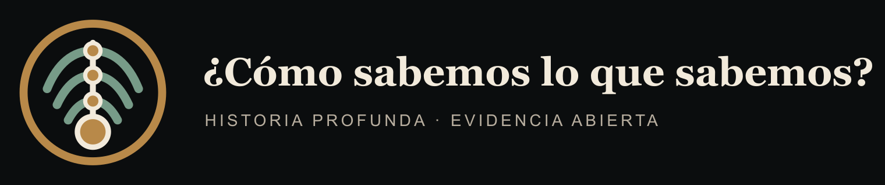

# ¿Cómo sabemos lo que sabemos?

Historia profunda de la Tierra, la vida y el ser humano desde primeros principios.

## Experiencia pública

**[Explorar la versión pública](https://vida-tierra.vercel.app)**

La versión `0.3.9` continúa la historia cronológica mundial de la medicina con MED-010: cuerpos, trepanaciones, dientes, plantas y códices de Mesoamérica, Andes y otras Américas, separados por archivo, procedencia, señal, práctica, consecuencia y límite. Incluye el módulo público «Una huella no hereda una historia clínica» y conserva MED-001–009 y CIV-001–003 íntegros; la secuencia global continúa cerrada en `001–052`.

El sitio usa `https://vida-tierra.vercel.app` como URL canónica. Otro dominio puede sustituirlo definiendo `SITE_URL` en el entorno de build, sin cambiar el código.


> **Ilustración conceptual:** comprime épocas distintas y no está a escala. Su procedencia y límites se registran en el [`ATLAS_VISUAL.md`](ATLAS_VISUAL.md).

## Identidad visual



El [kit de marca](assets/marca/README.md) contiene el símbolo maestro, lockups para fondos claros y oscuros, versiones monocromáticas, avatar social, favicon, Apple Touch Icon e iconos PWA. Todas las exportaciones se regeneran desde un SVG determinista con `npm run brand:build`.

Este repositorio público investiga cómo se reconstruyen acontecimientos que nadie observó directamente. Su pregunta rectora no es “¿qué dicen los libros?”, sino:

> Si desaparecieran los manuales y no pudiéramos confiar inicialmente en ninguna autoridad, ¿qué observaciones, mediciones, experimentos y razonamientos permitirían reconstruir esta conclusión?

El proyecto no busca creer ni desconfiar ciegamente de la ciencia. Busca hacer visible la cadena que une una muestra física con una afirmación sobre el pasado, medir cuánto depende de instrumentos y modelos, enfrentarla con explicaciones alternativas y expresar la incertidumbre sin disfrazarla.

## Regla central

Toda afirmación importante debe poder recorrerse en ambos sentidos:

```text
CLAIM → EVIDENCIA → FUENTE → MÉTODO → DATO ORIGINAL
  ↑                                             ↓
  └──────────── cadena de inferencia ───────────┘
```

Y toda investigación debe distinguir explícitamente:

- lo observado hoy;
- lo medido con instrumentos;
- el principio físico, químico o biológico empleado;
- el modelo y sus supuestos;
- lo inferido acerca del pasado;
- las alternativas y anomalías;
- el grado de confianza y qué podría falsar la conclusión.

## Estado actual · v0.3.9

La experiencia pública contiene:

- la arquitectura auditable del repositorio;
- plantillas para investigaciones, afirmaciones, evidencias, fuentes, controversias y errores;
- un sistema de confianza de A a E y etiquetas separadas de incertidumbre;
- los registros maestros [`CLAIMS.md`](CLAIMS.md), [`EVIDENCE_LEDGER.md`](EVIDENCE_LEDGER.md), [`SOURCES.md`](SOURCES.md), [`CONTROVERSIES.md`](CONTROVERSIES.md) y [`SCIENTIFIC_ERRORS.md`](SCIENTIFIC_ERRORS.md);
- una [`TIMELINE.md`](TIMELINE.md) preliminar desde los primeros sólidos del Sistema Solar hasta las primeras civilizaciones;
- el [`KNOWLEDGE_MAP.md`](KNOWLEDGE_MAP.md) y el [`ROADMAP.md`](ROADMAP.md);
- la primera investigación: [`¿Cómo sabemos la edad de la Tierra?`](02_formacion_tierra/INVESTIGACION_001_EDAD_TIERRA.md).
- la segunda investigación: [`¿Cómo sabemos que el universo tiene una historia y una edad finita?`](01_cosmos/INVESTIGACION_002_EDAD_E_HISTORIA_DEL_UNIVERSO.md);
- la tercera investigación: [`¿Cómo sabemos dónde y cómo se formaron los elementos?`](01_cosmos/INVESTIGACION_003_ORIGEN_ELEMENTOS.md);
- la cuarta investigación: [`¿Cómo inferimos el nacimiento, la evolución y la muerte de las estrellas?`](01_cosmos/INVESTIGACION_004_EVOLUCION_ESTELAR.md);
- la quinta investigación: [`¿Cómo inferimos una nebulosa y un disco protoplanetario?`](01_cosmos/INVESTIGACION_005_FORMACION_SISTEMA_SOLAR.md);
- la sexta investigación: [`¿Cómo ocurrió y cuánto duró la acreción terrestre?`](02_formacion_tierra/INVESTIGACION_006_ACRECION_TIERRA.md);
- la séptima investigación: [`¿Cómo sabemos que existe el núcleo terrestre, qué contiene y cuándo se diferenció?`](02_formacion_tierra/INVESTIGACION_007_NUCLEO_TIERRA.md);
- la octava investigación: [`¿Cómo se formó la Luna y qué parte del impacto podemos reconstruir?`](02_formacion_tierra/INVESTIGACION_008_ORIGEN_LUNA.md);
- la novena investigación: [`¿Qué conservan zircones, Acasta y Nuvvuagittuq de la primera corteza?`](02_formacion_tierra/INVESTIGACION_009_CORTEZA_HADEANA.md);
- la décima investigación: [`¿Cuándo hubo agua líquida y qué significa la señal de oxígeno?`](03_hadeano/INVESTIGACION_010_AGUA_HADEANA.md);
- la undécima investigación: [`¿Cómo se restringe una atmósfera sin muestras de aire?`](03_hadeano/INVESTIGACION_011_ATMOSFERA_HADEANA.md);
- la duodécima investigación: [`¿Pico tardío, cola de acreción o modelo híbrido?`](03_hadeano/INVESTIGACION_012_IMPACTOS_HADEANOS.md);
- la decimotercera investigación: [`¿Cuál es la evidencia de vida más antigua?`](04_arcaico/INVESTIGACION_013_VIDA_MAS_ANTIGUA.md);
- la decimocuarta investigación: [`¿Cuándo surgieron fotosíntesis y producción de oxígeno?`](04_arcaico/INVESTIGACION_014_FOTOSINTESIS_OXIGENO.md);
- la decimoquinta investigación: [`¿Cómo sabemos que aumentó el oxígeno?`](05_proterozoico/INVESTIGACION_015_GRAN_OXIDACION.md);
- la decimosexta investigación: [`¿Qué se puede reconstruir de LUCA y qué no?`](09_origen_vida/INVESTIGACION_016_LUCA.md);
- la decimoséptima investigación: [`¿Cómo inferimos el origen de eucariotas y la endosimbiosis mitocondrial?`](10_evolucion_vida/INVESTIGACION_017_EUCARIOGENESIS.md);
- la decimoctava investigación: [`¿Cómo inferimos el origen y la función evolutiva del sexo?`](10_evolucion_vida/INVESTIGACION_018_SEXO.md);
- la decimonovena investigación: [`¿Cuántas veces surgió la multicelularidad y cuándo un grupo se volvió individuo?`](10_evolucion_vida/INVESTIGACION_019_MULTICELULARIDAD.md);
- la vigésima investigación: [`¿Estuvo la Tierra globalmente congelada durante el Criogénico?`](05_proterozoico/INVESTIGACION_020_SNOWBALL_EARTH.md);
- la vigesimoprimera investigación: [`¿Qué eran los organismos ediacáricos y cómo vivían?`](05_proterozoico/INVESTIGACION_021_EDIACARA.md);
- la vigesimosegunda investigación: [`¿Fue súbita la radiación cámbrica o está comprimida por el registro?`](06_paleozoico/INVESTIGACION_022_RADIACION_CAMBRICA.md);
- la vigesimotercera investigación: [`¿Fue la radiación ordovícica un evento global y qué terminó con ella?`](06_paleozoico/INVESTIGACION_023_RADIACION_ORDOVICICA.md);
- la vigesimocuarta investigación: [`¿Cómo se recuperó la vida en el Silúrico y cuándo se ensamblaron ecosistemas terrestres?`](06_paleozoico/INVESTIGACION_024_RECUPERACION_SILURICA.md);
- la vigesimoquinta investigación: [`¿Fue el Devónico la «edad de los peces» y cómo transformaron bosques y tetrápodos la Tierra?`](06_paleozoico/INVESTIGACION_025_BOSQUES_PECES_TETRAPODOS.md);
- la vigesimosexta investigación: [`¿Por qué se acumuló tanto carbón en el Carbonífero y cómo se relacionaron oxígeno, incendios, gigantismo y amniotas?`](06_paleozoico/INVESTIGACION_026_CARBON_OXIGENO_AMNIOTAS.md);
- la vigesimoséptima investigación: [`¿Cómo se ensambló Pangea, qué eran los sinápsidos y por qué la mayor extinción no tuvo una sola causa?`](06_paleozoico/INVESTIGACION_027_PANGEA_SINAPSIDOS_EXTINCION.md);
- la vigesimoctava investigación: [`¿Cómo se reconstruyó la biosfera triásica y cuándo aparecieron dinosaurios y mamaliaformes?`](07_mesozoico/INVESTIGACION_028_RECUPERACION_DINOSAURIOS_MAMALIAFORMES.md);
- la vigesimonovena investigación: [`¿Cómo fragmentó el Jurásico a Pangea y qué revela sobre dinosaurios, avialanos y mamaliaformes?`](07_mesozoico/INVESTIGACION_029_JURASICO_PANGEA_DINOSAURIOS_AVIALANOS_MAMMALIAFORMES.md);
- la trigésima investigación: [`¿Cómo transformaron las angiospermas las redes cretácicas y qué revelan insectos, aves y mamíferos?`](07_mesozoico/INVESTIGACION_030_CRETACICO_FLORES_INSECTOS_AVES_MAMIFEROS.md);
- la trigésima primera investigación: [`¿Cómo conectamos Chicxulub, Deccan, la extinción K–Pg y la recuperación sin confundir coincidencia con mecanismo?`](07_mesozoico/INVESTIGACION_031_KPG_IMPACTO_DECCAN_EXTINCION_RECUPERACION.md);
- la trigésima segunda investigación: [`¿Cómo reconstruimos la recuperación paleógena, las radiaciones de mamíferos, primates y ballenas, y el PETM sin dibujar una marcha inevitable?`](08_cenozoico/INVESTIGACION_032_PALEOGENO_RECUPERACION_MAMIFEROS_PRIMATES_BALLENAS_PETM.md);
- la trigésima tercera investigación: [`¿Cómo reconstruimos pastizales, primates, clima y el istmo de Panamá sin convertir el Neógeno en una cadena causal única?`](08_cenozoico/INVESTIGACION_033_NEOGENO_PASTIZALES_PRIMATES_CLIMA_ISTMO_PANAMA.md);
- la trigésima cuarta investigación: [`¿Cómo reconstruimos glaciaciones, megafauna y cambios rápidos sin fundir seis relojes cuaternarios?`](08_cenozoico/INVESTIGACION_034_CUATERNARIO_GLACIACIONES_MEGAFAUNA_CAMBIOS_RAPIDOS.md);
- la trigésima quinta investigación: [`¿Cómo fechamos la separación del linaje humano respecto de otros simios si cada región del genoma tiene una historia distinta?`](08_cenozoico/INVESTIGACION_035_SEPARACION_LINAJES_HUMANOS_OTROS_SIMIOS.md);
- la trigésima sexta investigación: [`¿Cómo identificamos a los primeros homininos si edad, bipedalismo y parentesco no son la misma evidencia?`](08_cenozoico/INVESTIGACION_036_PRIMEROS_HOMININOS_SAHELANTHROPUS_ORRORIN_ARDIPITHECUS.md);
- una línea temática anticipada, con subíndice propio: [`CIV-001 — ¿Cómo distinguimos sedentarismo, agricultura, aldeas, ciudades y Estados sin una escalera universal?`](14_civilizaciones/INVESTIGACION_CIV_001_ORIGENES_ALDEAS_CIUDADES_ESTADOS.md) — **TRAZADO**; no completa ni sustituye las investigaciones globales `037–052`;
- una expansión metódica auditada: [`CIV-002 — ¿Cómo pasamos de medir una muestra a fechar una ocupación, una fase o un acontecimiento histórico?`](14_civilizaciones/INVESTIGACION_CIV_002_FECHADO_ARQUEOLOGICO_HISTORICO.md) — **AUDITADO**; no crea una Investigación 053 ni promueve CIV-001;
- el primer expediente regional auditado: [`CIV-003 — ¿Cómo reconstruimos campamentos, aldeas y urbanismos de Asia sudoccidental sin una cuna única?`](14_civilizaciones/INVESTIGACION_CIV_003_ASIA_SUDOCCIDENTAL_CAMPAMENTOS_ALDEAS_URBANISMOS.md) — **AUDITADO**; promueve sólo cinco claims exactos de CIV-001;
- la primera investigación médica auditada: [MED-001 — ¿Cómo sabemos si una intervención médica o quirúrgica funciona, para quién y con qué daños?](15_medicina/INVESTIGACION_MED_001_INTERVENCIONES_EFICACIA_DANOS.md) — **AUDITADO**; inaugura MED sin cerrar ni renumerar CIV;
- la segunda investigación médica auditada: [MED-002 — ¿Cómo sabemos si una prueba diagnóstica realmente ayuda a decidir?](15_medicina/INVESTIGACION_MED_002_PRUEBAS_DIAGNOSTICAS_DECISIONES.md) — **AUDITADO**; separa detección, exactitud, probabilidad, utilidad y desenlaces;
- la primera investigación histórica de Medicina: [MED-003 — ¿Qué permiten reconstruir huesos, biomoléculas, objetos y textos sobre los orígenes del cuidado y la intervención?](15_medicina/INVESTIGACION_MED_003_ORIGENES_ARCHIVO_CUIDADO.md) — **AUDITADO**; inaugura la secuencia cronológica MED-003–MED-033 sin una fecha universal de nacimiento;
- la segunda investigación histórica de Medicina: [MED-004 — ¿Qué prueban tablillas, papiros, cuerpos y espacios sobre especialistas y prácticas?](15_medicina/INVESTIGACION_MED_004_MESOPOTAMIA_VALLE_NILO.md) — **AUDITADO**; separa documento, género, circulación, práctica y consecuencia en Mesopotamia y el valle del Nilo;
- la tercera investigación histórica de Medicina: [MED-005 — ¿Cómo fechamos y contextualizamos las tradiciones médicas de Asia meridional?](15_medicina/INVESTIGACION_MED_005_ASIA_MERIDIONAL_AYURVEDA_TRANSMISIONES.md) — **AUDITADO**; separa testimonio, lectura, estrato, circulación, práctica y consecuencia sin convertir antigüedad en eficacia;
- la cuarta investigación histórica de Medicina: [MED-006 — ¿Cómo cambiaron los cánones, pulsos, agujas, farmacopeas e instituciones en China y Asia oriental?](15_medicina/INVESTIGACION_MED_006_CHINA_ASIA_ORIENTAL_CANONES_PRACTICAS.md) — **AUDITADO**; separa testigo, lectura, estrato, operación, institución y consecuencia sin convertir canon en práctica uniforme;
- la quinta investigación histórica de Medicina: [MED-007 — ¿Qué transformaron observación, pronóstico, escuelas y disección en el Mediterráneo griego y helenístico?](15_medicina/INVESTIGACION_MED_007_MEDITERRANEO_GRIEGO_HELENISTICO.md) — **AUDITADO**; separa testimonio, lectura, género, operación, institución y consecuencia sin inventar un autor único ni una medicina racional uniforme;
- la sexta investigación histórica de Medicina: [MED-008 — ¿Cómo circularon práctica militar, salud urbana, hospitales y corpus entre Roma y Bizancio?](15_medicina/INVESTIGACION_MED_008_ROMA_BIZANCIO_MEDITERRANEO_TARDIO.md) — **AUDITADO**; separa vestigio, identificación, función, operación, acceso y consecuencia sin convertir infraestructura, título o transmisión en cobertura o resultado;
- la séptima investigación histórica de Medicina: [MED-009 — ¿Qué archivos permiten reconstruir cuidado y conocimiento en África fuera del eje egipcio?](15_medicina/INVESTIGACION_MED_009_AFRICA_FUERA_EJE_EGIPCIO.md) — **AUDITADO**; separa archivo, procedencia, señal, inferencia, contraste y límite sin convertir silencios o analogías en hechos;
- la octava investigación histórica de Medicina: [MED-010 — ¿Qué muestran cuerpos, trepanaciones, plantas y códices en Mesoamérica, Andes y otras Américas?](15_medicina/INVESTIGACION_MED_010_MESOAMERICA_ANDES_AMERICAS.md) — **AUDITADO**; separa archivo, procedencia, señal, práctica, consecuencia y límite sin convertir huellas en historias clínicas;
- la trigésima séptima investigación: [`¿Cómo distinguimos especies, locomoción, dieta y parentesco entre australopitecos y Paranthropus sin convertir su diversidad en una escalera hacia Homo?`](08_cenozoico/INVESTIGACION_037_AUSTRALOPITECOS_PARANTHROPUS.md);
- la trigésima octava investigación: [`¿Cómo reconocemos a Homo temprano, habilis y erectus si fósiles, herramientas, cuerpos y moléculas responden preguntas distintas?`](08_cenozoico/INVESTIGACION_038_HOMO_TEMPRANO_HABILIS_ERECTUS.md);
- la trigésima novena investigación: [`¿Cómo reconstruimos las poblaciones humanas del Pleistoceno medio sin convertir Homo heidelbergensis en un cajón de sastre ni cada fósil en un ancestro?`](08_cenozoico/INVESTIGACION_039_HOMO_PLEISTOCENO_MEDIO_HEIDELBERGENSIS.md);
- la cuadragésima investigación: [`¿Cómo sabemos quiénes fueron neandertales y denisovanos y cuándo hubo mestizaje sin confundir un fósil, una genealogía y un porcentaje de ancestría?`](08_cenozoico/INVESTIGACION_040_NEANDERTALES_DENISOVANOS_MESTIZAJE.md);
- la cuadragésima primera investigación: [`¿Cómo reconstruimos a Homo floresiensis, H. luzonensis y H. naledi sin confundir morfología mosaico, asociación arqueológica y conducta?`](08_cenozoico/INVESTIGACION_041_FLORESIENSIS_NALEDI_DIVERSIDAD_TARDIA.md);
- la cuadragésima segunda investigación: [`¿Cómo sabemos que Homo sapiens surgió en África: una región única o poblaciones estructuradas?`](08_cenozoico/INVESTIGACION_042_ORIGEN_AFRICANO_HOMO_SAPIENS.md);
- la cuadragésima tercera investigación: [`¿Cuántas salidas de África hubo y cuáles dejaron descendencia?`](13_migraciones/INVESTIGACION_043_SALIDAS_AFRICA_DESCENDENCIA.md);
- la cuadragésima cuarta investigación: [`¿Cómo se poblaron Asia y Sahul sin convertir sitios, rutas y genomas en una sola historia?`](13_migraciones/INVESTIGACION_044_POBLAMIENTO_ASIA_SAHUL.md);
- la cuadragésima quinta investigación: [`¿Cuándo llegó Homo sapiens a Europa y qué significa «coexistir» con neandertales?`](13_migraciones/INVESTIGACION_045_LLEGADA_EUROPA_COEXISTENCIA_NEANDERTALES.md);
- la cuadragésima sexta investigación: [`¿Cuándo y por qué rutas se poblaron las Américas?`](13_migraciones/INVESTIGACION_046_POBLAMIENTO_AMERICAS.md);
- la cuadragésima séptima investigación: [`¿Qué observamos realmente sobre herramientas, fuego y cooperación, y qué conductas podemos inferir?`](11_evolucion_humana/INVESTIGACION_047_HERRAMIENTAS_FUEGO_COOPERACION.md);
- la cuadragésima octava investigación: [`¿Cuándo apareció el lenguaje y qué huellas puede dejar?`](11_evolucion_humana/INVESTIGACION_048_ORIGEN_LENGUAJE.md);
- la cuadragésima novena investigación: [`Entierros, arte, música, ritual y símbolos: ¿qué permiten inferir los archivos materiales?`](11_evolucion_humana/INVESTIGACION_049_SIMBOLISMO_RITUAL_ARTE_MUSICA.md);
- la quincuagésima investigación: [`Agriculturas y domesticaciones múltiples: ¿cómo se construyeron, detectaron y compararon las transiciones neolíticas?`](14_civilizaciones/INVESTIGACION_050_AGRICULTURAS_DOMESTICACIONES_MULTIPLES.md);
- la quincuagésima primera investigación: [`Aldeas, especialización, jerarquías, ciudades y Estados: ¿qué cambia y cómo lo sabemos?`](14_civilizaciones/INVESTIGACION_051_CIUDADES_ESTADOS.md);
- la quincuagésima segunda investigación: [`Comparación arqueológica de primeras civilizaciones: ¿qué dimensiones pueden compararse sin convertirlas en una escala?`](14_civilizaciones/INVESTIGACION_052_COMPARACION_PRIMERAS_CIVILIZACIONES.md), cierre de la secuencia global `001–052`;
- un [`ATLAS_VISUAL.md`](ATLAS_VISUAL.md) con procedencia y límites explícitos.

“Preliminar” significa que la cronología organiza el programa de trabajo; no convierte automáticamente cada fecha en una conclusión cerrada. Los estados de auditoría muestran qué ha sido investigado en profundidad y qué sigue pendiente.

## Cómo navegar

1. Empieza por [`METHODOLOGY.md`](METHODOLOGY.md).
2. Consulta una afirmación en [`CLAIMS.md`](CLAIMS.md).
3. Sigue sus evidencias en [`EVIDENCE_LEDGER.md`](EVIDENCE_LEDGER.md).
4. Abre los registros bibliográficos en [`SOURCES.md`](SOURCES.md).
5. Revisa desacuerdos en [`CONTROVERSIES.md`](CONTROVERSIES.md).
6. Comprueba su posición temporal en [`TIMELINE.md`](TIMELINE.md).
7. Usa el [`ATLAS_VISUAL.md`](ATLAS_VISUAL.md) para ver mapas explicativos y luego vuelve a sus registros.

La arquitectura completa y las reglas de nombres están en [`00_metodologia/ARCHITECTURE.md`](00_metodologia/ARCHITECTURE.md) y [`00_metodologia/ID_CONVENTIONS.md`](00_metodologia/ID_CONVENTIONS.md).

## Alcance cronológico

```text
Fase cósmica caliente → expansión → estrellas y elementos
  ↓
Sistema Solar
  ↓
Tierra y Luna
  ↓
Hadeano → Arcaico → Proterozoico
  ↓
Paleozoico → Mesozoico → Cenozoico
  ↓
Vida → animales → vertebrados → mamíferos
  ↓
Primates → homininos → Homo → Homo sapiens
  ↓
Migraciones → agricultura → ciudades → civilizaciones
```

## Convenciones rápidas

- `Ma`: millones de años antes del presente en geocronología.
- `Ga`: miles de millones de años antes del presente.
- `a. C.` / `d. C.`: fechas históricas de calendario cuando resultan más legibles.
- Las incertidumbres se conservan como las publica la fuente; no se combinan sin justificar el modelo.
- Una letra de confianza califica una afirmación concreta, no el prestigio de una disciplina o autor.
- Una fuente revisada por pares puede contener interpretaciones discutibles; “publicado” no equivale a “verdadero”.

## Contribuir

Las contribuciones deben añadir trazabilidad, no solo texto. Antes de abrir un cambio, consulta [`CONTRIBUTING.md`](CONTRIBUTING.md). Una afirmación nueva necesita ID, evidencia vinculada, fuente registrada, supuestos, límites, alternativa razonable, falsadores y confianza justificada.

## Alcance y límites

Este repositorio es una investigación educativa abierta en construcción. No sustituye la revisión especializada, el trabajo de laboratorio ni el acceso a muestras y datos primarios. Cuando una fuente está detrás de un muro de pago, se registra su DOI y se evita fingir que se auditó material no consultado.

## Licencia

El contenido de investigación se publica bajo [CC BY 4.0](https://creativecommons.org/licenses/by/4.0/deed.es): puede copiarse, traducirse, adaptarse y reutilizarse, incluso comercialmente, con la única condición de dar crédito. El código del sitio se publica bajo [MIT](LICENSE).

Los artículos citados en [`SOURCES.md`](SOURCES.md) pertenecen a sus autores y editoriales; esta licencia no se extiende a ellos. Los detalles, las formas de atribución recomendadas y los límites están en [`LICENCIAS.md`](LICENCIAS.md).
