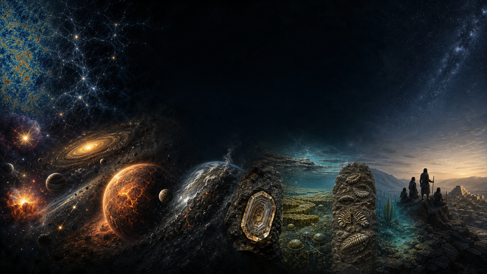

# ¿Cómo sabemos lo que sabemos?

Historia profunda de la Tierra, la vida y el ser humano desde primeros principios.



> **Ilustración conceptual:** comprime épocas distintas y no está a escala. Su procedencia y límites se registran en el [`ATLAS_VISUAL.md`](ATLAS_VISUAL.md).

Este repositorio público investiga cómo se reconstruyen acontecimientos que nadie observó directamente. Su pregunta rectora no es “¿qué dicen los libros?”, sino:

> Si desaparecieran los manuales y no pudiéramos confiar inicialmente en ninguna autoridad, ¿qué observaciones, mediciones, experimentos y razonamientos permitirían reconstruir esta conclusión?

El proyecto no busca creer ni desconfiar ciegamente de la ciencia. Busca hacer visible la cadena que une una muestra física con una afirmación sobre el pasado, medir cuánto depende de instrumentos y modelos, enfrentarla con explicaciones alternativas y expresar la incertidumbre sin disfrazarla.

## Regla central

Toda afirmación importante debe poder recorrerse en ambos sentidos:

```text
CLAIM → EVIDENCIA → FUENTE → MÉTODO → DATO ORIGINAL
  ↑                                             ↓
  └──────────── cadena de inferencia ───────────┘
```

Y toda investigación debe distinguir explícitamente:

- lo observado hoy;
- lo medido con instrumentos;
- el principio físico, químico o biológico empleado;
- el modelo y sus supuestos;
- lo inferido acerca del pasado;
- las alternativas y anomalías;
- el grado de confianza y qué podría falsar la conclusión.

## Estado actual

La fase fundacional contiene:

- la arquitectura auditable del repositorio;
- plantillas para investigaciones, afirmaciones, evidencias, fuentes, controversias y errores;
- un sistema de confianza de A a E y etiquetas separadas de incertidumbre;
- los registros maestros [`CLAIMS.md`](CLAIMS.md), [`EVIDENCE_LEDGER.md`](EVIDENCE_LEDGER.md), [`SOURCES.md`](SOURCES.md), [`CONTROVERSIES.md`](CONTROVERSIES.md) y [`SCIENTIFIC_ERRORS.md`](SCIENTIFIC_ERRORS.md);
- una [`TIMELINE.md`](TIMELINE.md) preliminar desde los primeros sólidos del Sistema Solar hasta las primeras civilizaciones;
- el [`KNOWLEDGE_MAP.md`](KNOWLEDGE_MAP.md) y el [`ROADMAP.md`](ROADMAP.md);
- la primera investigación: [`¿Cómo sabemos la edad de la Tierra?`](02_formacion_tierra/INVESTIGACION_001_EDAD_TIERRA.md).
- la segunda investigación: [`¿Cómo sabemos que el universo tiene una historia y una edad finita?`](01_cosmos/INVESTIGACION_002_EDAD_E_HISTORIA_DEL_UNIVERSO.md);
- la tercera investigación: [`¿Cómo sabemos dónde y cómo se formaron los elementos?`](01_cosmos/INVESTIGACION_003_ORIGEN_ELEMENTOS.md);
- la cuarta investigación: [`¿Cómo inferimos el nacimiento, la evolución y la muerte de las estrellas?`](01_cosmos/INVESTIGACION_004_EVOLUCION_ESTELAR.md);
- la quinta investigación: [`¿Cómo inferimos una nebulosa y un disco protoplanetario?`](01_cosmos/INVESTIGACION_005_FORMACION_SISTEMA_SOLAR.md);
- la sexta investigación: [`¿Cómo ocurrió y cuánto duró la acreción terrestre?`](02_formacion_tierra/INVESTIGACION_006_ACRECION_TIERRA.md);
- un [`ATLAS_VISUAL.md`](ATLAS_VISUAL.md) con procedencia y límites explícitos.

“Preliminar” significa que la cronología organiza el programa de trabajo; no convierte automáticamente cada fecha en una conclusión cerrada. Los estados de auditoría muestran qué ha sido investigado en profundidad y qué sigue pendiente.

## Cómo navegar

1. Empieza por [`METHODOLOGY.md`](METHODOLOGY.md).
2. Consulta una afirmación en [`CLAIMS.md`](CLAIMS.md).
3. Sigue sus evidencias en [`EVIDENCE_LEDGER.md`](EVIDENCE_LEDGER.md).
4. Abre los registros bibliográficos en [`SOURCES.md`](SOURCES.md).
5. Revisa desacuerdos en [`CONTROVERSIES.md`](CONTROVERSIES.md).
6. Comprueba su posición temporal en [`TIMELINE.md`](TIMELINE.md).
7. Usa el [`ATLAS_VISUAL.md`](ATLAS_VISUAL.md) para ver mapas explicativos y luego vuelve a sus registros.

La arquitectura completa y las reglas de nombres están en [`00_metodologia/ARCHITECTURE.md`](00_metodologia/ARCHITECTURE.md) y [`00_metodologia/ID_CONVENTIONS.md`](00_metodologia/ID_CONVENTIONS.md).

## Alcance cronológico

```text
Fase cósmica caliente → expansión → estrellas y elementos
  ↓
Sistema Solar
  ↓
Tierra y Luna
  ↓
Hadeano → Arcaico → Proterozoico
  ↓
Paleozoico → Mesozoico → Cenozoico
  ↓
Vida → animales → vertebrados → mamíferos
  ↓
Primates → homininos → Homo → Homo sapiens
  ↓
Migraciones → agricultura → ciudades → civilizaciones
```

## Convenciones rápidas

- `Ma`: millones de años antes del presente en geocronología.
- `Ga`: miles de millones de años antes del presente.
- `a. C.` / `d. C.`: fechas históricas de calendario cuando resultan más legibles.
- Las incertidumbres se conservan como las publica la fuente; no se combinan sin justificar el modelo.
- Una letra de confianza califica una afirmación concreta, no el prestigio de una disciplina o autor.
- Una fuente revisada por pares puede contener interpretaciones discutibles; “publicado” no equivale a “verdadero”.

## Contribuir

Las contribuciones deben añadir trazabilidad, no solo texto. Antes de abrir un cambio, consulta [`CONTRIBUTING.md`](CONTRIBUTING.md). Una afirmación nueva necesita ID, evidencia vinculada, fuente registrada, supuestos, límites, alternativa razonable, falsadores y confianza justificada.

## Alcance y límites

Este repositorio es una investigación educativa abierta en construcción. No sustituye la revisión especializada, el trabajo de laboratorio ni el acceso a muestras y datos primarios. Cuando una fuente está detrás de un muro de pago, se registra su DOI y se evita fingir que se auditó material no consultado.

## Licencia

Todavía no se ha elegido una licencia. Que el repositorio sea público permite leerlo, pero no concede por sí solo derechos generales de reutilización. La selección de licencia se mantiene como una decisión pendiente del propietario.
